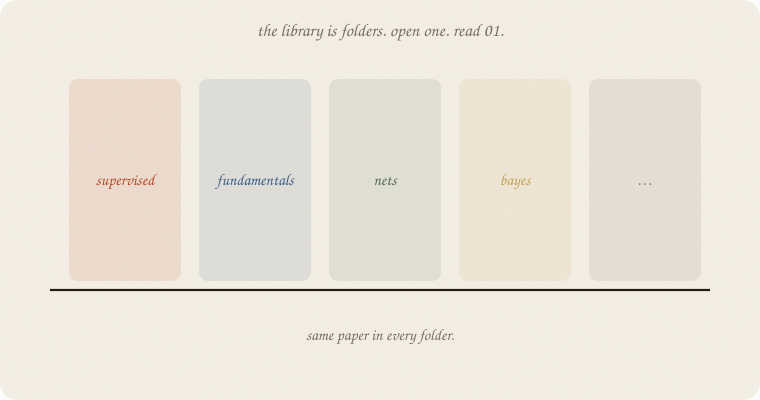
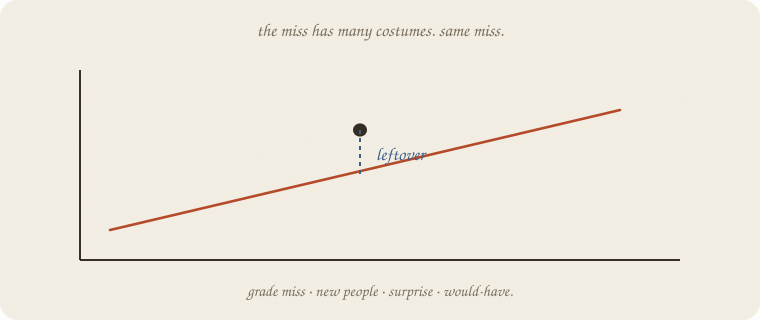
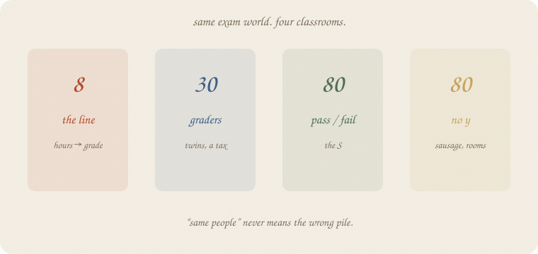
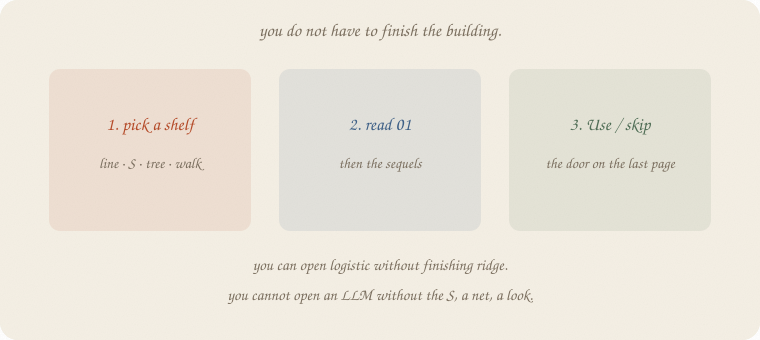
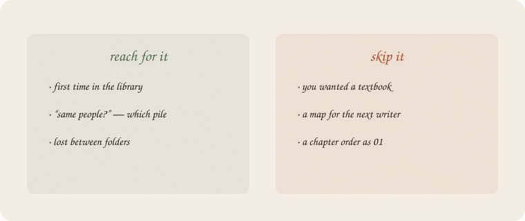

---
tags:
  - sketchbook
  - statistics
  - ml
aliases:
  - How to read this
  - Front door
  - Introduction
---

# How to read this — a sketchbook

> [!abstract] In one sentence
> A **library** of short notebooks, not a ladder. Picture, one sentence, real numbers. The verb in every room is **leftover**.

This is the front door. Not [[PATH.md]] (that is for writers). Not [[AGENTS.md]] (that is how to add a shelf). You are a reader. Start here, then pick a 01.

Job-interview version. Derivations live elsewhere.

Flip it like a notebook. One page = one idea. Done.

---

## Page 1 — What this is

Each note is a **zine**: paper, ink, one idea per page.

A picture before a formula. A cheat sheet that says when to reach for the method and when to skip it. Numbers that were **run**, not guessed.

It is not a textbook. It is not a blog. It is the version you would sketch on a whiteboard if someone asked “what *is* ridge?” and you had four minutes.

The site is those zines in a browser. Same pencils.

---

## Page 2 — The verb is leftover

You have a cloud of people. You draw a machine (a line, an S, a tree). Almost nobody sits on it.

The **gap** — real minus guess — is leftover.

That miss wears costumes:

| costume | notebook |
|---|---|
| vertical miss on a grade | [[01 linear regression]] |
| miss on **new** people | [[01 train test validate]] |
| jumpy vs shy | [[02 bias variance]] |
| a shape leftovers are allowed | [[01 distributions]] |
| surprise of the true next word | [[04 LLM]] |
| actual − would-have | [[02 causal impact]] |
| a starting bump, then data | [[01 prior]] |
| a reward you chose, then next week | [[01 the loop]] |
| one room, many arms, no next | [[02 bandits]] |
| from here, this act, points from now on | [[03 Q]] |

Ridge taxes leftover. A t-test asks if leftover could have faked a number. A forest votes leftover away. Same verb. New costume.

If you keep only one thing from the whole library:

> leftover. then a machine. then leftover on people the machine has not seen.

---

## Page 3 — Four classrooms

Same exam *world*: hours, sleep, tutor, coffee. **Not** the same pile of people.

| class | who | *y* | used by |
|---|---|---|---|
| **eight** | tidy table | grade | the line, t-test, bootstrap |
| **thirty graders** | twins + junk | grade | ridge → lasso → LARS, train/test, bias–variance |
| **eighty pass/fail** | crowd | pass | logistic, LDA, tree, forest, metrics |
| **eighty unlabeled** | no *y* | — | PCA, k-means |

When a note says “same people,” it means **this classroom**, not the whole vault. Thirty is not eighty. A grade is not a pass. No *y* is not a grade.

---

## Page 4 — How to walk a site

This is a **library**. You do not have to finish the building.

1. **Pick a shelf.** Line, S, tree, walk, chance, cause, time, no *y*.
2. **Read 01** of that family. Sequels are a tax, a camera, a haircut — shorter.
3. **Use / skip** on the last page is the door. Honest: when this method pays you, what it costs, what to open instead.

You **can** open logistic without finishing ridge. You **can** open PCA without a grade.

You **cannot** open softmax without the S. You **cannot** open an LLM without a net, a look, leftover as surprise. Those 01s are stairs, not decoration.

Lost? Three honest starts:

- a number: [[01 linear regression]]
- leftover on new people: [[01 train test validate]]
- yes / no: [[01 logistic regression]]

An LLM is **one room** in the nets wing. Not the building.

---

## Page 5 — Mini recipe

1. This file is the **door**. PATH is for the next writer. AGENTS is house style.
2. Open **01 of a family**, not a random sequel.
3. Picture, then the name. Cheat sheet last.
4. “Same people” → check the classroom (8 / 30 / 80 pass / unlabeled).
5. If you wanted a derivation, you are in the wrong building. Leave by Use / skip.

If you keep only one thing:

> library, not a ladder. leftover is the thread. start at 01.

---

## Last page — cheat sheet

| word | meaning |
|---|---|
| leftover | real − guess (many costumes) |
| 01 | the ordinary idea of a family |
| Use / skip | when to reach for it, when not |
| classroom | 8 / 30 graders / 80 pass-fail / unlabeled |
| PATH | map of shelves (writers). Freeze: [[HANDOFF.md]] |

**Also called:** leftover = residual / error · 01 = the first sketchbook of a wing · zine = one note.

### Use / skip

**Reach for it when** you just walked in, you mixed the classrooms, or you are lost between shelves.

**Skip it when** you wanted a textbook; you wanted a chapter list as 01. Writers: [[HANDOFF.md]] (freeze), [[AGENTS.md]] (shape).

**Pays you:** the verb, the four piles, three honest starts. Permission not to read in folder order.

**Costs you:** no sklearn page — this is a map, not a fit. No derivation. No “read everything before logistic.”

---

*Front door. First machine: [[01 linear regression]]. Leftover on new people: [[01 train test validate]]. Yes/no: [[01 logistic regression]].*
