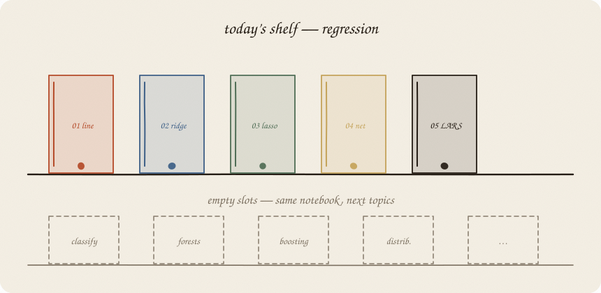
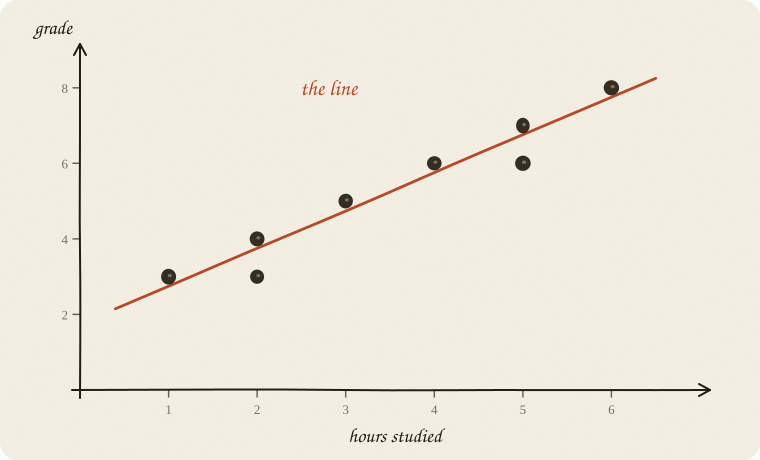
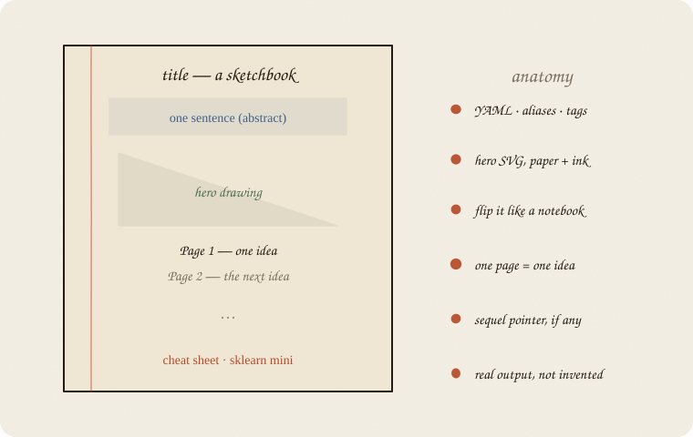
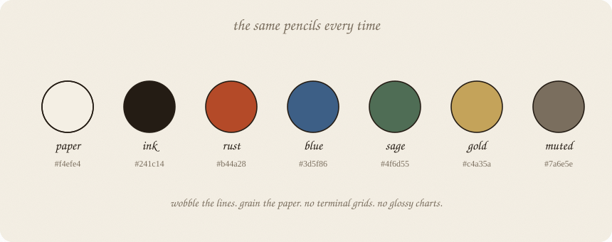
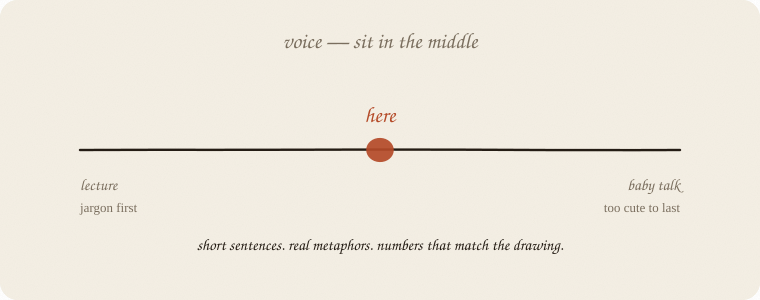
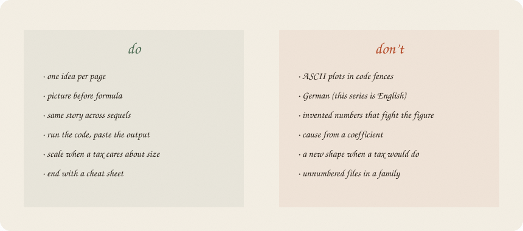

---
tags:
  - sketchbook
  - statistics
  - ml
  - agents
aliases:
  - Sketchbook house rules
  - Data science sketchbook receipt
---

# Sketchbook series — receipt & house rules

> [!abstract] In one sentence
> Today we built a **regression shelf** in paper-and-ink English. Everything after this — classification, forests, boosting, distributions — uses the **same notebook**, not a new personality.



This file is two things at once:

1. A **receipt** for what landed (which notes, which prefixes).
2. The **house rules** for the next agent (or you, on a later night) who adds a topic.

**What to write next** (encyclopedia map, path to LLMs as one summit): [[PATH.md]].

**What a human reads first:** [[00 how to read this]] — leftover, four classrooms, pick a 01. Not this file.

Read this file for *how*. Read PATH for *which shelf*. Then copy the shape, not the metaphors.

Flip it like a notebook. One page = one idea. Done.

---

## Page 1 — What landed today

Vault root. Notes live under `supervised learning/`, `optimization/`, `probability/`, `neural nets/`, `inference/`, `causal/`, `time series/`, `unsupervised/`.

**Notes** live under `regression/`, numbered so the file list *is* the reading order:

| # | note | idea in one breath |
|--:|---|---|
| 01 | [[01 linear regression]] | cloud → straight line → ŷ = a + b x |
| 02 | [[02 ridge regression]] | tax huge knobs. calmer on new people |
| 03 | [[03 lasso]] | tax \|b\|. some knobs snap to zero |
| 04 | [[04 elastic-net]] | both taxes. junk dies, twins share |
| 05 | [[05 LARS]] | not a tax. a walk. the film of who joins |
| 06 | [[06 GLM]] | one engine, glasses for y (grade / pass / count) |

**Classification** (same pencils):

| # | note | idea in one breath |
|--:|---|---|
| 01 | [[01 logistic regression]] | line inside, S outside, output is P(yes) |
| 02 | [[02 LDA]] | two blobs; shared shape → line; QDA bends |
| 03 | [[03 softmax]] | many rooms share P=1; LLM last layer |

**Ensembles** (starts with one brick):

| # | note | idea in one breath |
|--:|---|---|
| 01 | [[01 decision tree]] | questions and rectangles; Gini picks the first cut |
| 02 | [[02 random forest]] | many trees, bag + muted levers, then a vote |
| 03 | [[03 gradient boosting]] | trees in a line; each fits the leftover |
| 04 | [[04 boosting flavors]] | AdaBoost reweights people; GB leftovers; XGB is an engine |

**Walk / chance (path page 4):**

| # | note | idea in one breath |
|--:|---|---|
| 01 | [[01 gradient descent]] | walk the bowl; rate = stride |
| 01 | [[01 distributions]] | bell, coin, counts — leftover costumes |
| 01 | [[01 t-test]] | could leftover have faked this number? |
| 02 | [[02 bootstrap]] | redraw the people; the pile is leftover |

**Time (path page 4, now standing):**

| # | note | idea in one breath |
|--:|---|---|
| 01 | [[01 lag trend season]] | yesterday is a lever; the calendar repeats |

**Cause (path page 4, now standing):**

| # | note | idea in one breath |
|--:|---|---|
| 01 | [[01 confounding]] | pattern ≠ mechanism; a loud *b* can be a passenger |
| 02 | [[02 causal impact]] | actual − would-have, after a start date |

**Unsupervised (path page 4, now standing):**

| # | note | idea in one breath |
|--:|---|---|
| 01 | [[01 PCA]] | no y. turn the sausage. drop the thin axis |
| 02 | [[02 k-means]] | no y. paint k rooms. you pick k |

**Fundamentals (path page 4, now standing):**

| # | note | idea in one breath |
|--:|---|---|
| 01 | [[01 train test validate]] | leftover on new people; if you tune, hide a third pile |
| 02 | [[02 bias variance]] | jumpy knobs vs shy sit; you buy one with the other |
| 03 | [[03 metrics]] | accuracy can clap for always-fail; precision / recall pick a wall |

**Nets (path page 4, now standing):**

| # | note | idea in one breath |
|--:|---|---|
| 01 | [[01 neural net]] | score → squash → score → squash; leftover walks home |
| 02 | [[02 embeddings]] | a word is a point; nearby = same notes |
| 03 | [[03 attention]] | look around, share 1, mix; who matters depends on the asker |
| 04 | [[04 LLM]] | P(next token); lookup + look + net, stacked |

**Drawings** live in `assets/`, prefixes so they do not collide:

| prefix | series |
|---|---|
| `lr-` | linear |
| `rr-` | ridge |
| `la-` | lasso |
| `en-` | elastic net |
| `ls-` | LARS |
| `gm-` | GLM |
| `lg-` | logistic |
| `ld-` | LDA / QDA |
| `dt-` | decision tree |
| `rf-` | random forest |
| `gb-` | gradient boosting |
| `bf-` | boosting flavors (Ada / GB / XGB) |
| `gd-` | gradient descent |
| `ds-` | distributions |
| `sm-` | softmax |
| `nn-` | tiny neural net |
| `em-` | embeddings |
| `at-` | attention |
| `lm-` | LLM / next token |
| `tt-` | t-test / inference |
| `bs-` | bootstrap / resample |
| `ca-` | cause / confounding |
| `ci-` | causal impact |
| `ts-` | time series |
| `pc-` | PCA / unsupervised |
| `km-` | k-means |
| `fm-` | fundamentals / train-test |
| `in-` | intro / how to read |
| `sb-` | this receipt |

Hero of each note is `*-00-hero.svg`. Embed as ordinary markdown so GitHub can render it. Path is **relative to the note**:

```

```

From a nested family note that is two folders down: ``. Do not use `![[…]]` — GitHub prints that as text.

Empty slots on the lower shelf are not decoration. The **walk** is [[PATH.md]]. Descent, distributions, softmax, a tiny net, embeddings, attention, one LLM sketchbook, a t-test, cause 01–02, bootstrap, time 01, PCA, k-means, and fundamentals 01–03 (train/test, bias–variance, metrics) are written. **Remaining rooms get written, short. Order not locked.** SVM, Bayes (road to PyMC), RL, MCMC, beta — they belong. Do not start a wing from the summit. Do not omit a topic because it is fancy. Do not shorten ridge / lasso / LARS unless asked.

---

## Page 2 — Anatomy of a note



Every sketchbook, in this order:

1. **YAML** — `tags: [sketchbook, statistics, ml]`. Aliases include the short name *and* the old unnumbered name, so wikilinks do not rot.
2. **Title** — `Thing — a sketchbook`
3. **One-sentence abstract** in a callout. If you cannot say it in one sentence, you do not have a sketchbook yet. You have a chapter.
4. **Hero drawing.** First thing the eye hits.
5. **Sequel line**, if this is not 01. `Read [[01 …]] first. This is the sibling / sequel / camera.`
6. **`Flip it like a notebook. One page = one idea. Done.`** Keep that line. It is the contract with the reader.
7. **Pages.** `## Page N — short name`. Horizontal rules between them.
8. **Mini recipe** near the end. Numbered. Hands, not theory.
9. **sklearn mini — mandatory, last working page before the cheat sheet.** Same family story. Printed numbers must match the pages. Run it. Paste the stdout. Do not invent the printout. (Full rules: page 6.) Exception: [[00 how to read this]] is a **map**, not a fit — no sklearn page.
10. **Cheat sheet.** A table a tired person can screenshot. Always ends with a **Use / skip** remark: when to reach for *this* method, when to skip it, what it pays you, what it costs you. Short. Honest. Points at siblings instead of hand-waving “use something else.” Optional last rows: **Also called** — house word → the word you’d say in a room. Only for words *this* note introduced. Do not clone a glossary into every sequel.
11. **Closing italics** pointing at the next sibling.

Length: roughly 8–16 pages. Dense, not encyclopedic. If you need a second topic, make a sequel. Do not fatten 01. Sequels **must** be shorter than 01 — a tax, a walk, a camera, not a second textbook. Omit nothing that belongs on the map; write it short.

---

## Page 3 — Pictures



**Medium:** hand-drawn SVG. Paper fill `#f4efe4`, grain filter, wobble on the strokes. Rounded-rect page. Ink blobs for points, not perfect circles.

**Not allowed:** ASCII plots in code fences. Matplotlib-default charts. Screenshots of notebooks. Clip-art. Emoji as diagrams.

**Palette (reuse, do not freestyle):**

| pencil | hex | job |
|---|---|---|
| paper | `#f4efe4` | background |
| ink | `#241c14` | axes, points, body lines |
| rust | `#b44a28` | the thing we are introducing, or the ordinary / wild line |
| blue | `#3d5f86` | the calmer cousin, the leftover, a second method |
| sage | `#4f6d55` | “quiet truth”, the do-column, a third method |
| gold | `#c4a35a` | mix / compromise (elastic net used this) |
| muted | `#7a6e5e` | labels, captions, empty slots |

**Type:** Bradley Hand (fallback: Apple Chancery, Comic Sans MS) for labels. Georgia for tick numbers and small captions.

**Honesty:** if the text says ŷ = 1.75 + 1·x, the drawing uses that line. If sklearn prints `hours 0.000`, the caption does not pretend hours survived.

**How to make one:** a small Python script that writes SVG (see the throwaway generators from today). Keep the script if you want; the **SVG in `assets/` is the artefact**. Do not check in a matplotlib PNG and call it a sketch.

---

## Page 4 — Voice



**Language: English.** The series started in German and moved. Stay put. Chat may be German; the notes are not.

**Reader:** smart 18-year-old. No stats course. Not a child. This is the **job-interview version**: picture, one sentence, real numbers. Not a textbook. Whoever wants the derivation goes somewhere else.

Sit between lecture and baby talk:

- Short sentences. Then a short one.
- One metaphor per idea, then stop petting it. *Tax, walk, leftover, twins, knobs, haircut* — those already exist. Invent a new one only if the old ones lie.
- Formula after the picture, not before. LaTeX is allowed. It is not the teacher.
- Humility baked in. Pattern ≠ cause. R² is volume, not truth. A zero is a shortlist, not a moral verdict.
- Jargon may enter **after** the picture, in one line. “People call this soft thresholding.” Then move.

**Do not:**

- Write in German “because the user is German.” The notes are English on purpose.
- Hedge every sentence. Pick a verb.
- Be cute for a whole page. One wink is enough.
- Dump a textbook definition and then “explain it simply.” Start simple. Name it later.

---

## Page 5 — Do / don’t



**Do**

- One idea per page.
- Picture before formula.
- Keep **one running story** across a family. Regression’s story is grades: hours, sleep, tutor, plus twins (minutes) and junk (coffee, noise). Classification should pick *its* story and not abandon it mid-shelf.
- Scale *x* when a method taxes size. Say so out loud. OLS with one honest *x*: optional. Ridge / lasso / elastic-net: **required**. Logistic (and any linear score): scale when levers are in different units.
- End every note with a **sklearn mini** that uses the family’s story and whose printed numbers agree with the pages. Seed it. `np.random.default_rng(7)` is the house seed unless you have a reason.
- Number files in a family: `01 …`, `02 …`. Reading order = sort order.
- Point sequels at numbered paths: `[[01 linear regression]]`, not the old bare name — but keep the old name as an alias.

**Don’t**

- ASCII art in triple-backticks as a “plot.”
- Invent numbers that fight the figure or the printout.
- Infer cause from a coefficient.
- Change the *shape* of the model when you only changed the *score* (ridge is still a line).
- Leave unnumbered siblings in a folder that is supposed to be a sequence.
- Write a new house style because the new topic feels fancier. Forests still get paper, ink, pages, a cheat sheet, and a tiny fitted example.
- Ship a note without the sklearn page. A sketchbook that never touches data is a comic. (The front door [[00 how to read this]] is the one map that skips it.)
- Omit SVM, MCMC, kernels, BSTS, Bayes, RL, fundamentals because they feel advanced. They belong. After their 01. Short.
- Fatten a sequel (ridge, lasso, LARS) until it is longer than the idea. Keep the topic; cut the repetition — **but do not rewrite ridge / lasso / LARS unless asked.**
- Write notes in German because the chat was German.

---

## Page 6 — sklearn mini at the end of every note

**Not optional.** Every sketchbook ends with a working sklearn example, after the mini recipe and before the cheat sheet. Title it like the other pages (`## Page N — …, in sklearn`).

Two matching jobs. Miss either one and rewrite:

1. **Story-matching.** Same people, same levers, same *y* as page 1 of that family. Regression’s story is grades (hours, sleep, tutor; minutes as a twin; coffee and noise as junk). Classification will pick its own story on 01 and **keep it** through 05. Do not switch to `load_iris()` because it is lying around. Do not invent a second universe in the code block.
2. **Number-matching.** The printout has to agree with the pages and the drawings. If the sketch says ŷ = 1.75 + 1·x, sklearn must print that. If lasso fires hours, the snippet must fire hours. Tune `alpha` / splits until the story the pages told is the story the numbers tell. Then paste **that** run.

Shape of the page:

```
## Page N — short name, in sklearn

One or two sentences: what this run is supposed to show.

```python
# short enough to type. house seed 7.
```

```
the real stdout
```

One paragraph that *reads* the printout.


Rules for the snippet:

- Imports, data, fit, print. No classes, no CLI, no extra files.
- `make_pipeline(StandardScaler(), Model(...))` whenever scale matters.
- Print named coefficients (or the object the topic actually has), then train/test score.
- Output fence sits **immediately** under the code. That stdout was **run**, not guessed.
- sklearn’s `alpha` is λ. Say that once. `l1_ratio` is the mix knob. Don’t pretend the names are pretty.
- Sequels may reuse 01’s data-generating code. Change only the estimator and what you print. The story stays.

If the method has no sklearn estimator worth using, a tiny numpy loop is fine. Fake output is not. A note with no example is not done.

---

## Page 7 — How to add the next shelf

Classification, ensembles, distributions — same ritual:

1. Make a folder at vault root (or under `supervised learning/` if it *is* supervised), named for the family (`classification/`, `ensembles/`, `probability/`).
2. Number the notes. 01 is the ordinary idea. Sequels are the seatbelts, the haircuts, the cameras.
3. Pick **one story** for the whole family and write it on page 1 of 01. Do not switch stories in 03.
4. Draw SVGs into `assets/` with a new two-letter prefix (`cl-`, `rf-`, `xb-`, `ds-`, …). Do not reuse `lr-`.
5. Open with hero + one sentence. Close with: mini recipe → **sklearn mini (story + numbers match)** → cheat sheet **with Use / skip** → sequel pointer.
6. Come back here and put the new spines on the shelf (a line in the table on page 1 is enough). Do not rewrite the house rules unless the rules were wrong.

**Next spine:** [[PATH.md]] — remaining rooms, short, **order not locked**. SVM, Bayes (not PyMC as 01), RL (not PPO as 01). Do not start a wing from the summit. Do not omit a topic because it is fancy.

**The site (later):** [datazines.com](https://datazines.com) is these zines in a browser. Notes stay markdown. HTML is a leaf, not a new personality. Recipe: [[html/README.md]]. Converter: `scripts/note_to_html.py`. Drawings stay **SVG**. Do not start the site from a blog theme.

If a topic does not fit the notebook voice, it does not belong in this series yet.

---

## Page 8 — Mini recipe for the next agent

1. Read this file for *how*. Read [[PATH.md]] for *which room*. Then read **01 of the family you are extending**, not a random blog.
2. Name the idea in one sentence. If you fail, stop.
3. List 8–12 page titles. Each must be *one* idea.
4. Draw the pictures first, or at least know what each picture claims.
5. Write English, sketchbook pages, YAML, numbered filename.
6. Run the sklearn mini on the **same story and numbers** as the pages. Paste the stdout. Read it in one paragraph. If the printout contradicts the sketch, fix the sketch or the knobs — do not shrug.
7. Link sequels both ways. Aliases for old names.
8. Do not “improve” the voice. Match it.

If you keep only one thing:

> paper, ink, one idea per page, real numbers, same story till the shelf is done.

---

## Last page — cheat sheet

| thing | rule |
|---|---|
| place | `<family>/0N name.md` (supervised families under `supervised learning/`) |
| pictures | `assets/<prefix>-….svg` |
| language | English |
| voice | smart 18, not lecture, not cutesy |
| page | one idea, picture, then names |
| numbers | match the drawing *and* the sklearn printout |
| scale | OLS one *x*: skip. ridge / lasso / elastic-net: always. logistic: when units differ |
| seed | `7` unless you must change it |
| end of every note | recipe → sklearn mini (same story, matching numbers, real stdout) → cheat sheet **with Use / skip** → next sibling |
| sklearn mini | mandatory. family story, not iris. numbers agree with the pages |
| Use / skip | on every cheat sheet: when to use, when not, pays / costs |
| HTML zine | `scripts/note_to_html.py` → `html/<stem>.html`. live SVG. recipe: [[html/README.md]] |
| site | datazines.com when the shelf is thick. same pencils, not a blog |
| this file | receipt + rules. update the shelf, rarely the rules |

---

*Receipt for the regression shelf, 30 Aug 2026. Next book, same pencils.*
