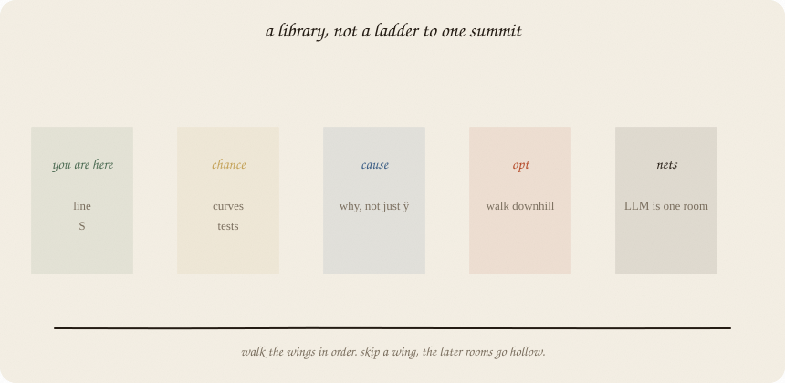
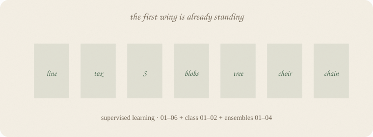
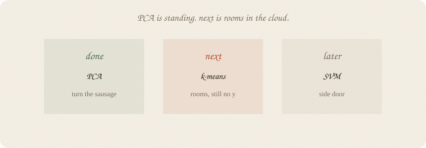

---
tags:
  - sketchbook
  - statistics
  - ml
  - agents
aliases:
  - Encyclopedia path
  - What to learn next
  - Path to LLMs
---

# Path — a library, not a ladder

> [!abstract] In one sentence
> This series is a **data-science encyclopedia** in sketchbooks. LLMs are **one room in the nets wing**, not the building. A **recommended route** so later rooms don’t go hollow — not a requirement to finish the building.

House style lives in [[AGENTS.md]]. A human’s front door is [[00 how to read this]] — not this file.

**Freeze (6 Sep 2026):** this file is a **map of what exists**, and the **parking lot** for ideas until the freeze lifts. No new rooms tonight. Site: [[PUBLISH.md]].

---

## Page 1 — Two jobs, one voice

**Job A.** A readable encyclopedia: line, chance, tests, cause, optimization, nets, time, unsupervised, fundamentals, Bayes, RL. Simple terms. Real numbers. Use / skip. This is the **interview overview**. Derivations live elsewhere.

**Job B.** Enough foundation that an LLM is not magic: *P(next token)* is softmax on a deep score, trained by walking downhill.

A is the building. B is a marked staircase through it. Do not skip A to finish B. Do not pretend B is the only staircase.

Same pencils as always. Same “one idea per page.” New family = new folder at vault root (or under `supervised learning/` only if it *is* supervised). **Language of the notes is English**, even when the chat is German.

---

## Page 2 — The first wing is already standing

**Supervised learning** (regression 01–06, classification 01–04, ensembles 01–04 standing — do not fatten *those* notes):

- Regression 01–06: line, tax, shortlist, mix, walk, glasses for *y*
- Classification 01–04: S, blobs, **softmax**, SVM / margin
- Ensembles 01–04: tree, choir, leftover-chain, boosting dialects

**Also standing (path page 4, done):**

- [[00 how to read this]] — front door: folders are shelves, read 01
- [[01 gradient descent]] — walk the bowl
- [[01 distributions]] — bell, coin, counts
- [[02 beta]] — coin’s cousin: a bump on unknown P
- [[03 softmax]] — many-class S; LLM last layer
- [[01 neural net]] — one hidden layer; leftover walks home
- [[02 embeddings]] — a word is a point; nearby = same notes
- [[03 attention]] — look around, share 1, mix
- [[04 LLM]] — P(next token); this block, stacked
- [[01 t-test]] — could leftover have faked this number?
- [[01 confounding]] — pattern ≠ mechanism; a loud *b* can be a passenger
- [[02 bootstrap]] — redraw the people; the pile is leftover
- [[01 lag trend season]] — yesterday is a lever; the calendar repeats
- [[02 causal impact]] — actual − would-have, after a start date
- [[01 PCA]] — no y; turn the sausage; drop the thin axis
- [[02 k-means]] — no y; paint k rooms; you pick k
- [[01 train test validate]] — leftover on new people; if you tune, hide a third pile
- [[02 bias variance]] — jumpy knobs vs shy sit; you buy one with the other
- [[03 metrics]] — accuracy can clap for always-fail; precision / recall pick a wall
- [[04 SVM]] — fattest street; fence in the middle; only the curb holds it
- [[01 prior]] — a starting bump; data slides it; posterior is the bump after
- [[02 MCMC]] — cannot add? walk the height; the pile is the bump
- [[01 the loop]] — state, action, reward, next; leftover is a score you chose
- [[02 bandits]] — one room, many arms; try or cash; no next
- [[03 Q]] — from here, this act, points from now on

You already own: score, leftover, tax, squash, impurity, vote vs chain, learning rate (as volume), a tiny net, a lookup table of points, a look, a next-token pile, a judge for a mean and a slope, see vs do, leftover replayed without a bell, a series with a holdout in time, a gap vs would-have, a cloud with no grade, rooms in that cloud, leftover on **new** people, jumpy vs shy, accuracy that can clap for always-fail. That is the furniture later wings reuse.

**Order, not a ban.** SVM, kernels, MCMC, BSTS, another boosting dialect, fundamentals, Bayes, RL — they belong in the building. Write them **after** their 01, **short**. Do not start a wing from the summit. Do not fatten one brand into a second textbook. Ridge / lasso / LARS stay as written until someone asks to cut.

---

## Page 3 — The wings (encyclopedia)

Write **left to right**. Inside a wing, 01 is the ordinary idea.

| wing | folder (suggested) | 01 is | later rooms (not all at once) |
|---|---|---|---|
| **1. Supervised** | `supervised learning/…` | line, S, tree | *standing* (SVM 04 now on the S-shelf) |
| **2. Chance** | `probability/` then `inference/` | a distribution is a shape for leftovers | Gaussian, Bernoulli, Poisson; **beta standing**; sampling; SE; CI; t-test / p-value; bootstrap |
| **3. Cause** | `causal/` | pattern ≠ mechanism (already a page) | *01–02 standing* (confounding, causal impact). DAGs / experiments later. BSTS lives under **time**, as the fat would-have — not a cause 01. |
| **4. Walk** | `optimization/` | gradient descent | step size; local minima; SGD; MCMC (walk a *posterior*); Bayesian optimization as “search the knobs when the bowl is expensive” |
| **5. Nets** | `neural nets/` | a tiny net | softmax; embeddings; attention; transformer / LLM (one sketchbook, not a career) |
| **6. Time** | `time series/` | lag, trend, season | *01 standing*. Holdouts in time (already a page). **Parked:** ARIMA / ARIMAX (lag as a named leftover model); BSTS (would-have as a bump — engine for [[02 causal impact]], after [[02 MCMC]]). Not as 01. |
| **7. Unsupervised** | `unsupervised/` | “no y” | PCA as rotating the cloud; k-means; a page on embeddings you already have |
| **8. Fundamentals** | `fundamentals/` | leftover on **new** people | *01–03 standing* (train/test, bias–variance, metrics). Significance already lives in [[01 t-test]] |
| **9. Bayes** | `bayes/` | a prior is a starting costume | *01–02 standing* (prior, MCMC). A library that walks is an engine, not 03 |
| **10. Act** | `rl/` | state, action, reward, next state | *01–03 standing* (loop, bandits, Q). Policy later. Not a brand as 04 |

Rooms on the map get written. Short. In the wing they belong to. **Which remaining room is next is not locked** — pick one when a session starts. Do not omit a wing because it is fancy. Do not start Bayes from PyMC or RL from PPO.

---

## Page 4 — The rooms stand. Freeze.

**Written:** [[00 how to read this]] · [[01 gradient descent]] · [[01 distributions]] · [[02 beta]] · [[03 softmax]] · [[01 neural net]] · [[02 embeddings]] · [[03 attention]] · [[04 LLM]] · [[01 t-test]] · [[01 confounding]] · [[02 bootstrap]] · [[01 lag trend season]] · [[02 causal impact]] · [[01 PCA]] · [[02 k-means]] · [[01 train test validate]] · [[02 bias variance]] · [[03 metrics]] · [[04 SVM]] · [[01 prior]] · [[02 MCMC]] · [[01 the loop]] · [[02 bandits]] · [[03 Q]]

No *y*. The sausage is rotated. The rooms are painted. The loop has a table.

**Freeze:** do not write any new 01 until the freeze lifts. Park ideas on this page (time row, cheat sheet). Next work is **fix / refine**, then the desk: [[PUBLISH.md]]. Ridge / lasso / LARS: do not shorten unless asked.

---

## Page 5 — Staircase to “how LLMs work” (marked, not exclusive)

Reuse the encyclopedia; don’t clone it.

1. Line + leftover + tax *(have)*  
2. Logistic S *(have)*  
3. **GD** *(have)*  
4. **Distributions** + **softmax / cross-entropy** *(have)*  
5. Tiny net + backprop as leftover flowing backward *(have)*  
6. Embeddings (tokens as points in a cloud) *(have)*  
7. Attention (which other tokens matter) *(have)*  
8. Transformer block = attention + net, stacked; train = next token; use = sample from softmax *(have)*  
9. Cheap extras as *pages*, not shelves: tokenizer, context window, temperature, pretrain vs chat

Weight decay = ridge. Dropout ≈ bagging. Pages, not wings.

---

## Page 6 — Other summits, same building

When someone says “we also need…” — they are usually **already on the map**:

| they want | lives in |
|---|---|
| t-test, p-value, “is this real?” | inference, after distributions |
| train / test / validate, metrics, bias–variance | fundamentals, after a line you can overfit |
| Bayesian optimization | optimization, after GD (expensive bowl) |
| PyMC, posterior, beta prior | Bayes, after distributions + a walk (MCMC) |
| reinforcement learning | RL, after leftover as *reward* makes sense — 01 is the loop |
| causal impact | causal, after chance + a little time |
| A/B test | inference + cause (experiment) |
| forecast | time series ([[01 lag trend season]]) |
| ARIMA / ARIMAX | time, after lag/trend/season — leftover with a named memory. Not 01 |
| BSTS, CausalImpact engine | time sequel + [[02 MCMC]]; same gap as [[02 causal impact]]. Not 01 |
| BEST (Bayesian estimation vs t) | inference sequel, after [[01 t-test]] + [[01 prior]]. Not PyMC as 01 |
| “why did the model do that?” | start: *b*, Gini gain, importances; later: a small explainability page — not SHAP as 01 |

Do not start a wing from the summit. Causal impact without confounding is a demo. Bayesian opt without GD is a slogan. LLM without softmax is a box cartoon. PyMC without a prior is a library tour. PPO without the loop is a brand.

---

## Page 7 — How to walk (for future sessions)

1. Open [[PUBLISH.md]] for the site. During the freeze, this file is a map, not a to-do.
2. Do not start a new 01. Sequels that already exist stay short. Do not shorten ridge / lasso / LARS unless asked.
3. Same story when the wing allows it (exam / grades) until the idea *needs* a new story (tokens, time, reward).
4. Update the shelf table in [[AGENTS.md]] when a note lands. Update **page 2 of this file** when a wing’s 01 exists.
5. If a topic is shiny (SVM, MCMC, PyMC, PPO): ask “which wing, which 01 does it need?” If the 01 is missing, write that first. Then write the topic **short**. Do not leave it off the shelf because it is fancy.
6. Notes in **English**. Chat language does not change that.

If you keep only one thing:

> encyclopedia stands. freeze the rooms. next: paper in a browser.

---

## Last page — cheat sheet

| | |
|---|---|
| building | data-science encyclopedia, sketchbook voice |
| LLM | one room, nets wing, after GD + softmax + a tiny net |
| standing | supervised + GD + distributions + softmax + tiny net + embeddings + attention + LLM + t-test + cause + bootstrap + time + impact + PCA + k-means + train/test + bias–variance + **metrics** |
| **next** | **freeze** — polish notes, then [[PUBLISH.md]] |
| deferred | **time:** ARIMA/X · BSTS (would-have bump) · **inference:** BEST · **RL:** policy page · k-NN · naive Bayes · A/B — not until freeze lifts |
| don’t | new wings; start PyMC / PPO / BSTS as 01; fatten one brand; write notes in German |
| style | [[AGENTS.md]] |

### Use / skip

**Reach for this file** to see what exists.

**Skip** using it as “write the next 01.” That is frozen. Site: [[PUBLISH.md]].

---

*Map for the library. House rules stay in AGENTS. Site: [[PUBLISH.md]].*
