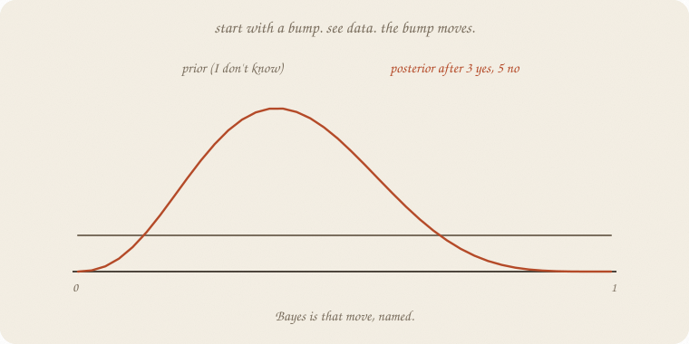
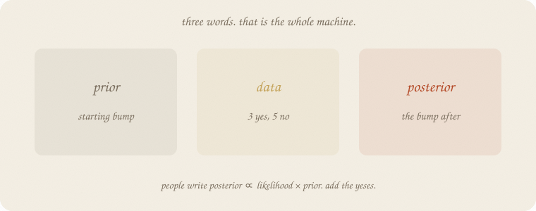
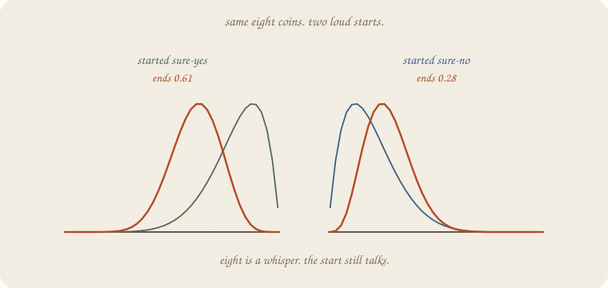
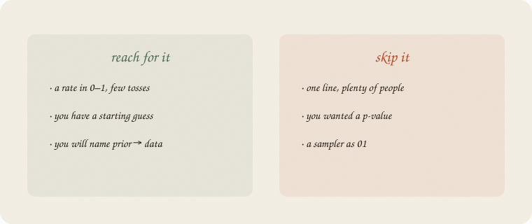

---
tags:
  - sketchbook
  - statistics
  - ml
aliases:
  - Bayes
  - Prior
  - Posterior
  - Bayesian statistics
---

# Prior — a sketchbook

> [!abstract] In one sentence
> A **prior** is a starting costume for an unknown. **Data** slides it. The bump after is the **posterior**. Same add-the-yeses move as [[02 beta]], named.



Read [[02 beta]] first. Same eight coins, house seed 7, true *P* = 0.6. Beta was the bump. This notebook is the **move**: start → see → bump after.

This is 01 of the Bayes wing. When you cannot add, [[02 MCMC]] walks the height.

Flip it like a notebook. One page = one idea. Done.

---

## Page 1 — You already added the yeses

[[02 beta]]: start Beta(1, 1). See 3 pass, 5 fail. Become Beta(4, 6). Mean 0.50 → **0.40**.

That *is* Bayes. Three words:



| word | in this story |
|---|---|
| **prior** | the bump before the eight coins |
| **data** | 3 yes, 5 no |
| **posterior** | the bump after |

People write:

> posterior ∝ likelihood × prior

Ugly. Friendly: *how well the data fit this P* times *where you started*. For a coin and a beta, that product is “add the yeses to α, the nos to β.” You already did it.

The **likelihood** is P(these eight | this *P*). Three yes and five no like *P* = 0.4 more than *P* = 0.8 (0.28 vs 0.01). The prior is the starting bump. Multiply, get the posterior. Beta makes the multiply a plus.

---

## Page 2 — A point guess is not a bump

The ordinary guess from eight coins: 3 / 8 = **0.375**. One number. No shoulders.

The posterior Beta(4, 6): mean **0.40**, 5% at **0.17**, 95% at **0.66**. Still a wide stick. Eight is a whisper. The point 0.375 pretends it isn’t.

A t-test asked “could leftover have faked this number?” ([[01 t-test]]). Bayes asks a different question: **where does P like to sit, after I started somewhere and then saw the coins?** Not a *p*. A bump.

You can still report a mean. You should also report the width.

---

## Page 3 — The start still talks when *n* is tiny

Same eight coins. Two loud priors.



| start | mean before | mean after | 5%–95% after |
|---|---:|---:|---|
| Beta(1, 1) shrug | 0.50 | **0.40** | 0.17–0.66 |
| Beta(2, 2) mild half | 0.50 | **0.42** | 0.20–0.65 |
| Beta(8, 2) sure-yes | 0.80 | **0.61** | 0.42–0.79 |
| Beta(2, 8) sure-no | 0.20 | **0.28** | 0.12–0.46 |

Truth was 0.6. A sure-yes start still ends near 0.61. A sure-no start ends at 0.28 — eight gloomy coins plus a gloomy start. **The prior is not free.** Write it down. If you cannot defend Beta(8, 2), don’t use it.

More tosses, the start matters less. That is the deal, not a scandal.

---

## Page 4 — Not a sampler

This notebook has no walk. Beta in, coins, beta out. Closed.

When the unknown is a slope, or ten *P*s, or a bump that is not beta, you **cannot** add. Then you walk the posterior with leftover as a height — [[02 MCMC]], after [[01 gradient descent]].

Logistic still estimates P from hours without a prior. Plenty of people, one S: stay there. Bayes pays rent when the pile is small or the start is real (last year’s pass rate, a doctor’s base rate).

---

## Page 5 — Mini recipe

1. Name the unknown (here: *P* in 0–1).
2. **Prior** — a starting bump you can defend. Beta(1, 1) if you don’t know.
3. **Data** — yeses and nos (or leftover, later).
4. **Posterior** — prior updated. Coin + beta: add yeses to α, nos to β.
5. Report **mean and width**, not a fake point.

If you keep only one thing:

> prior = starting bump. data slides it. posterior = the bump after.

---

## Page 6 — Eight coins, in scipy

Same tosses as [[02 beta]]. House seed 7. True *P* = 0.6. Four starts, four posteriors.

```python
import numpy as np
from scipy.stats import beta

rng = np.random.default_rng(7)
tosses = rng.binomial(1, 0.6, 8)
yes, no = int(tosses.sum()), int(8 - tosses.sum())
print("tosses", tosses.tolist(), "  yes", yes, "  no", no)
print("ordinary guess  yes/n =", round(yes / 8, 3))

def show(a, b, title):
    d = beta(a, b)
    print(f"{title:28s} mean {d.mean():.3f}   5% {d.ppf(0.05):.3f}   95% {d.ppf(0.95):.3f}")

show(1, 1, "prior  Beta(1,1)")
show(1 + yes, 1 + no, "post   Beta(4,6)")
show(2, 2, "prior  Beta(2,2)")
show(2 + yes, 2 + no, "post   Beta(5,7)")
show(8, 2, "prior  Beta(8,2) sure-yes")
show(8 + yes, 2 + no, "post   Beta(11,7)")
show(2, 8, "prior  Beta(2,8) sure-no")
show(2 + yes, 8 + no, "post   Beta(5,13)")
```

```
tosses [0, 0, 0, 1, 1, 0, 1, 0]   yes 3   no 5
ordinary guess  yes/n = 0.375
prior  Beta(1,1)             mean 0.500   5% 0.050   95% 0.950
post   Beta(4,6)             mean 0.400   5% 0.169   95% 0.655
prior  Beta(2,2)             mean 0.500   5% 0.135   95% 0.865
post   Beta(5,7)             mean 0.417   5% 0.200   95% 0.650
prior  Beta(8,2) sure-yes    mean 0.800   5% 0.571   95% 0.959
post   Beta(11,7)            mean 0.611   5% 0.420   95% 0.788
prior  Beta(2,8) sure-no     mean 0.200   5% 0.041   95% 0.429
post   Beta(5,13)            mean 0.278   5% 0.124   95% 0.461
```

Shrug → 0.40, wide. Sure-yes → 0.61 (truth was 0.6 — luck plus a loud start). Sure-no → 0.28. Ordinary 3/8 = 0.375 is the shrug posterior’s neighbor, with no shoulders. `ppf` is the bump, not a CI from a t-test.

---

## Last page — cheat sheet

| word | meaning |
|---|---|
| prior | starting bump |
| data / likelihood | how well these coins fit this *P* |
| posterior | bump after the coins |
| β in, coins, β out | add yeses — conjugate |
| width | how unsure you still are |

**Also called:** prior = starting costume · posterior = updated belief · likelihood = P(data \| P) · MLE = yes/n, no bump.



### Use / skip

**Reach for it when** the unknown is a **rate**, the pile is **small**, and you can defend a starting bump.

**Skip it when** one line and plenty of people already work; you wanted a *p* ([[01 t-test]]); you cannot write the prior down.

**Pays you:** a bump, not a fake point. The start is visible. Same coins as beta, named.

**Costs you:** the prior is a choice. Eight tosses leave a wide stick. Not a sampler. Not a slope with ten knobs (that walk is later).

---

*Bayes 01. A starting bump. Next: [[02 MCMC]] — walk the height when you cannot add.*
