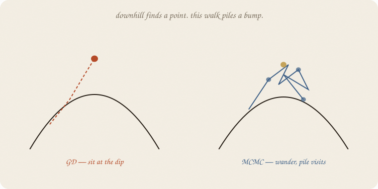
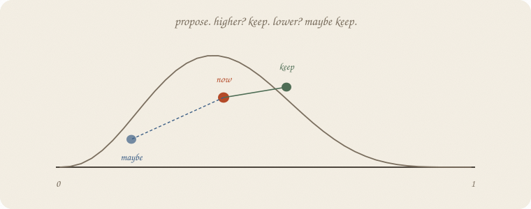
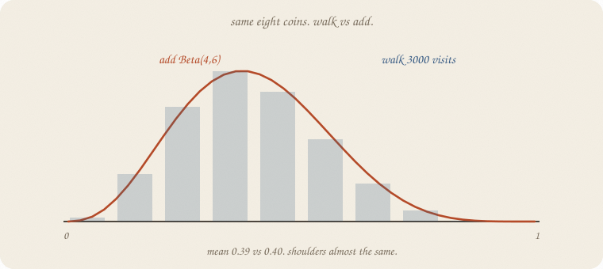
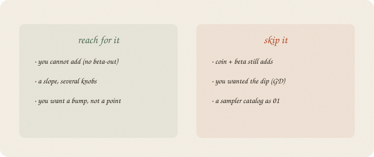

---
tags:
  - sketchbook
  - statistics
  - ml
aliases:
  - MCMC
  - Metropolis
  - Markov chain Monte Carlo
---

# MCMC — a sketchbook

> [!abstract] In one sentence
> When you **cannot add**, the posterior is only a **height**. Walk around that height. The pile of visits *is* the bump.



Read [[01 prior]] and [[01 gradient descent]] first. Same eight coins, house seed 7, 3 yes / 5 no. Prior still adds: Beta(4, 6), mean **0.40**. This notebook **pretends we cannot add**, walks anyway, and checks the pile against that bump.

This is 02 of Bayes. A walk, not a catalog of samplers.

Flip it like a notebook. One page = one idea. Done.

---

## Page 1 — GD sits. This walk piles.

[[01 gradient descent]] walks a bowl **downhill** and **stops** at a point: ŷ’s leftover² as small as it gets.

The posterior is also a height on knob-land: how much this *P* likes the coins, times the prior. If you only sit at the peak, you get a point. Bayes wanted a **bump** — mean *and* width.

So you walk **around**, not only down. Visit high places often, low places rarely. After you drop the first stretch, the histogram of visits is a **sketch** of the posterior — if the walk mixed. Short chain, still a whisper.

People call this **Markov chain Monte Carlo**. Ugly. Friendly job: *wander the bump; the pile is the answer.*

On a coin we *can* add. We walk anyway so you can see the pile match. A slope with a prior usually cannot add. Then this walk is the method, not a demo.

---

## Page 2 — Propose, maybe keep

Stand at a *P*. Propose a neighbor (a small nudge).



- **Higher** posterior? Keep it.
- **Lower**? Keep it with chance = new height / old height. Sometimes go downhill. That is how you still visit the shoulders.

If the neighbor is outside 0–1, stay. Repeat. Throw away the first stretch (you started at 0.5; that was a guess). The rest is the pile — **if** later steps still wander and do not stick in one pocket.

Quiet nudge: you crawl, accept almost everything. Loud nudge: you jump, reject a lot. Interview stride here: **0.12**. Accept rate **0.77**. Not a moral.

This flavor is **Metropolis**. Other walks exist. Same job.

---

## Page 3 — The pile matches the add

Same coins. Flat prior. Height ∝ *P*³ (1−*P*)⁵ — three yes, five no.

4000 steps, drop the first 1000.



| | mean | 5% | 95% |
|---|---:|---:|---:|
| **add** Beta(4, 6) | **0.40** | 0.17 | 0.66 |
| **walk** 3000 visits | **0.39** | 0.17 | 0.65 |

Close enough. Eight coins, a whisper either way. The walk did not need the beta formula. It only needed a **height** at each *P*.

That is the gift when you cannot add: if you can score a guess, you can pile guesses.

---

## Page 4 — Mini recipe

1. Write a **height** (log posterior is safer). Prior × how well the data fit this guess.
2. Start somewhere legal.
3. **Propose** a neighbor. Keep if higher; maybe keep if lower.
4. Repeat a lot. Drop the first stretch.
5. The histogram, mean, and shoulders *are* the posterior.
6. If you *can* add (coin + beta), add. Walk is for when you cannot.

If you keep only one thing:

> cannot add? walk the height. the pile is the bump.

---

## Page 5 — Eight coins, walking, in numpy

Same 3 yes, 5 no. Flat prior. Metropolis on *P*. House seed 7. No extra library.

```python
import numpy as np

yes, no = 3, 5

def log_post(p):
    p = np.clip(p, 1e-9, 1 - 1e-9)
    return yes * np.log(p) + no * np.log(1 - p)

rng = np.random.default_rng(7)
n, step, burn = 4000, 0.12, 1000
p, lp = 0.5, log_post(0.5)
chain = np.empty(n)
acc = 0
for i in range(n):
    q = p + rng.normal(0, step)
    if 0 < q < 1:
        lq = log_post(q)
        if np.log(rng.random()) < lq - lp:
            p, lp = q, lq
            acc += 1
    chain[i] = p
post = chain[burn:]

print("accept rate", round(acc / n, 2))
print("walk mean", round(post.mean(), 3))
print("walk 5%", round(float(np.quantile(post, 0.05)), 3),
      "  95%", round(float(np.quantile(post, 0.95)), 3))

from scipy.stats import beta
d = beta(4, 6)
print("add  mean", round(d.mean(), 3),
      "  5%", round(d.ppf(0.05), 3),
      "  95%", round(d.ppf(0.95), 3))
print("first 8", np.round(chain[:8], 3).tolist())
```

```
accept rate 0.77
walk mean 0.39
walk 5% 0.174   95% 0.648
add  mean 0.4   5% 0.169   95% 0.655
first 8 [0.5, 0.467, 0.413, 0.42, 0.361, 0.42, 0.432, 0.429]
```

Start at 0.5, wander. Mean **0.39** vs add **0.40**. Shoulders 0.17–0.65 vs 0.17–0.66. First steps already leave 0.5. `step` is the nudge, not GD’s learning rate — same *quiet* habit, different job (pile, not dip).

---

## Last page — cheat sheet

| word | meaning |
|---|---|
| height | posterior at this guess (prior × likelihood) |
| propose | a neighbor |
| accept | keep the neighbor (always if higher; maybe if lower) |
| chain | the walk |
| pile | visits after the first stretch = the bump |
| Metropolis | this propose / maybe-keep |

**Also called** (in a room):

| here | there |
|---|---|
| MCMC | wander the posterior |
| burn-in | drop the first stretch |
| accept rate | how often you moved |



### Use / skip

**Reach for it when** you **cannot add** (no beta-out), you still want a **bump**, and you can score a guess.

**Skip it when** coin + beta still adds ([[01 prior]]); you wanted the **dip** ([[01 gradient descent]]); you wanted a catalog of samplers as 01.

**Pays you:** a posterior without a named bump. Same coins, a pile that matches the add — so you trust the walk when add is gone.

**Costs you:** many steps. A nudge to pick. The first stretch is a lie. Not a point estimate. Not a library.

---

*Bayes 02. Walk the height. Next: [[01 the loop]] — state, action, reward, next. Not a sampler catalog.*
