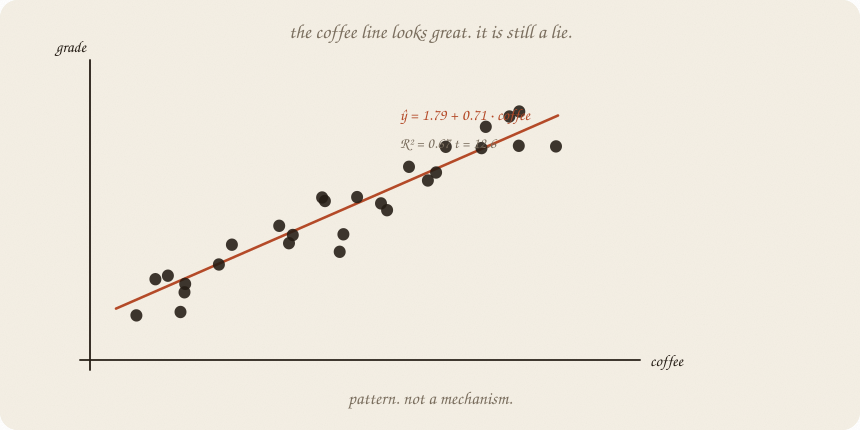
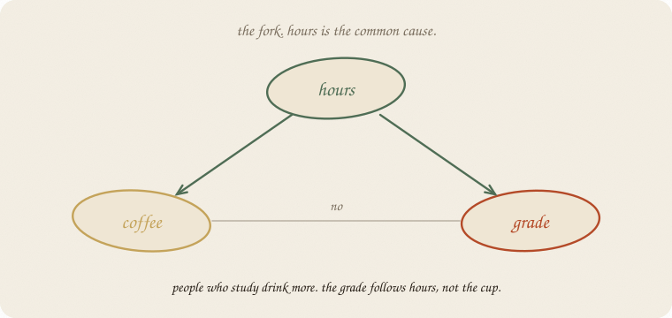
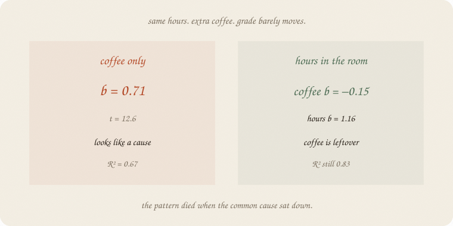
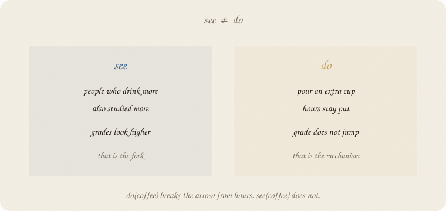
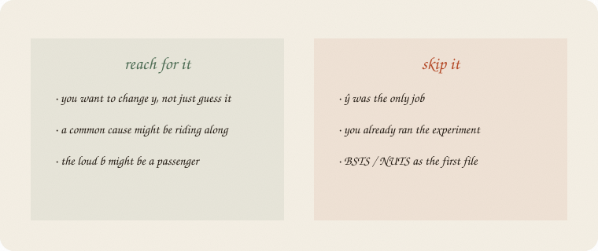

---
tags:
  - sketchbook
  - statistics
  - ml
aliases:
  - Confounding
  - Cause
  - Causal inference
  - pattern vs mechanism
---

# Confounding — a sketchbook

> [!abstract] In one sentence
> A loud *b* is a **pattern**. Cause is a **mechanism**: what happens if you *do* the lever. A common cause can make a passenger look like a driver.



Read [[01 linear regression]] and [[01 t-test]] first. Same exam world. Hours still make the grade. Coffee is back — as junk that **rides with hours**. The t-test can call coffee “real.” It cannot tell you coffee *did* it.

This is 01 of the cause wing. Experiments, DAGs as sequels, causal impact after a little time. Not MCMC. Not BSTS.

Flip it like a notebook. One page = one idea. Done.

---

## Page 1 — The coffee line looks great

Eighty students, house seed 7. A **crowd**, not the thirty on the ridge page. Grade is still 1.8 + 1 · hours, plus leftover. Coffee is **not** in that recipe. People who study just drink more.

Fit coffee only, anyway.

ŷ = **1.79 + 0.71 · coffee**. R² = 0.67. *t* = 12.6.

The t-test shouts. The cloud rises. A campaign could print “drink coffee, raise your grade.”

That is a **pattern**. The line is honest about the cloud. It is silent about the tap.

---

## Page 2 — Hours sits behind both

Why do coffee and grade rise together? Because **hours** pushes both.



Hours → coffee (they drink while they study).
Hours → grade (the real lever).
Coffee → grade? **No.** We wrote the world that way.

People call this a **fork**. The common cause is a **confounder**. Coffee is a **passenger**. The passenger can look louder than the driver if you never seat the driver.

Correlation hours·coffee = **0.93**. Of course coffee predicts the grade. It is a noisy copy of hours.

---

## Page 3 — Hold hours still

Put hours in the room. Coffee’s job is now: *among people with the same hours, does extra coffee move the grade?*



| model | coffee *b* | hours *b* | R² |
|---|---:|---:|---:|
| coffee only | **0.71** | — | 0.67 |
| hours only | — | **0.99** | 0.83 |
| both | **−0.15** | **1.16** | 0.83 |

Coffee’s slope dies. Hours stays near 1 — the number we planted. R² does not improve when coffee sits down. The extra cup was leftover.

This is not a new line. It is the old line, with the common cause **held still**. Lasso would fire coffee ([[03 lasso]]). Here we care *why* it should be fired.

---

## Page 4 — See is not do

**See coffee:** look at people who already drink more. They studied more. Grades look higher. The fork is intact.

**Do coffee:** pour an extra cup. Hours stay put. The grade does not jump. You **broke** the arrow from hours to coffee. That is the mechanism.



People write do(coffee) for that break. Ugly letters. Friendly job: *what if we set the lever ourselves?*

An experiment is do() in the world: random extra cups, hours free to be whatever they were. Then coffee’s *b* is a cause, or it isn’t. Seeing never did that job.

A t-test on the see-line still answers leftover. It does not answer do().

---

## Page 5 — Mini recipe

1. Name the **job**. Guess *y*? A pattern is enough. **Change** *y*? You need a mechanism.
2. Draw the **fork** (who sits behind both?). If you cannot name one, you are not done looking.
3. **Hold** the common cause still (put it in the line, or compare inside hours-bins).
4. If the passenger’s *b* dies, it was riding. If it lives, maybe it drives — or another fork remains.
5. Prefer **do** (experiment) when you can. See + hold is a sketch of do, not do itself.
6. Causal impact, BSTS, NUTS: later rooms. They still need this sentence first.

If you keep only one thing:

> pattern ≠ mechanism. a loud *b* can be a passenger.

---

## Page 6 — Coffee as passenger, in sklearn

Eighty students, house seed 7 — enough that coffee-only looks loud and then dies when hours is in the room. Grade depends on hours only. Coffee rides with hours.

```python
import numpy as np
from sklearn.linear_model import LinearRegression

rng = np.random.default_rng(7)
n = 80
hours = rng.uniform(1, 6, n)
coffee = 0.4 + 1.3 * hours + rng.normal(0, 0.8, n)
coffee = np.clip(coffee, 0, None)
grade = 1.8 + 1.0 * hours + rng.normal(0, 0.7, n)

print("corr hours·coffee", round(np.corrcoef(hours, coffee)[0, 1], 2))
print("corr coffee·grade", round(np.corrcoef(coffee, grade)[0, 1], 2))
print("corr hours·grade ", round(np.corrcoef(hours, grade)[0, 1], 2))

mc = LinearRegression().fit(coffee.reshape(-1, 1), grade)
mh = LinearRegression().fit(hours.reshape(-1, 1), grade)
mb = LinearRegression().fit(np.column_stack([hours, coffee]), grade)

print("coffee-only  ŷ =", f"{mc.intercept_:.2f} + {mc.coef_[0]:.2f} · coffee",
      "  R²", round(mc.score(coffee.reshape(-1, 1), grade), 2))
print("hours-only   ŷ =", f"{mh.intercept_:.2f} + {mh.coef_[0]:.2f} · hours",
      "  R²", round(mh.score(hours.reshape(-1, 1), grade), 2))
print("both         hours", round(mb.coef_[0], 2), "  coffee", round(mb.coef_[1], 2),
      "  R²", round(mb.score(np.column_stack([hours, coffee]), grade), 2))
```

```
corr hours·coffee 0.93
corr coffee·grade 0.82
corr hours·grade  0.91
coffee-only  ŷ = 1.79 + 0.71 · coffee   R² 0.67
hours-only   ŷ = 1.78 + 0.99 · hours   R² 0.83
both         hours 1.16   coffee -0.15   R² 0.83
```

Coffee-only: 0.71 and a proud R². Hours-only: *b* ≈ 1, as planted. Both: coffee flips sign and dies; hours stays the driver; R² does not thank the cup. A t-test on the first line would have printed a tiny *p*. Tiny *p*, still a passenger.

---

## Last page — cheat sheet

| word | meaning |
|---|---|
| pattern | the cloud / the *b* you saw |
| mechanism | what *y* does if you **do** the lever |
| confounder | common cause sitting behind both |
| fork | hours → coffee and hours → grade |
| passenger | loud *b*, no arrow of its own |
| do(x) | set the lever; break the incoming arrows |
| hold still | put the confounder in the room |



### Use / skip

**Reach for it when** you want to **change** *y*, not just guess it; a common cause might be riding along; the loud *b* might be a passenger.

**Skip it when** ŷ was the only job ([[01 linear regression]]); you already ran the experiment; you wanted BSTS / NUTS as the first file.

**Pays you:** the cause wing’s 01. A fork you can draw. See vs do. Why lasso firing coffee can be the *right* story, not only a haircut.

**Costs you:** holding hours still is not an experiment. A hidden fork remains hidden. *p* still only judges leftover. Causal impact without this sentence is a demo.

---

*Cause wing, 01. Pattern ≠ mechanism. The gap on a series: [[02 causal impact]]. Time furniture: [[01 lag trend season]]. Chance sequel: [[02 bootstrap]].*
