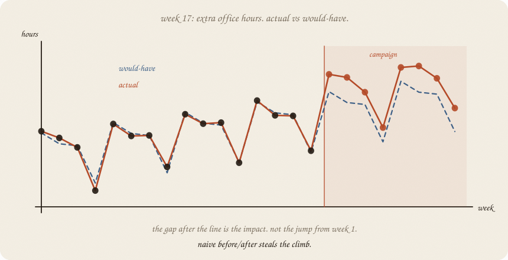
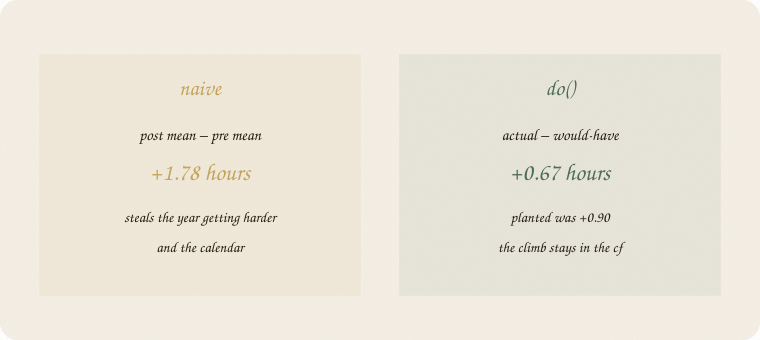
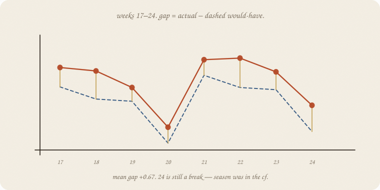
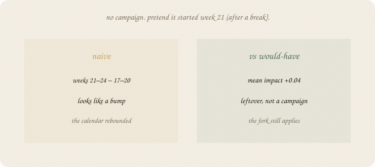

---
tags:
  - sketchbook
  - statistics
  - ml
aliases:
  - Causal impact
  - Causal Impact Sketchbook
  - counterfactual series
---

# Causal impact — a sketchbook

> [!abstract] In one sentence
> Impact is **actual − would-have**, after a start date. Would-have is the series from [[01 lag trend season]], fitted on the **past**. Naive before/after steals the climb.



Read [[01 confounding]] and [[01 lag trend season]] first. Same exam world: 24 weeks of hours. Week 17 they add extra office hours — a **campaign**. The fork still applies. One series, one start date, a would-have.

---

## Page 1 — The campaign has a start date

Weeks 1–16: ordinary year. Trend up, break every fourth week.

Week 17: extra office hours start. Hours after that are mixed: what the year was going to do, plus whatever the extra hours did. This is **not** an experiment. Would-have has to carry the fork from [[01 confounding]]: no other shock at week 17, and the past still looks like the future without the campaign.

The question is not “did post look higher than pre?” Pre is earlier in a climbing year. Of course post looks higher.

The question is:

> after week 17, how much higher than **the weeks we would have had**?

Would-have is a series. Fit it on the past. Project it through the campaign. The **gap** is the impact.

---

## Page 2 — Naive steals the climb

Mean of weeks 1–16: **3.83**. Mean of 17–24: **5.61**. Difference **+1.78**.

The campaign did not add 1.78 hours. The year was already climbing. Break weeks sit in both piles and cancel badly. Naive before/after is a passenger of **trend + season**. Same sin as coffee-only in 01: a loud number, the wrong lever.



Planted lift (we wrote the world): **+0.90**. Naive almost doubled it. Pattern. Not do().

---

## Page 3 — Would-have is trend + season on the past

Fit the time-01 line **only on weeks 1–16**: week-number plus the 4-week dummies. Project weeks 17–24. That dashed line is would-have. No campaign in it.



| week | actual | would-have | gap |
|---:|---:|---:|---:|
| 17 | 6.04 | 5.42 | +0.62 |
| 18 | 5.93 | 5.03 | +0.90 |
| 19 | 5.40 | 4.96 | +0.44 |
| 20 break | 4.13 | 3.62 | +0.51 |
| 24 break | 4.83 | 3.99 | +0.84 |

Mean gap **+0.67**. Planted was +0.90. Short past, leftover, a sketch — not a scandal. Week 24 is still a **break**. Season was in the counterfactual. Naive would have called the rebound the campaign.

People call this **causal impact**. Ugly product name. Friendly job: *gap vs a series that never saw the campaign.*

---

## Page 4 — A fake start dies

No extra hours. Pretend the campaign started **week 21** — right after a break. Naive: weeks 21–24 minus 17–20 looks like a bump (the calendar rebounded).

Would-have, same method: mean gap **+0.04**. Leftover. Not a campaign.



If your start date is a passenger of the calendar, the counterfactual should shrug. If it shouts, you forgot season — or you picked the date after seeing the spike. That is still the fork.

Bootstrap the **pre** leftover, 2000 bags ([[02 bootstrap]]): mean gap 0.51 to 0.82. Zero not in *that* pile. This is leftover of the **would-have fit**, replayed — not a full causal interval (post rattles too; the fork is still an assumption). The fake start’s 0.04 would sit on zero. Sketch, not a trophy *p*.

---

## Page 5 — Would-have can be a bump

The dashed line is **one** guess. A fatter would-have is a **bump** on every future week: start somewhere ([[01 prior]]), walk the height ([[02 MCMC]]). Then the gap is a pile, not a point.

People call that engine **BSTS** — Bayesian structural time series. Same furniture as time 01 (trend, season, lag), with a posterior instead of one least-squares line. Same sentence:

> impact = actual − would-have.

The fork does not go away because the dashed line got shoulders. This notebook keeps the line + leftover replay. The bump is the same job, louder. A good control can make that bump narrower: [[03 control series]].

---

## Page 6 — Mini recipe

1. One **series**, one **start date**. People, not weeks? Go back to 01.
2. Fit **would-have** on the **past** only (trend + season, as in time 01).
3. Impact = actual − would-have, **after** the start.
4. Do **not** subtract pre-mean from post-mean. That steals the climb.
5. Fake the start on a quiet stretch. If that “impact” is loud, your would-have is a passenger.
6. Want a bump on would-have, not one dashed line? That walk is [[02 MCMC]]. Same gap. Same fork.

If you keep only one thing:

> impact = actual − would-have. would-have never saw the campaign.

---

## Page 7 — Week-17 office hours, in sklearn

Same 24-week beat as [[01 lag trend season]]. Campaign at week 17, planted **+0.90**. Trend + season on the past. Last-four fake start has **no** lift.

```python
import numpy as np
from sklearn.linear_model import LinearRegression

rng = np.random.default_rng(7)
n = 24
t = np.arange(n, dtype=float)
season = np.array([0.8, 0.4, 0.1, -1.4] * 6)
y0 = 3.2 + 0.09 * t + season + rng.normal(0, 0.22, n)
start = 16
y = y0.copy()
y[start:] += 0.90
dummies = np.eye(4)[np.arange(n) % 4][:, :3]
X = np.column_stack([t, dummies])
m = LinearRegression().fit(X[:start], y[:start])
yhat = m.predict(X)
impact = y[start:] - yhat[start:]

print("actual", np.round(y, 2).tolist())
print("naive pre/post", round(y[:start].mean(), 2), round(y[start:].mean(), 2),
      "  diff", round(y[start:].mean() - y[:start].mean(), 2))
print("cf post  ", np.round(yhat[start:], 2).tolist())
print("actual post", np.round(y[start:], 2).tolist())
print("week impact", np.round(impact, 2).tolist())
print("mean impact vs cf", round(impact.mean(), 2), "  planted", 0.90)

fake = (y0[20:] - LinearRegression().fit(X[:20], y0[:20]).predict(X[20:])).mean()
print("fake start week 21  mean impact", round(fake, 2))

resid = y[:start] - m.predict(X[:start])
rngb = np.random.default_rng(7)
means = []
for _ in range(2000):
    yb = m.predict(X[:start]) + rngb.choice(resid, start, replace=True)
    mb = LinearRegression().fit(X[:start], yb)
    means.append((y[start:] - mb.predict(X[start:])).mean())
means = np.array(means)
print("boot 95% mean impact", np.round(np.percentile(means, [2.5, 97.5]), 2),
      "  se", round(means.std(ddof=1), 2))
```

```
actual [4.0, 3.76, 3.42, 1.87, 4.26, 3.83, 3.85, 2.72, 4.61, 4.27, 4.31, 2.87, 5.1, 4.57, 4.55, 3.3, 6.04, 5.93, 5.4, 4.13, 6.29, 6.34, 5.9, 4.83]
naive pre/post 3.83 5.61   diff 1.78
cf post   [5.42, 5.03, 4.96, 3.62, 5.79, 5.4, 5.33, 3.99]
actual post [6.04, 5.93, 5.4, 4.13, 6.29, 6.34, 5.9, 4.83]
week impact [0.62, 0.9, 0.44, 0.51, 0.5, 0.94, 0.57, 0.84]
mean impact vs cf 0.67   planted 0.9
fake start week 21  mean impact 0.04
boot 95% mean impact [0.51 0.82]   se 0.08
```

Naive +1.78 steals the year. Gap vs would-have **+0.67** (planted 0.90 — leftover on 16 weeks, a sketch). Fake start **+0.04**. Bootstrap 0.51–0.82, zero out. `X[:start]` is the past. The campaign never trains the dashed line.

---

## Last page — cheat sheet

| word | meaning |
|---|---|
| start date | when the campaign begins |
| would-have | series fitted on the past, projected |
| impact | actual − would-have, after the start |
| naive | post mean − pre mean (steals trend) |
| fake start | same method on a quiet date; should shrug |
| BSTS | would-have as a bump (prior + walk), not one line |


### Use / skip

**Reach for it when**

- you have **one series and a start date**
- you can name would-have (trend + season)
- you already own the fork

**Skip it when**

- ŷ for next week was the job ([[01 lag trend season]])
- you already ran the experiment
- you wanted a posterior on every week before you owned the fork

**Pays you:** actual − would-have on one series. Naive called out. Season kept in the counterfactual so a break is not a campaign.

**Costs you:** would-have is a guess (here 0.67 vs 0.90). A hidden fork in time remains hidden. Picking the start after seeing the spike is still coffee-only. The bootstrap here is leftover of the fit, not a full causal interval. A bump on would-have ([[02 MCMC]]) is louder, not a different gap.

---

*Actual − would-have. Time 01 was the dashed line. A bump on that line: [[02 MCMC]].*
