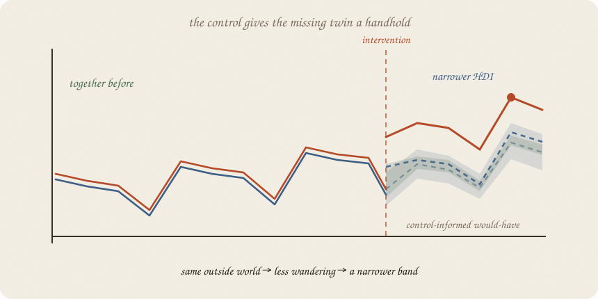
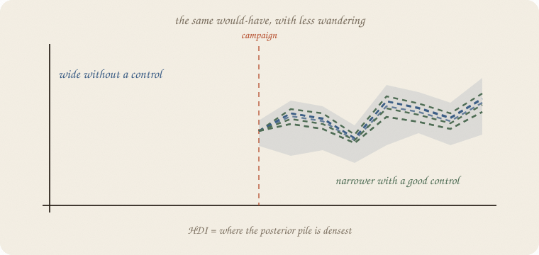

---
tags:
  - sketchbook
  - statistics
  - ml
aliases:
  - Control series
  - Control time series
  - Control Series Sketchbook
  - HDI
---

# Control series — a sketchbook

> [!abstract] In one sentence
> An unaffected, related series helps BSTS predict the missing **would-have**; because it explains more of the outside world, the counterfactual can have a narrower **HDI**.



Read [[02 causal impact]] first. That note made the missing twin: what the treated series would have done without the campaign. This is the next question: **what helps us draw that twin?**

---

## Page 1 — One series leaves a lot unknown

Class A gets extra office hours in week 17. After that, we see A. We do not see the other A — the A that never got the campaign.

Without another clue, many futures could fit the past:

- the class was going to climb
- a break was coming
- the whole school had a good week
- the campaign added something

The would-have is not a fact waiting behind the curtain. It is a prediction. A prediction has uncertainty.

---

## Page 2 — A control is another window

Class B follows the same term. It gets the same breaks and outside shocks. It does **not** get the office-hours campaign.

B is a **control series**. It is not required to stay flat. In fact, a useful control moves when the outside world moves.

Before week 17, A and B should move together. If B rises and A usually rises too, later B helps us guess the A we would have had.

The control does not reveal the answer. It gives the prediction another handhold.

---

## Page 3 — A band, not a line

BSTS — Bayesian structural time series — does not promise one perfect dashed line. It keeps a pile of plausible lines.

People often draw that pile as a **credible band** around the would-have. A **95% HDI** is the shortest interval containing the densest 95% of the posterior draws in this small picture.

The band is uncertainty about the missing world. It is not uncertainty about whether the observed A value exists.

With A alone, the band may be wide. A good control explains some of the movement, so the band may become narrower.



Narrower is not automatically better. A control that was also affected, or that never moved with A, adds confidence theater, not information.

---

## Page 4 — Why the control can narrow the HDI

The model learns the old relationship between A and B **before** the campaign.

If B is high in a later week, the model has a better idea where A would probably be. Less of the prediction is left to the trend, the season, and the model’s vague prior.

In a Bayesian sketch:

1. Start with possible relationships between A and B.
2. Look at the pre-campaign weeks.
3. Keep relationships that fit those weeks.
4. Carry each surviving relationship through the later B values.
5. The pile of resulting A paths is the counterfactual posterior.

The control can make that pile less spread out. That is the HDI getting narrower.

The condition is the important part:

> **not affected by the intervention, but affected by the same outside world.**

---

## Page 5 — One small number

In the toy class data, the pre-period relationship is strong: correlation **0.98**.

At week 21, a simple model with trend and season alone gives a 95% posterior predictive interval of **6.01 to 7.51**. Width: **1.49**.

Give the model the good control series. The interval becomes **5.81 to 7.07**. Width: **1.26**.

The control shaved off some uncertainty. It did not prove the campaign worked. The observed A is **7.47**; the causal question is still whether the control was truly unaffected and the pre-period relationship deserved trust.

---

## Page 6 — Mini recipe

1. Name the treated series and the intervention date.
2. Find a series the intervention did **not** touch.
3. Check that the two series moved together before the intervention.
4. Fit the control, trend, and season on the pre-period only.
5. Draw many possible would-haves. Keep the middle story and its HDI.
6. Compare actual with the counterfactual band after the start.
7. If the control was affected too, throw the shortcut away.

If you keep only one thing:

> A good control does not remove uncertainty. It gives uncertainty less room to wander.

---

## Page 7 — A control narrows the band, in numpy

This is a small Bayesian linear model, not a full BSTS package. It uses the same office-hours story to show the one lever that matters here: a related control can make the posterior predictive HDI narrower.

```python
import numpy as np

rng = np.random.default_rng(7)
n = 24
t = np.arange(n, dtype=float)
season = np.array([0.8, 0.4, 0.1, -1.4] * 6)
control = 2.8 + 0.09 * t + 0.8 * season + rng.normal(0, 0.18, n)
y0 = 1.2 + 1.0 * control + 0.2 * season + rng.normal(0, 0.22, n)
start = 16
y = y0.copy()
y[start:] += 0.90

sigma = 0.28
prior_sd = 10.0

def posterior(X, y):
    precision = X.T @ X / sigma**2 + np.eye(X.shape[1]) / prior_sd**2
    covariance = np.linalg.inv(precision)
    mean = covariance @ (X.T @ y / sigma**2)
    return mean, covariance

def hdi(draws, mass=0.95):
    draws = np.sort(draws)
    width = int(np.floor(mass * len(draws)))
    spans = draws[width:] - draws[:-width]
    i = np.argmin(spans)
    return draws[i], draws[i + width]

def predictive_hdi(X, y, x_new):
    mean, covariance = posterior(X, y)
    beta = rng.multivariate_normal(mean, covariance, 12000)
    draws = rng.normal(beta @ x_new, sigma)
    lo, hi = hdi(draws)
    return draws.mean(), lo, hi

season_rows = np.eye(4)[np.arange(n) % 4][:, :3]
X_plain = np.column_stack([np.ones(n), t, season_rows])
X_control = np.column_stack([np.ones(n), control])
x_plain = np.array([1, 20, *season_rows[20]])
x_control = np.array([1, control[20]])

plain = predictive_hdi(X_plain[:start], y[:start], x_plain)
with_control = predictive_hdi(X_control[:start], y[:start], x_control)

print("pre-period correlation", round(np.corrcoef(control[:start], y[:start])[0, 1], 2))
print("week 21 actual A", round(y[20], 2))
print("without control mean / 95% HDI", round(plain[0], 2),
      np.round(plain[1:], 2))
print("with control mean / 95% HDI   ", round(with_control[0], 2),
      np.round(with_control[1:], 2))
print("HDI widths", round(plain[2] - plain[1], 2),
      "→", round(with_control[2] - with_control[1], 2))
```

```
pre-period correlation 0.98
week 21 actual A 7.47
without control mean / 95% HDI 6.74 [6.01 7.51]
with control mean / 95% HDI    6.42 [5.81 7.07]
HDI widths 1.49 → 1.26
```

The control makes this toy band **0.23 hours narrower**. That is a prediction improvement, not a causal verdict. BSTS adds more structural pieces and a more careful posterior; the logic stays the same.

---

## Last page — cheat sheet

| word | meaning |
|---|---|
| control series | a related series the intervention did not affect |
| pre-period | time before the intervention; where the relationship is learned |
| counterfactual | the treated series’ would-have without the intervention |
| HDI | shortest interval containing the densest posterior mass |
| BSTS | Bayesian structural time series: controls + trend / season + uncertainty |

### Use / skip

**Reach for it when**

- you have a plausible unaffected series
- it moved with the treated series before the intervention
- you want uncertainty around the would-have, not one confident line

**Skip it when**

- the control received the intervention too
- the control and treated series never moved together
- you only need a next-week forecast ([[01 lag trend season]])

**Pays you:** a more informed counterfactual and, when the control is good, a narrower HDI.

**Costs you:** a control is an assumption. A narrower band can still be precisely wrong if the control was contaminated or the relationship broke.

---

*A control carries some of the outside world. BSTS turns that clue into a distribution of would-haves. 
