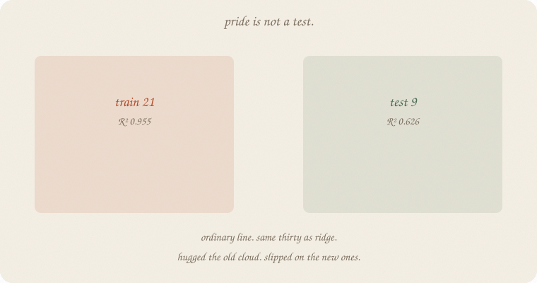
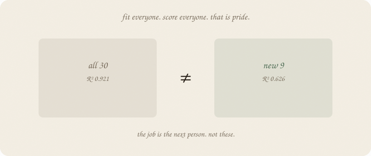
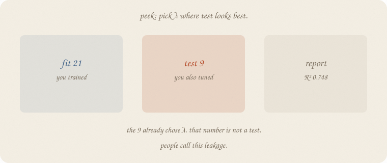
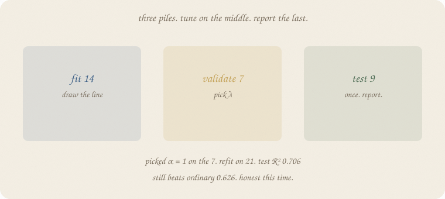
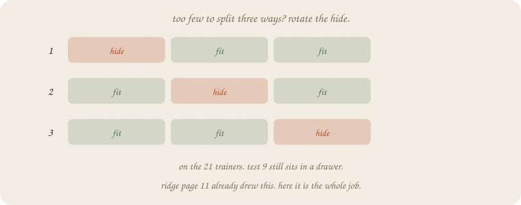
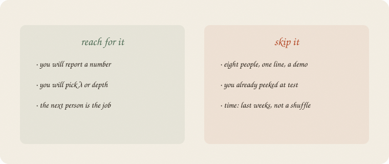

---
tags:
  - sketchbook
  - statistics
  - ml
aliases:
  - train test validate
  - Train test split
  - Cross-validation
  - Holdout
---

# Train / test / validate — a sketchbook

> [!abstract] In one sentence
> Score leftover on **people the line has not seen**. Pride on the old cloud is not a test. If you pick λ, hide a **third** pile so the test stays honest.



Read [[01 linear regression]] and [[02 ridge regression]] first — especially ridge page 3 (old points are a trap) and page 11 (the folds). Same **thirty graders**, same twins and junk.

Flip it like a notebook. One page = one idea. Done.

---

## Page 1 — The job is the next person

Thirty students. Grade from hours, sleep, tutor. Minutes is a twin. Coffee and noise are junk. House seed 7.

You can fit a line on **all thirty** and print R². Linear 01 did that on eight people. It is a volume knob for *these* people.

The job is not “look smart on the people you already asked.”

The job is: **guess well for the next person.**

That is this notebook. Not a new model. A ritual for leftover.

---

## Page 2 — Pride is not a test

Fit ordinary least squares on all thirty. Score all thirty.



R² **0.921**. Looks grown-up. It used every leftover twice: once to draw the line, once to grade it.

Hide 9 people. Fit on 21. Score the 9.

| pile | people | ordinary R² |
|---|---:|---:|
| all 30 (pride) | 30 | **0.921** |
| train | 21 | **0.955** |
| test | 9 | **0.626** |

The line hugged the 21 (0.955). The 9 had not voted. **0.626.** That gap *is* the lesson from ridge page 3. This page names it: **train** vs **test**.

sklearn’s `train_test_split(..., test_size=0.3, random_state=0)` is that hide. Same split as the ridge page. Same numbers.

---

## Page 3 — Do not peek

Ridge needs a λ. Temptation: try a few λ, keep the one where **test** R² is biggest.



| α (sklearn `alpha` = λ) | train R² | test R² |
|---:|---:|---:|
| 1 | 0.944 | 0.706 |
| 3 | 0.939 | 0.731 |
| **10** | 0.907 | **0.748** |
| 30 | 0.780 | 0.672 |

Picked **10**. Report 0.748. Looks like ridge won.

The 9 already chose λ. That number is not a test. People call this **leakage**. Same sin as shuffling weeks into a “test” set ([[01 lag trend season]]). The future voted on the knobs.

---

## Page 4 — Three piles

Hide the 9 and **do not touch them** until the end.

From the 21, hide 7 more. Fit on 14. Pick λ on the 7. Then refit the winner on all 21. **Then** score the 9. Once.



| pile | people | job |
|---|---:|---|
| **fit** | 14 | draw the line |
| **validate** | 7 | pick λ |
| **test** | 9 | report. once. |

On the 7, α = **1** wins (val R² 0.736). α = 10, the peek’s darling, is 0.647 on this hide.

Refit α = 1 on the 21. Test R² **0.706**. Still beats ordinary 0.626. Honest this time.

Seven people is a thin judge. The number wiggles. That is why the next page exists.

---

## Page 5 — Rotate the hide

Too few to split three ways? Keep the 9 in a drawer. On the 21, hide a third, fit the rest, score the hide. Rotate. Average the pain.



That ritual is **cross-validation**. Ridge page 11 already drew the folds. Here it is the whole job, not a volume-knob aside.

3-fold CV on the 21 (test still untouched):

| α | CV mean | the three hides |
|---:|---:|---|
| **1** | **0.702** | 0.985 / 0.864 / 0.259 |
| 3 | 0.683 | 0.986 / 0.845 / 0.218 |
| 10 | 0.522 | 0.954 / 0.698 / −0.084 |
| 30 | 0.070 | 0.786 / 0.35 / −0.925 |

Picked **1** again. Refit on 21. Test **0.706**. Same report as the one validate pile, more stable pick.

One fold went 0.259. Seven-ish people, leftover rattles. Average anyway. Do not throw out the ritual because one hide was ugly.

Time is a different hide: **last weeks**, not a shuffle ([[01 lag trend season]]).

---

## Page 6 — Mini recipe

1. **Hide people** before you fit. That pile is test. Do not look.
2. **Fit** on the rest. Score both piles. Train high, test low → you hugged the old cloud.
3. **If you pick a knob** (λ, depth, k): you need a **third** pile, or rotate the hide on the trainers (CV).
4. **Refit** the winner on all trainers. Score test **once**.
5. **Time:** last weeks are the test. Not a random 30%.
6. **Do not** call R² on the trainers a result. That is pride.

If you keep only one thing:

> leftover on new people. if you tune, hide a third pile.

---

## Page 7 — Thirty graders, in sklearn

Same thirty as [[02 ridge regression]]. Same split (`random_state=0`). Ordinary hugs. Peek vs three piles vs CV. House seed 7.

```python
import numpy as np
from sklearn.linear_model import LinearRegression, Ridge
from sklearn.model_selection import train_test_split, KFold
from sklearn.pipeline import make_pipeline
from sklearn.preprocessing import StandardScaler

rng = np.random.default_rng(7)
n = 30
hours = rng.uniform(1, 6, n)
sleep = rng.uniform(4, 9, n)
tutor = (rng.random(n) > 0.6).astype(float)
coffee = rng.uniform(0, 4, n)
noise = rng.normal(0, 1, n)
minutes = hours * 60 + rng.normal(0, 3, n)
naps = sleep + rng.normal(0, 0.25, n)
grade = 1.8 + 0.9 * hours + 0.35 * sleep + 0.6 * tutor + rng.normal(0, 0.55, n)
X = np.column_stack([hours, minutes, sleep, naps, tutor, coffee, noise])
Xtr, Xte, ytr, yte = train_test_split(X, grade, test_size=0.3, random_state=0)

print("n", n, "train", len(ytr), "test", len(yte))

ols = LinearRegression().fit(Xtr, ytr)
print("ordinary  R² train", round(ols.score(Xtr, ytr), 3),
      "  R² test", round(ols.score(Xte, yte), 3))
print("ordinary  R² all 30", round(LinearRegression().fit(X, grade).score(X, grade), 3))

print("\npeek — pick λ on the test pile")
best_te, best_a = -1, None
for a in [1, 3, 10, 30]:
    r = make_pipeline(StandardScaler(), Ridge(alpha=a)).fit(Xtr, ytr)
    te = r.score(Xte, yte)
    print(f"  alpha={a:<3}  R² train {r.score(Xtr, ytr):.3f}  R² test {te:.3f}")
    if te > best_te:
        best_te, best_a = te, a
print("picked on test:", best_a)

Xfit, Xva, yfit, yva = train_test_split(Xtr, ytr, test_size=7, random_state=0)
print("\nhonest — 14 fit / 7 validate / 9 test")
best_va, best_a = -1, None
for a in [1, 3, 10, 30]:
    r = make_pipeline(StandardScaler(), Ridge(alpha=a)).fit(Xfit, yfit)
    va = r.score(Xva, yva)
    print(f"  alpha={a:<3}  R² fit {r.score(Xfit, yfit):.3f}  R² val {va:.3f}")
    if va > best_va:
        best_va, best_a = va, a
print("picked on val:", best_a)
win = make_pipeline(StandardScaler(), Ridge(alpha=best_a)).fit(Xtr, ytr)
print("refit on 21, R² test", round(win.score(Xte, yte), 3))

print("\n3-fold CV on the 21 (no test)")
kf = KFold(n_splits=3, shuffle=True, random_state=7)
best_cv, best_a = -1, None
for a in [1, 3, 10, 30]:
    scores = []
    for ti, vi in kf.split(Xtr):
        r = make_pipeline(StandardScaler(), Ridge(alpha=a)).fit(Xtr[ti], ytr[ti])
        scores.append(r.score(Xtr[vi], ytr[vi]))
    mu = float(np.mean(scores))
    print(f"  alpha={a:<3}  CV {mu:.3f}  folds {np.round(scores, 3).tolist()}")
    if mu > best_cv:
        best_cv, best_a = mu, a
print("picked on CV:", best_a)
win = make_pipeline(StandardScaler(), Ridge(alpha=best_a)).fit(Xtr, ytr)
print("refit on 21, R² test", round(win.score(Xte, yte), 3))
```

```
n 30 train 21 test 9
ordinary  R² train 0.955   R² test 0.626
ordinary  R² all 30 0.921

peek — pick λ on the test pile
  alpha=1    R² train 0.944  R² test 0.706
  alpha=3    R² train 0.939  R² test 0.731
  alpha=10   R² train 0.907  R² test 0.748
  alpha=30   R² train 0.780  R² test 0.672
picked on test: 10

honest — 14 fit / 7 validate / 9 test
  alpha=1    R² fit 0.956  R² val 0.736
  alpha=3    R² fit 0.948  R² val 0.731
  alpha=10   R² fit 0.899  R² val 0.647
  alpha=30   R² fit 0.737  R² val 0.444
picked on val: 1
refit on 21, R² test 0.706

3-fold CV on the 21 (no test)
  alpha=1    CV 0.702  folds [0.985, 0.864, 0.259]
  alpha=3    CV 0.683  folds [0.986, 0.845, 0.218]
  alpha=10   CV 0.522  folds [0.954, 0.698, -0.084]
  alpha=30   CV 0.070  folds [0.786, 0.35, -0.925]
picked on CV: 1
refit on 21, R² test 0.706
```

Pride 0.921. Train 0.955, test 0.626 — ordinary hugged. Peek picked α = 10 and would have reported 0.748. Three piles and CV both pick **1**, then report **0.706** on the 9. sklearn’s `alpha` is λ. `KFold` is the rotate. The test array is not an argument to `KFold`.

Ridge’s printed run used α = 10 on purpose: twins share, test 0.748 vs ordinary 0.626. That was a **demo of the tax**, not a claim that 10 was chosen honestly. This notebook is the ritual that would choose.

---

## Last page — cheat sheet

| word | meaning |
|---|---|
| train | people you fit on |
| test | people you score once, at the end |
| validate | people you use to pick λ / depth / k |
| pride | score on the people you fit |
| leakage | test helped pick the knobs |
| CV | rotate the validate hide on the trainers |

**Also called** (in a room):

| here | there |
|---|---|
| train/test | holdout |
| validate | development set |
| CV | k-fold |
| peek | test-set tuning |



### Use / skip

**Reach for it when** you will **report a number**, or pick λ / depth / k, and the job is the **next person**.

**Skip it when** eight people and one line is a demo ([[01 linear regression]] page 16 is pride on purpose); you already peeked; the “new people” are **later in time** — then last weeks, not a shuffle ([[01 lag trend season]]).

**Pays you:** leftover that means something. A λ you can defend. The sentence from ridge page 3, as a habit.

**Costs you:** fewer people to fit. A thin validate pile rattles (0.259 on one fold). CV is slower. Not a model — a ritual for leftover.

---

*Fundamentals 01. Leftover on new people. Next: [[02 bias variance]] — ridge’s dartboard, as its own notebook. Metrics after that. Not a p-value (that is [[01 t-test]]).*
