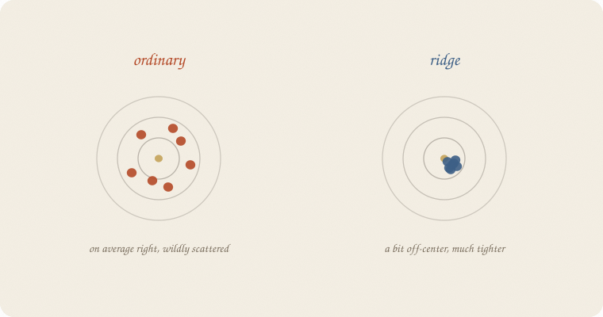
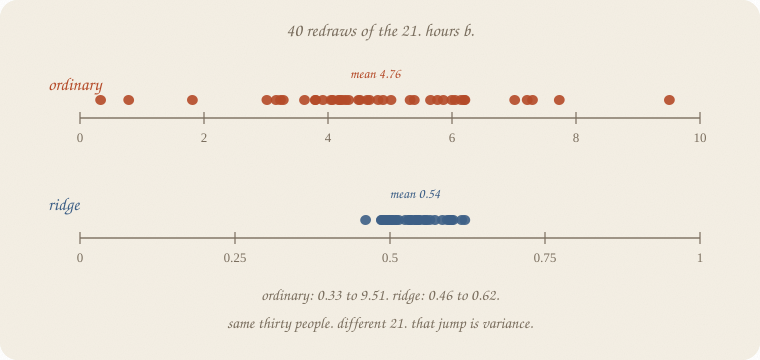
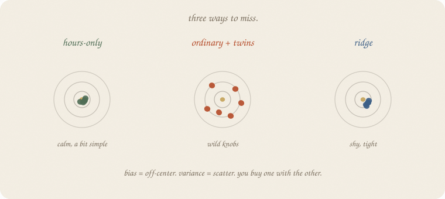
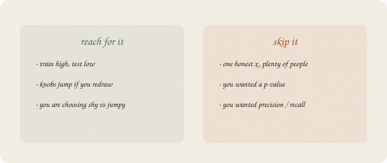

---
tags:
  - sketchbook
  - statistics
  - ml
aliases:
  - bias variance
  - Bias–variance
  - Bias-variance tradeoff
---

# Bias vs variance — a sketchbook

> [!abstract] In one sentence
> **Variance** is how much the line jumps if you redraw the people. **Bias** is how much it sits systematically off. You buy one with the other.



Read [[01 train test validate]] first. Same **thirty graders**, same twins. Ridge already drew this dartboard (page 8). This notebook *is* that picture: leftover on new people, named.

Not a second ridge. Not a p-value ([[01 t-test]]). Metrics: [[03 metrics]].

Flip it like a notebook. One page = one idea. Done.

---

## Page 1 — The gap has a name

[[01 train test validate]] hid 9 people. Ordinary: train R² **0.955**, test **0.626**.

That gap is not “the model is bad.” It is two different sins that look the same on one split:

- the line **hugged this 21** (jumpy — another 21 would have hugged differently)
- or the line is **systematically shy** (off-center on every 21)

People call the jump **variance**. The shy sit **bias**.

Ridge’s dartboard: ordinary darts fly everywhere, on average near the bullseye. Ridge’s darts cluster, a bit off-center. Same trade. This page puts numbers on it.

---

## Page 2 — Variance is the jump

Redraw the 21 / 9 split **forty** times. Same thirty people. Different hide. Fit ordinary. Read hours *b*.



Ordinary hours *b*: mean **4.76**, sd **1.77**, from **0.33** to **9.51**.

That is not a slope. That is a fight with minutes, a new winner every redraw. Net effect still ≈ 0.93 grade per extra hour — a cancellation, as ridge said. The *story* jumps. That jump is variance.

Ridge, scaled, α = 10: hours *b* mean **0.54**, sd **0.04**, from **0.46** to **0.62**.

Different units (scaled). Same lesson: **the pile is tight.** Redraw the 21, get almost the same knob.

Hours-only, no twins: *b* mean **0.96**, sd **0.05**. Calm. One honest *x* did not need a tax.

---

## Page 3 — Bias is the shy sit

Ridge’s pile is not on the ordinary mean. It is **smaller on purpose**. The tax pulls knobs toward zero. Every redraw, a little shy.

That systematic miss is **bias**. Not a moral. A choice: sit off-center so you do not fly.

Hours-only is the other shy: it never sees sleep or tutor. Calm knobs, a bit simple. Test R² mean **0.70** — less than ordinary’s mean **0.79**, and ordinary’s *worst* redraw is **0.54**.

Ordinary: better *on average*, uglier *on a bad hide*. Ridge: a bit worse on average (test mean **0.77**), less of a disaster (worst **0.60**).

You are not trying to be unbiased and heroic. You are trying not to flail ([[02 ridge regression]], page 8).

---

## Page 4 — You buy one with the other



| machine | bias | variance | vibe |
|---|---|---|---|
| hours-only | a bit high (sleep ignored) | low | calm, simple |
| ordinary + twins | low *on average* | **high** | wild knobs |
| ridge | a bit high (shy) | **low** | tight pile |

There is no free dart in the bullseye every time. A deep tree hugs (variance). A stump is shy (bias). A forest votes the hug away ([[02 random forest]]). Same dartboard, different machine.

[[01 train test validate]] is how you *see* leftover on new people. This notebook is *which leftover you bought*.

---

## Page 5 — Mini recipe

1. **Redraw** the hide (or the people). Fit again. Look at the knobs.
2. If they **fly** — variance. Tax, stump, or more people.
3. If they **sit still but off** — bias. The machine is too shy or too simple.
4. **Do not** hunt zero bias. Hunt leftover on people you have not seen.
5. One honest *x*, plenty of people: skip the sermon.

If you keep only one thing:

> jumpy knobs = variance. shy sit = bias. you buy one with the other.

---

## Page 6 — Forty hides, in sklearn

Same thirty as [[01 train test validate]] and ridge. 40 different 21 / 9 splits (`random_state=0…39`). Ordinary hours *b* vs ridge hours *b* (scaled, α = 10). 

```python
import numpy as np
from sklearn.linear_model import LinearRegression, Ridge
from sklearn.model_selection import train_test_split
from sklearn.pipeline import make_pipeline
from sklearn.preprocessing import StandardScaler

rng = np.random.default_rng(7)
n = 30
hours = rng.uniform(1, 6, n)
sleep = rng.uniform(4, 9, n)
tutor = (rng.random(n) > 0.6).astype(float)
coffee = rng.uniform(0, 4, n)
noise = rng.normal(0, 1, n)
minutes = hours * 60 + rng.normal(0, 3, n)
naps = sleep + rng.normal(0, 0.25, n)
grade = 1.8 + 0.9 * hours + 0.35 * sleep + 0.6 * tutor + rng.normal(0, 0.55, n)
X = np.column_stack([hours, minutes, sleep, naps, tutor, coffee, noise])

ols_h, rd_h, ols_te, rd_te, only_b, only_te = [], [], [], [], [], []
for s in range(40):
    Xtr, Xte, ytr, yte = train_test_split(X, grade, test_size=0.3, random_state=s)
    ols = LinearRegression().fit(Xtr, ytr)
    rd = make_pipeline(StandardScaler(), Ridge(alpha=10)).fit(Xtr, ytr)
    ols_h.append(ols.coef_[0])
    rd_h.append(rd.named_steps["ridge"].coef_[0])
    ols_te.append(ols.score(Xte, yte))
    rd_te.append(rd.score(Xte, yte))
    Htr, Hte, ytr2, yte2 = train_test_split(
        hours.reshape(-1, 1), grade, test_size=0.3, random_state=s
    )
    m = LinearRegression().fit(Htr, ytr2)
    only_b.append(m.coef_[0])
    only_te.append(m.score(Hte, yte2))

def row(title, a):
    a = np.array(a)
    print(f"{title:20s}  mean {a.mean():6.3f}   sd {a.std(ddof=1):5.3f}   "
          f"min {a.min():6.3f}   max {a.max():6.3f}")

print("40 redraws of 21 / 9")
row("OLS hours b", ols_h)
row("ridge hours (sc.)", rd_h)
row("OLS test R²", ols_te)
row("ridge test R²", rd_te)
row("hours-only b", only_b)
row("hours-only test R²", only_te)
```

```
40 redraws of 21 / 9
OLS hours b           mean  4.762   sd 1.773   min  0.333   max  9.506
ridge hours (sc.)     mean  0.541   sd 0.041   min  0.461   max  0.621
OLS test R²           mean  0.788   sd 0.102   min  0.540   max  0.925
ridge test R²         mean  0.772   sd 0.083   min  0.601   max  0.941
hours-only b          mean  0.958   sd 0.052   min  0.864   max  1.102
hours-only test R²    mean  0.698   sd 0.156   min  0.304   max  0.914
```

Ordinary hours *b* spans **nine points**. Ridge’s scaled hours *b* stays in a **0.16** window. Test R²: ordinary mean a hair higher, worst hide uglier (0.54 vs 0.60). Hours-only *b* is calm (0.96, planted 0.9) and loses on test because sleep and tutor never got a knob.

`alpha=10` is the ridge demo, not the honest pick from 01. The dartboard does not care. sd is the jump. mean vs planted is the sit.

---

## Last page — cheat sheet

| word | meaning |
|---|---|
| variance | knobs jump when the people jump |
| bias | knobs sit off, every redraw |
| trade | shy vs jumpy — you buy one with the other |
| redraw | new train/test hide, same thirty |

**Also called** (in a room):

| here | there |
|---|---|
| jumpy | high variance |
| shy | high bias |
| hug the trainers | overfit |



### Use / skip

**Reach for it when** train is high and test is low, or knobs **jump** if you redraw, and you are choosing shy vs jumpy.

**Skip it when** one honest *x* and plenty of people (hours-only was already calm); you wanted a *p* ([[01 t-test]]); you wanted precision / recall (metrics, next).

**Pays you:** a name for the gap on [[01 train test validate]]. The dartboard from ridge, as a habit.

**Costs you:** bias and variance are not two numbers you read off one fit. You need redraws, or a story (twins, a tax, a stump). Not a third pile — that was 01.

---

*Fundamentals 02. Jumpy vs shy. Next: [[03 metrics]] — when accuracy lies. Not a p-value.*
