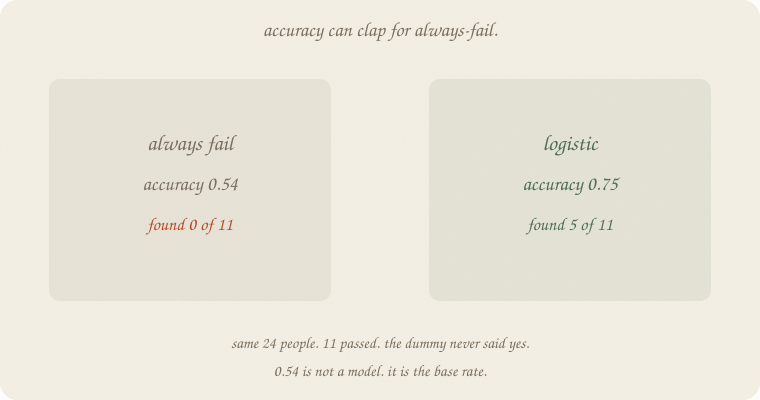
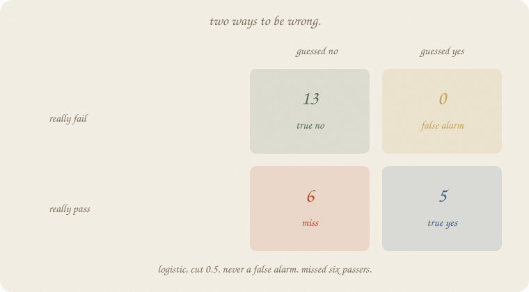
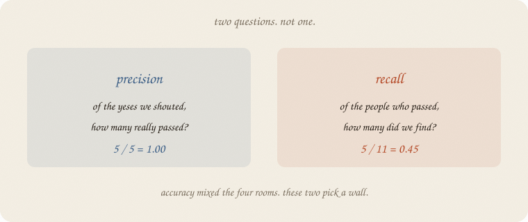
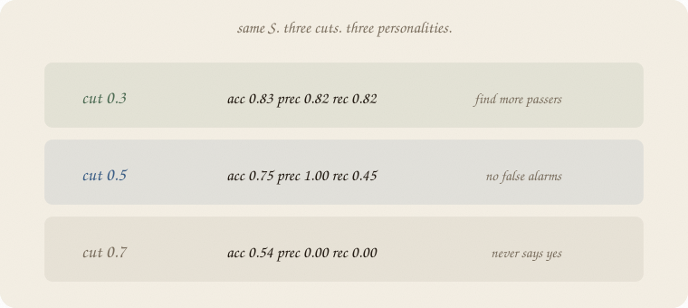
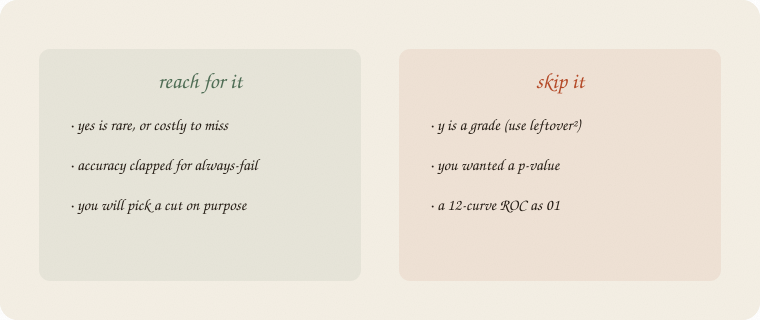

---
tags:
  - sketchbook
  - statistics
  - ml
aliases:
  - metrics
  - Precision recall
  - Accuracy
  - RMSE
---

# Metrics — a sketchbook

> [!abstract] In one sentence
> **Accuracy** can clap for always-fail. Ask two other questions: of the yeses we shouted, how many were real (**precision**)? Of the people who passed, how many did we find (**recall**)?



Read [[01 train test validate]] and [[01 logistic regression]] first. Same pass/fail exam, a harder paper, so yes is rarer. R² still lives on the grade shelf. This notebook is **precision and recall**, not a p-value ([[01 t-test]]).

Flip it like a notebook. One page = one idea. Done.

---

## Page 1 — A grade leftover is still a leftover

Eight people, ŷ = 1.75 + 1 · hours. Leftover² mean **0.1875**. RMSE **0.433**. R² **0.936**.

That is the metric for a **number**. Vertical miss, then a square, then a mean. Linear 01 already owns it. Pride if you score the same eight. A test if you hid people ([[01 train test validate]]).

Yes/no is a different *y*. You cannot RMSE a pass. You can count rooms.

---

## Page 2 — Accuracy can clap for always-fail

Harder exam. Same hours, sleep, tutor. Pass is rarer: **26 / 80**. Hide 24. Train 56 (15 passed). Test 24 (**11** passed).

A dummy that **always says fail**:

| | |
|---|---:|
| accuracy | **0.542** |
| found passers | **0 of 11** |

13 of 24 failed. Guess fail every time and you are right 13 times. 0.54 is the **base rate**, not a model.

Logistic, cut 0.5: accuracy **0.75**. Better. Still: it only said yes **five** times. Six passers walked by.

Accuracy mixed four rooms into one number. The dummy hid in that mix.

---

## Page 3 — Four rooms

Guess vs truth. Two ways to be wrong.



Logistic, cut 0.5, on the 24:

| | guessed fail | guessed pass |
|---|---:|---:|
| really fail | **13** true no | **0** false alarm |
| really pass | **6** miss | **5** true yes |

Never a false alarm. Missed six passers. Accuracy = (13 + 5) / 24 = 0.75. The six misses sat in the pile and barely dented it.

People call the table a **confusion matrix**. Four rooms. Name them in English first.

---

## Page 4 — Two questions, not one



**Precision** — of the yeses we shouted, how many really passed?

5 / 5 = **1.00**. Every “pass” was a pass. No false alarms.

**Recall** — of the people who passed, how many did we find?

5 / 11 = **0.45**. Half the passers, a bit worse. Six misses.

Always-fail: precision 0, recall 0. Accuracy still 0.54.

Which wall matters is **politics**. Missing a passer (exam: they needed the tutor) vs a false alarm (you booked extra hours for someone who was fine). The 0.5 cut does not know your cost. You do.

---

## Page 5 — The cut is extra

Same S. Same 24. Three cuts.



| cut | accuracy | precision | recall | said yes |
|---:|---:|---:|---:|---:|
| 0.3 | **0.83** | 0.82 | **0.82** | 11 |
| 0.5 | 0.75 | **1.00** | 0.45 | 5 |
| 0.7 | 0.54 | 0 | 0 | 0 |

0.7 is always-fail again. 0.3 finds more passers, pays two false alarms. 0.5 is the default, not sacred — logistic 01 already said that.

Do not pick the cut on the test pile. That is peeking ([[01 train test validate]]).

---

## Page 6 — Mini recipe

1. **y a number?** leftover² / RMSE / R². Hide people first.
2. **y yes/no?** do not stop at accuracy. Count the **four rooms**.
3. **Precision** = of the yeses we shouted, how many were real.
4. **Recall** = of the real yeses, how many we found.
5. **Always-fail** is the dummy. If accuracy ≈ the fail rate, you have not started.
6. **The cut is politics.** Tune it on validate, not on test.

If you keep only one thing:

> accuracy can clap for always-fail. precision / recall pick a wall.

---

## Page 7 — A harder exam, in sklearn

Same levers as logistic. Harder intercept so pass is rarer (**26 / 80**). House seed 7. Split 70/30, `random_state=0`. Dummy vs logistic vs three cuts.

```python
import numpy as np
from sklearn.dummy import DummyClassifier
from sklearn.linear_model import LogisticRegression
from sklearn.model_selection import train_test_split
from sklearn.metrics import (
    accuracy_score, precision_score, recall_score, confusion_matrix,
)

rng = np.random.default_rng(7)
n = 80
hours = rng.uniform(1, 6, n)
sleep = rng.uniform(4, 9, n)
tutor = (rng.random(n) > 0.6).astype(float)
z = -4.8 + 1.05 * hours + 0.25 * (sleep - 6.5) + 0.7 * tutor
passed = (rng.random(n) < 1 / (1 + np.exp(-z))).astype(int)
print("passers", int(passed.sum()), "/", n, "  rate", round(float(passed.mean()), 3))

Xtr, Xte, ytr, yte = train_test_split(
    hours.reshape(-1, 1), passed, test_size=0.3, random_state=0
)
print("train", len(ytr), "pass", int(ytr.sum()), "rate", round(float(ytr.mean()), 3))
print("test ", len(yte), "pass", int(yte.sum()), "rate", round(float(yte.mean()), 3))

dummy = DummyClassifier(strategy="most_frequent").fit(Xtr, ytr)
log = LogisticRegression().fit(Xtr, ytr)
yp_d = dummy.predict(Xte)
yp = log.predict(Xte)
proba = log.predict_proba(Xte)[:, 1]

def show(title, yhat):
    print(title)
    print("  acc ", round(accuracy_score(yte, yhat), 3))
    print("  prec", round(precision_score(yte, yhat, zero_division=0), 3))
    print("  rec ", round(recall_score(yte, yhat, zero_division=0), 3))
    print("  cm  TN FP / FN TP", confusion_matrix(yte, yhat).ravel().tolist())

show("always fail (dummy)", yp_d)
show("logistic, cut 0.5", yp)
print("P(pass | 2h) =", round(log.predict_proba([[2]])[0, 1], 2))
print("P(pass | 5h) =", round(log.predict_proba([[5]])[0, 1], 2))
print("predicted yes at 0.5:", int(yp.sum()))

print("\ncuts on the same 24")
for t in (0.3, 0.5, 0.7):
    yhat = (proba >= t).astype(int)
    print(f"  t={t}  acc {accuracy_score(yte, yhat):.3f}  "
          f"prec {precision_score(yte, yhat, zero_division=0):.3f}  "
          f"rec {recall_score(yte, yhat, zero_division=0):.3f}  "
          f"yes {int(yhat.sum())}")
```

```
passers 26 / 80   rate 0.325
train 56 pass 15 rate 0.268
test  24 pass 11 rate 0.458
always fail (dummy)
  acc  0.542
  prec 0.0
  rec  0.0
  cm  TN FP / FN TP [13, 0, 11, 0]
logistic, cut 0.5
  acc  0.75
  prec 1.0
  rec  0.455
  cm  TN FP / FN TP [13, 0, 6, 5]
P(pass | 2h) = 0.11
P(pass | 5h) = 0.47
predicted yes at 0.5: 5

cuts on the same 24
  t=0.3  acc 0.833  prec 0.818  rec 0.818  yes 11
  t=0.5  acc 0.750  prec 1.000  rec 0.455  yes 5
  t=0.7  acc 0.542  prec 0.000  rec 0.000  yes 0
```

Dummy accuracy **0.542** — the fail share of the 24. Precision 0, recall 0. Logistic at 0.5: accuracy 0.75, precision **1.00**, recall **0.45**. Five true yes, six misses, zero false alarms. Cut 0.3 finds 9 of 11 passers and pays two false alarms. Cut 0.7 is the dummy again.

Logistic 01 used a milder intercept (−3.2). Pass rate there was ~2/3, so accuracy 0.84 did not have to hide always-fail. This notebook needed a rarer yes so the clap would be obvious. Same levers. Harder exam. Not a second universe.

`zero_division=0` is sklearn saying: you never shouted yes, so precision is 0, not a crash.

---

## Last page — cheat sheet

| word | meaning |
|---|---|
| leftover² / RMSE | miss on a **number** |
| accuracy | share of guesses that match |
| true yes / miss / false alarm / true no | the four rooms |
| precision | of shouted yeses, how many were real |
| recall | of real yeses, how many we found |
| dummy | always the majority (here: always fail) |

**Also called** (in a room):

| here | there |
|---|---|
| miss | false negative |
| false alarm | false positive |
| four rooms | confusion matrix |
| dummy | baseline |



### Use / skip

**Reach for it when** yes is **rare** or costly to miss, accuracy clapped for always-fail, or you will **pick a cut** on purpose.

**Skip it when** *y* is a grade (use leftover² / R²); you wanted a *p* ([[01 t-test]]); you wanted a 12-curve ROC.

**Pays you:** two questions instead of one clap. A dummy to beat. The cut as politics, not magic.

**Costs you:** two numbers, not one. A thin test pile (11 passers) rattles. F1 / ROC exist; they are sequels.

---

*Accuracy can clap for always-fail. Precision / recall pick a wall.*
