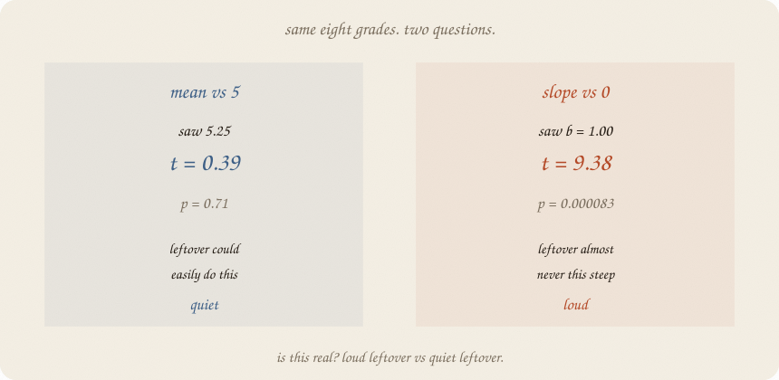
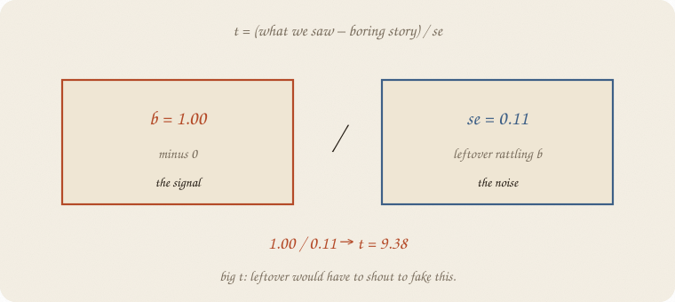
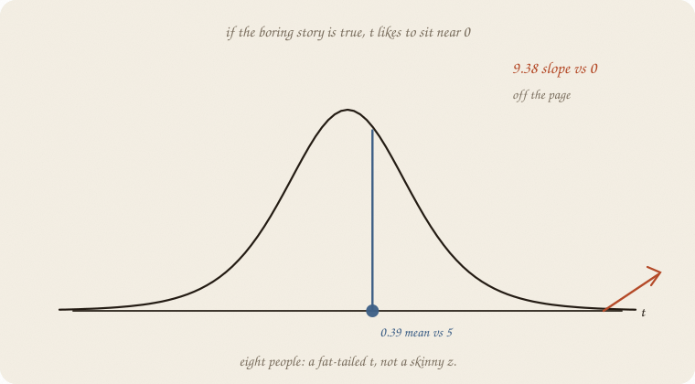
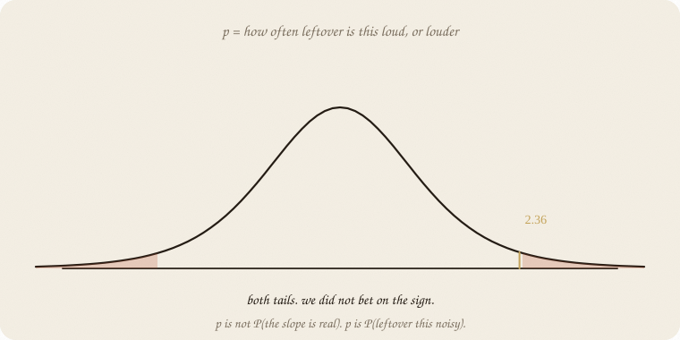
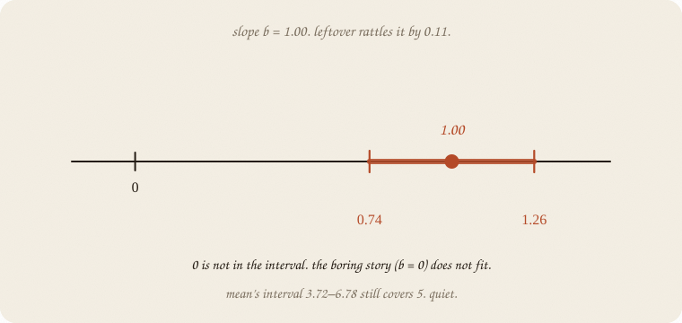
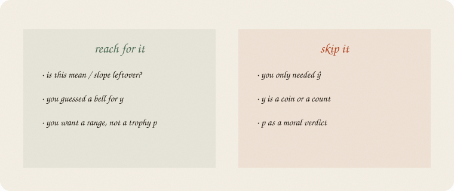

---
tags:
  - sketchbook
  - statistics
  - ml
aliases:
  - t-test
  - t test
  - T-test Sketchbook
  - p-value
---

# t-test — a sketchbook

> [!abstract] In one sentence
> A t-test asks: **could leftover have faked this number?** Loud leftover → quiet *t*. Quiet leftover vs a steep slope → loud *t*. *p* is how often leftover is that loud.



Read [[01 distributions]] first, and the eight grades on [[01 linear regression]]. Same people. Same line ŷ = 1.75 + 1 · hours. The new question is not ŷ. It is **is this real?**

This is 01 of the inference wing. Bootstrap, A/B, “how sure is *b*?” live here. Cause is a later wing.

Flip it like a notebook. One page = one idea. Done.

---

## Page 1 — Two questions, one class

Eight grades. Mean **5.25**. Slope **b = 1**.

Question A: is the mean different from 5 — a boring “about average” story?

Question B: is the slope different from 0 — a boring “hours do nothing” story?

Same leftover costume: a **bell** ([[01 distributions]]). Same eight dots. The answers will not match. That is the point of the notebook.

---

## Page 2 — Signal over rattle

You saw a number. Leftover rattles every number. Divide:

$$t = \frac{\text{what we saw} − \text{boring story}}{\text{se}}$$

**se** is how much leftover usually shoves that number. Mean: se = sd / √n. Slope: a similar rattle, from the leftovers of the line.



Mean vs 5: (5.25 − 5) / 0.65 → **t = 0.39**. Tiny.

Slope vs 0: 1.00 / 0.11 → **t = 9.38**. Huge.

People call se the **standard error**. Not the leftover’s sd. The leftover’s sd *for this knob*, after eight people.

---

## Page 3 — If the boring story is true, t sits near 0

Draw leftover’s favorite *t*s. A bell, a bit fatter than a z because eight people is not infinity. Degrees of freedom = how many leftovers you really have (7 for a mean, 6 for a slope — you already spent knobs).



0.39 sits in the fat middle. Leftover does this all day.

9.38 is **off the page**. If hours did nothing, leftover almost never draws a line this steep.

The costume still matters. Coin *y* is not this bell. Counts are not this bell. Wrong costume → smug *t*.

---

## Page 4 — *p* is the tail, not a verdict

**p** = how often leftover is this loud, **or louder**, if the boring story is true. Both tails: we did not bet on the sign.



Mean vs 5: **p = 0.71**. Leftover this quiet is ordinary.

Slope vs 0: **p = 8.3×10⁻⁵**. Leftover this loud is a freak — *if* hours truly did nothing, and the bell is honest.

*p* is **not** P(the slope is real). *p* is P(leftover this noisy | boring story). Flip that in your head and you get a religion. Keep the definition.

0.05 is a habit, not a law. Same politics as logistic’s 0.5 cut.

---

## Page 5 — The interval is the honest twin

A **confidence interval** is the set of boring stories leftover still fits.

Slope: 1.00 ± (2.45 × 0.11) → **0.74 to 1.26**. Zero is not in it. Hours-do-nothing does not fit.

Mean: 5.25 ± (2.36 × 0.65) → **3.72 to 6.78**. Five *is* in it. About-average still fits.



Same leftover, two knobs. The interval is the picture you can screenshot. *p* is a tail of that picture.

Light vs heavy study (hours ≤ 3 vs ≥ 4): means 3.75 vs 6.75, **t = 4.43**, p = 0.004. A two-sample cousin. Same ratio. You split the class; you did not invent a new test.

---

## Page 6 — Mini recipe

1. Name the **boring story** (mean = 5, *b* = 0, two groups equal).
2. Guess the **costume** ([[01 distributions]]). Bell for this notebook.
3. Compute **t** = (saw − boring) / se.
4. Read **p** as leftover’s tail, not as a medal.
5. Prefer the **interval**. Does the boring number sit inside?
6. Eight dots make a fat *t*. More people, skinnier se, louder *t* for the same *b*.

If you keep only one thing:

> *t* is signal over leftover-rattle. *p* is how often leftover shouts that loud.

---

## Page 7 — Eight grades, in scipy

Same table as linear regression. Mean vs 5, slope vs 0, and the two groups. No extra story.

```python
import numpy as np
from scipy import stats

hours = np.array([1, 2, 2, 3, 4, 5, 5, 6], float)
grade = np.array([3, 4, 3, 5, 6, 7, 6, 8], float)

mean = grade.mean()
se_mean = grade.std(ddof=1) / np.sqrt(len(grade))
t5, p5 = stats.ttest_1samp(grade, 5.0)
lr = stats.linregress(hours, grade)
tcrit_m = stats.t.ppf(0.975, 7)
tcrit_b = stats.t.ppf(0.975, 6)
light = grade[hours <= 3]
heavy = grade[hours >= 4]
t2, p2 = stats.ttest_ind(heavy, light)

print("n", len(grade), "  mean", round(mean, 2), "  sd", round(grade.std(ddof=1), 2), "  se", round(se_mean, 2))
print("H0 mean=5   t", round(t5, 2), "  p", round(p5, 2))
print("95% CI mean", round(mean - tcrit_m * se_mean, 2), round(mean + tcrit_m * se_mean, 2))
print("slope b", round(lr.slope, 2), "  se", round(lr.stderr, 2),
      "  t", round(lr.slope / lr.stderr, 2), "  p", f"{lr.pvalue:.1e}")
print("95% CI slope", round(lr.slope - tcrit_b * lr.stderr, 2),
      round(lr.slope + tcrit_b * lr.stderr, 2))
print("light/heavy means", round(light.mean(), 2), round(heavy.mean(), 2),
      "  t", round(t2, 2), "  p", round(p2, 3))
```

```
n 8   mean 5.25   sd 1.83   se 0.65
H0 mean=5   t 0.39   p 0.71
95% CI mean 3.72 6.78
slope b 1.0   se 0.11   t 9.38   p 8.3e-05
95% CI slope 0.74 1.26
light/heavy means 3.75 6.75   t 4.43   p 0.004
```

Mean vs 5: leftover shrugs (p = 0.71; 5 sits in 3.72–6.78). Slope vs 0: leftover would have to scream (t = 9.38; 0 is outside 0.74–1.26). Light vs heavy is the same verb on two piles.

`ttest_1samp` is question A. `linregress` already prints the slope’s *t* and *p*. `ddof=1` is the honest sd (n − 1). Fake a smaller se and *t* gets louder — don’t.

---

## Last page — cheat sheet

| word | meaning |
|---|---|
| boring story / H0 | the number leftover is asked to fake |
| se | leftover’s rattle for this knob |
| t | (saw − boring) / se |
| df | leftovers you still own |
| p | tail: leftover this loud or louder |
| CI | boring numbers leftover still fits |



### Use / skip

**Reach for it when** you ask whether a **mean or slope** could be leftover, you guessed a **bell** for *y*, and you want a **range**, not a trophy *p*.

**Skip it when** you only needed ŷ ([[01 linear regression]]); *y* is a coin or a count ([[01 logistic regression]] / [[06 GLM]] — different tests); you wanted *p* as a moral verdict.

**Pays you:** the chance wing’s first test. Same leftover as the line, now used as a judge. Interval and *t* are twins.

**Costs you:** the bell is a guess. Eight people make a fat *t*. *p* is not P(true). Pattern of leftover, not cause (that wing is later).

---

*Inference 01. Same eight grades, now with a judge. Bootstrap later. Cause later. Chance costume still: [[01 distributions]].*
