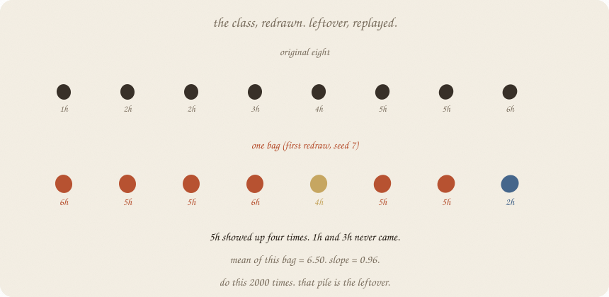
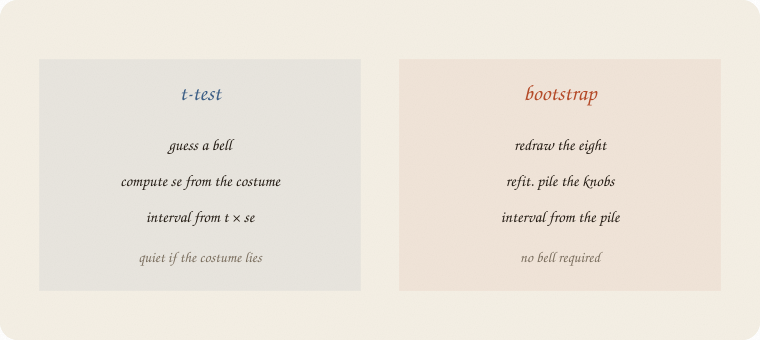
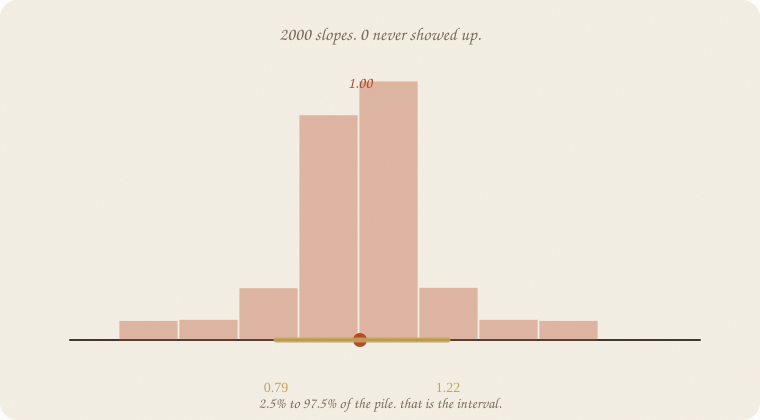
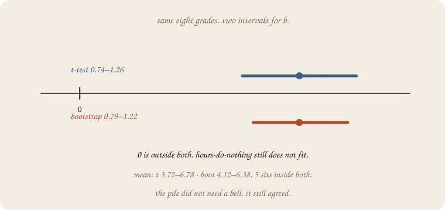
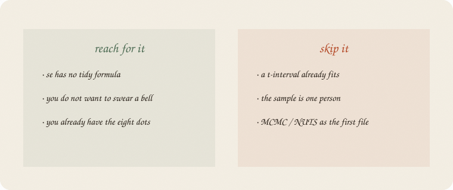

---
tags:
  - sketchbook
  - statistics
  - ml
aliases:
  - Bootstrap
  - Bootstrap Sketchbook
  - resampling
---

# Bootstrap — a sketchbook

> [!abstract] In one sentence
> Redraw the eight people **with replacement**, refit, pile the knobs. The pile *is* leftover. The interval is two percentiles. No bell required.



Read [[01 t-test]] first. Same eight grades. Same line ŷ = 1.75 + 1 · hours. Forests already **bagged** people ([[02 random forest]]). This notebook uses that redraw as a **judge**, not as a choir.

Flip it like a notebook. One page = one idea. Done.

---

## Page 1 — The t-test borrowed a costume

[[01 t-test]] needed a **bell** for leftover, then se, then t × se.

That was honest when the costume fit. Eight leftovers looked like a small bell. A median, a ratio, a forest’s vote — those do not come with a tidy se.

The bootstrap’s dare:

> Pretend these eight *are* the world. Draw eight again, some twice, some never. Refit. Repeat.



The spread of those fake worlds is leftover, replayed. Same verb as bagging. Different job: **uncertainty**, not a vote.

---

## Page 2 — One bag is a new class

First redraw of the eight:

hours `6, 5, 5, 6, 4, 5, 5, 2` 
grades `8, 7, 7, 8, 6, 6, 6, 4`

5h showed up four times. 1h and 3h never came. Mean of this bag = **6.50**. Slope = **0.96**.

The original mean was 5.25. This bag is a loud class. That is allowed. Leftover does that.

People call it **sampling with replacement**. Forests said **bag**. Same redraw.

---

## Page 3 — The pile is leftover

Do it **2000** times. Each bag: a mean, a slope.



The slope pile sits on **1.00**. Its sd is **0.11** — the same se the t-test printed from a formula. **Zero never showed up.** Hours-do-nothing is not in this world, replayed 2000 times.

The mean pile’s sd is **0.60**, next to the t-test’s 0.65. Close. Eight people, two judges, same leftover.

The 2.5% and 97.5% of the pile are the interval. No t-table. No costume.

---

## Page 4 — Two intervals, one story



| knob | t-test 95% | bootstrap 95% | boring story inside? |
|---|---|---|---|
| mean | 3.72 – 6.78 | **4.12 – 6.38** | 5 sits in both |
| slope | 0.74 – 1.26 | **0.79 – 1.22** | 0 in neither |

Same eight grades. Bootstrap is a hair tighter here (the pile is a bit less fat-tailed than the t with 6 df). The **verdict did not flip**. Mean vs 5 still quiet. Slope vs 0 still loud.

When they disagree, believe the pile if you do not trust the bell. Believe neither if eight people is a joke.

---

## Page 5 — Mini recipe

1. Keep the original eight (or eighty). They *are* the world for this trick.
2. Draw **n** people **with replacement**. Some twice. Some never.
3. Refit the number you care about (mean, *b*, a median, a vote).
4. Repeat until the pile is boring (thousands, not twelve).
5. Interval = 2.5% and 97.5% of the pile. se ≈ the pile’s sd.
6. If a t-interval already fits and the bell is honest, you replayed leftover for sport.

If you keep only one thing:

> redraw the people. the pile is leftover. percentiles are the interval.

---

## Page 6 — Eight grades, redrawn, in numpy

Same table as [[01 t-test]]. 2000 bags. `LinearRegression` only to refit *b*. The loop *is* the lesson.

```python
import numpy as np
from sklearn.linear_model import LinearRegression

hours = np.array([1, 2, 2, 3, 4, 5, 5, 6], float)
grade = np.array([3, 4, 3, 5, 6, 7, 6, 8], float)
rng = np.random.default_rng(7)
n, B = 8, 2000
means = np.empty(B)
slopes = np.empty(B)
for i in range(B):
    ix = rng.integers(0, n, n)
    means[i] = grade[ix].mean()
    slopes[i] = LinearRegression().fit(hours[ix].reshape(-1, 1), grade[ix]).coef_[0]

print("people", n, "  redraws", B)
print("original mean", round(grade.mean(), 2), "  slope", 1.00)
print("boot se mean", round(means.std(ddof=1), 2), "  slope", round(slopes.std(ddof=1), 2))
print("95% boot mean ", np.round(np.percentile(means, [2.5, 97.5]), 2))
print("95% boot slope", np.round(np.percentile(slopes, [2.5, 97.5]), 2))
print("redraws with slope ≤ 0", int((slopes <= 0).sum()))
ix = np.random.default_rng(7).integers(0, n, n)
print("first bag hours", hours[ix].astype(int).tolist())
print("first bag grade", grade[ix].astype(int).tolist())
print("first bag mean", round(grade[ix].mean(), 2),
      "  slope", round(float(LinearRegression().fit(hours[ix].reshape(-1, 1), grade[ix]).coef_[0]), 2))
```

```
people 8   redraws 2000
original mean 5.25   slope 1.0
boot se mean 0.6   slope 0.11
95% boot mean  [4.12 6.38]
95% boot slope [0.79 1.22]
redraws with slope ≤ 0 0
first bag hours [6, 5, 5, 6, 4, 5, 5, 2]
first bag grade [8, 7, 7, 8, 6, 6, 6, 4]
first bag mean 6.5   slope 0.96
```

First bag is a loud class (mean 6.50) — leftover, one replay. Across 2000, slope se = 0.11 matches the t-test. Zero never appears. The mean interval still covers 5.

`rng.integers(0, n, n)` is the bag. `percentile(..., [2.5, 97.5])` is the interval. No `ttest_1samp`. The bell stayed home.

---

## Last page — cheat sheet

| word | meaning |
|---|---|
| bag / redraw | n draws with replacement |
| pile | the knobs from every bag |
| boot se | sd of the pile |
| percentile interval | 2.5% and 97.5% of the pile |
| with replacement | some people twice, some never |



### Use / skip

**Reach for it when**

- se has no tidy formula
- you do not want to swear a **bell**
- you already have the dots

**Skip it when**

- a t-interval already fits ([[01 t-test]])
- the sample is one person
- you wanted MCMC / NUTS as the first file

**Pays you:** leftover without a costume. Same redraw forests used to disagree. An interval for ugly knobs (median, a ratio, a vote).

**Costs you:** the eight *are* the world — a weird sample makes a weird pile. 2000 loops, not a one-shot formula. Still not cause ([[01 confounding]]). Still not a posterior (MCMC later).

---

*Inference 02. Same leftover, replayed. Forests bagged to vote; here the bag judges. Next empty 01: a little time.*
