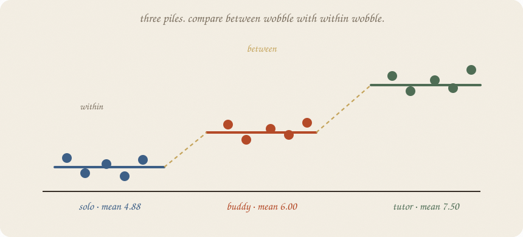
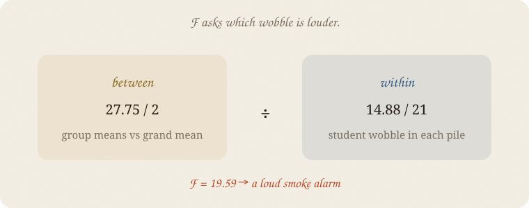

---
tags:
  - sketchbook
  - statistics
  - ml
aliases:
  - ANOVA
  - Analysis of variance
  - ANOVA Sketchbook
---

# ANOVA — a sketchbook

> [!abstract] In one sentence
> A t-test compares two means; **ANOVA** compares three or more by asking whether the groups sit farther apart than people wobble inside them.



Read [[01 t-test]] first. Same exam world, new question: three study routines — solo, buddy, tutor. Which piles of grades are genuinely apart, and which gaps are just leftover wobble?

**ANOVA** means **analysis of variance**. The name sounds backwards because the test uses variation to answer a question about means: are the group means separated by more than ordinary within-group noise?

---

## Page 1 — Three routines, three piles

Eight students try each routine. The means are:

| routine | grades | mean |
|---|---|---:|
| solo | 4, 5, 4, 6, 5, 4, 6, 5 | **4.88** |
| buddy | 5, 6, 6, 7, 6, 5, 7, 6 | **6.00** |
| tutor | 6, 7, 8, 7, 8, 7, 9, 8 | **7.50** |

The piles look separated. But every pile has its own rattle. ANOVA asks whether the distance **between** the pile centres is loud compared with the wobble **within** the piles.

---

## Page 2 — The two kinds of wobble

Imagine a rubber band around each group mean.

- **Within-group variation:** students wobble around their own routine’s mean.
- **Between-group variation:** the routine means wobble around the grand mean.

The grand mean here is **6.12**. The between sum of squares is **27.75**. The within sum of squares is **14.88**.

ANOVA turns them into average wobble:

$$F = \frac{\text{between variation}}{\text{within variation}}$$

Here:

$$F = \frac{27.75 / 2}{14.88 / 21} = \textbf{19.59}$$

Large *F* means the pile centres are far apart relative to the inside rattle.



---

## Page 3 — What the F can say

The boring story is:

> all three routines have the same mean grade.

If that story were true, the group means would usually sit closer together. Here, *F* = **19.59**, *p* = **1.58 × 10⁻⁵**.

ANOVA says:

> **At least one routine differs.**

It does **not** say which routine differs from which. The F is a smoke alarm, not a map of the fire.

---

## Page 4 — Three t-tests are three chances

You could compare solo vs buddy, solo vs tutor, and buddy vs tutor. That is three questions:

$$\binom{3}{2} = 3$$

Each question at α = 0.05 has a small false-alarm chance. Across all three, the chance of at least one false alarm is larger than 0.05.

ANOVA asks the one overall question first. If it is quiet, stop. Do not go pair-fishing because one pair looks interesting.

The follow-up tools live in [[04 multiple comparisons]].

---

## Page 5 — Two groups hide inside ANOVA

With only two groups, one-way ANOVA and the equal-variance t-test tell the same story:

$$F = t^2$$

ANOVA is not a new kind of magic. It is the many-pile version of the t-test’s signal-over-rattle idea.

The assumptions are the same family too: independent observations, roughly bell-shaped leftovers, and similar spreads. If the piles are wildly lopsided or the observations are paired, this page is not a free pass.

ANOVA is a comparison, not a causal machine. If tutor students were already more motivated, the mean gap is not automatically the tutor’s effect. Pattern is still not mechanism ([[01 confounding]]).

---

## Page 6 — Mini recipe

1. Put the observations into **three or more groups**.
2. Compute each group mean and the grand mean.
3. Measure wobble **between** groups and **within** groups.
4. Divide: *F* = between / within.
5. Read the *p* as a test of “all means equal,” not as a verdict on one pair.
6. If the F is loud, use a planned comparison or [[04 multiple comparisons]].

If you keep only one thing:

> ANOVA tells you that a difference is somewhere. It does not name the pair.

---

## Page 7 — Three routines, in scipy

Same three grade piles as page 1. The run prints the overall F, then the pairwise questions so you can see why the follow-up needs a correction.

```python
import numpy as np
from scipy import stats

solo = np.array([4, 5, 4, 6, 5, 4, 6, 5], float)
buddy = np.array([5, 6, 6, 7, 6, 5, 7, 6], float)
tutor = np.array([6, 7, 8, 7, 8, 7, 9, 8], float)
groups = [solo, buddy, tutor]

all_grades = np.concatenate(groups)
grand = all_grades.mean()
ss_between = sum(len(g) * (g.mean() - grand) ** 2 for g in groups)
ss_within = sum(((g - g.mean()) ** 2).sum() for g in groups)
F, p = stats.f_oneway(*groups)

print("means", [round(g.mean(), 2) for g in groups], "  grand", round(grand, 2))
print("between SS", round(ss_between, 2), "  within SS", round(ss_within, 2))
print("F", round(F, 2), "  df 2,21", "  p", f"{p:.2e}")

for name_a, name_b, a, b in zip(
    ["solo", "solo", "buddy"],
    ["buddy", "tutor", "tutor"],
    [solo, solo, buddy],
    [buddy, tutor, tutor],
):
    t, raw_p = stats.ttest_ind(a, b, equal_var=True)
    print(name_a, "vs", name_b, "raw p", f"{raw_p:.6f}",
          "Bonferroni p", f"{min(raw_p * 3, 1):.6f}")
```

```
means [4.88, 6.0, 7.5]   grand 6.12
between SS 27.75   within SS 14.88
F 19.59   df 2,21   p 1.58e-05
solo vs buddy raw p 0.0135 Bonferroni p 0.0404
solo vs tutor raw p 0.000035 Bonferroni p 0.000105
buddy vs tutor raw p 0.0032 Bonferroni p 0.0096
```

The overall test is loud. Every raw pairwise *p* is also small here, but those are three unprotected looks. [[04 multiple comparisons]] explains the protection. Tukey belongs there too.

---

## Last page — cheat sheet

| word | meaning |
|---|---|
| within | wobble inside each group |
| between | distance of group means from the grand mean |
| F | between variation / within variation |
| null | all group means are equal |
| result | at least one mean differs; not which one |
| follow-up | planned contrast, Tukey, or another correction |

### Use / skip

**Reach for it when**

- you have **three or more means** to compare
- the observations are independent
- you want one overall test before looking at pairs

**Skip it when**

- you only have two groups and a t-test says the same thing
- the groups are paired or wildly non-bell-shaped
- you want a causal claim from group means

**Pays you:** one overall smoke alarm instead of three first guesses.

**Costs you:** F does not name the pair. Looking at pairs afterward needs protection. Same assumptions as the t-test family.

---

*Inference 03. Three piles, one F. The smoke alarm does not name the fire. Next: [[04 multiple comparisons]].*
