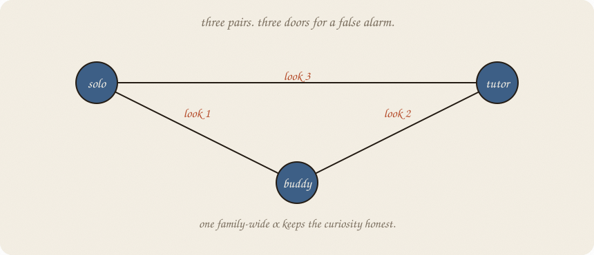
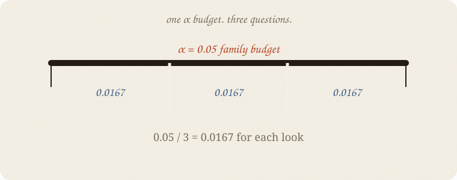

---
tags:
  - sketchbook
  - statistics
  - ml
aliases:
  - Multiple comparisons
  - Multiple testing
  - Bonferroni
  - Tukey HSD
  - Alpha error accumulation
  - Multiple Comparisons Sketchbook
---

# Multiple comparisons — a sketchbook

> [!abstract] In one sentence
> If you ask enough questions, leftover eventually says **yes** by accident; Bonferroni and Tukey HSD help keep the family’s false alarms under control.



Read [[03 ANOVA]] first. ANOVA told us that at least one of three routines differs. Now we want to ask **which pairs** without pretending the first raw *p* was the only look.

---

## Page 1 — One look, one small alarm

At α = **0.05**, one test allows a 5% chance of a false alarm when the boring story is true.

That does not mean every *p* below 0.05 is fake. It means the rule is calibrated for one question under its assumptions.

One question:

> Does solo differ from buddy?

One small door for a false alarm.

---

## Page 2 — Three looks open three doors

With solo, buddy, and tutor, there are three pairs:

| pair | raw p |
|---|---:|
| solo vs buddy | 0.0135 |
| solo vs tutor | 0.000035 |
| buddy vs tutor | 0.0032 |

If all three boring stories were true, the chance of **at least one** false alarm is larger than 0.05. A rough independent calculation gives:

$$1 - (1 - 0.05)^3 = 0.1426$$

The tests are not perfectly independent, so this is a picture, not the final answer. The habit is the point: more looks, more opportunity for leftover to shout.

People call this the **family-wise error rate**: the chance of one or more false alarms in the family of questions.

---

## Page 3 — Bonferroni brings one α to the family

Bonferroni is the blunt, honest haircut:

$$\alpha_{\text{each}} = \frac{\alpha_{\text{family}}}{m}$$

For three pairs and family α = 0.05:

$$0.05 / 3 = 0.0167$$

Or multiply each raw *p* by three and compare with 0.05. The three adjusted values are **0.0404**, **0.000105**, and **0.0096**.

Bonferroni works for any small list of planned questions. It is easy to explain. It can be conservative: it may miss a real difference when the family gets large.



---

## Page 4 — Tukey knows the all-pairs job

Tukey HSD — honestly significant difference — is made for comparing **all pairs of group means** after an ANOVA.

It uses the shared within-group wobble and the number of groups together. It asks for one family-wide answer, not three unrelated *p* values.

For these three piles, Tukey gives:

| pair | mean difference | Tukey p | 95% interval |
|---|---:|---:|---:|
| solo − buddy | −1.125 | 0.0364 | −2.186 to −0.064 |
| solo − tutor | −2.625 | 0.000010 | −3.686 to −1.564 |
| buddy − tutor | −1.500 | 0.0050 | −2.561 to −0.439 |

Every interval stays away from zero here. Each pair survives Tukey’s family-wide guard.

Tukey is not automatically “better” than Bonferroni. It is better matched to the all-pairs question. Bonferroni is the general-purpose haircut.

---

## Page 5 — Alpha does not become a moral score

The error is not that α physically accumulates inside the data. The error is asking many questions while reporting each one as if it were alone.

Call it **alpha-error accumulation** if you need the phrase. The precise idea is:

> the chance of at least one false alarm rises across a family of tests.

Pre-name the family. “We will compare all three routines” is cleaner than trying every split and reporting the one that shouted.

ANOVA first. Then the correction that matches the question.

---

## Page 6 — Mini recipe

1. Name the family of questions before looking at the answers.
2. Run [[03 ANOVA]] for the overall “any difference?” question.
3. If you have a few planned contrasts, use Bonferroni or another planned correction.
4. If you want every pair, use Tukey HSD.
5. Report the adjusted *p*, interval, and pair — not only the raw *p*.
6. Do not turn a corrected *p* into “the effect is true.” It is still an inference under assumptions.

If you keep only one thing:

> Many looks need one family-wide guard.

---

## Page 7 — Three routines, protected, in scipy

Same three piles. The run prints raw pairwise *p* values, Bonferroni values, and Tukey HSD values.

```python
import numpy as np
from scipy import stats

solo = np.array([4, 5, 4, 6, 5, 4, 6, 5], float)
buddy = np.array([5, 6, 6, 7, 6, 5, 7, 6], float)
tutor = np.array([6, 7, 8, 7, 8, 7, 9, 8], float)
groups = [solo, buddy, tutor]
names = ["solo", "buddy", "tutor"]

raw = []
for i in range(3):
    for j in range(i + 1, 3):
        _, p = stats.ttest_ind(groups[i], groups[j], equal_var=True)
        raw.append((names[i], names[j], p))

print("pair                         raw p   Bonferroni p")
for a, b, p in raw:
    print(f"{a:>5} vs {b:<6}          {p:.6f}       {min(3 * p, 1):.6f}")

tukey = stats.tukey_hsd(*groups)
print("Tukey p")
for i in range(3):
    for j in range(i + 1, 3):
        print(names[i], "vs", names[j], f"{tukey.pvalue[i, j]:.6f}")
```

```
pair                         raw p   Bonferroni p
 solo vs buddy           0.0135       0.0404
 solo vs tutor           0.000035       0.000105
buddy vs tutor           0.0032       0.0096
Tukey p
solo vs buddy 0.036372
solo vs tutor 0.000010
buddy vs tutor 0.004988
```

The raw values look more impressive because they paid no family fee. Bonferroni and Tukey both keep all three pairs below 0.05 here, but the methods answer slightly different questions.

---

## Last page — cheat sheet

| word | meaning |
|---|---|
| family | all tests you are treating as one question set |
| α | allowed family error budget |
| FWER | chance of one or more false alarms in the family |
| Bonferroni | divide α by the number of tests; general-purpose |
| Tukey HSD | all-pairs guard after ANOVA |
| raw p | each test pretending it was alone |

### Use / skip

**Reach for it when**

- ANOVA sent you to specific pairs
- you had several planned questions
- you want to show honest family-wide intervals and *p* values

**Skip it when**

- there was only one pre-planned test
- you are using correction as permission to fish forever
- you forgot the overall question that came before the pairs

**Pays you:** fewer false discoveries from a crowded question list.

**Costs you:** Bonferroni can be shy; Tukey belongs to all pairs; neither repairs confounding, bad data, or a question invented after the result.

---

*Inference 04. ANOVA found the smoke. Bonferroni and Tukey check the rooms without crying wolf. Next: another question, not another fishing trip.*
