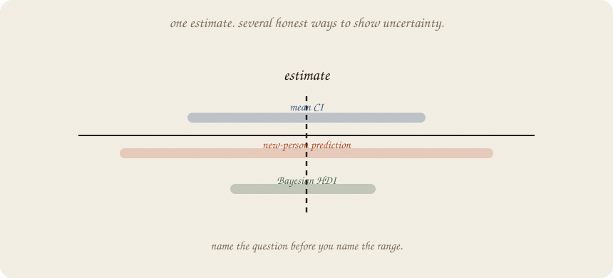
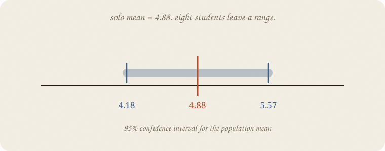
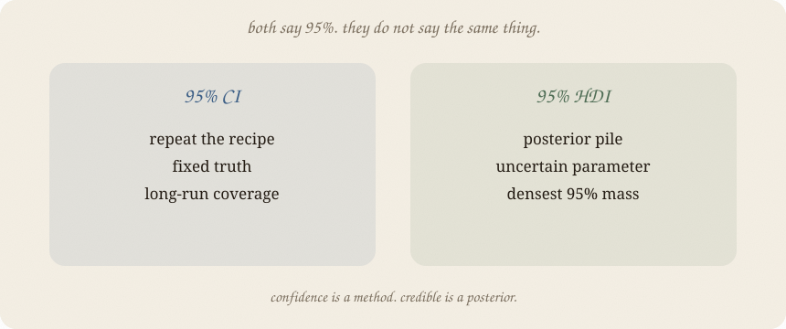

---
tags:
  - sketchbook
  - statistics
  - ml
aliases:
  - Confidence intervals
  - Confidence interval
  - Credible interval
  - Confidence Intervals Sketchbook
---

# Confidence intervals — a sketchbook

> [!abstract] In one sentence
> A confidence interval is a range produced by a method that would catch the fixed truth in, say, 95% of repeated samples; a Bayesian **HDI** is a 95% densest range of the posterior belief.



Read [[01 t-test]], [[02 bootstrap]], [[03 ANOVA]], and [[04 multiple comparisons]] first. They already made intervals appear. This note puts the different intervals on one table — and walks past the traps people repeat in interviews.

---

## Page 1 — A range, not a trophy

The grade mean in the solo pile is **4.88**. That is one estimate from eight students. The interval says how much the estimate could wobble under a stated method.

For a 95% t confidence interval:

$$\text{estimate} \pm \text{critical leftover} \times \text{standard error}$$

Here the mean interval is **4.18 to 5.57**.

It is wider than the mean alone because eight students are a small, noisy window. More students usually make the standard error smaller. More wobble makes it larger.



The interval is not decoration around a point. It is the part of the answer that admits what the data did not pin down.

---

## Page 2 — The first big trap: what 95% means

Wrong but common:

> “There is a 95% probability that the true mean is between 4.18 and 5.57.”

For a classical confidence interval, the true mean is treated as fixed. The **method** is random because another sample would make another interval.

The 95% promise belongs to the repeated method:

> If we repeated the same sampling-and-interval recipe many times, about 95% of those intervals would catch the fixed mean.

After this one interval is calculated, it either catches the mean or it does not. The method has coverage; this single interval does not have a personal probability attached to it.

People often speak loosely. In a room, “we are 95% confident” is acceptable shorthand. In your head, keep the repeated-method meaning.

Two more *wrong* shortcuts:

- A 95% CI is **not** the middle 95% of the students or grades. That is a distribution of observations; use a prediction interval for a new student.
- “The interval contains zero” does not mean “there is no effect.” It means zero is still compatible with this estimate and this interval method. A small sample may simply have left the answer blurry.

---

## Page 3 — Mean interval is not a new-person interval

The 95% CI **4.18 to 5.57** is about the unknown population **mean**.

A new student is noisier than a mean. For one new grade, the 95% prediction interval is **2.78 to 6.97**.

| range | question | this toy example |
|---|---|---:|
| confidence interval | where is the population mean? | **4.18 – 5.57** |
| prediction interval | where might one new grade land? | **2.78 – 6.97** |

The prediction interval includes the rattle of the estimated mean **and** the student-to-student rattle. Do not report a confidence interval when someone asked for the next person.

---

## Page 4 — The second big trap: CI is not HDI

A classical CI and a Bayesian HDI can both say “95%,” but they mean different things.

**95% confidence interval**

- comes from a repeated-sampling recipe
- treats the parameter as fixed
- talks about the long-run coverage of the method

**95% HDI** — highest-density interval

- comes from a posterior distribution
- treats the parameter as uncertain in the model
- contains the densest 95% of posterior mass

For the eight pass/fail students, suppose our Bayesian model gives a posterior for the pass probability. Its 95% HDI is a statement about that posterior, given the data and prior. It is not the classical CI wearing a new label.



The word **credible** belongs to the Bayesian side. The word **confidence** belongs to the repeated-sampling side.

---

## Page 5 — A small HDI, with its assumptions attached

Eight students: two passed. Start with a Beta(1, 1) prior — every pass probability gets equal starting weight. After two passes and six fails, the posterior is Beta(3, 7).

Its mean is **0.30**. A central 95% posterior interval is **0.07 to 0.59**. The 95% HDI is **0.06 to 0.57**.

The HDI can be read in the Bayesian model as:

> given this prior, this likelihood, and these data, the densest 95% of plausible *p* values is 0.06 to 0.57.

That is a useful sentence. “There is a 95% chance the truth is there” is only justified as a posterior statement with the model and prior made explicit. It is not what a t confidence interval means.

---

## Page 6 — Narrow is not important, and neither is causal

A narrow interval says the estimate is precise under the model. It does **not** say:

- the effect is large
- the effect matters in the real world
- the model is right
- the pattern is a cause

A tiny effect can be measured very precisely with a huge sample. A large-looking effect can have a wide interval with eight people. And no interval repairs confounding ([[01 confounding]]).

For several pairs after ANOVA, an ordinary interval is not enough if you want family-wide protection. Use the simultaneous Tukey intervals from [[04 multiple comparisons]].

---

## Page 7 — Bootstrap makes another route

[[02 bootstrap]] redraws the observed people and takes percentiles of the resulting pile. Its interval is not automatically a classical t interval and not automatically a Bayesian HDI.

For the eight original grades, the bootstrap mean interval was **4.12 to 6.38**. The t interval was **3.72 to 6.78** in [[01 t-test]]. Different engines, different promises, same honest habit: show the range.

No interval is a force field. Eight strange people can produce a strange interval. A bad control can produce a precise-looking causal interval. A post-hoc family can produce a pretty but unprotected interval.

---

## Page 8 — Mini recipe

1. Say **what** the interval is about: a mean, a difference, a slope, a new observation, or a parameter.
2. Name the engine: t, bootstrap, Bayesian posterior, or Tukey family-wide.
3. Say what the level means for that engine.
4. Check whether you need a mean interval or a prediction interval.
5. Check whether many comparisons need simultaneous protection.
6. Report the interval with the estimate. Do not hide the width.

If you keep only one thing:

> First name the question. Then name the interval’s promise.

---

## Page 9 — Same grades, several ranges, in scipy

The code prints a mean CI, a new-student prediction interval, and the Bayesian Beta HDI. The HDI is a posterior interval; it is not a confidence interval.

```python
import numpy as np
from scipy import stats

grade = np.array([4, 5, 4, 6, 5, 4, 6, 5], float)
n = len(grade)
mean = grade.mean()
sd = grade.std(ddof=1)
se = sd / np.sqrt(n)
tcrit = stats.t.ppf(0.975, n - 1)

mean_ci = mean + np.array([-1, 1]) * tcrit * se
prediction = mean + np.array([-1, 1]) * tcrit * sd * np.sqrt(1 + 1 / n)

# Two passes, six fails; uniform Beta(1, 1) prior → Beta(3, 7) posterior.
rng = np.random.default_rng(7)
posterior = stats.beta(3, 7).rvs(12_000, random_state=rng)
sorted_post = np.sort(posterior)
window = int(0.95 * len(sorted_post))
spans = sorted_post[window:] - sorted_post[:-window]
i = np.argmin(spans)
hdi = np.array([sorted_post[i], sorted_post[i + window]])

print("mean", round(mean, 2), "  sd", round(sd, 2), "  se", round(se, 2))
print("95% CI mean", np.round(mean_ci, 2))
print("95% prediction interval", np.round(prediction, 2))
print("posterior Beta(3,7) mean / 95% central",
      round(posterior.mean(), 2), np.round(np.quantile(posterior, [0.025, 0.975]), 2))
print("95% HDI", np.round(hdi, 2), "  width", round(hdi[1] - hdi[0], 2))
```

```
mean 4.88   sd 0.83   se 0.3
95% CI mean [4.18 5.57]
95% prediction interval [2.78 6.97]
posterior Beta(3,7) mean / 95% central 0.3 [0.07 0.59]
95% HDI [0.06 0.57]   width 0.51
```

The mean CI is narrower than the prediction interval because a mean averages away person-level noise. The HDI answers a different, Bayesian question about *p*. None of these ranges says that a study routine caused the grades.

---

## Last page — cheat sheet

| word | meaning |
|---|---|
| CI | classical repeated-sampling interval |
| confidence level | long-run coverage of the CI recipe |
| prediction interval | range for one new observation; wider than a mean CI |
| bootstrap interval | percentile range from redraws |
| credible interval | Bayesian posterior range |
| HDI | shortest interval containing the densest posterior mass |
| simultaneous interval | family-wide protection for many comparisons |

### Use / skip

**Reach for it when**

- a point estimate without its width would mislead
- you need to distinguish mean uncertainty from new-person uncertainty
- you need to say how much the data and model leave open

**Skip it when**

- you use a mean CI to answer a prediction question
- you call a CI a probability statement about a fixed truth
- you call an HDI a CI, or use either as proof of cause

**Pays you:** a range honest enough to show what remains unknown.

**Costs you:** the range inherits the engine’s assumptions. A narrow interval can be precisely wrong; many looks need simultaneous protection.

---

*Inference 05. A range is part of the answer. Confidence covers in repeated runs; an HDI describes posterior mass. Next: choose the question before choosing the interval.*
