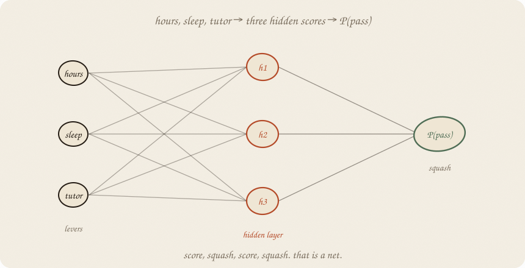
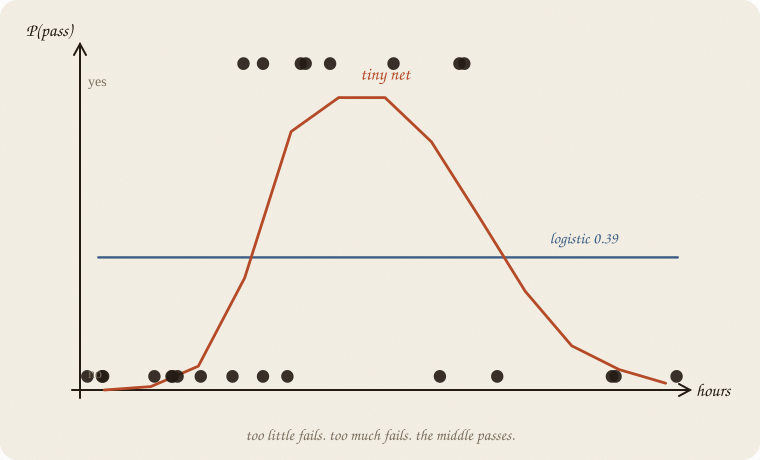
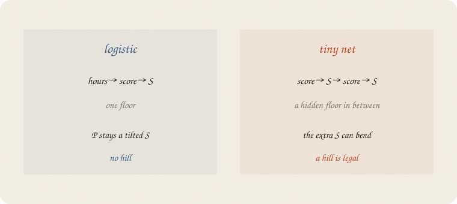
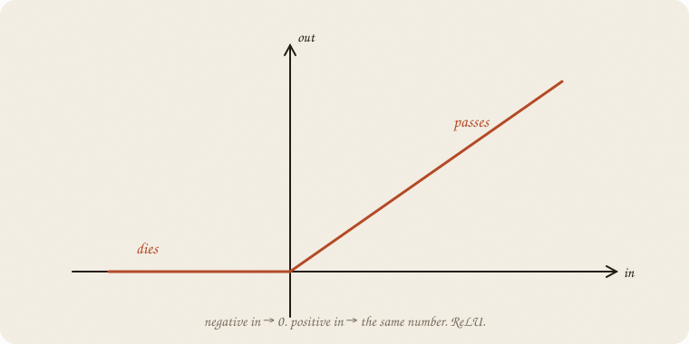
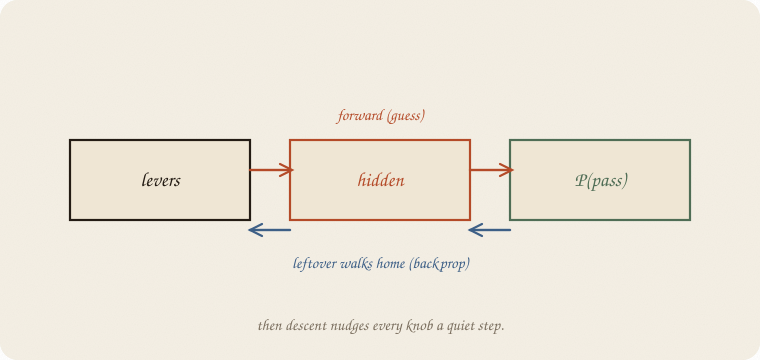
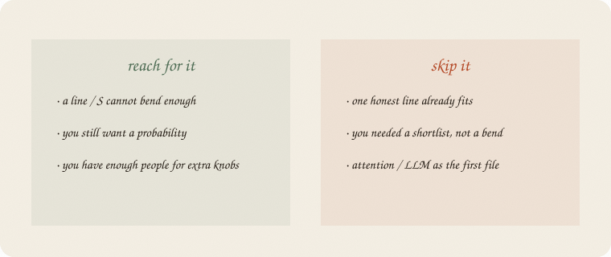

---
tags:
  - sketchbook
  - statistics
  - ml
aliases:
  - Neural net
  - Neural Net Sketchbook
  - MLP
  - tiny net
---

# Neural net — a sketchbook

> [!abstract] In one sentence
> Logistic is **one** score, then an S. A tiny net is **score → squash → score → squash**. The extra floor is what lets the curve bend.



Read [[01 logistic regression]] and [[01 gradient descent]] first. Same exam world: hours, sleep, tutor, *y* = did they pass? Softmax ([[03 softmax]]) is waiting at the last layer if you ever have more rooms.

This is 01 of the nets wing. Embeddings, attention, an LLM — later rooms. This notebook is the brick they all sit on.

Flip it like a notebook. One page = one idea. Done.

---

## Page 1 — Hours that help, then hurt

The old logistic story: more hours → more likely to pass. An S that only climbs.

This class is meaner. Too little study: fail. A solid middle: pass. Too much: burnout, fail again. Sleep still helps a little. Tutor is still a lever.

Same people. Same three knobs. The **shape** of *y* changed. A single tilted S cannot draw a hill.

---

## Page 2 — Logistic shrugs

Fit logistic anyway. Hours, sleep, tutor in. Scale them (the tax from ridge still applies — size of a knob is not a moral). House seed 7.

It prints a flat **P ≈ 0.39** at every hours, sleep held at 6.5, no tutor. Train 0.57, test 0.60. Barely better than guessing the majority (fail).



The blue line is honest. It is also useless. The yes-dots live in the **middle**. Logistic has no word for “middle.”

---

## Page 3 — Stack another floor

Logistic:

hours → **score** → **S** → P(pass)

A tiny net:

hours → **score** → **squash** → **score** → **S** → P(pass)



The middle scores are the **hidden layer**. Three of them in this notebook. Each is a line on the levers, then a squash. The last score is a line on *those* three, then the familiar S.

Nothing here is magic. Two logistics glued together. The glue is what bends.

People call this a **multi-layer perceptron**. Ugly name. Friendly job: *one extra floor of scores.*

---

## Page 4 — The cheap squash in the middle

The last squash is still the S you know (so P stays in 0–1).

The hidden squash is usually cheaper: **ReLU**. Negative in → 0. Positive in → the same number. A hinge.



A dead unit is a unit whose score stayed negative. It contributes nothing this person. That is allowed. Three hinges, mixed, can make a hill. One S cannot.

You do not pick the hinges by hand. Descent walks the knobs until the hill appears — or doesn’t.

---

## Page 5 — Leftover walks home

Forward: levers → hidden → P(pass). A guess.

The guess is wrong by some leftover. Boosting planted a tree on that leftover. Here the leftover **walks backward** through the floors and tells every knob which way to nudge.



People call this **backpropagation**. Then [[01 gradient descent]] takes the quiet step. Same rate-knob as the bowl. Same explosion if you shout.

On 160 people, three hidden units: **16 knobs**. Logistic had 4 (a plus three *b*s). Extra floors cost extra knobs. Extra knobs need extra people, or they memorize.

---

## Page 6 — Mini recipe

1. **y is still pass/fail** (or a number, later). Same exam levers unless the idea needs new ones.
2. **Scale x.** Hidden scores tax size the way ridge did.
3. **One hidden layer** first. Three units is a start, not a religion.
4. **ReLU** in the middle, **S** at the end if you want P(yes).
5. **Walk** the knobs ([[01 gradient descent]]). Quiet rate. Stop when new people stop improving.
6. If a line already fits, you stacked a floor for sport.

If you keep only one thing:

> score, squash, score, squash. leftover walks home. then you step.

---

## Page 7 — Hill vs shrug, in sklearn

Same 160 students. Pass is a hill on hours. Logistic vs a net with **3 hidden units**. House seed 7. `lbfgs` is a quiet walker for a tiny net — not SGD yet.

```python
import numpy as np
from sklearn.linear_model import LogisticRegression
from sklearn.neural_network import MLPClassifier
from sklearn.pipeline import make_pipeline
from sklearn.preprocessing import StandardScaler
from sklearn.model_selection import train_test_split

rng = np.random.default_rng(7)
n = 160
hours = rng.uniform(1, 6, n)
sleep = rng.uniform(4, 9, n)
tutor = (rng.random(n) > 0.6).astype(float)
z = 1.6 - 1.35 * ((hours - 3.5) ** 2) + 0.2 * (sleep - 6.5)
passed = (rng.random(n) < 1 / (1 + np.exp(-z))).astype(int)

X = np.column_stack([hours, sleep, tutor])
Xtr, Xte, ytr, yte = train_test_split(X, passed, test_size=0.3, random_state=0)

log = make_pipeline(StandardScaler(), LogisticRegression()).fit(Xtr, ytr)
net = make_pipeline(
    StandardScaler(),
    MLPClassifier(
        hidden_layer_sizes=(3,),
        activation="relu",
        solver="lbfgs",
        random_state=7,
        max_iter=4000,
    ),
).fit(Xtr, ytr)

print("pass / fail", int(passed.sum()), int((1 - passed).sum()))
print("log  train/test", round(log.score(Xtr, ytr), 3), round(log.score(Xte, yte), 3))
print("net  train/test", round(net.score(Xtr, ytr), 3), round(net.score(Xte, yte), 3))
m = net.named_steps["mlpclassifier"]
print("hidden units", m.hidden_layer_sizes[0], "  knobs",
      sum(w.size for w in m.coefs_) + sum(b.size for b in m.intercepts_))
for h in (1.5, 2.5, 3.5, 4.5, 5.5):
    x = [[h, 6.5, 0]]
    print(f"P | {h}h   log {log.predict_proba(x)[0, 1]:.2f}   net {net.predict_proba(x)[0, 1]:.2f}")
```

```
pass / fail 64 96
log  train/test 0.571 0.604
net  train/test 0.821 0.771
hidden units 3   knobs 16
P | 1.5h   log 0.39   net 0.01
P | 2.5h   log 0.39   net 0.50
P | 3.5h   log 0.39   net 0.86
P | 4.5h   log 0.39   net 0.37
P | 5.5h   log 0.39   net 0.05
```

Logistic never leaves 0.39. The net is a hill: 0.01 at 1.5 hours, **0.86 at 3.5**, 0.05 at 5.5. Test 0.77 vs 0.60 is the extra floor earning its keep — on *these* 48 people, not a law. Sixteen knobs on 112 trainers is still a small choir. A deeper net would start singing the training set.

`predict_proba` is the last S. `hidden_layer_sizes=(3,)` is the middle floor.

---

## Last page — cheat sheet

| word | meaning |
|---|---|
| hidden layer | extra floor of scores + squash |
| ReLU | max(0, score) — the cheap middle squash |
| sigmoid / S | last squash if you want P(yes) |
| backprop | leftover walks backward to every knob |
| MLP | sklearn’s name for this tiny net |
| knobs | every *b* and *a* on every floor |

**Also called:** leftover walking home = backpropagation · knobs = weights · squash = activation.



### Use / skip

**Reach for it when** a line or one S cannot bend (a hill, a dip, “middle is different”), you still want a **probability**, and you have enough people for the extra knobs.

**Skip it when** one honest line already fits ([[01 linear regression]] / [[01 logistic regression]]); you needed a **shortlist**, not a bend ([[03 lasso]]); the story is questions and rectangles ([[01 decision tree]]); you wanted attention / an LLM as the first file.

**Pays you:** the first machine that can draw a hill without you carving the feature. The verb of every later net. Backprop is just leftover + descent.

**Costs you:** knobs multiply. Scale matters. A loud rate or a fat hidden layer memorizes. The *b*s are no longer “+1 hour → this.” Readable floors come later (embeddings).

---

*Nets wing, 01. Same leftover, walking backward. Next room: [[02 embeddings]] — a word is a point.*
