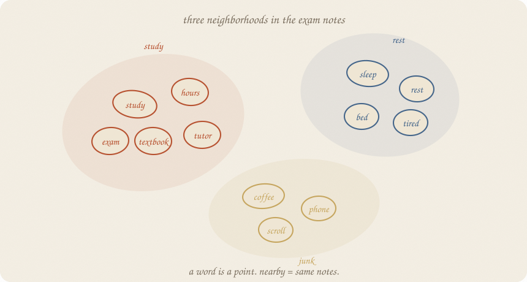
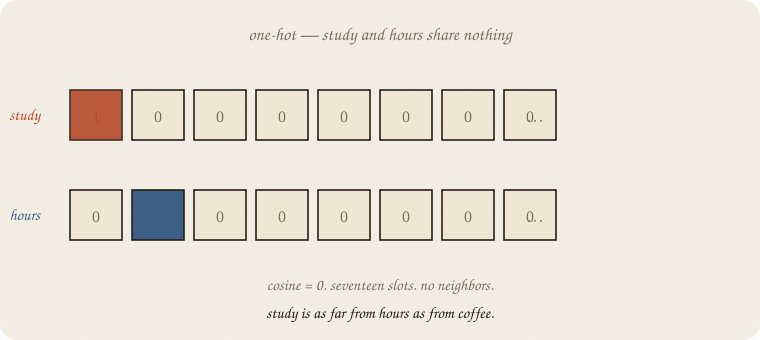
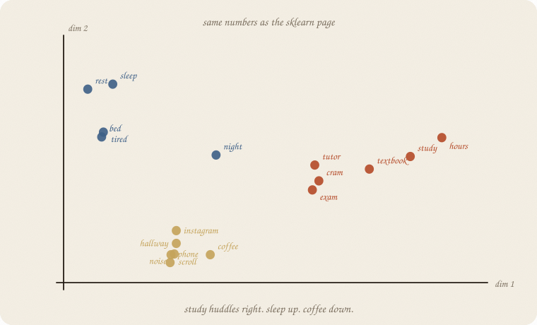
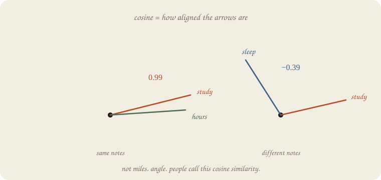
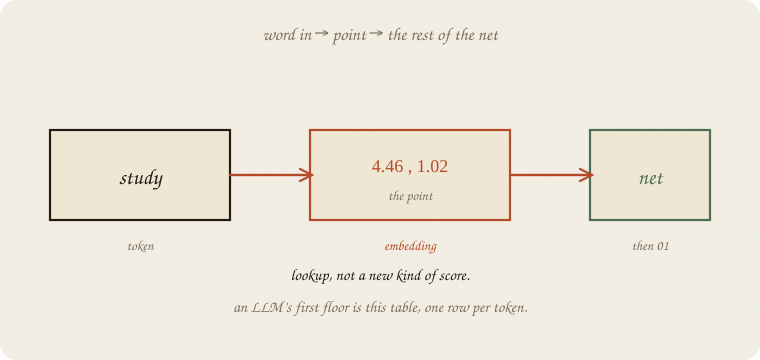
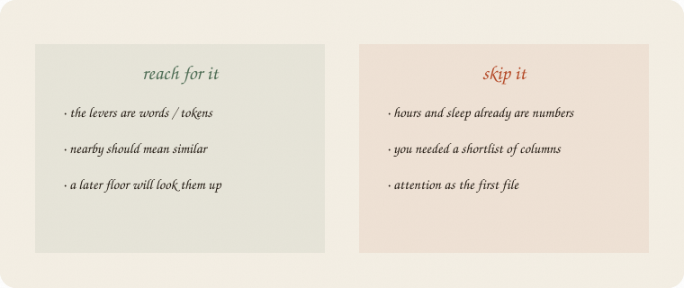

---
tags:
  - sketchbook
  - statistics
  - ml
aliases:
  - Embeddings
  - Embedding Sketchbook
  - word vectors
---

# Embeddings — a sketchbook

> [!abstract] In one sentence
> A word is **a point**. Nearby points kept company in the same notes. The table of points is a **lookup** the rest of the net can read.



Read [[01 neural net]] first. Same exam world. The levers changed species: not hours as a number — **words** in the students’ notes. Softmax ([[03 softmax]]) still waits at the last layer.

This is 02 of the nets wing. Attention is the next room. Not this file.

Flip it like a notebook. One page = one idea. Done.

---

## Page 1 — Hours was already a number

Hours, sleep, tutor: three numbers. The tiny net could score them.

Now the input is a **note**:

> *study hours textbook*

Those are words. A net cannot add “study” to “hours.” It needs a number for each word first.

Same people. Same exam. New object: the **vocabulary**.

---

## Page 2 — One slot each is a dead map

The blunt trick: give every word its own slot. **1** here, **0** everywhere else. People call this **one-hot**.

Seventeen words → seventeen slots. `study` is `[1, 0, 0, …]`. `hours` is `[0, 1, 0, …]`.



They never share a 1. Cosine is **0**. `study` is as far from `hours` as from `coffee`. The map has no neighborhoods. A later floor has nothing to reuse.

One-hot is a dictionary. It is not a cloud.

---

## Page 3 — Put each word on the page

Twenty-seven short notes. Three neighborhoods, on purpose:

- **study** — hours, textbook, tutor, exam, cram
- **rest** — sleep, tired, bed
- **junk** — coffee, phone, scroll

Count how often two words share a note. Then squash that table down to **two** numbers per word (a picture; grown-up tables have hundreds). Nearby on the page means they kept company.



`study` lands at **(4.46, 1.02)**. `hours` at **(5.23, 1.77)** — same huddle. `sleep` is up and left. `coffee` is down. That pair of numbers **is** the embedding.

People call the whole table an **embedding matrix**. One row per word. Lookup, not a new kind of score.

---

## Page 4 — Nearby is an angle

How close is close? Not miles on the paper. **Angle.**

Two arrows from the origin. Same direction → cosine near 1. Right angle → 0. Opposite → negative.



On these notes:

| pair | cosine |
|---|---:|
| study · hours | **0.99** |
| sleep · rest | **0.99** |
| coffee · phone | **0.96** |
| study · sleep | **−0.39** |
| study · coffee | **−0.36** |

One-hot said study · hours = **0**. The cloud says they are almost the same arrow. That is the whole gift.

Nearest to `study`: textbook, tutor, hours. Nearest to `sleep`: rest, tired, night. Pattern, not a definition of “study.”

---

## Page 5 — The first floor is a lookup

A net does not reinvent the point every time. It **looks the row up**.



`study` → (4.46, 1.02) → then [[01 neural net]] does score → squash → …

An LLM’s first floor is this table, one row per **token** (a word-piece, not always a whole word). The rest of the net never sees the letters. It sees the point.

Who writes the table? On this page: the notes did, via a short PCA. Grown-up tables **walk** ([[01 gradient descent]]): leftover from “predict the next word” nudges every row. Same leftover as 01. Different floor.

---

## Page 6 — Mini recipe

1. The levers are **words** (or tokens). Hours already a number? Skip this notebook.
2. Do **not** leave them one-hot if nearby should mean similar.
3. One **point per word**. Dim 2 is for the picture. Real tables are fatter.
4. **Cosine** to ask “who sits near?” Angle, not miles.
5. The net **looks the row up**, then does 01.
6. The table can be frozen (a dictionary) or walked with the leftover.

If you keep only one thing:

> a word is a point. nearby = same notes. lookup, then the net.

---

## Page 7 — Notes → points, in sklearn

Twenty-seven exam notes, house seed 7 (PCA). Count co-occurrence, two dimensions. The printout is the cloud on page 3.

```python
import numpy as np
from sklearn.feature_extraction.text import CountVectorizer
from sklearn.decomposition import PCA
from sklearn.metrics.pairwise import cosine_similarity

notes = [
    "study hours textbook",
    "hours study tutor exam",
    "textbook hours cram",
    "tutor study hours",
    "cram textbook study night",
    "hours textbook tutor",
    "study cram hours exam",
    "tutor textbook hours",
    "exam study textbook",
    "night cram hours",
    "sleep rest tired",
    "rest sleep bed",
    "tired sleep rest night",
    "bed rest sleep",
    "sleep tired bed",
    "rest bed tired",
    "sleep night rest",
    "coffee phone scroll",
    "phone coffee noise",
    "noise hallway coffee",
    "coffee noise hallway",
    "phone scroll coffee",
    "scroll phone instagram",
    "study sleep hours",
    "coffee study hours",
    "tutor sleep rest",
    "night exam coffee",
]

vec = CountVectorizer()
X = vec.fit_transform(notes).toarray()
words = np.array(vec.get_feature_names_out())
C = X.T @ X
np.fill_diagonal(C, 0)

E = PCA(n_components=2, random_state=7).fit_transform(C)
idx = {w: i for i, w in enumerate(words)}
sim = cosine_similarity(E)
oh = np.eye(len(words))

print("notes", X.shape[0], "  words", X.shape[1], "  embed dim 2")
print("one-hot cosine  study·hours", round(float(oh[idx["study"]] @ oh[idx["hours"]]), 2))
print("embed  cosine   study·hours", round(float(sim[idx["study"], idx["hours"]]), 2))
print("embed  cosine   study·sleep", round(float(sim[idx["study"], idx["sleep"]]), 2))
print("embed  cosine   study·coffee", round(float(sim[idx["study"], idx["coffee"]]), 2))
print("embed  cosine   sleep·rest", round(float(sim[idx["sleep"], idx["rest"]]), 2))
print("embed  cosine   coffee·phone", round(float(sim[idx["coffee"], idx["phone"]]), 2))
print("point study ", np.round(E[idx["study"]], 2))
print("point hours ", np.round(E[idx["hours"]], 2))
print("point sleep ", np.round(E[idx["sleep"]], 2))
print("point coffee", np.round(E[idx["coffee"]], 2))
for seed in ("study", "sleep", "coffee"):
    i = idx[seed]
    order = np.argsort(-sim[i])
    parts = [f"{words[j]} {sim[i, j]:.2f}" for j in order if j != i][:3]
    print(f"near {seed:6s}", "  ".join(parts))
```

```
notes 27   words 17   embed dim 2
one-hot cosine  study·hours 0.0
embed  cosine   study·hours 0.99
embed  cosine   study·sleep -0.39
embed  cosine   study·coffee -0.36
embed  cosine   sleep·rest 0.99
embed  cosine   coffee·phone 0.96
point study  [4.46 1.02]
point hours  [5.23 1.77]
point sleep  [-2.8  3.9]
point coffee [-0.42 -2.89]
near study  textbook 1.00  tutor 1.00  hours 0.99
near sleep  rest 0.99  tired 0.93  night 0.93
near coffee phone 0.96  noise 0.96  scroll 0.95
```

One-hot: study and hours share **nothing**. Embed: **0.99**, and they sit at (4.46, 1.02) and (5.23, 1.77) — the huddle on page 3. Sleep is another neighborhood (cosine **−0.39** with study). Coffee’s neighbors are phone, noise, scroll — junk, as written.

PCA on co-occurrence is a **sketch** of the table. Cosines on this page are in that **2-d drawing** — angles can warp. Word2vec and an LLM walk the same idea with leftover, in fatter dimensions. Dim 2 is so we can draw it. Do not ship 2-d as a language model.

---

## Last page — cheat sheet

| word | meaning |
|---|---|
| token | a word, or a word-piece |
| one-hot | one slot per token; no neighbors |
| embedding | the point (a row in the table) |
| cosine | angle between two points |
| lookup | token → row → the rest of the net |
| dim | how fat the point is (2 here; hundreds later) |

**Also called:** point / row = embedding vector · one-hot = dummy encoding · nearby = similar meaning.



### Use / skip

**Reach for it when** the levers are **words / tokens**, nearby should mean similar, and a later floor will look the row up.

**Skip it when** hours and sleep already are numbers ([[01 neural net]] / [[01 logistic regression]]); you needed a **shortlist** of columns ([[03 lasso]]); you wanted attention as the first file.

**Pays you:** words become knobs a net can score. Neighborhoods. The first floor of an LLM without a transformer cartoon.

**Costs you:** dim 2 is a postcard. Co-occurrence ≠ meaning. A table walked on tiny notes will huddle junk with junk and still not know what coffee *is*. Pattern, not a dictionary.

---

*Nets wing, 02. A point per token. Next room: [[03 attention]] — which other tokens matter.*
