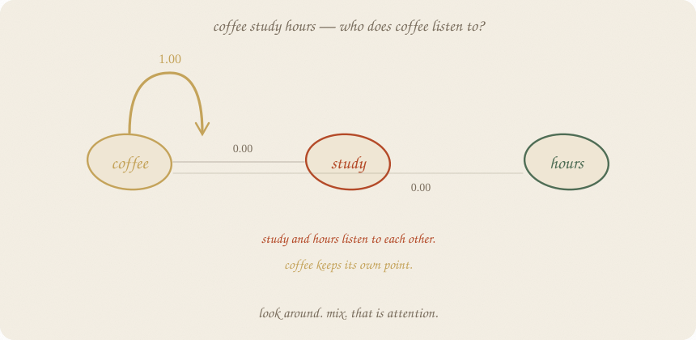
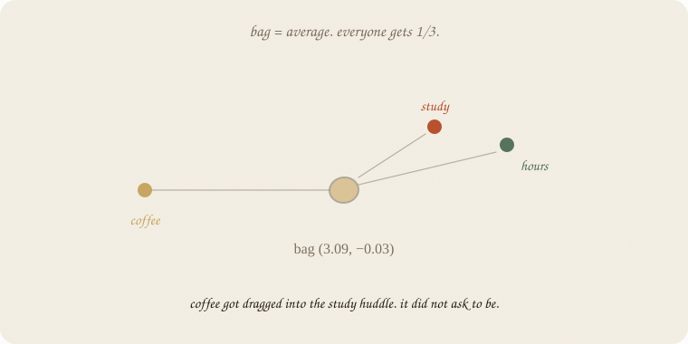
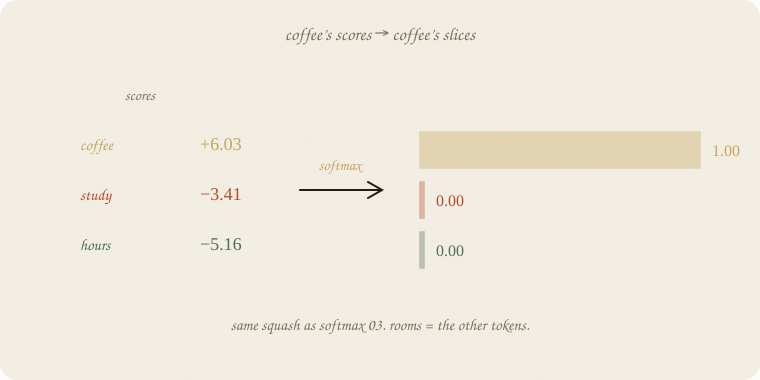
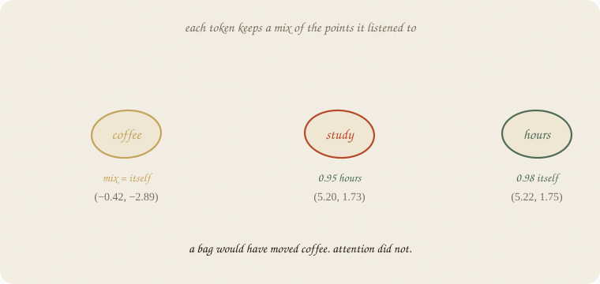
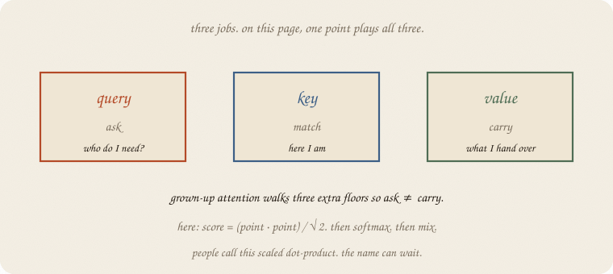
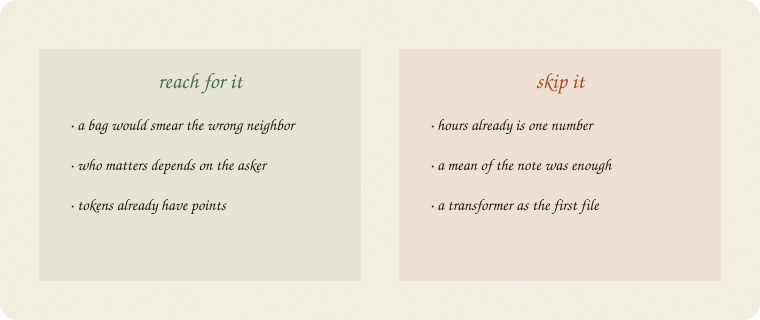

---
tags:
  - sketchbook
  - statistics
  - ml
aliases:
  - Attention
  - Attention Sketchbook
  - self-attention
---

# Attention — a sketchbook

> [!abstract] In one sentence
> Each token **looks around**, softmax-shares 1 across the others, then **mixes** their points. Who matters depends on who is asking.



Read [[02 embeddings]] first. Same exam notes. Same 2-d points. Softmax ([[03 softmax]]) is the sharing. The tiny net ([[01 neural net]]) still waits after the mix.

This look is **all directions** — a postcard of mix. An LLM that predicts the next word must **look left** only (a mask). Positions are extra.

Flip it like a notebook. One page = one idea. Done.

---

## Page 1 — A bag cannot refuse

The note is three words:

> *coffee study hours*

[[02 embeddings]] already put them on the page. Coffee down. Study and hours in the huddle.

A blunt next step: **average the three points.** A bag of words. Everyone gets 1/3, whether they asked or not.



The bag lands at **(3.09, −0.03)** — in the study huddle. Coffee got dragged. It did not ask to be. If the leftover cares about junk, you just erased it.

Attention is the machine that can **refuse**.

---

## Page 2 — Look, then share 1

Coffee asks: *who here is like me?*

Score = how aligned my point is with yours (dot product), quieter by √dim so fat points don’t explode. Then the same squash as [[03 softmax]]: scores in, **slices that add to 1**.



Coffee’s scores: itself **+6.03**, study −3.41, hours −5.16.

Slices: **1.00 , 0.00 , 0.00**.

Study’s slices: 0.00 coffee, 0.05 itself, **0.95 hours**. Hours mostly listens to hours. Same note. Three different questions.

People call the slices **attention weights**. Rooms = the other tokens, not fail / pass / honors.

---

## Page 3 — Mix is a weighted average

Each token keeps a **mix** of the points it listened to.



Coffee’s mix is coffee. Study’s mix slides toward hours (5.20, 1.73). Hours stays hours.

A bag moved coffee. Attention did not. That is the gift. Not “understands coffee.” **Refuses the wrong neighbor.**

The mix is still a point. Then [[01 neural net]] can score → squash as usual.

---

## Page 4 — Ask, match, carry

Three jobs hide in that look:

- **query** — who do I need?
- **key** — here I am
- **value** — what I hand over



On this page, one point plays all three. Grown-up attention walks **three extra floors** so ask ≠ carry. Same leftover, more knobs.

Score = (query · key) / √dim. Softmax. Mix the values. People call this **scaled dot-product**. The name can wait.

Many heads = many looks in parallel (study-vs-junk, grammar, …). Later page. One head is the brick.

---

## Page 5 — Mini recipe

1. Tokens already have **points** ([[02 embeddings]]). Hours as a number? Skip this notebook.
2. Each token **looks** at the others (dot, then /√dim).
3. **Softmax** → slices add to 1. Same squash as 03.
4. **Mix** the points (or the values) with those slices.
5. Then the tiny net. Then leftover walks home.
6. A mean of the note was enough? You stacked a look for sport.

If you keep only one thing:

> look around. share 1. mix. who matters depends on the asker.

---

## Page 6 — Coffee study hours, in numpy

Same 27 notes, same 2-d table as [[02 embeddings]]. One sentence. No sklearn estimator — the look *is* the lesson.

```python
import numpy as np
from sklearn.feature_extraction.text import CountVectorizer
from sklearn.decomposition import PCA

notes = [
    "study hours textbook",
    "hours study tutor exam",
    "textbook hours cram",
    "tutor study hours",
    "cram textbook study night",
    "hours textbook tutor",
    "study cram hours exam",
    "tutor textbook hours",
    "exam study textbook",
    "night cram hours",
    "sleep rest tired",
    "rest sleep bed",
    "tired sleep rest night",
    "bed rest sleep",
    "sleep tired bed",
    "rest bed tired",
    "sleep night rest",
    "coffee phone scroll",
    "phone coffee noise",
    "noise hallway coffee",
    "coffee noise hallway",
    "phone scroll coffee",
    "scroll phone instagram",
    "study sleep hours",
    "coffee study hours",
    "tutor sleep rest",
    "night exam coffee",
]

vec = CountVectorizer()
X = vec.fit_transform(notes).toarray()
words = np.array(vec.get_feature_names_out())
C = X.T @ X
np.fill_diagonal(C, 0)
E = PCA(n_components=2, random_state=7).fit_transform(C)
idx = {w: i for i, w in enumerate(words)}

sent = ["coffee", "study", "hours"]
Xw = np.stack([E[idx[w]] for w in sent])
scale = np.sqrt(Xw.shape[1])
scores = (Xw @ Xw.T) / scale
ex = np.exp(scores - scores.max(1, keepdims=True))
W = ex / ex.sum(1, keepdims=True)
mix = W @ Xw

print("tokens", sent)
print("points")
print(np.round(Xw, 2))
print("bag mean", np.round(Xw.mean(0), 2))
print("weights")
print(np.round(W, 2))
print("mix")
print(np.round(mix, 2))
```

```
tokens ['coffee', 'study', 'hours']
points
[[-0.42 -2.89]
 [ 4.46  1.02]
 [ 5.23  1.77]]
bag mean [ 3.09 -0.03]
weights
[[1.   0.   0.  ]
 [0.   0.05 0.95]
 [0.   0.02 0.98]]
mix
[[-0.42 -2.89]
 [ 5.2   1.73]
 [ 5.22  1.75]]
```

Coffee’s row is **1.00 on coffee**. The mix is still (−0.42, −2.89). The bag had already smeared it to (3.09, −0.03). Study mostly listens to hours (0.95) — same huddle, as [[02 embeddings]] promised (cosine 0.99).

This is **self-attention** with one head and no extra Q/K/V floors. An LLM walks those floors, stacks the block, and softmaxes the next token. The look is already this page.

---

## Last page — cheat sheet

| word | meaning |
|---|---|
| look / score | (query · key) / √dim |
| weights | softmax of the scores; add to 1 |
| mix | weighted average of values |
| query / key / value | ask / match / carry |
| bag | mean of the points; cannot refuse |
| self-attention | tokens looking at **this** note |

**Also called** (in a room):

| here | there |
|---|---|
| look | attention scores |
| mix | weighted average of values |
| bag | mean pooling |



### Use / skip

**Reach for it when**

- a bag would smear the wrong neighbor
- **who matters depends on the asker**
- tokens already have points

**Skip it when**

- hours already is one number ([[01 neural net]])
- a mean of the note was enough
- you wanted a transformer as the first file

**Pays you:** a look that can refuse. The brick inside every transformer. Softmax you already own, pointed at *other tokens*.

**Costs you:** every token looks at every token (n²). Extra Q/K/V knobs. One head on 2-d notes is a postcard. Pattern of looking, not understanding.

---

*Nets wing, 03. Look, share 1, mix. Next room: [[04 LLM]] — this block, stacked, trained on the next token.*
