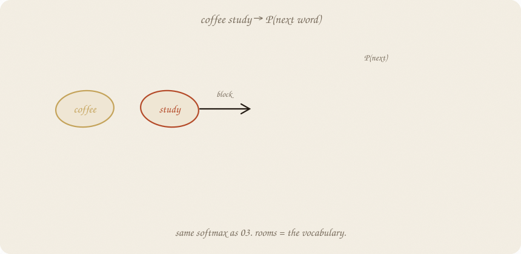
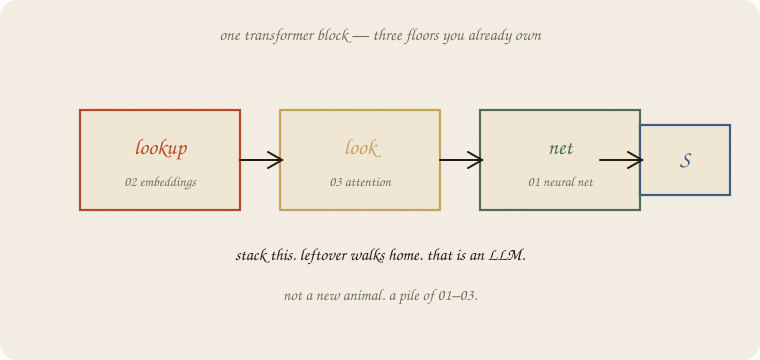
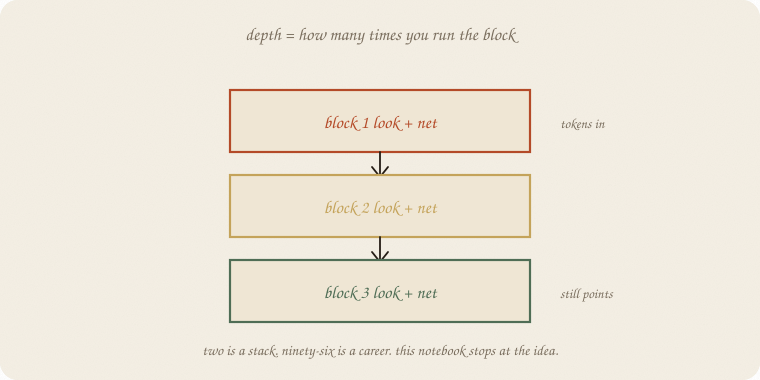
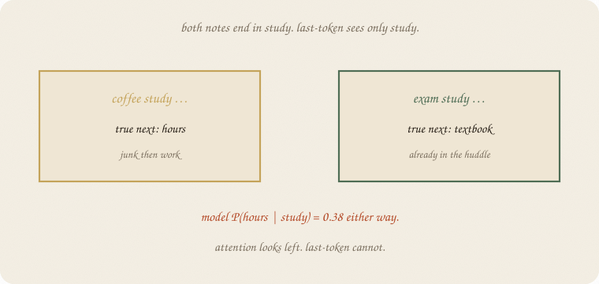
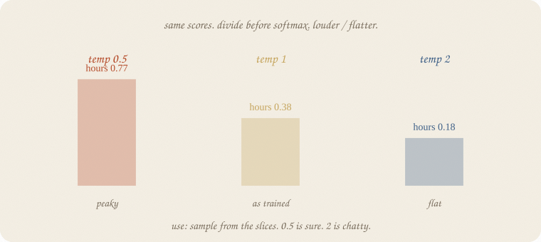
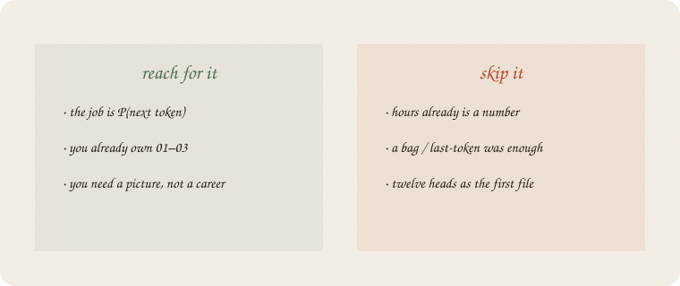

---
tags:
  - sketchbook
  - statistics
  - ml
aliases:
  - LLM
  - LLM Sketchbook
  - transformer
  - language model
---

# LLM — a sketchbook

> [!abstract] In one sentence
> An LLM is **P(next token)**: lookup → look → net, **stacked**, trained by walking downhill, used by sampling the softmax. Not a new animal. A pile of 01–03.



Read [[01 neural net]], [[02 embeddings]], [[03 attention]], and [[03 softmax]] first. Same exam notes. The job changed: not P(pass) — **P(the next word)**.

Flip it like a notebook. One page = one idea. Done.

---

## Page 1 — The job is the next word

The notes are still:

> *coffee study hours*
> *exam study textbook*

An LLM does not “know the exam.” It asks, again and again:

> given the words so far, **what is P(the next one)?**

Rooms = the vocabulary. Seventeen words here. A grown-up list is tens of thousands. Same squash as [[03 softmax]]: scores in, slices that add to 1.

Train: the true next word should get a big slice. Leftover = surprise if that slice was small. **Cross-entropy** = −log P(true token). Same leftover as [[03 softmax]], aimed at the next word. Walk the knobs ([[01 gradient descent]]).

Use: pick the biggest slice, or **sample**. Then glue that word on and ask again.

---

## Page 2 — One block is three floors you own

A **transformer block** is not a fourth machine. It is:

1. **lookup** — word → point ([[02 embeddings]])
2. **look** — each point mixes the others ([[03 attention]])
3. **net** — score → squash → score ([[01 neural net]])

Then softmax over the word-list.



Weight decay is ridge. Dropout is a cousin of bagging. Pages, not wings. The leftover still walks home.

---

## Page 3 — Stack means “run it again”

One block mixes the note once. **Stack** = feed the mix into another look + net.



Two is a stack. Ninety-six is a career. This notebook stops at the idea.

Depth is extra floors, not extra magic. Extra knobs need extra notes, or they memorize *coffee study hours* and shrug on a new sentence.

---

## Page 4 — Last token is a cheap LLM — and it lies

A tiny model: look up the **last** word only, then softmax. No look. No stack.

On these 27 notes, 58 next-word pairs, dim 4, 400 quiet steps:

P(hours | study) = **0.38** — same as counting. P(noise | coffee) = **0.47**, near the count 0.50. Cross-entropy 2.84 → **1.27** (random would sit near ln 17 ≈ 2.83).

It copied the bigram table. Useful. Also blind.



*coffee study* wants **hours**. *exam study* wants **textbook**. Both end in `study`. Last-token sees only `study`, so it cannot split them. **Attention looks left** — a mask so the future cannot leak. The postcard in 03 looked all ways; next-token training cannot. That is why 03 sits under this room.

---

## Page 5 — Temperature is volume on the slices

Same scores. Divide by a number **before** softmax.



After `study`, P(hours):

| temp | P(hours) | pile |
|---:|---:|---|
| 0.5 | **0.77** | peaky, sure |
| 1 | **0.38** | as trained |
| 2 | **0.18** | flatter, chatty |

Use: **sample** from the slices. 0.5 repeats itself. 2 wanders. The scores did not change. You changed how peaky the **pile** is before you draw. Logistic’s 0.5 cut is different: it keeps P and only changes the yes/no call.

Tokenizer, context window, pretrain vs chat: extra pages when a project knocks. Not a second sketchbook.

---

## Page 6 — Mini recipe

1. The job is **P(next token)**. Pass/fail? Go back to [[01 logistic regression]].
2. **Lookup** the words ([[02 embeddings]]).
3. **Look** across the note ([[03 attention]]) — last-token is the cheap skip, and it lies.
4. **Net**, then **softmax** over the vocab.
5. **Stack** the block if one mix is not enough. Stop before a career.
6. Train: leftover = surprise of the true next word. Walk.
7. Use: sample. Temperature is volume.

If you keep only one thing:

> P(next token) = softmax on a stacked look+net. leftover walks home.

---

## Page 7 — Next word after *study*, in numpy

Same 27 notes as [[02 embeddings]]. Last-token model (the cheap LLM). Dim 4. No sklearn estimator — the walk *is* the lesson.

```python
import numpy as np
from collections import Counter, defaultdict

notes = [
    "study hours textbook",
    "hours study tutor exam",
    "textbook hours cram",
    "tutor study hours",
    "cram textbook study night",
    "hours textbook tutor",
    "study cram hours exam",
    "tutor textbook hours",
    "exam study textbook",
    "night cram hours",
    "sleep rest tired",
    "rest sleep bed",
    "tired sleep rest night",
    "bed rest sleep",
    "sleep tired bed",
    "rest bed tired",
    "sleep night rest",
    "coffee phone scroll",
    "phone coffee noise",
    "noise hallway coffee",
    "coffee noise hallway",
    "phone scroll coffee",
    "scroll phone instagram",
    "study sleep hours",
    "coffee study hours",
    "tutor sleep rest",
    "night exam coffee",
]

pairs = []
trigrams = []
for n in notes:
    toks = n.split()
    for i in range(len(toks) - 1):
        pairs.append((toks[i], toks[i + 1]))
    for i in range(len(toks) - 2):
        trigrams.append((toks[i], toks[i + 1], toks[i + 2]))

nxt = defaultdict(list)
for a, b in pairs:
    nxt[a].append(b)

vocab = sorted({w for n in notes for w in n.split()})
stoi = {w: i for i, w in enumerate(vocab)}
V = len(vocab)

rng = np.random.default_rng(7)
D = 4
Emb = rng.normal(0, 0.3, (V, D))
Wout = rng.normal(0, 0.3, (D, V))
bias = np.zeros(V)

def softmax(z):
    z = z - z.max()
    e = np.exp(z)
    return e / e.sum()

xs = np.array([stoi[a] for a, b in pairs])
ys = np.array([stoi[b] for a, b in pairs])
rate, n = 0.4, len(xs)
for step in range(400):
    dE = np.zeros_like(Emb)
    dW = np.zeros_like(Wout)
    db = np.zeros_like(bias)
    loss = 0.0
    for i, j in zip(xs, ys):
        h = Emb[i]
        p = softmax(h @ Wout + bias)
        loss += -np.log(p[j] + 1e-12)
        g = p.copy()
        g[j] -= 1
        dW += np.outer(h, g)
        db += g
        dE[i] += Wout @ g
    Emb -= rate * dE / n
    Wout -= rate * dW / n
    bias -= rate * db / n
    if step in (0, 399):
        print(f"step {step:3d}  ce={loss/n:.3f}")

print("pairs", n, "  vocab", V, "  embed dim", D)

def emp(a, b):
    c = Counter(nxt[a])
    return c[b] / sum(c.values())

def mod(a, b):
    p = softmax(Emb[stoi[a]] @ Wout + bias)
    return float(p[stoi[b]])

print("P(hours | study)     emp", round(emp("study", "hours"), 2), "  model", round(mod("study", "hours"), 2))
print("P(textbook | hours)  emp", round(emp("hours", "textbook"), 2), "  model", round(mod("hours", "textbook"), 2))
print("P(noise | coffee)    emp", round(emp("coffee", "noise"), 2), "  model", round(mod("coffee", "noise"), 2))
print("coffee study → hours notes", sum(1 for a, b, c in trigrams if (a, b, c) == ("coffee", "study", "hours")))
print("exam study → textbook notes", sum(1 for a, b, c in trigrams if (a, b, c) == ("exam", "study", "textbook")))
p = softmax(Emb[stoi["study"]] @ Wout + bias)
print("model P(hours | study)    ", round(float(p[stoi["hours"]]), 2))
print("model P(textbook | study) ", round(float(p[stoi["textbook"]]), 2))
scores = Emb[stoi["study"]] @ Wout + bias
for t in (0.5, 1.0, 2.0):
    pt = softmax(scores / t)
    print(f"temp {t}  P(hours)={pt[stoi['hours']]:.2f}  maxP={pt.max():.2f}")
```

```
step   0  ce=2.844
step 399  ce=1.273
pairs 58   vocab 17   embed dim 4
P(hours | study)     emp 0.38   model 0.38
P(textbook | hours)  emp 0.4   model 0.42
P(noise | coffee)    emp 0.5   model 0.47
coffee study → hours notes 1
exam study → textbook notes 1
model P(hours | study)     0.38
model P(textbook | study)  0.11
temp 0.5  P(hours)=0.77  maxP=0.77
temp 1.0  P(hours)=0.38  maxP=0.38
temp 2.0  P(hours)=0.18  maxP=0.18
```

Start: surprise like a random 17-sided die (2.84 ≈ ln 17). After 400 steps the model **matches the counts** (0.38 / 0.38). It still cannot split *coffee study* from *exam study* — both end in `study`, both get P(hours)=0.38. Temperature only rescales that pile.

A real LLM is this walk with a look and a stack, on a much bigger note pile. The verb did not change.

---

## Last page — cheat sheet

| word | meaning |
|---|---|
| next token | the only job |
| block | lookup + look + net |
| stack | run the block again |
| cross-entropy | surprise of the true next word |
| sample | draw from the slices |
| temperature | volume on the slices — divide scores by T, then softmax |

**Also called** (in a room):

| here | there |
|---|---|
| leftover | cross-entropy |
| look | attention |
| next token | next word / piece |



### Use / skip

**Reach for it when** the job is **P(next token)**, you already own 01–03, and you need a picture of the pile — not a career.

**Skip it when** hours already is a number ([[01 neural net]]); a bag or last-token was enough; you wanted twelve heads as the first file.

**Pays you:** the LLM one-liner without a transformer cartoon. Train = leftover. Use = sample. Stack = more of the same.

**Costs you:** last-token copies bigrams and goes blind. Real stacks are expensive. Sampling is not truth. Pattern of next words, not a mind.

---

*Nets wing, 04. One room. Chance wing still waiting: `inference/01 t-test` after [[01 distributions]].*
