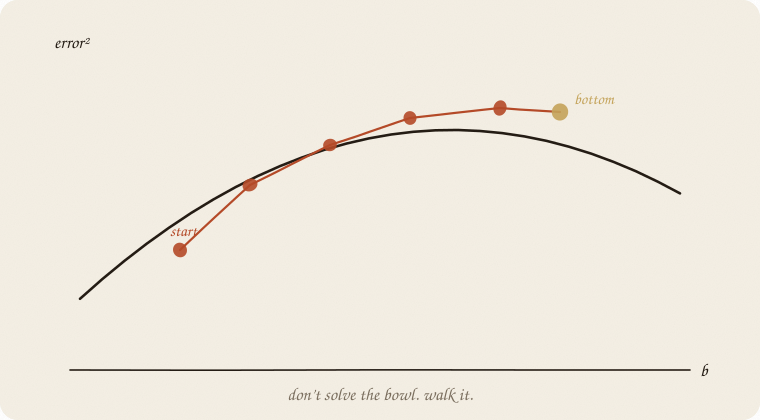
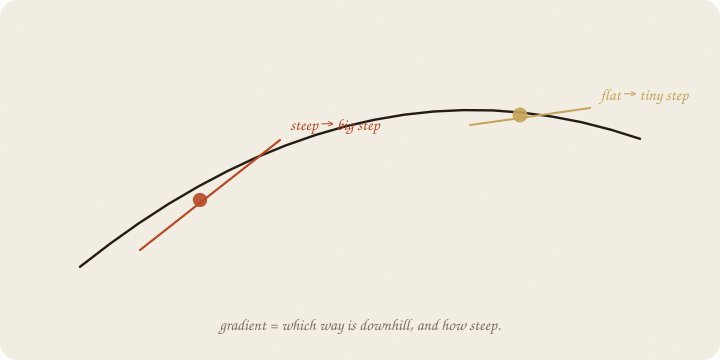
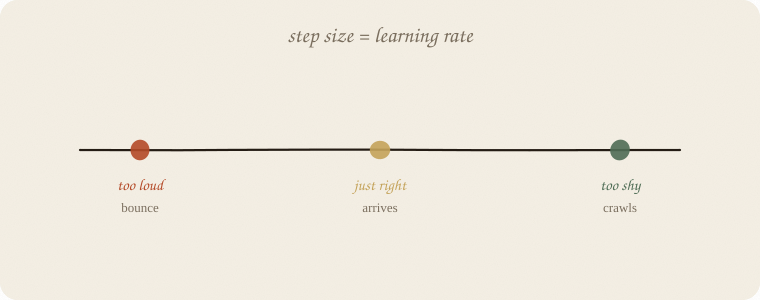

---
tags:
  - sketchbook
  - statistics
  - ml
aliases:
  - Gradient Descent
  - Gradient Descent Sketchbook
---

# Gradient descent — a sketchbook

> [!abstract] In one sentence
> OLS **solved** the bowl. Descent **walks** it: look which way is downhill, take a step, repeat. Step size = learning rate.



Read [[01 linear regression]] first, especially the bowl on page 14. Same eight people. Same line ŷ = a + b · hours. Different verb: **walk** to a and b instead of jumping to the bottom.

This is 01 of the optimization wing. Nets, boosting’s inner loop, “training” — they all walk. LLMs walk this bowl with billions of knobs.

Flip it like a notebook. One page = one idea. Done.

---

## Page 1 — The bowl you already drew

Error² as a function of a and b is a bowl. Least squares sits at the lowest point: **a = 1.75, b = 1** for our eight grades.

For a straight line, you *can* land there in one shot. For a net, you cannot. Too many knobs, no tidy formula. So you **walk**:

1. Stand somewhere (guess a, b).
2. Feel the slope — **which way is downhill, how steep.**
3. Take a step that way.
4. Repeat.

The slope is the **gradient**. Descent = go against it (down).

---

## Page 2 — Gradient is just slope



On a 1-D hill: steep → big step. Flat (near the bottom) → tiny step. You do not jump to the answer. You slide.

With two knobs (a and b) the slope is a pair of numbers: “nudge a this way, b that way.” Same idea. The leftover *y − ŷ* tells you the direction — boosting hunted leftovers by planting a tree; here you hunt them by **moving knobs**.

---

## Page 3 — Learning rate is the volume

You have met this knob in boosting. Here it is the **step size**.

new knob ≈ old knob − (learning rate) × slope



| too loud | just right | too shy |
|---|---|---|
| bounce, or explode | arrives | crawls forever |

On our eight people, rate **0.05**: after 400 steps you are at a ≈ 1.71, b ≈ 1.01 — next to OLS.
Rate **0.2**: after 30 steps a and b are in the billions. The bowl spat you out.

Same word as boosting. Different machine. Still: **quiet steps, more of them.**

---

## Page 4 — Mini recipe

1. Pick a loss (for the line: mean leftover²).
2. Guess knobs.
3. Compute slope of the loss at those knobs.
4. Step downhill, quietly.
5. Stop when the steps get tiny, or you’ve had enough walks.
6. If it explodes, the rate is too loud. If it crawls, too shy.

If you keep only one thing:

> don’t solve the bowl. walk it. rate = how long each stride is.

---

## Page 5 — Eight people, walking, in numpy

Same table as linear regression. Start at a = 0, b = 0. Rate 0.05. No sklearn estimator — the walk *is* the lesson.

```python
import numpy as np
from sklearn.linear_model import LinearRegression

hours = np.array([1, 2, 2, 3, 4, 5, 5, 6], float)
grade = np.array([3, 4, 3, 5, 6, 7, 6, 8], float)

ols = LinearRegression().fit(hours.reshape(-1, 1), grade)
print("OLS  a, b, mse",
      round(ols.intercept_, 3), round(ols.coef_[0], 3),
      round(((ols.predict(hours.reshape(-1, 1)) - grade) ** 2).mean(), 4))

a, b, rate = 0.0, 0.0, 0.05
for step in range(1, 401):
    resid = (a + b * hours) - grade
    a -= rate * resid.mean()
    b -= rate * (resid * hours).mean()
    if step in (1, 10, 50, 100, 200, 400):
        mse = ((a + b * hours - grade) ** 2).mean()
        print(f"step {step:3d}  a={a:.3f}  b={b:.3f}  mse={mse:.4f}")
```

```
OLS  a, b, mse 1.75 1.0 0.1875
step   1  a=0.263  b=1.056  mse=1.8619
step  10  a=0.436  b=1.310  mse=0.5043
step  50  a=0.823  b=1.219  mse=0.3451
step 100  a=1.151  b=1.142  mse=0.2534
step 200  a=1.500  b=1.059  mse=0.1990
step 400  a=1.706  b=1.010  mse=0.1879
```

Walk, don’t jump: 400 quiet steps land next to 1.75 + 1·hours. MSE almost the OLS floor (0.1875). A loud rate (0.2) explodes — do not paste that into production.

SGD later: use **one person** (or a handful) per step instead of all eight. Same downhill, noisier path. Nets need that.

---

## Last page — cheat sheet

| word | meaning |
|---|---|
| bowl / loss | error as a function of knobs |
| gradient | slope: downhill + how steep |
| step | knobs ← knobs − rate × gradient |
| learning rate | stride length |
| OLS | the exact bottom, when it exists |
| SGD | walk on a sample, not the whole class |

### Use / skip

**Reach for it when** there is no closed-form bottom (nets, deep anything). When you want to *see* training as walking.

**Skip it when** one line and OLS already solved it; you only needed a and b once.

**Pays you:** the verb of modern ML. Same rate-knob as boosting. The only way an LLM gets its weights.

**Costs you:** knobs to tune. Can bounce or crawl. Local dips on uglier bowls (later page). Not a new *model* — a way to **fit** one.

---

*Walk wing, 01. Chance wing next door: [[01 distributions]]. Softmax after that. The leftover walking backward: [[01 neural net]].*
