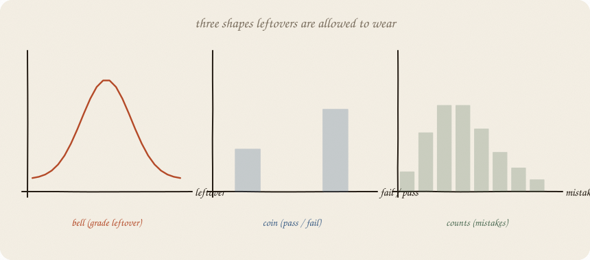
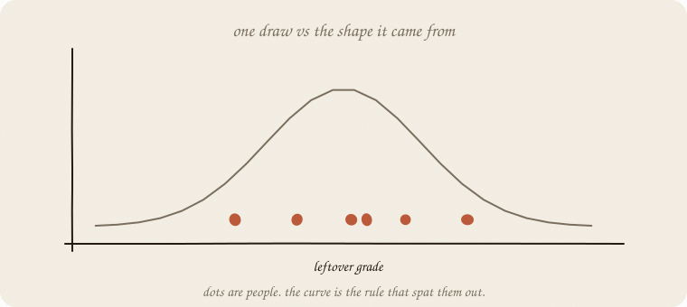
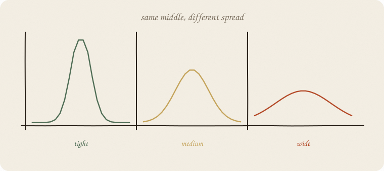

---
tags:
  - sketchbook
  - statistics
  - ml
aliases:
  - Distributions
  - Probability distributions
  - Distributions Sketchbook
---

# Distributions — a sketchbook

> [!abstract] In one sentence
> A distribution is the **shape leftovers are allowed to wear**: a bell, a coin, a pile of counts. Dots are people; the curve is the rule that spat them out.



Read [[01 linear regression]] and [[06 GLM]]. GLM already picked glasses for *y*. This notebook names the **shapes** those glasses assumed — without a 40-curve catalog.

This is 01 of the chance wing. t-tests, CIs, “is this real?” come after. Softmax needs a coin that can have many faces.

Flip it like a notebook. One page = one idea. Done.

---

## Page 1 — The leftover had a costume

Eight grades. Line ŷ = 1.75 + 1 · hours. Leftovers:

`+0.25, +0.25, −0.75, +0.25, +0.25, +0.25, −0.75, +0.25`

Mean **exactly 0** (OLS). Spread about 0.46. They look like a small **bell** around zero — not a coin, not a count.

A **distribution** says: *if I drew another leftover, where would it like to land?* The curve is the rule. The eight numbers are **one sample** from that rule.



You never see the curve in the wild. You see dots. You guess the costume.

---

## Page 2 — Three costumes you already met

| costume | *y* looks like | GLM / model you used |
|---|---|---|
| **bell** (Gaussian) | a number that can sit anywhere, leftovers blob around 0 | ordinary line |
| **coin** (Bernoulli) | yes / no | logistic |
| **counts** (Poisson) | 0, 1, 2, 3… never negative | Poisson GLM, mistakes |

That is enough for a first encyclopedia room. Uniform, exponential, binomial-as-*k*-out-of-*n* — sequels when a project needs the door.

The costume has two usual knobs:

- **center** — where it sits (mean, or P(yes), or mean count)
- **spread** — how fat

For the **bell**, spread is σ (standard deviation). Tight grades vs wild grades.

For the **coin**, there is no extra σ. Fatness is already in **P**: a 50/50 coin rattles most; a 0.95 coin almost always lands yes. Spread = P(1 − P).

For **counts**, mean and spread travel together (Poisson: variance ≈ mean). A busy week of mistakes is also a wild week.



The line’s *b* does not know this. Tests later *do*. The three shapes are the hero drawing — bell, two bars, a pile of 0,1,2,…

---

## Page 3 — Why this wing exists

Without a costume you can still predict. ŷ does not need a last name.

You need a costume when you ask:

- How surprised should I be by a leftover of −0.75?
- Is this *b* distinguishable from noise? (t-test, later)
- May ŷ go negative? (counts say no)
- What is P(class) for *three* rooms? (softmax: a coin with three faces)

GLM was “pick glasses.” This is “name the light those glasses assume.” The **link** ([[06 GLM]]) is the translation (score → ŷ). The **family** is this costume. Identity + bell = the grade line. Logit + coin = logistic. Log + counts = Poisson. Wrong costume → ŷ in a nonsense region, and smug leftover.

---

## Page 4 — Mini recipe

1. Look at *y* (or at leftovers). Number? Coin? Count?
2. Pick a **costume**, not a menu of forty.
3. Name **center** and **spread**. Bell: σ. Coin: P already is the spread. Counts: spread rides with the mean.
4. Remember: dots = sample, curve = rule.
5. Prediction can ignore the costume. **Uncertainty cannot.**

If you keep only one thing:

> distribution = allowed shape of leftover (or of y). bell, coin, counts.

---

## Page 5 — Eight leftovers, in numpy

Same eight people. No extra library.

```python
import numpy as np
from sklearn.linear_model import LinearRegression

hours = np.array([1, 2, 2, 3, 4, 5, 5, 6], float)
grade = np.array([3, 4, 3, 5, 6, 7, 6, 8], float)
line = LinearRegression().fit(hours.reshape(-1, 1), grade)
resid = grade - line.predict(hours.reshape(-1, 1))
print("residuals", np.round(resid, 3))
print("mean", round(resid.mean(), 6), "std", round(resid.std(ddof=1), 3))
```

```
residuals [ 0.25  0.25 -0.75  0.25  0.25  0.25 -0.75  0.25]
mean 0.0 std 0.463
```

Mean 0: OLS. Std ~0.46: the bell’s spread, guessed from eight dots. Two leftovers at −0.75 are the fat tails of a tiny sample — not a new costume.

---

## Last page — cheat sheet

| word | meaning |
|---|---|
| distribution | rule for where a random number likes to land |
| sample | the dots you actually got |
| Gaussian / bell | leftovers of a line |
| Bernoulli / coin | yes / no |
| Poisson / counts | 0, 1, 2, … |
| mean | center |
| std / σ | spread of the **bell** |
| P(1−P) | spread of the **coin** (no extra σ) |

### Use / skip

**Reach for it when** you care how *y* rattles, not only ŷ; before tests; before softmax; when GLM asked “which family?”

**Skip it when** you only wanted a line and a cheat sheet of *b*; when someone hands you a zoo of named curves with no *y* in sight.

**Pays you:** the chance wing’s 01. Unlocks t-tests, CIs, “legal region” for ŷ. Three costumes cover most of this encyclopedia.

**Costs you:** the curve is a guess. Eight dots do not prove a bell. Wrong costume → smug uncertainty (GLM’s cost, again).

---

*Chance wing, 01. The first test: [[01 t-test]]. Many-faced coin: [[03 softmax]]. Walking knobs: [[01 gradient descent]].*
