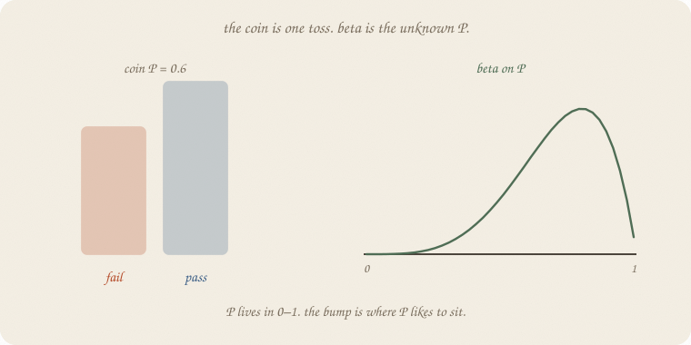
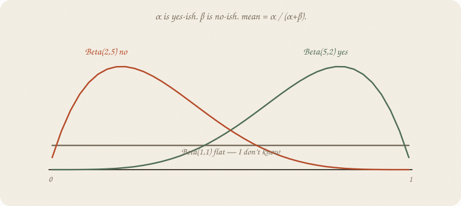
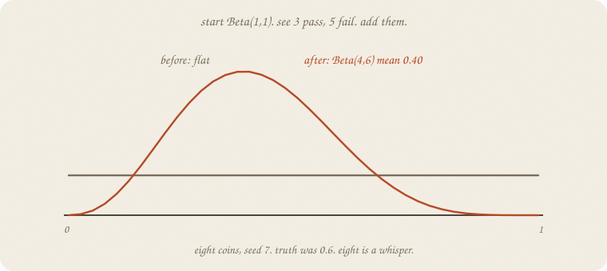
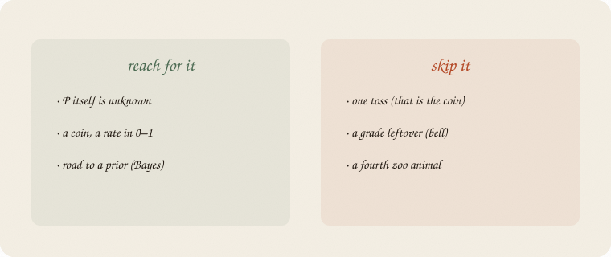

---
tags:
  - sketchbook
  - statistics
  - ml
aliases:
  - Beta
  - Beta distribution
  - Beta Sketchbook
---

# Beta — a sketchbook

> [!abstract] In one sentence
> A **coin** is one toss. **Beta** is a costume for the unknown *P* itself — a bump on 0–1 that starts as a guess and moves when you see yeses and nos.



Read [[01 distributions]] first. Bell, coin, counts. This is the coin’s **cousin**, not a fourth zoo animal. Logistic already used a coin for *one* pass/fail. Beta is what you wear when **P(pass) is the thing you don’t know yet**.

This is 02 of chance. Bayes 01 will put a prior on this bump.

Flip it like a notebook. One page = one idea. Done.

---

## Page 1 — The coin assumed you knew P

A Bernoulli coin: each person passes with probability *P*, or they don’t.

Logistic *estimated* P from hours. Fine.

Sometimes you do not have hours. You have a **rate** you have not seen: next year’s pass rate, a coin you have not flipped, a click rate.

Then *P* itself is the unknown. It lives in **0–1**. A bell can spill below 0. A count costume is for 0, 1, 2, …. Wrong family.

**Beta** is a bump on that stick. Where the bump sits is your guess about *P*. How fat the bump is: how sure.

---

## Page 2 — Two knobs, both counts of pretend tosses

People write Beta(α, β). Ugly. Friendly:

- **α** — yes-ish mass (passers you are willing to imagine — not a real count until you add data)
- **β** — no-ish mass (failers you imagine)

Beta(1, 1) is **flat**: I don’t know. It is not “I already saw one pass and one fail.” After you see tosses, you **add** them. Then the knobs start to look like counts.

Mean = α / (α + β). Always in 0–1. Legal region, built in.



| costume | mean | vibe |
|---|---:|---|
| Beta(1, 1) | 0.50 | **flat** — I don’t know |
| Beta(2, 2) | 0.50 | mild bump in the middle |
| Beta(5, 2) | 0.71 | leans **yes** |
| Beta(2, 5) | 0.29 | leans **no** |

α = 1, β = 1 is the honest shrug. Bigger α + β: same mean, **skinnier** bump. You are more sure.

Not a 40-curve catalog. These four are the interview.

---

## Page 3 — See tosses, add them

Start Beta(1, 1). Flat.

See **3 pass, 5 fail** (eight coins, house seed 7).

Add them: α ← 1 + 3, β ← 1 + 5. Now **Beta(4, 6)**. Mean **0.40**.



The bump slid toward fail. Eight tosses are a whisper. The truth in the machine was 0.6 — we drew a gloomy sample. That is the point: a small pile can look like the wrong coin. The bump is still wide (5% at 0.17, 95% at 0.66). Not a verdict.

Start Beta(2, 2) instead (mild “about half”). Same eight: Beta(5, 7), mean **0.42**. The start still tugs. More tosses, the start matters less.

People call this **conjugate**: beta in, coin data, beta out. Fancy. Job: *add the yeses to α, the nos to β.*

Bayes 01 is this move, named. Not tonight.

---

## Page 4 — Mini recipe

1. Unknown is a **rate in 0–1**, not a leftover, not a count.
2. Pick a start: Beta(1, 1) if you don’t know; lean α or β if you do.
3. **Add** yeses to α, nos to β.
4. Mean = α / (α + β). Fat bump = unsure.
5. Do not treat eight tosses as the true coin.

If you keep only one thing:

> coin = one toss. beta = the unknown P. add the yeses.

---

## Page 5 — Eight coins, in scipy

House seed 7. True P = 0.6. Eight tosses. Flat start, then the add. No sklearn estimator — the bump *is* the lesson.

```python
import numpy as np
from scipy.stats import beta

rng = np.random.default_rng(7)
tosses = rng.binomial(1, 0.6, 8)
yes, no = int(tosses.sum()), int(8 - tosses.sum())
print("tosses", tosses.tolist(), "  yes", yes, "  no", no)

def show(a, b, title):
    d = beta(a, b)
    print(title)
    print(f"  mean {d.mean():.3f}   5% {d.ppf(0.05):.3f}   95% {d.ppf(0.95):.3f}")

show(1, 1, "start  Beta(1,1)")
show(1 + yes, 1 + no, "after  Beta(1+yes, 1+no)")
show(2, 2, "start  Beta(2,2)")
show(2 + yes, 2 + no, "after  Beta(2+yes, 2+no)")
```

```
tosses [0, 0, 0, 1, 1, 0, 1, 0]   yes 3   no 5
start  Beta(1,1)
  mean 0.500   5% 0.050   95% 0.950
after  Beta(1+yes, 1+no)
  mean 0.400   5% 0.169   95% 0.655
start  Beta(2,2)
  mean 0.500   5% 0.135   95% 0.865
after  Beta(2+yes, 2+no)
  mean 0.417   5% 0.200   95% 0.650
```

Three yes, five no. Flat start → mean **0.40**, still a wide stick (0.16 to 0.66). Mild start Beta(2, 2) → **0.42**. Truth was 0.6; eight coins lied a little. `ppf(0.05)` / `ppf(0.95)` are the bump’s shoulders, not a t-test.

---

## Last page — cheat sheet

| word | meaning |
|---|---|
| coin / Bernoulli | one toss, P known or estimated |
| beta | bump on 0–1 for **unknown P** |
| α, β | yes-ish, no-ish mass |
| mean | α / (α + β) |
| Beta(1, 1) | flat — I don’t know |
| add | yeses → α, nos → β |

**Also called** (in a room):

| here | there |
|---|---|
| α, β | pseudo-counts |
| Beta(1,1) | uniform on 0–1 |
| add | conjugate update |



### Use / skip

**Reach for it when** *P* itself is unknown, the thing lives in **0–1**, and you will add yeses and nos. Road to a prior: [[01 prior]].

**Skip it when** one toss is enough (the coin); leftover is a grade (bell); *y* is a count (Poisson).

**Pays you:** a legal bump for a rate. A start you can write in two numbers. The move Bayes will name.

**Costs you:** eight tosses are a whisper. α, β are not “data” until you say they are a guess. Not a sampler. Not a fourth zoo.

---

*Chance 02. Coin’s cousin. Next: [[01 prior]] — this bump, named.*
