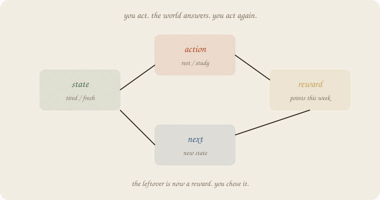
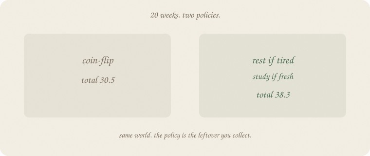
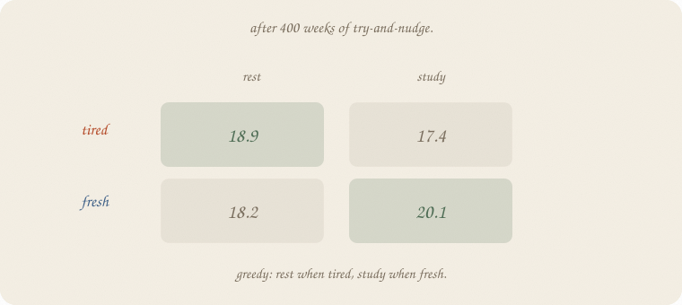
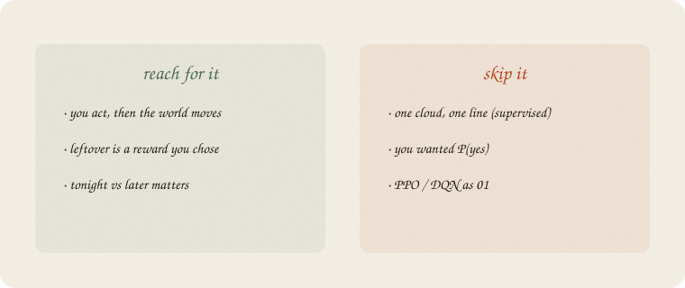

---
tags:
  - sketchbook
  - statistics
  - ml
aliases:
  - RL
  - Reinforcement learning
  - The loop
  - Q-learning
---

# The loop — a sketchbook

> [!abstract] In one sentence
> You are in a **state**, you pick an **action**, the world pays a **reward** and lands you in a **next** state. Then again. The score you collect is **reward**, not leftover.



Read [[01 linear regression]] and [[01 gradient descent]] first. Same exam *world*: study vs rest. Not a cloud of eighty people. A **week**, then the next week. Supervised guessed a grade from hours. This notebook **picks** rest or study, then sees what the week did.

Bandits ([[02 bandits]]) have no next-state. The table, named: [[03 Q]].

Flip it like a notebook. One page = one idea. Done.

---

## Page 1 — The machine changed jobs

Supervised: a pile of people, *x* in, *y* out. The leftover is *y* − ŷ. You did not pick *x*.

Here there is no frozen pile. You **do** something. The world answers. That answer is the next situation.

Four names:

| word | this week |
|---|---|
| **state** | tired or fresh |
| **action** | rest or study |
| **reward** | points this week (how the exam-life paid you) |
| **next** | tired or fresh *after* that |

People call the four-pack a **loop**. The policy is the rule: from this state, which action? The **sum of rewards** is the score — not leftover (*y* − ŷ). Q later treats **target − Q** as the miss ([[03 Q]]).

Cause asked what happens if you *do* the lever ([[01 confounding]]). RL *is* that do(), again and again, and the lever changes the next state.

---

## Page 2 — Two policies, same world

Tired: rest usually makes you fresh (reward ~1). Study while tired pays ~0 and you stay tired.

Fresh: study pays ~3 and often tires you. Rest pays ~0 and you stay fresh.



Twenty weeks, start tired.

| policy | total |
|---|---:|
| coin-flip rest/study | **30.5** |
| rest if tired, study if fresh | **38.3** |

Same world. The **policy** is the leftover you collect. Random still gets some 3s. Sensible banks rest until fresh, then studies.

First six sensible weeks (state, act, reward, next):

`(tired, rest, 0.74, tired)` → rest again → fresh → study 2.65 → tired → …

You can read the loop aloud. That is 01.

---

## Page 3 — A table of “how good”

You do not have to invent the sensible rule. Try, get a reward, **nudge** a table.

Rows = states. Columns = actions. Entry = “from here, this act, then act greedily after — how many points, roughly.” People call that **Q**.

Nudge (quiet, like a learning rate):

> Q(state, act) ← Q + 0.3 × [reward + 0.9 × best Q(next) − Q]

The 0.9 is **later is a bit less than now**. Tomorrow’s 3 is not worth a 3 today. Same volume habit as descent; the leftover is a **target**, not a downhill slope on a bowl.

400 weeks, 20% random tries so you still sample the dull act.



| | rest | study |
|---|---:|---:|
| tired | **18.9** | 17.4 |
| fresh | 18.2 | **20.1** |

Greedy: rest when tired, study when fresh. The table found the policy from page 2.

A table you can screenshot.

---

## Page 4 — Mini recipe

1. Name **state**, **action**, **reward**, **next**. If there is no next, that is [[02 bandits]].
2. A **policy** maps state → action.
3. Run the loop. Total reward is leftover you chose.
4. Optional: a **Q** table, quiet nudge, sometimes try at random.
5. Greedy on Q is a policy.
6. Do not start at a brand.

If you keep only one thing:

> state, action, reward, next. then again.

---

## Page 5 — Twenty weeks, in numpy

Exam loop. Two states, two acts. Random policy and Q share one world. Sensible policy gets a fresh draw of the weeks.

```python
import numpy as np

rng = np.random.default_rng(7)
# 0 tired, 1 fresh   |   0 rest, 1 study

def step(s, a, rng):
    if s == 0 and a == 0:   # tired, rest
        return 1.0 + rng.normal(0, 0.15), 1 if rng.random() < 0.8 else 0
    if s == 0 and a == 1:   # tired, study
        return 0.0 + rng.normal(0, 0.15), 1 if rng.random() < 0.1 else 0
    if s == 1 and a == 0:   # fresh, rest
        return 0.0 + rng.normal(0, 0.15), 1 if rng.random() < 0.9 else 0
    return 3.0 + rng.normal(0, 0.15), 1 if rng.random() < 0.2 else 0  # fresh, study

def run(policy, rng, n=20):
    s, total, hist = 0, 0.0, []
    for _ in range(n):
        a = policy(s)
        r, ns = step(s, a, rng)
        hist.append((int(s), int(a), round(float(r), 2), int(ns)))
        total += r
        s = ns
    return total, hist

rng_r = np.random.default_rng(7)
rng_s = np.random.default_rng(8)
t_r, h_r = run(lambda s: int(rng_r.random() < 0.5), rng_r)
t_s, h_s = run(lambda s: 0 if s == 0 else 1, rng_s)
print("random 20-week total", round(t_r, 2))
print("sensible 20-week total", round(t_s, 2))
print("sensible first 6 (state, act, reward, next)")
for row in h_s[:6]:
    print(" ", row)

rng_q = np.random.default_rng(7)
Q = np.zeros((2, 2))
s = 0
for _ in range(400):
    a = int(rng_q.integers(0, 2)) if rng_q.random() < 0.2 else int(np.argmax(Q[s]))
    r, ns = step(s, a, rng_q)
    Q[s, a] += 0.3 * (r + 0.9 * Q[ns].max() - Q[s, a])
    s = ns
print("Q tired [rest, study]", np.round(Q[0], 2).tolist())
print("Q fresh [rest, study]", np.round(Q[1], 2).tolist())
print("greedy", ["rest" if i == 0 else "study" for i in np.argmax(Q, axis=1)])
```

```
random 20-week total 30.5
sensible 20-week total 38.34
sensible first 6 (state, act, reward, next)
  (0, 0, 0.74, 0)
  (0, 0, 0.8, 1)
  (1, 1, 2.65, 0)
  (0, 0, 0.86, 1)
  (1, 1, 3.14, 0)
  (0, 0, 1.12, 1)
Q tired [rest, study] [18.88, 17.39]
Q fresh [rest, study] [18.15, 20.06]
greedy ['rest', 'study']
```

Coin-flip **30.5**. Sensible **38.3**. Q’s greedy row is rest / study — the same rule. `0.3` is the nudge. `0.9` is “later counts a bit less.” `0.2` is how often you try the other act. No sklearn estimator — the loop *is* the lesson.

---

## Last page — cheat sheet

| word | meaning |
|---|---|
| state | where you are (tired / fresh) |
| action | what you do (rest / study) |
| reward | points this step |
| next | state after the act |
| policy | state → action |
| Q | table of “how good is this act from here” |

**Also called** (in a room):

| here | there |
|---|---|
| loop | MDP step |
| Q | action value |
| 0.9 | discount |
| 0.2 try-at-random | ε-greedy |



### Use / skip

**Reach for it when**

- you **act**
- the world **moves**
- the score is a **reward**
- tonight vs later matters

**Skip it when**

- one cloud and a line already work (supervised)
- you wanted P(yes) ([[01 logistic regression]])

**Pays you:** the four names. A policy you can read. A table that can find it.

**Costs you:** a world-model (or a lot of weeks). Random tries hurt now to learn. Not a grade line. Not a sampler.

---

*The loop. Next: [[02 bandits]] — no next-state. The table, named: [[03 Q]].*
