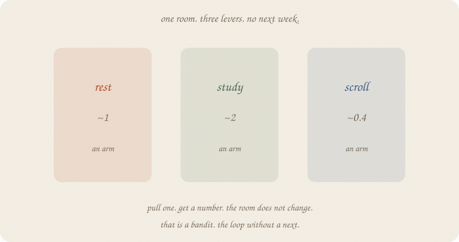
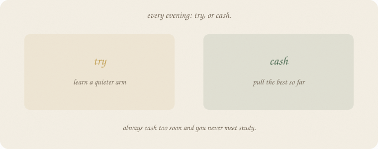
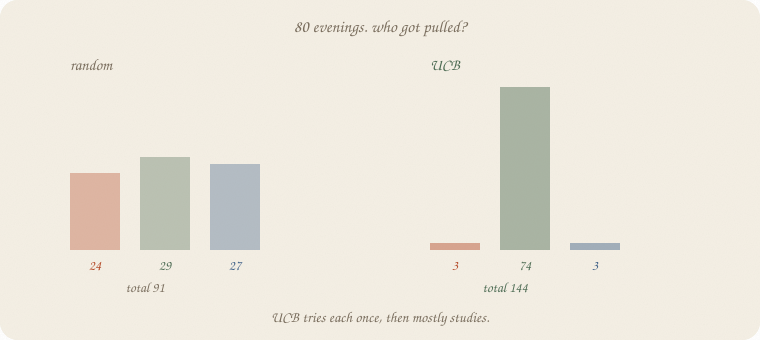
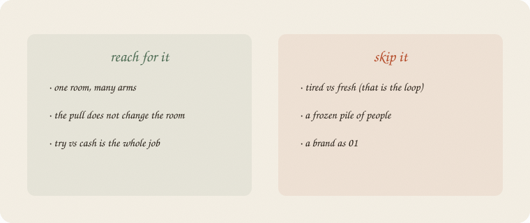

---
tags:
  - sketchbook
  - statistics
  - ml
aliases:
  - Bandits
  - Multi-armed bandit
  - UCB
---

# Bandits — a sketchbook

> [!abstract] In one sentence
> One room, many **arms**. You pull one, get a number, the room does **not** change. Try the unknown or cash the best so far.



Read [[01 the loop]] first. Same exam *world*: an evening, not a cloud of eighty people. The loop had tired / fresh — the act changed **next week**. A bandit has **no next**. You are always in the same room. Only the lever you pull tonight changes.

This is 02 of the act wing. A camera on “no next-state,” not a second textbook. Not a brand.

Flip it like a notebook. One page = one idea. Done.

---

## Page 1 — The next state went away

[[01 the loop]]: state, action, reward, **next**. Rest when tired so tomorrow you can study.

Some jobs have no tomorrow-as-a-new-room. Three evening habits. Every night you pick one. The house is still the house.

| arm | true mean (hidden) |
|---|---:|
| rest | **1.0** |
| study | **2.0** |
| scroll | **0.4** |

You do not know those means. You pull. A noisy number comes back. People call each lever an **arm**. The machine is a **bandit** — one room, many arms.

If pulling study made you tired, you would need the loop. Here it does not. Skip *next*. Keep action and reward.

---

## Page 2 — Try or cash

Every evening two urges:



- **Cash** — pull the arm that looks best so far.
- **Try** — pull one you have barely met, in case it is secretly study.

Always cash too soon and you never meet study. Always try and you waste nights on scroll. The score is the **sum of pulls**. The miss versus always-study (if you had known) is **regret**.

You cannot start by cashing study. You have not met it yet.

---

## Page 3 — Eighty evenings

House seed 7. True means 1.0 / 2.0 / 0.4, leftover 0.6. One pull of each first, then a rule.



| rule | total | rest / study / scroll |
|---|---:|---|
| coin-flip | **91** | 24 / 29 / 27 |
| ε-greedy (15% try) | **141** | 3 / 72 / 5 |
| UCB | **144** | 3 / **74** / 3 |

Oracle if you knew study was best: 2 × 80 = **160**. Random leaves **69** on the table. UCB leaves **16**. It tried each arm once, then mostly studied. Last twelve pulls: study, study, … one peek at scroll, study again.

**UCB** = mean so far + a bonus for *rarely pulled*. Quiet arms look taller until you try them. Then the bonus shrinks. No ε to pick. The bonus *is* the try.

ε-greedy almost tied (141). Same story: try a little, cash a lot. UCB is the bonus spelled out.

---

## Page 4 — Mini recipe

1. **One room.** If the pull changes the room, go back to [[01 the loop]].
2. Name the **arms**. You do not know their means.
3. Pull. Get a number. Update that arm’s average.
4. **Try vs cash.** ε-greedy: sometimes random. UCB: bonus for neglected arms.
5. Regret = what always-best would have paid, minus you. You never see it live — you only see totals.
6. Do not start at a brand.

If you keep only one thing:

> no next. try or cash. the room stays.

---

## Page 5 — Eighty evenings, in numpy

Three arms. True means hidden. House seed 7. Random vs ε-greedy vs UCB. First three pulls: one of each.

```python
import numpy as np

mu = np.array([1.0, 2.0, 0.4])  # rest, study, scroll

def pull(a, rng):
    return mu[a] + rng.normal(0, 0.6)

def run(kind, n=80, seed=7, eps=0.15):
    rng = np.random.default_rng(seed)
    Q, N = np.zeros(3), np.zeros(3)
    total, hist = 0.0, []
    for t in range(1, n + 1):
        if kind == "random":
            a = int(rng.integers(0, 3))
        elif kind == "eps":
            if t <= 3:
                a = t - 1
            elif rng.random() < eps:
                a = int(rng.integers(0, 3))
            else:
                a = int(np.argmax(Q))
        elif kind == "ucb":
            if t <= 3:
                a = t - 1
            else:
                a = int(np.argmax(Q + np.sqrt(2 * np.log(t) / N)))
        r = pull(a, rng)
        N[a] += 1
        Q[a] += (r - Q[a]) / N[a]
        total += r
        hist.append(a)
    return total, Q, N, hist

print("n=80  seed=7")
for kind in ("random", "eps", "ucb"):
    tot, Q, N, hist = run(kind)
    print(f"{kind:8s} total {tot:6.1f}  mean {tot/80:.2f}  "
          f"counts rest/study/scroll {N.astype(int).tolist()}  "
          f"Q {np.round(Q, 2).tolist()}")

tot, Q, N, hist = run("ucb")
print("UCB first 12", hist[:12])
print("UCB last 12", hist[-12:])
```

```
n=80  seed=7
random   total   91.2  mean 1.14  counts rest/study/scroll [24, 29, 27]  Q [1.02, 1.97, 0.36]
eps      total  140.9  mean 1.76  counts rest/study/scroll [3, 72, 5]  Q [1.15, 1.88, 0.47]
ucb      total  143.7  mean 1.80  counts rest/study/scroll [3, 74, 3]  Q [0.43, 1.92, 0.16]
UCB first 12 [0, 1, 2, 1, 1, 0, 1, 1, 1, 1, 1, 1]
UCB last 12 [1, 1, 1, 1, 2, 1, 1, 1, 1, 1, 1, 1]
```

Random shares nights almost equally — Q already *sees* study (~1.97) and still keeps pulling scroll. ε-greedy and UCB cash study. First twelve UCB: rest, study, scroll, then study. Last twelve: almost all study, one scroll peek. `Q` is the running mean of that arm — not the loop’s Q-table (no next). No sklearn estimator. The pulls *are* the lesson.

---

## Last page — cheat sheet

| word | meaning |
|---|---|
| arm | a lever in the one room |
| pull | pick an arm, get a noisy number |
| try | pull a quiet arm on purpose |
| cash | pull the best mean so far |
| regret | oracle-best minus you |
| UCB | mean + bonus for rarely pulled |

**Also called** (in a room):

| here | there |
|---|---|
| bandit | one-state RL |
| arm | action |
| ε-greedy | sometimes random |
| UCB | upper confidence bound |



### Use / skip

**Reach for it when** there is **one room**, many arms, the pull does **not** change the room, and try vs cash is the whole job.

**Skip it when** tired vs fresh matters ([[01 the loop]]); you have a frozen pile of people (supervised); you wanted a brand as 01.

**Pays you:** the try/cash sentence. A rule that finds study without knowing it. Counts you can screenshot.

**Costs you:** no next-state (if the room *does* change, this notebook lies). Random tries cost nights. Regret is a writer’s stick, not a live number.

---

*Act 02. No next. Try or cash. Next: [[03 Q]] — the loop’s table, named. Not a brand.*
