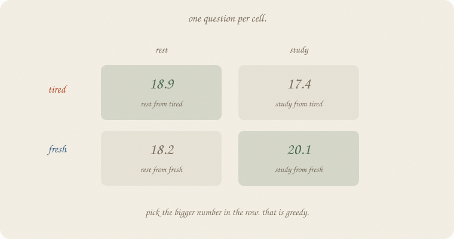
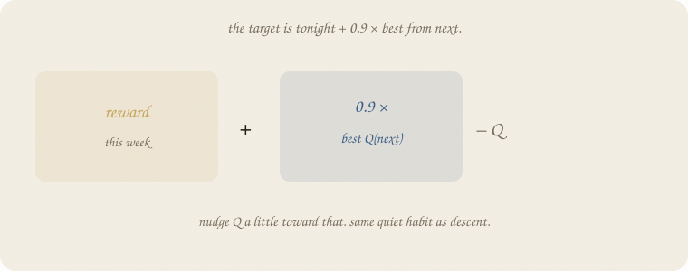
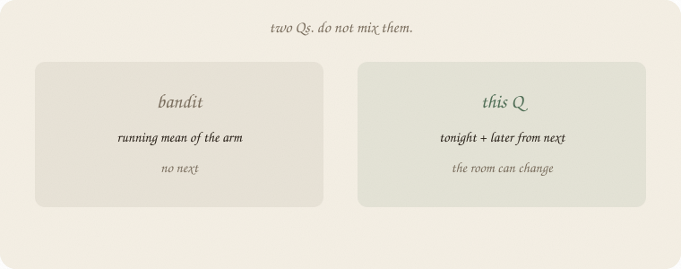

---
tags:
  - sketchbook
  - statistics
  - ml
aliases:
  - Q
  - Q-learning
  - Action value
---

# Q — a sketchbook

> [!abstract] In one sentence
> **Q(state, act)** is one number: from here, if I do this, then act greedily after — how many points from now on, roughly.



Read [[01 the loop]] first. Same exam weeks: tired / fresh, rest / study. Same 400-week table. This notebook *is* that table, named. Not a second loop. Not a bandit mean ([[02 bandits]]).

Flip it like a notebook. One page = one idea. Done.

---

## Page 1 — Four cells, four questions

The loop had a grid. Each cell answers **one** question:

> I am **this** (tired or fresh). I do **that** (rest or study). Then I always pick the bigger cell in the next row. How many points do I expect, from now on?

That number is **Q**. Ugly letter. Friendly job: *how good is this act from here.*

After 400 weeks (from 01):

| | rest | study |
|---|---:|---:|
| tired | **18.9** | 17.4 |
| fresh | 18.2 | **20.1** |

Greedy = bigger number in the **row**. Tired → rest. Fresh → study. The policy is the table with a highlighter.

A bandit’s Q is a **running mean of that arm**. No next room. Do not mix them ([[02 bandits]]).

---

## Page 2 — The leftover is a target

You do not fill Q by thinking. You **nudge**.

Tonight: tired, rest, reward 0.86, next = fresh.

Target = tonight + **0.9 × best Q(fresh)**.



Best Q(fresh) is study, 20.1. Target ≈ 0.86 + 0.9 × 20.1 ≈ **19.0**.

Old Q(tired, rest) was 18.9. Nudge a little toward 19.0:

> Q ← Q + 0.3 × (target − Q)

Same quiet volume as descent. Different job: not sit at a dip — **track a moving target**. The 0.9 is “later counts a bit less.” Without it, infinite rest-study forever would blow up the table.

20% of weeks you pick the **smaller** cell on purpose, so the dull act still gets a number. Otherwise study-from-tired stays a lie you never checked.

---

## Page 3 — Two Qs



| | bandit | this Q |
|---|---|---|
| room | one, forever | tired / fresh |
| number | mean of pulls | tonight + later from **next** |
| try | ε or UCB | ε on the row |

If rest tonight changed nothing but the points, you would average rest. Here rest **changes next week**. That is why the cell is not a mean of 1s. It is 1 plus a discounted life after.

A deep net that *outputs* Q is a later engine. The idea is the table. Not 01.

---

## Page 4 — Mini recipe

1. One cell per (state, act).
2. Target = reward + 0.9 × max Q(next).
3. Nudge Q toward the target. Quiet rate.
4. Sometimes pick the worse act on purpose.
5. Policy = argmax in the row.
6. No next? That average is a bandit, not this Q.

If you keep only one thing:

> Q = from here, this act, points from now on.

---

## Page 5 — The same 400 weeks, in numpy

Same world as [[01 the loop]]. Only print Q.

```python
import numpy as np

rng = np.random.default_rng(7)
# 0 tired, 1 fresh   |   0 rest, 1 study

def step(s, a, rng):
    if s == 0 and a == 0:
        return 1.0 + rng.normal(0, 0.15), 1 if rng.random() < 0.8 else 0
    if s == 0 and a == 1:
        return 0.0 + rng.normal(0, 0.15), 1 if rng.random() < 0.1 else 0
    if s == 1 and a == 0:
        return 0.0 + rng.normal(0, 0.15), 1 if rng.random() < 0.9 else 0
    return 3.0 + rng.normal(0, 0.15), 1 if rng.random() < 0.2 else 0

Q = np.zeros((2, 2))
s = 0
for _ in range(400):
    a = int(rng.integers(0, 2)) if rng.random() < 0.2 else int(np.argmax(Q[s]))
    r, ns = step(s, a, rng)
    Q[s, a] += 0.3 * (r + 0.9 * Q[ns].max() - Q[s, a])
    s = ns

print("Q tired [rest, study]", np.round(Q[0], 2).tolist())
print("Q fresh [rest, study]", np.round(Q[1], 2).tolist())
print("greedy", ["rest" if i == 0 else "study" for i in np.argmax(Q, axis=1)])
print("target example: tired rest, r=0.86, next=fresh →",
      round(0.86 + 0.9 * Q[1].max(), 1))
```

```
Q tired [rest, study] [18.88, 17.39]
Q fresh [rest, study] [18.15, 20.06]
greedy ['rest', 'study']
target example: tired rest, r=0.86, next=fresh → 18.9
```

Same printout as 01. The extra line: one night’s target lands on **18.9** — the cell it is nudging. `0.3` is the stride. `0.9` is later. `0.2` is try. No sklearn. The table *is* the lesson.

---

## Last page — cheat sheet

| word | meaning |
|---|---|
| Q(s, a) | points from now on, this act, then greedy |
| target | r + 0.9 × max Q(next) |
| nudge | Q ← Q + rate × (target − Q) |
| greedy | bigger cell in the row |
| try | pick the smaller cell sometimes |

**Also called** (in a room):

| here | there |
|---|---|
| Q | action value |
| target | TD target |
| rate 0.3 | α |
| 0.9 | γ |
| try 0.2 | ε |


### Use / skip

**Reach for it when**

- you already have the **loop**
- you want a **table** not a brand
- greedy on the row is enough policy

**Skip it when**

- there is no next ([[02 bandits]] — that Q is a mean)
- a frozen pile of people (supervised)

**Pays you:** four readable cells. A policy without inventing one. The same leftover-as-target as 01, named.

**Costs you:** a small world (two states). Random tries. Not a grade. Not a sampler.

---

*The table, named. Next: leftover as a score you chose, then a walk.*
