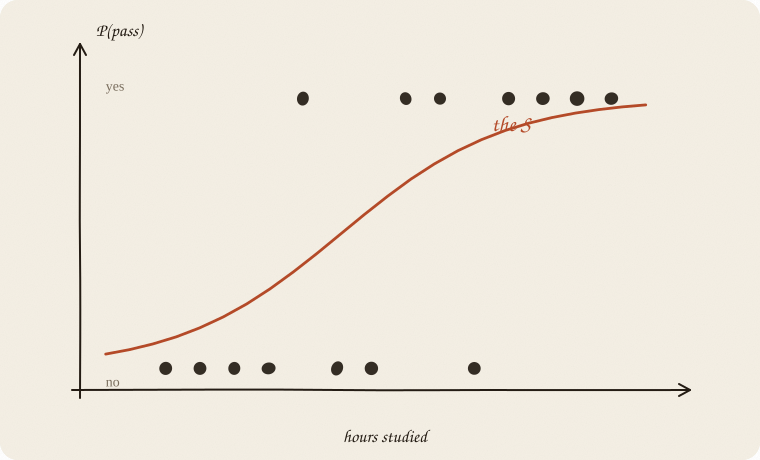
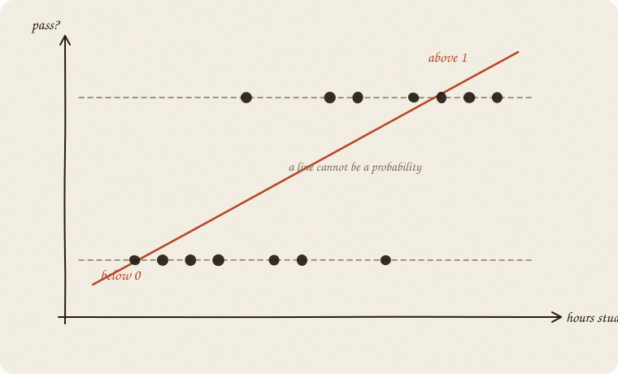
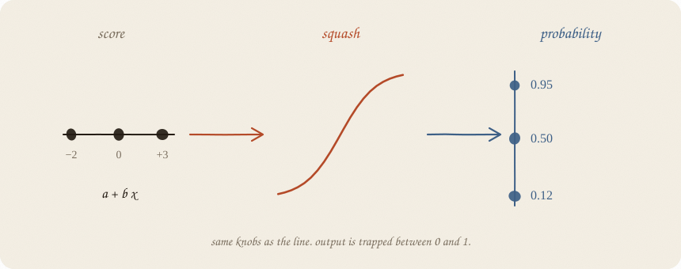
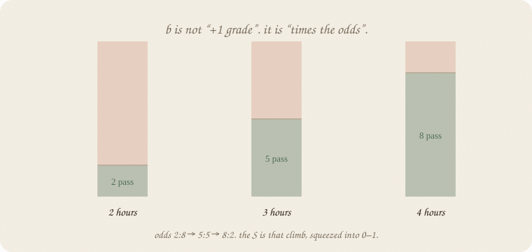
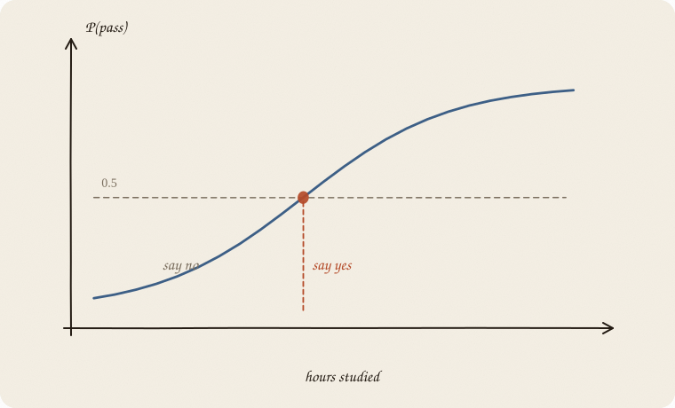

---
tags:
  - sketchbook
  - statistics
  - ml
aliases:
  - Logistic Regression
  - Logistic Regression Sketchbook
  - logistic regression
---

# Logistic regression — a sketchbook

> [!abstract] In one sentence
> Same knobs as the line — **a + b x** — then you **squash** the score into a number between 0 and 1. That number is **P(yes)**.



Read [[01 linear regression]] first. Same hours-and-grades world. Only now *y* is not a grade. *y* is **did they pass?**

Flip it like a notebook. One page = one idea. Done.

---

## Page 1 — Yes or no

The old question: *how does the grade depend on hours?*
The new question: *did they pass the exam?*

Pass is not 4.75. Pass is **yes or no**. 1 or 0.

You still have hours, sleep, a tutor. Same levers. The output changed species.

A straight line will happily say “pass = 1.4” or “pass = −0.2”. Those are not answers. A probability lives in **[0, 1]**. That is the whole problem this sketchbook solves.

One person is 0 or 1. A **share** of yeses — 3 in 10 of this group passed — is the same machine. Still a number in 0–1. Not a free grade.

---

## Page 2 — The line escapes the tracks

Fit an ordinary line to the 0/1 dots anyway. It slices through. Then it keeps going.



Above 1: “more than certainly pass.”
Below 0: “negative chance.”

The line does not know it is talking about a probability. It only knows *up and down*. Wrong tool for this *y*.

---

## Page 3 — Keep the knobs. Squash the output.

You still compute a **score**, the old way:

$$\text{score} = a + b \cdot \text{hours}$$

Then you push it through an S:

$$P(\text{pass}) = \frac{1}{1 + e^{-\text{score}}}$$



Score −2 → probability near 0.
Score 0 → 0.5. Coin flip.
Score +3 → near 1.

Same two knobs. New glasses. The S is called a **sigmoid**. People also say **logistic curve**. The name of this sketchbook.

---

## Page 4 — What *b* means now

On the grade line, *b = 1* meant “+1 hour → +1 grade.” Clean.

Here *b* does **not** mean “+1 hour → +0.2 probability.” The S is not equally steep everywhere. In the middle it is steep. Near 0 and 1 it is almost flat. Extra hours help most when you were on the fence.

What *is* constant is a different count: **how many yeses per no.** People call that the **odds**.

50/50: one yes per no. Odds **1 : 1**.
75/25: three yeses per no. Odds **3 : 1**.

Say 2 hours is 50/50 (odds 1 : 1). One extra hour, if *e^b* = 3: now 3 : 1. That is **75/25**. P only went 0.50 → 0.75. The pile of yeses tripled relative to nos. P did not triple.



Same factor on the odds, every time you add 1 to *x*. Not the same jump in P.

That factor is *e^b*. The name can wait.

If the algebra still feels slippery, keep this instead:

> *b* says how fast the S climbs. Sign says up or down. Size says how dramatic.

---

## Page 5 — A call still needs a threshold

The model gives **P(pass) = 0.64**. That is not yet “pass” or “fail.”

You pick a cut. Classic: 0.5.



Above the cut: say yes. Below: say no.

0.5 is a default, not a law. If missing a pass is costly, you may cut lower and call more people “likely.” The S did not change. **You** changed how brave the call is.

Accuracy on old people can look great and still be a bad cut for the next person. Same humility as R².

---

## Page 6 — Still a line on the inside

Logistic is **not** a free-form curve that wiggles wherever it wants.

The score is still linear. No bend in *x*. No “after 4 hours it stops helping,” unless you add that feature yourself.

If the yes-dots and no-dots are a mixed blob that no tilted S can separate, logistic will shrug politely and give you probabilities near 0.5. Then you want a different shelf (trees, forests).

Logistic = **linear score + squash**. Remember which part is the line.

If two levers are written in different units — hours and minutes — the *b*s are not comparable until you **scale**, same as ridge. One *x* (this notebook): skip it.

---

## Page 7 — Mini recipe

1. **y is yes/no — or a share of yeses in 0–1.** If y is a free grade, go back to [[01 linear regression]].
2. **Same levers.** Hours, sleep, tutor. Score = a + b’s.
3. **Squash** to P(yes).
4. **Read b** as “how the S climbs,” not as “+b probability.”
5. **Pick a cut** if you need a call. 0.5 is a habit, not a truth.
6. **Judge on new people**, and on the probabilities, not only on yes/no hits.

If you keep only one thing:

> line on the inside, S on the outside, output is P(yes).

---

## Page 8 — Hours → pass, in sklearn

Exam world, house seed 7: hours, sleep, tutor. **Eighty** students — a crowd, not the thirty on the ridge page. *y* is pass/fail, not a grade. One lever, no scaler — the S is the lesson, not a fight between hours and minutes. Mixed units: scale first ([[02 ridge regression]], page 10).

```python
import numpy as np
from sklearn.linear_model import LogisticRegression

rng = np.random.default_rng(7)
n = 80
hours = rng.uniform(1, 6, n)
sleep = rng.uniform(4, 9, n)
tutor = (rng.random(n) > 0.6).astype(float)
z = -3.2 + 1.05 * hours + 0.25 * (sleep - 6.5) + 0.7 * tutor
passed = (rng.random(n) < 1 / (1 + np.exp(-z))).astype(int)

m = LogisticRegression().fit(hours.reshape(-1, 1), passed)
print(f"score = {m.intercept_[0]:.2f} + {m.coef_[0, 0]:.2f} · hours")
print("P(pass | 3 hours) =", round(m.predict_proba([[3]])[0, 1], 2))
print("P(pass | 5 hours) =", round(m.predict_proba([[5]])[0, 1], 2))
print("accuracy on these 80 =", round(m.score(hours.reshape(-1, 1), passed), 3))
```

```
score = -4.29 + 1.62 · hours
P(pass | 3 hours) = 0.64
P(pass | 5 hours) = 0.98
accuracy on these 80 = 0.838
```

Three hours: still a coin with a lean (0.64). Five hours: almost sure (0.98). The S climbed. Accuracy 0.84 is on *these* people — pride, like R² without a split. Pass is common here, so always-fail would look *worse*. When yes is rare, accuracy can clap for always-fail ([[03 metrics]]).

`predict_proba` is the S. `predict` is the 0.5 cut. Do not copy this unscaled one-column fit onto hours *and* minutes. The inside is still a line; size of a knob starts to matter.

---

## Last page — cheat sheet

| symbol | meaning |
|---|---|
| score = a + b x | the old line, still inside |
| P = 1 / (1 + e^(−score)) | the squash |
| y | 0/1 for one person, or a share of yeses |
| P | probability of yes |
| b | steepness of the S (log-odds) |
| 0.5 | default cut, not sacred |
| sigmoid / logit | names for the squash / its inverse |

**Also called** (in a room):

| here | there |
|---|---|
| squash | sigmoid |
| score | logit |
| S | logistic curve |

### Use / skip

**Reach for it when** *y* is yes/no (or a fraction of yeses), you want a **probability**, and a linear score inside is honest enough.

**Skip it when** *y* is a free number (that is [[01 linear regression]]); the yes/no cloud is a blob no S can cut ([[01 decision tree]]); the story is two ovals ([[02 LDA]]); you need a guaranteed 0 or 1 with no “maybe.”

**Pays you:** output stays in 0–1. Knobs stay readable. Fast, stable, a good first classifier.

**Costs you:** still linear on the inside. A threshold is extra politics. Rare events and tangled *x* need extra care (or a sequel with a tax). Levers in different units: **scale**, like ridge. This page did not.

---

*First spine on the classification shelf. Twin that draws the clouds: [[02 LDA]]. Many rooms, share 1: [[03 softmax]]. A fence, not an S: [[04 SVM]]. A boundary made of questions: [[01 decision tree]]. If *y* is a count: [[06 GLM]].*
