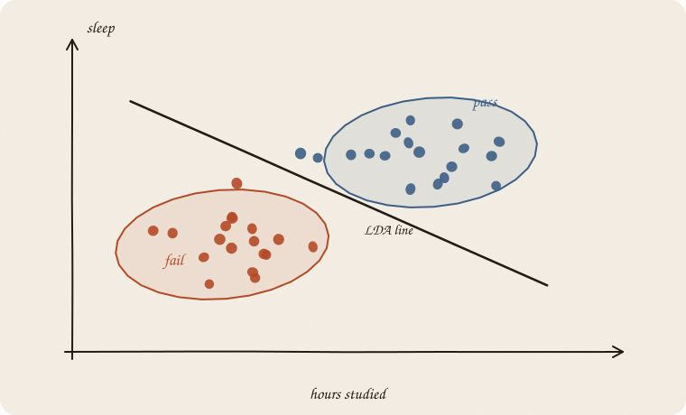
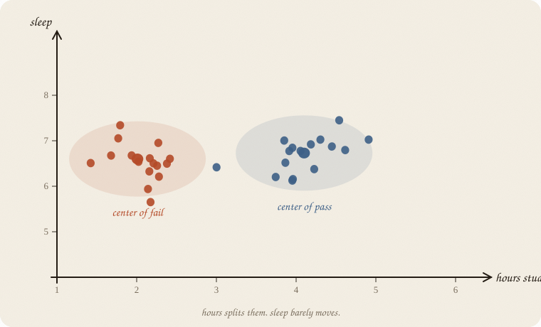
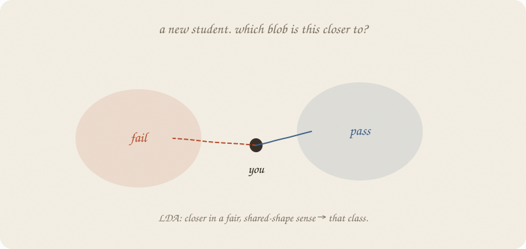
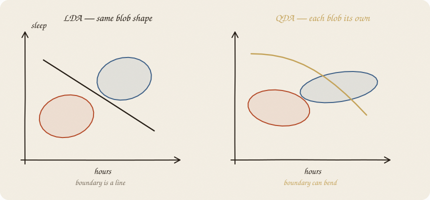
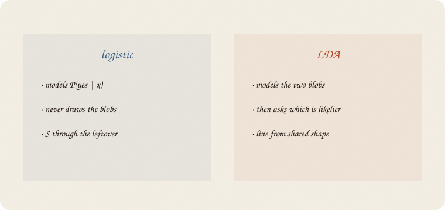

---
tags:
  - sketchbook
  - statistics
  - ml
aliases:
  - LDA
  - QDA
  - Linear Discriminant Analysis
  - Quadratic Discriminant Analysis
  - LDA Sketchbook
---

# LDA — a sketchbook (QDA at the back)

> [!abstract] In one sentence
> Draw **two blobs** (fail / pass). A new person is whoever’s blob they sit in. Same blob-shape → a **line** (LDA). Each blob its own shape → a **curve** (QDA).



Read [[01 logistic regression]] first. Same exam. Same hours and sleep. Different religion: logistic never drew the clouds. LDA **starts** with the clouds.

Flip it like a notebook. One page = one idea. Done.

---

## Page 1 — You already classify. You modeled P(yes).

Logistic asked: *given these hours, what’s P(pass)?* Then a cut.

LDA asks a ruder, older question:

> If passers look like **this oval**, and failers look like **that oval**, which oval is this new student closer to?

Same *y*: pass / fail.
Same levers: hours, sleep.
Different object: **the two clouds**, not the S.

You did not miss this as a foundation. You missed a twin. Logistic can live without it. This notebook is the twin.

---

## Page 2 — Two blobs with centers

Imagine the scatter: hours vs sleep. Failers clump left. Passers clump right. Each clump has a **center** (the average failer, the average passer).



On our eighty students (seed 7, same world as logistic), the fitted centers are roughly:

| | hours | sleep |
|---|---:|---:|
| fail | 2.0 | 6.6 |
| pass | 4.1 | 6.7 |

Sleep barely moves. Hours does the separating. The picture is already a story: *passers studied more; they did not sleep more.*

---

## Page 3 — A new student is a question

Someone walks in: 3 hours, 7 of sleep. Not in the old cloud.



LDA: measure how close they are to each center, **in a fair way** that knows the blob is oval, not a circle (hours and sleep may stretch differently, even lean together). Then pick the nearer blob.

“Fair way” is the Mahalanobis distance if you want the name later. For now: *not raw Euclidean if the oval is a sausage.*

If the two blobs have the **same sausage shape**, the set of points equally close to both centers is a **straight line**. That line is LDA.

---

## Page 4 — Shared shape → line. Own shape → curve.

**LDA** (linear): one shared oval for both classes. Boundary = a line.

**QDA** (quadratic): each class gets its own oval — failers maybe tall and thin, passers wide. Boundary **bends**.



QDA is the first gentle *curve* in this series that is not a kernel and not a tree. It is still “two Gaussians fighting.” Only the fight is allowed to be unfair in shape.

Name cheat:

- **L** = linear boundary
- **Q** = quadratic boundary
- **DA** = discriminant analysis = *decide by comparing blobs*

---

## Page 5 — Logistic never drew the blobs



| | logistic | LDA |
|---|---|---|
| models | P(pass \| x) | the two clouds, then P(cloud \| x) |
| blobs | never drawn | the whole point |
| boundary | a line (in score-land, an S) | a line, if shapes are shared |
| extra assumption | linear score | Gaussian ovals, same shape |

On the same eighty people, hours+sleep, they almost agree:

- LDA test accuracy **0.875**
- logistic test accuracy **0.875**
- knobs even rhyme: LDA hours 1.94, logistic hours 1.69

When the blobs really are ovals, LDA and logistic are cousins. When they are not, logistic often shrugs more politely — it never promised a Gaussian.

QDA is the one that **can** leave logistic behind, if the ovals truly differ. It can also overfit: two full shapes, less data.

---

## Page 6 — Mini recipe

1. **y is a class.** Pass / fail. (More classes: more blobs.)
2. **Draw the clouds** in your head. Ovals? Same shape?
3. **Same shape → LDA** (line). **Different → QDA** (curve).
4. **A new point:** which center, in the oval metric?
5. **Compare to logistic** on hidden people. If they tie, prefer the story you believe (S vs blobs).
6. **Do not** treat the line as cause. Same sermon.

If you keep only one thing:

> logistic models the S. LDA models two blobs. Same exam, different religion.

---

## Page 7 — Two blobs, in sklearn

Same eighty students as logistic. *y* = pass. Features = hours, sleep. House seed 7. Split 70/30.

```python
import numpy as np
from sklearn.discriminant_analysis import (
    LinearDiscriminantAnalysis,
    QuadraticDiscriminantAnalysis,
)
from sklearn.linear_model import LogisticRegression
from sklearn.model_selection import train_test_split

rng = np.random.default_rng(7)
n = 80
hours = rng.uniform(1, 6, n)
sleep = rng.uniform(4, 9, n)
tutor = (rng.random(n) > 0.6).astype(float)
z = -3.2 + 1.05 * hours + 0.25 * (sleep - 6.5) + 0.7 * tutor
passed = (rng.random(n) < 1 / (1 + np.exp(-z))).astype(int)

X = np.column_stack([hours, sleep])
Xtr, Xte, ytr, yte = train_test_split(X, passed, test_size=0.3, random_state=0)

lda = LinearDiscriminantAnalysis().fit(Xtr, ytr)
qda = QuadraticDiscriminantAnalysis().fit(Xtr, ytr)
log = LogisticRegression().fit(Xtr, ytr)

print("LDA means (fail, then pass):")
print(np.round(lda.means_, 2))
print("LDA  P(pass | 2h, 5s) =", round(lda.predict_proba([[2, 5]])[0, 1], 2))
print("LDA  P(pass | 5h, 8s) =", round(lda.predict_proba([[5, 8]])[0, 1], 2))
print("acc  LDA train/test ", round(lda.score(Xtr, ytr), 3), round(lda.score(Xte, yte), 3))
print("acc  QDA train/test ", round(qda.score(Xtr, ytr), 3), round(qda.score(Xte, yte), 3))
print("acc  log train/test ", round(log.score(Xtr, ytr), 3), round(log.score(Xte, yte), 3))
```

```
LDA means (fail, then pass):
[[2.01 6.6 ]
 [4.1  6.73]]
LDA  P(pass | 2h, 5s) = 0.11
LDA  P(pass | 5h, 8s) = 0.99
acc  LDA train/test  0.857 0.875
acc  QDA train/test  0.821 0.875
acc  log train/test  0.857 0.875
```

Fail center: ~2 hours. Pass center: ~4 hours. Sleep almost tied.
2 hours + 5 sleep → P(pass) 0.11. 5 hours + 8 sleep → 0.99.
On this split, LDA, QDA, and logistic **tie on the test set**. QDA is a hair worse on train — not a miracle curve today. The blobs did not need different shapes.

---

## Last page — cheat sheet

| word | meaning |
|---|---|
| blob / oval | Gaussian cloud of one class |
| center | class mean |
| LDA | shared shape → straight boundary |
| QDA | own shapes → curved boundary |
| logistic | S, no blobs |

### Use / skip

**Reach for LDA when** classes look like ovals of **one** shape, you have modest *n*, maybe several *x*, and a straight boundary is enough. Often a cousin of logistic, with a blob story.

**Reach for QDA when** the ovals clearly differ and you want a **first curve** without kernels or trees. Still Gaussian.

**Skip both when** the clouds are bananas, not ovals; one class has 8 people and 40 *x* (QDA will melt); you only wanted P(yes) and a line (stay with [[01 logistic regression]]); mixes and thresholds matter more than ovals ([[01 decision tree]]).

**Pays you:** a picture of two clouds. LDA is stable. QDA is the cheapest bent boundary in the house.

**Costs you:** Gaussian faith. QDA eats data. A tie with logistic is common — then the extra religion did not pay rent.

---

*Twin of logistic, not its parent. Next, a boundary made of questions: [[01 decision tree]].*
