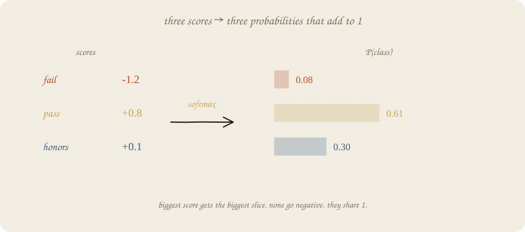
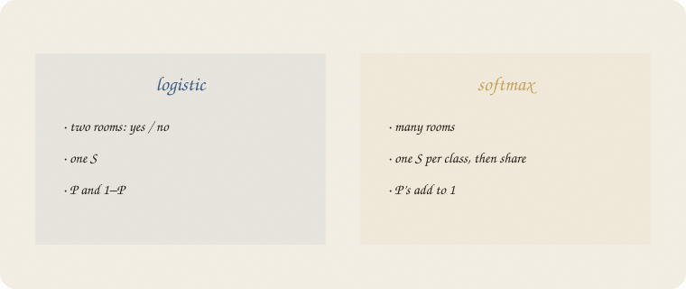
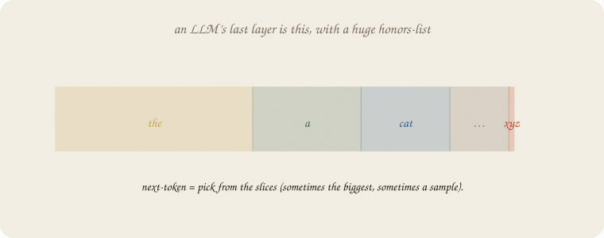

---
tags:
  - sketchbook
  - statistics
  - ml
aliases:
  - Softmax
  - Softmax Sketchbook
  - multinomial logistic
---

# Softmax — a sketchbook

> [!abstract] In one sentence
> Logistic was P(yes) vs P(no). Softmax is **P(each room)** when there are **three or more exclusive rooms**. Scores in → slices that add to 1.



Read [[01 logistic regression]] and [[01 distributions]]. Coin with two faces → coin with many faces. Same exam world: now fail / pass / **honors**.

Flip it like a notebook. One page = one idea. Done.

---

## Page 1 — Two rooms were easy

Logistic: one score, one S, P(pass) and 1 − that.

Three rooms cannot share one S. Fail, pass, honors: you need **three scores**, then a way to turn them into three probabilities that **add to 1** and never go negative.

That squash is **softmax**. Ugly name. Friendly job: *biggest score gets the biggest slice; everyone shares 1.*



---

## Page 2 — Scores in, slices out

Example scores: fail −1.2, pass +0.8, honors +0.1.

Exponentiate (so nothing is negative), then divide by the total:

P = [0.08, 0.61, 0.30]  —  pass takes the pile.


Each class still has a **linear score** inside (a + b · hours), like logistic. Softmax is only the **sharing**.

*b* now: extra hours **lift honors relative to fail**. You read *which room gets more of the pile*, not “+b probability.”

---

## Page 3 — Surprise of the true room

Train: the **true** room should get a big slice. If honors was true and P(honors) = 0.10, that is a nasty surprise. If it was 0.60, a smaller one. People call that leftover **cross-entropy** — surprise of the true room, −log P(true). Formula lives with next-token: [[04 LLM]]. Tree entropy measured mix in a room. Here surprise is *aimed at the true room*.



A language model is the same squash over a huge room-list (next words). Bookmark, not this notebook: [[04 LLM]].

Use: pick the biggest slice, or **sample**. Temperature later. The machine is already this one.

---

## Page 4 — Mini recipe

1. *y* has **3+ exclusive** rooms (not overlapping tags).
2. One linear score per room.
3. Softmax → P’s add to 1.
4. Read *b* as “this lever feeds that room.”
5. Two rooms only? Logistic is enough (softmax with two rooms *is* logistic).
6. LLM last layer: same machine, later shelf.

If you keep only one thing:

> many scores, share 1. last layer of an LLM.

---

## Page 5 — Fail / pass / honors, in sklearn

Eighty students, house seed 7. Same exam *hours*, not ridge’s thirty graders. *y* has three rooms, driven by hours. `LogisticRegression` with 3 classes **is** softmax (multinomial).

```python
import numpy as np
from sklearn.linear_model import LogisticRegression
from sklearn.model_selection import train_test_split

rng = np.random.default_rng(7)
n = 80
hours = rng.uniform(1, 6, n)
logits = np.stack([2.0 - 0.9 * hours, 0.2 + 0.1 * hours, -2.5 + 0.85 * hours], axis=1)
ex = np.exp(logits - logits.max(1, keepdims=True))
p = ex / ex.sum(1, keepdims=True)
y = np.array([rng.choice(3, p=pp) for pp in p])  # 0 fail, 1 pass, 2 honors

Xtr, Xte, ytr, yte = train_test_split(hours.reshape(-1, 1), y, test_size=0.3, random_state=0)
clf = LogisticRegression().fit(Xtr, ytr)
print("counts fail/pass/honors", np.bincount(y, minlength=3))
print("acc train/test", round(clf.score(Xtr, ytr), 3), round(clf.score(Xte, yte), 3))
print("coef hours [fail, pass, honors]", np.round(clf.coef_[:, 0], 3))
print("P | 2h", np.round(clf.predict_proba([[2]])[0], 3))
print("P | 5h", np.round(clf.predict_proba([[5]])[0], 3))
```

```
counts fail/pass/honors [15 26 39]
acc train/test 0.536 0.542
coef hours [fail, pass, honors] [-0.941  0.259  0.682]
P | 2h [0.31  0.426 0.263]
P | 5h [0.006 0.311 0.683]
```

Hours up: fail’s *b* negative, honors positive. At 2 hours the pile is mixed; at 5 hours **honors 0.68**, fail almost gone. Accuracy ~0.54 is not a scandal — three rooms, one lever, overlapping S-shapes. The *pile* is the point, not a 90% trophy.

`predict_proba` is the slices. `predict` is argmax (biggest room).

---

## Last page — cheat sheet

| word | meaning |
|---|---|
| score (logit) | a + b x, one per room |
| softmax | exp(score) / sum exp → P’s add to 1 |
| logistic | softmax with two rooms |
| cross-entropy | surprise of the true room |
| vocab | LLM: rooms = next tokens |

### Use / skip

**Reach for it when** *y* has 3+ exclusive rooms; last layer of a net; you want P(room), not one S.

**Skip it when** yes/no only ([[01 logistic regression]]); labels can overlap (multi-label is another machine).

**Pays you:** the many-class S. The LLM one-liner without a transformer cartoon.

**Costs you:** still linear scores inside (until a net). Argmax hides uncertainty. Three-way accuracy looks “low” even when the pile is honest.

---

*Classification 03. Descent: [[01 gradient descent]]. Costumes: [[01 distributions]]. The hidden floor: [[01 neural net]].*
