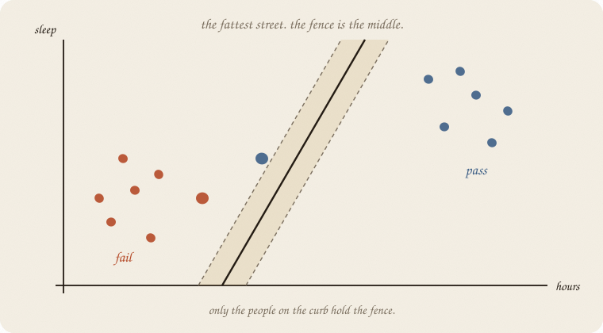
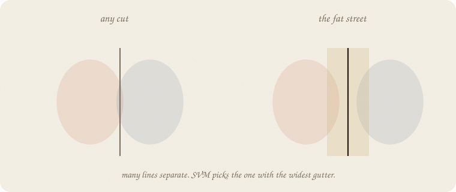
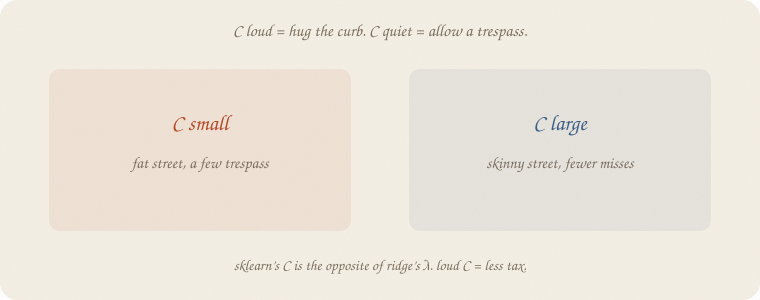
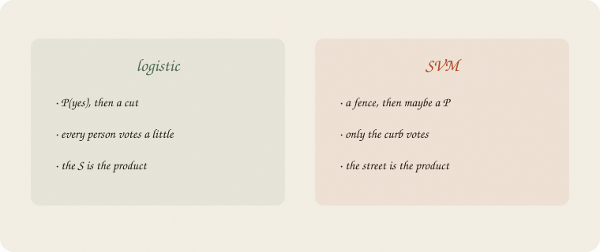
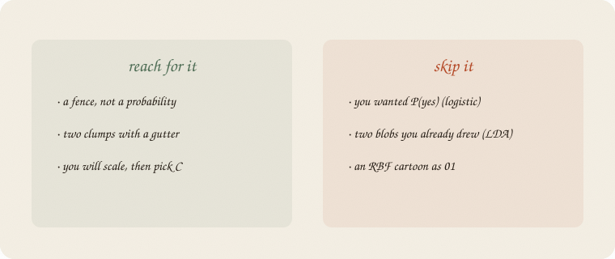

---
tags:
  - sketchbook
  - statistics
  - ml
aliases:
  - SVM
  - Support vector machine
  - Margin
  - Support Vector Machine
---

# SVM — a sketchbook

> [!abstract] In one sentence
> Draw the **fattest street** between fail and pass. The fence is the middle of that street. Only the people on the curb hold it.



Read [[01 logistic regression]] and [[02 LDA]] first. Same exam. Same hours and sleep. Logistic wanted **P(yes)**. LDA drew two blobs. This notebook wants a **fence**, and the widest gutter it can get.

---

## Page 1 — A cut is not enough

Logistic: score, squash, P(pass), then a 0.5 cut. The cut is extra politics ([[03 metrics]]).

LDA: two ovals. The set of points equally close to both centers is a **line**.

Many lines separate fail from pass. Some graze a passer. Some leave a fat empty strip.

SVM asks a different question:

> which fence has the **widest street** on both sides?

People call the street a **margin**. The fence sits in the middle. Ugly name. Friendly job: *fattest gutter.*

---

## Page 2 — The fattest street



Left: any line that happens to split. Skinny. A new student a little off the old cloud crosses it by accident.

Right: push the line until both curbs are as far as they can be. The gutter is the product.

Hours still does the separating. Sleep barely moves — same story as LDA’s centers (fail ~2 h, pass ~4 h). The picture is a **street along hours**, not a blob religion.

You do not need P(yes) to draw this. You need two clumps and a gap.

---

## Page 3 — Only the curb votes

Fit the fence. Most people sit deep in fail or deep in pass. They do not touch the street. **Move them a little and the fence does not move.**

The people who **hold** the fence are the support vectors. On a dream street they sit on the dashed curbs. With trespass allowed (our `C=1`), they can also sit **in** the gutter or on the wrong side. Push one of those, the street tilts.

On our 56 trainers, a linear SVM keeps **12 fail + 12 pass = 24**. The other 32 are decoration — deep interior, silent.

Logistic: every person tugs the S a little. SVM: only the holders vote.

---

## Page 4 — C is how much trespass you allow

The street is a dream. Real clouds overlap. Someone will stand in the gutter.



**C** (sklearn’s name) is how loudly you punish a trespass.

- **C small** — fat street, a few people allowed on the wrong curb. Calmer. A bit like a tax.
- **C large** — skinny street, hug every curb-sitter. Pride on the trainers. The next person maybe not.

Ridge’s λ was “how loud is the tax.” **Loud C is the opposite: less tax.** Do not mix the letters. Scale first — hours and sleep are different units; the street cares about spelling, same sermon as ridge.

---

## Page 5 — Not P(yes)



Logistic’s product is an S. Output is a probability. Then you cut.

SVM’s product is a fence. Output is **which side**. You *can* glue a probability on later. That is extra. The machine did not owe you one.

On this exam they almost agree. New student: 3 hours, 7 sleep. Logistic P(pass) **0.69**. Linear SVM says **pass**. Same call, different religion.

LDA still owns the two-blob story. SVM does not need ovals. It needs a gutter.

A **kernel** (RBF) can bend the street without drawing a QDA oval. On these eighty people, RBF tied logistic on test — no miracle curve today.

---

## Page 6 — Mini recipe

1. **Want P(yes)?** Stay with [[01 logistic regression]].
2. **Want two ovals?** Stay with [[02 LDA]].
3. **Want a fence** with the widest gutter: SVM.
4. **Scale.** Then pick C (loud C = hug, quiet C = fat street).
5. **Read the curb** (`n_support_`), not every person.
6. **Do not** start at RBF. Linear street first.

If you keep only one thing:

> fattest street. fence in the middle. only the curb holds it.

---

## Page 7 — A street, in sklearn

Same eighty as logistic / LDA. Hours and sleep, pass/fail. Split 70/30, `random_state=0`. Linear SVM vs logistic. Count who holds the fence.

```python
import numpy as np
from sklearn.svm import LinearSVC, SVC
from sklearn.linear_model import LogisticRegression
from sklearn.model_selection import train_test_split
from sklearn.pipeline import make_pipeline
from sklearn.preprocessing import StandardScaler

rng = np.random.default_rng(7)
n = 80
hours = rng.uniform(1, 6, n)
sleep = rng.uniform(4, 9, n)
tutor = (rng.random(n) > 0.6).astype(float)
z = -3.2 + 1.05 * hours + 0.25 * (sleep - 6.5) + 0.7 * tutor
passed = (rng.random(n) < 1 / (1 + np.exp(-z))).astype(int)

X = np.column_stack([hours, sleep])
Xtr, Xte, ytr, yte = train_test_split(X, passed, test_size=0.3, random_state=0)

log = LogisticRegression().fit(Xtr, ytr)
svm = make_pipeline(StandardScaler(), LinearSVC(C=1, dual="auto", random_state=7)).fit(Xtr, ytr)
svc = make_pipeline(StandardScaler(), SVC(kernel="linear", C=1, random_state=7)).fit(Xtr, ytr)

print("n train", len(ytr), "  n test", len(yte))
print("logistic  acc train/test", round(log.score(Xtr, ytr), 3), round(log.score(Xte, yte), 3))
print("logistic  hours, sleep", np.round(log.coef_[0], 3).tolist())

clf = svm.named_steps["linearsvc"]
print("LinearSVC C=1  acc train/test", round(svm.score(Xtr, ytr), 3), round(svm.score(Xte, yte), 3))
print("LinearSVC  hours, sleep", np.round(clf.coef_[0], 3).tolist())

m = svc.named_steps["svc"]
print("SVC linear C=1  acc train/test", round(svc.score(Xtr, ytr), 3), round(svc.score(Xte, yte), 3))
print("support vectors  fail, pass", m.n_support_.tolist(), "  of", len(ytr))
print("3h, 7s  log P(pass) =", round(log.predict_proba([[3, 7]])[0, 1], 2),
      "  SVM pred =", int(svm.predict([[3, 7]])[0]))
```

```
n train 56   n test 24
logistic  acc train/test 0.857 0.875
logistic  hours, sleep [1.69, 0.421]
LinearSVC C=1  acc train/test 0.857 0.875
LinearSVC  hours, sleep [0.987, 0.237]
SVC linear C=1  acc train/test 0.875 0.833
support vectors  fail, pass [12, 12]   of 56
3h, 7s  log P(pass) = 0.69   SVM pred = 1
```

LinearSVC **ties** logistic on this test (0.875). Hours still louder than sleep. `SVC(kernel="linear")` is the same street with an extra gift: **24 support vectors of 56**. The curb, counted. `C=1` is a default, not a moral. `LinearSVC` has no `predict_proba` — the fence did not owe you an S. New student 3 h, 7 sleep: pass, same as logistic’s 0.69.

Scale is in the pipeline. Unscaled, sleep’s units fight hours, same sin as unscaled ridge.

---

## Last page — cheat sheet

| word | meaning |
|---|---|
| street / margin | empty strip on both sides of the fence |
| fence | the middle of the street |
| support vector | a person on the curb; they hold the fence |
| C | how loudly you punish a trespass (loud = hug) |
| LinearSVC | the linear street, sklearn’s fast fence |
| kernel | a bend of the street without a new oval |

**Also called** (in a room):

| here | there |
|---|---|
| street | margin |
| fence | decision boundary |
| curb-sitter | support vector |
| C | inverse of a tax |



### Use / skip

**Reach for it when**

- you want a **fence**, not a probability
- two clumps with a gutter
- you will **scale**, then pick C

**Skip it when**

- you wanted P(yes) ([[01 logistic regression]])
- two blobs you already drew ([[02 LDA]])
- questions and rectangles ([[01 decision tree]])

**Pays you:** a picture of the gutter. A shortlist of people who actually hold the line. Often ties logistic on a straight smear.

**Costs you:** no P(yes) unless you glue one on. C to pick. Scale, always. A kernel is extra religion — not a first file.

---

*Classification 04. A fence, not an S. Next: the coin’s cousin — beta — then a prior.*
