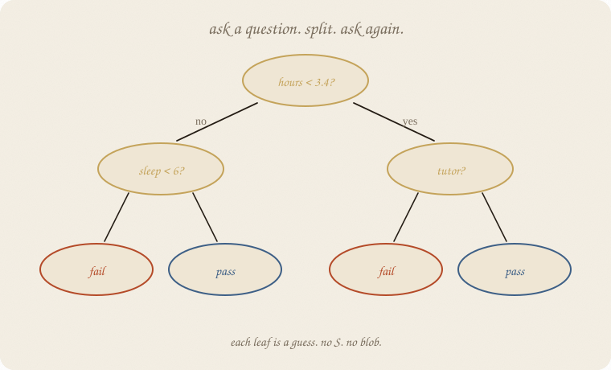
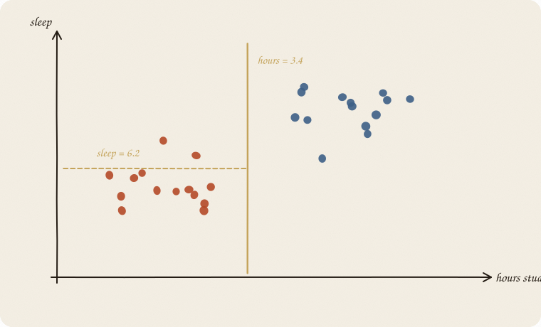
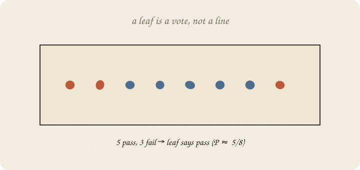
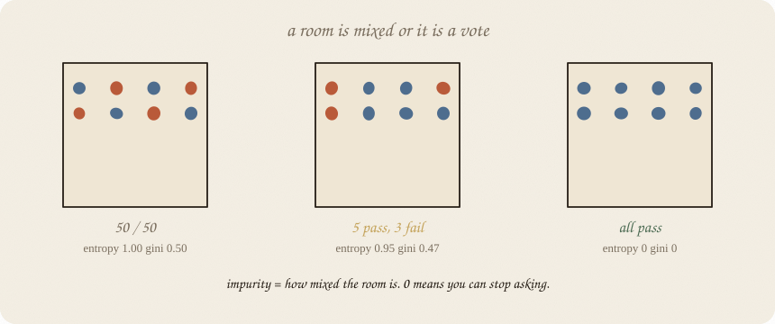
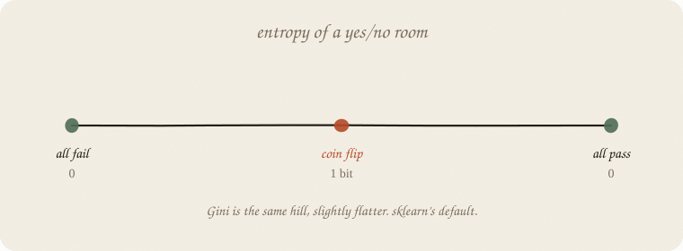
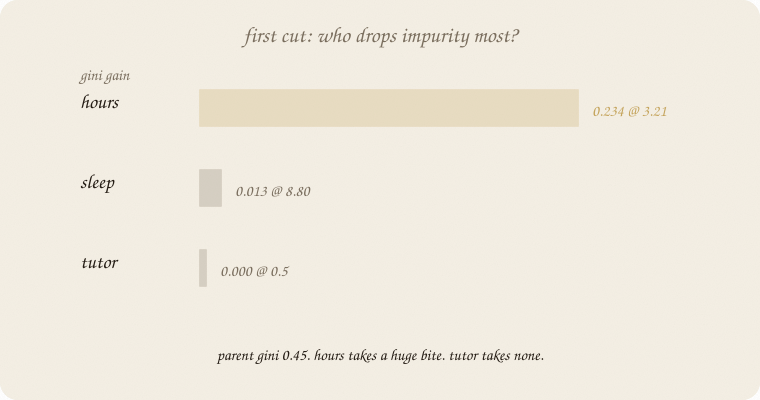
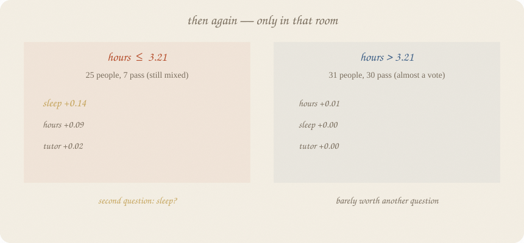
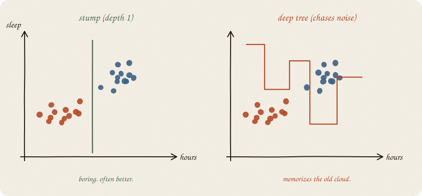

---
tags:
  - sketchbook
  - statistics
  - ml
aliases:
  - Decision Tree
  - Decision Tree Sketchbook
  - CART
---
	
# Decision tree — a sketchbook

> [!abstract] In one sentence
> **Ask a yes/no about one *x*. Split. Repeat.** The first question is whichever cut **drops the mix** the most (entropy / Gini). Each leaf is a vote.



Read [[01 logistic regression]] first. Same pass/fail exam. Logistic drew an S. LDA drew two ovals. A tree draws **rectangles** with questions on the doors.

One tree. A forest is many of these ([[02 random forest]]).

Flip it like a notebook. One page = one idea. Done.

---

## Page 1 — A different kind of sentence

Logistic: `score = a + b · hours`, then squash.
LDA: two ovals, pick the nearer.

A tree speaks like a person:

> If hours ≤ 3.21, guess **fail**.
> Else guess **pass**.

That one-question tree is a **stump**. Add a second question, a third. The sentence becomes a flowchart. No *b*. No S. No covariance.

The exam story still holds. Hours, sleep, tutor. *y* is pass/fail.

The rest of this notebook is *why hours went first.*

---

## Page 2 — Cuts are axis-aligned

The computer does not draw a diagonal LDA line. It picks **one lever** and a **cut**: hours = 3.4. Everyone left of the cut goes to one room. Everyone right, the other.



Then, in a room, it may cut **another** axis: sleep = 6.2. The map becomes rectangles. Never a tilt — unless you invent a tilted *x* yourself.

That looks crude. It is also why trees eat mixes: “hours low **and** sleep high” is two cuts, not a clever oval.

---

## Page 3 — A leaf is a vote

People in a rectangle: 5 pass, 3 fail. The leaf says **pass**. If you ask for a probability: 5/8.



No line through the room. No Gaussian. The guess is the majority (or the mean, if *y* were a grade — a regression tree). New student lands in a leaf, inherits that vote.

That is the whole predictor: **which room did you fall into?**

A room that is still 50/50 is a bad place to stop. That is impurity.

---

## Page 4 — Impurity: how mixed is the room?

Eight people. Three rooms.



| room | mix | entropy | Gini |
|---|---|---:|---:|
| 4 pass, 4 fail | coin flip | 1.00 | 0.50 |
| 5 pass, 3 fail | a lean | 0.95 | 0.47 |
| 8 pass, 0 fail | a vote | **0** | **0** |

**Entropy** is “how many bits of surprise are left.” Coin flip = 1 bit. Pure = 0. You can stop asking.

$$H = -\,p\log_2 p - (1-p)\log_2(1-p)$$

**Gini** is the same hill, slightly flatter: *probability two random people in the room disagree.*

$$G = 1 - p^2 - (1-p)^2 = 2p(1-p)$$



sklearn’s default is **Gini**. Entropy is the textbook twin. They almost always pick the **same first lever**. They may disagree on the exact threshold. Both are “how mixed.” You do not need a physics course. You need: **0 = pure. 1 (or 0.5 for Gini) = useless mix.**

---

## Page 5 — The first question is the biggest bite

Start with the whole training room. Ours: 56 people, 37 pass, 19 fail.

Parent Gini ≈ **0.45**. Still mixed.

Try every lever, every possible cut. Score = how much the **weighted average Gini of the two new rooms** drops. That drop is **information gain** (entropy) or **Gini gain**. Biggest bite wins. That *x* goes first.



On this exam (train split):

| lever | best cut | Gini gain | entropy gain | what the rooms look like |
|---|---|---:|---:|---|
| **hours** | 3.21 (Gini) / 3.57 (entropy) | **0.234** | **0.443** | left mostly fail; right almost all pass |
| sleep | 8.80 | 0.013 | 0.033 | peels off 3 people. cheap trick. |
| tutor | 0.5 | 0.000 | 0.000 | both rooms still ~66% pass. useless. |

Hours wins by a mile. Tutor is noise for a first cut. That is why the stump says:

> hours ≤ 3.21 → fail 
> hours > 3.21 → pass

Not because hours is “more important in the universe.” Because **this cut cleaned the room hardest.**

Gini and entropy both pick hours. They disagree slightly on the number (3.21 vs 3.57). Same story.

---

## Page 6 — Then again — only in that room

The tree does **not** rank features globally and then use 2nd place next. It walks into **each room** and repeats the contest **there**.



**Left room** (hours ≤ 3.21): 25 people, only 7 pass. Still mixed (Gini 0.40). New contest:

| lever | Gini gain in *this* room |
|---|---:|
| sleep | **0.137** ← wins |
| hours | 0.089 |
| tutor | 0.024 |

Second question: **sleep ≤ 7.91?** Low hours *and* low sleep → fail. Low hours but lots of sleep → a few sneak a pass.

**Right room** (hours > 3.21): 31 people, 30 pass. Gini already **0.06**. Almost a vote. Extra cuts nibble 0.01. Barely worth asking. Depth 2 still fiddles here; a sensible tree could stop.

Order, then:

1. **hours** (whole room)
2. **sleep** (only the low-hours room)
3. tutor: never, on this stump-to-depth-2 path

`feature_importances_` on a depth-2 tree: hours 0.80, sleep 0.20, tutor 0.00. That is **total Gini drop credited to each lever**, not a mystical ranking.

---

## Page 7 — Depth is the volume knob

**Depth 1** — one cut. Stump. Boring. Often honest.

**Depth 2** — a handful of rooms. Still a sentence you can read aloud.

**Depth “until perfect”** — a room for every oddball. Train accuracy 1.0. The next person is not those oddballs.



On this pass/fail class (eighty students):

| tree | train acc | test acc | leaves |
|---|---:|---:|---:|
| stump (depth 1) | 0.857 | 0.792 | 2 |
| depth 2 | 0.893 | 0.792 | 4 |
| deep (depth 8, actually 5) | **1.000** | **0.708** | 11 |

The deep tree **memorized** the old cloud and got worse on new people. Same lesson as an un-taxed line. Here the tax is **don’t go deep** (or don’t grow tiny leaves). Forests will tax by *voting many jumpy trees* — member overfit, choir not ([[02 random forest]]). Not this notebook.

---

## Page 8 — Mini recipe

1. **y is a class** (or a number — then impurity is variance, each leaf is a mean).
2. **Score every cut** by how much it drops entropy or Gini. Biggest bite = first question.
3. **Walk into each room.** Repeat the contest *there*. 2nd feature is not “2nd globally.”
4. **Stop** when the room is pure enough, too small, or depth says so.
5. **Predict** = the leaf’s vote.
6. **Read the tree aloud.** If you cannot, it is too deep.
7. **Judge on hidden people.** Train 1.0 is a confession, not a trophy.

If you keep only one thing:

> first cut = biggest drop in mix. next cut = biggest drop *in that room.*

---

## Page 9 — Gains, in sklearn

Same pass/fail class as logistic / LDA — eighty students. Not the thirty graders on the ridge page. The snippet prints the stump (Gini), the entropy stump, and depth 2 — so you can see first vs second.

```python
import numpy as np
from sklearn.model_selection import train_test_split
from sklearn.tree import DecisionTreeClassifier, export_text

rng = np.random.default_rng(7)
n = 80
hours = rng.uniform(1, 6, n)
sleep = rng.uniform(4, 9, n)
tutor = (rng.random(n) > 0.6).astype(float)
z = -3.2 + 1.05 * hours + 0.25 * (sleep - 6.5) + 0.7 * tutor
passed = (rng.random(n) < 1 / (1 + np.exp(-z))).astype(int)

X = np.column_stack([hours, sleep, tutor])
names = ["hours", "sleep", "tutor"]
Xtr, Xte, ytr, yte = train_test_split(X, passed, test_size=0.3, random_state=0)

for crit in ("gini", "entropy"):
    t = DecisionTreeClassifier(max_depth=1, criterion=crit, random_state=7).fit(Xtr, ytr)
    print(crit, "stump")
    print(export_text(t, feature_names=names), end="")
    print("importances", dict(zip(names, t.feature_importances_.round(3))))
    print()

t2 = DecisionTreeClassifier(max_depth=2, criterion="gini", random_state=7).fit(Xtr, ytr)
print("depth 2")
print(export_text(t2, feature_names=names), end="")
print("importances", dict(zip(names, t2.feature_importances_.round(3))))
print("acc train/test", round(t2.score(Xtr, ytr), 3), round(t2.score(Xte, yte), 3))
```

```
gini stump
|--- hours <= 3.21
|   |--- class: 0
|--- hours >  3.21
|   |--- class: 1
importances {'hours': 1.0, 'sleep': 0.0, 'tutor': 0.0}

entropy stump
|--- hours <= 3.57
|   |--- class: 0
|--- hours >  3.57
|   |--- class: 1
importances {'hours': 1.0, 'sleep': 0.0, 'tutor': 0.0}

depth 2
|--- hours <= 3.21
|   |--- sleep <= 7.91
|   |   |--- class: 0
|   |--- sleep >  7.91
|   |   |--- class: 1
|--- hours >  3.21
|   |--- hours <= 3.57
|   |   |--- class: 1
|--- hours >  3.57
|   |   |--- class: 1
importances {'hours': 0.798, 'sleep': 0.202, 'tutor': 0.0}
acc train/test 0.893 0.792
```

Gini vs entropy: both **hours first**. Cut 3.21 vs 3.57 — same story, different yardstick.
Depth 2: sleep is allowed to speak **only after** hours put you in the mixed left room. Tutor still 0.

Deep tree from the old page, for the tax lesson: `max_depth=8` → 11 leaves, train **1.0**, test **0.708**. Memorized.

`class: 0` is fail, `1` is pass.

---

## Last page — cheat sheet

| word | meaning |
|---|---|
| cut | one *x*, one threshold, two rooms |
| impurity | how mixed a room is |
| entropy | −p log₂ p − (1−p) log₂(1−p). 0 = pure, 1 = coin |
| Gini | 2p(1−p). sklearn default. same idea |
| gain | parent impurity − weighted child impurity |
| first feature | the cut with the **biggest gain** on the whole room |
| second feature | biggest gain **in that child room**, not 2nd place overall |
| leaf | a room with a vote (or a mean) |
| stump | depth 1 |
| depth | how many questions stacked |

**Also called** (in a room):

| here | there |
|---|---|
| room | node |
| cut | split |
| leftover mix | impurity |

### Use / skip

**Reach for it when** you want **rules you can read**; *x* mix (hours low **and** sleep high); a first look before a forest; *y* is a class *or* a number.

**Skip it when** one deep tree on tiny data (it will memorize); you need a smooth S ([[01 logistic regression]]); the truth is two ovals ([[02 LDA]]); you already know you want 500 trees — still *read this*, then grow a forest. Don’t start at XGBoost.

**Pays you:** no scaling drama. Mixes for free. A sentence. The atom of bagging and boosting. A **reason** for feature order (gain), not a vibe.

**Costs you:** jagged boundary. Unstable: a new sample, a different first cut. Depth is a loaded knob. One tree is rarely the final model — it is the **brick**.

---

*Brick for the ensemble wall. Next, many trees vote: [[02 random forest]]. Then leftover-trees: [[03 gradient boosting]]. LDA if you still want ovals: [[02 LDA]].*
