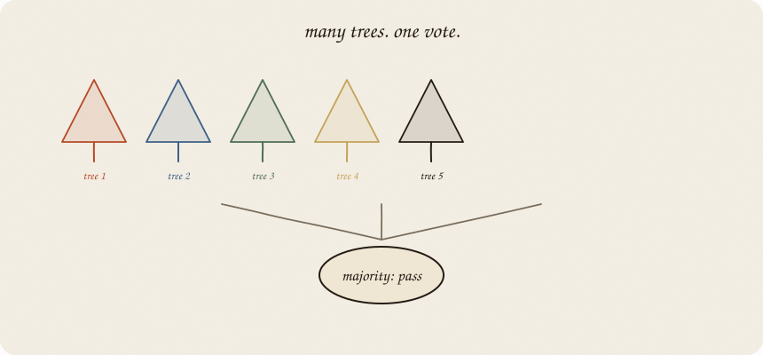
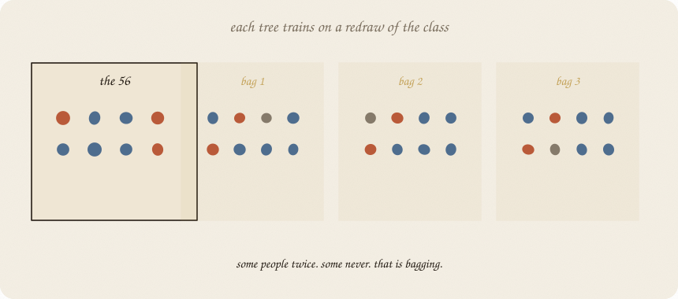
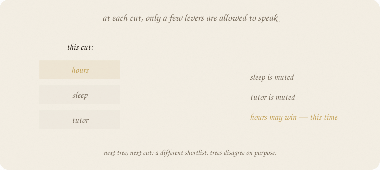
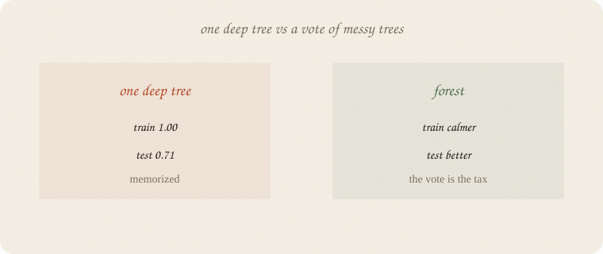

---
tags:
  - sketchbook
  - statistics
  - ml
aliases:
  - Random Forest
  - Random Forest Sketchbook
  - bagging
---

# Random forest — a sketchbook

> [!abstract] In one sentence
> **Many trees, grown on purpose disagreeing, then a vote.** One tree memorizes. The vote is the tax.



Read [[01 decision tree]] first. Same pass/fail exam. Same hours, sleep, tutor. One deep tree hit train **1.0** and test **0.71**. This notebook is what you do with that gap.

Flip it like a notebook. One page = one idea. Done.

---

## Page 1 — One tree is jumpy

A tree’s first cut is the biggest Gini bite **on this sample**. Draw the 56 people again, get a different first cut. That jumpy first question is why a single tree is a brick, not a house.

The forest idea is rude and effective:

> Grow **lots** of slightly wrong trees. Let them vote.

Wrong on purpose. Average out the drama.

---

## Page 2 — Two kinds of disagreement

**Bagging.** Each tree does not see the same 56 people. It gets a **redraw with replacement**: some students twice, some never. That bag is its whole world.



**Random levers at each cut.** Even in one bag, the tree is not allowed to always pick hours. At every split it is handed a **shortlist** (often √p of the features). Sleep might win this cut only because hours was muted.



Together: different people, different allowed questions. Trees start with different first cuts. On our data, tree 0 opened with **sleep**; tree 1 opened with **hours**. Same exam. Different bags.

If they all opened with hours, the vote would be one stump in a choir. The randomness is the point.

---

## Page 3 — The vote is the tax

A new student walks in. Each tree casts fail or pass. Majority wins. (Or average the P(pass) from the leaves.)



You cannot read 100 flowcharts aloud. You **traded a sentence for a stabler call**. That is the cost, same family as ridge: less drama, less story.

One deep tree still sits in the forest as a member. It just does not get to decide alone. Ridge called that tree’s hug **overfitting** and taxed the knobs. Here the members may still memorize. The **vote** is what you ship. Overfit of one learner is not overfit of the choir.

---

## Page 4 — Same pass/fail class

Train 56 / test 24. Deep tree vs forest:

| model | trees | train acc | test acc |
|---|---:|---:|---:|
| one deep tree | 1 | **1.000** | **0.708** |
| forest | 10 | 0.982 | 0.708 |
| forest | 50 | 1.000 | **0.792** |
| forest | 100 | 1.000 | **0.792** |

Ten trees: not enough vote — test still 0.71.
Fifty and a hundred: test **0.79**, same as the honest stump, without you having to pick depth 1 by hand.

Train can still hit 1.0 on 56 people. The tax showed up on **new** people, which is the only score that counts. Feature importances (average Gini drop across trees): hours 0.68, sleep 0.30, tutor 0.03. Hours still first *in aggregate*. Sleep gets a voice it never had in the stump.

---

## Page 5 — Mini recipe

1. Start from **one tree**. Know Gini / first cut.
2. **Bag** the people (redraw with replacement).
3. At each cut, **mute most levers.** Force disagreement.
4. Grow many. **Vote.**
5. More trees ≠ more depth. Depth can stay modest; *n_estimators* is how many voters.
6. Judge on hidden people. Do not read 100 trees. Read importances as a *choir*, not a cause.

If you keep only one thing:

> bag the people, shuffle the questions, vote. that is the forest.

---

## Page 6 — The vote, in sklearn

Same pass/fail class as the tree notebook — eighty students.

```python
import numpy as np
from sklearn.model_selection import train_test_split
from sklearn.tree import DecisionTreeClassifier, export_text
from sklearn.ensemble import RandomForestClassifier

rng = np.random.default_rng(7)
n = 80
hours = rng.uniform(1, 6, n)
sleep = rng.uniform(4, 9, n)
tutor = (rng.random(n) > 0.6).astype(float)
z = -3.2 + 1.05 * hours + 0.25 * (sleep - 6.5) + 0.7 * tutor
passed = (rng.random(n) < 1 / (1 + np.exp(-z))).astype(int)

X = np.column_stack([hours, sleep, tutor])
names = ["hours", "sleep", "tutor"]
Xtr, Xte, ytr, yte = train_test_split(X, passed, test_size=0.3, random_state=0)

deep = DecisionTreeClassifier(max_depth=8, random_state=7).fit(Xtr, ytr)
rf = RandomForestClassifier(n_estimators=100, random_state=7).fit(Xtr, ytr)

print("deep  acc train/test", round(deep.score(Xtr, ytr), 3), round(deep.score(Xte, yte), 3))
print("rf    acc train/test", round(rf.score(Xtr, ytr), 3), round(rf.score(Xte, yte), 3))
print("importances", dict(zip(names, rf.feature_importances_.round(3))))
print("tree 0 first cut:")
print(export_text(rf.estimators_[0], feature_names=names, max_depth=0), end="")
print("tree 1 first cut:")
print(export_text(rf.estimators_[1], feature_names=names, max_depth=0), end="")
```

```
deep  acc train/test 1.0 0.708
rf    acc train/test 1.0 0.792
importances {'hours': 0.676, 'sleep': 0.298, 'tutor': 0.026}
tree 0 first cut:
|--- sleep <= 4.88
|   |--- truncated branch of depth 5
tree 1 first cut:
|--- hours <= 2.22
|   |--- truncated branch of depth 5
```

Deep tree memorizes (test 0.71). Forest’s vote lands at **0.79**. Tree 0 opened on **sleep**, tree 1 on **hours** — that is bag + random levers, not a bug.

`n_estimators=100` is “how many voters.” `max_features="sqrt"` is sklearn’s default shortlist at each cut.

---

## Last page — cheat sheet

| word | meaning |
|---|---|
| bag / bootstrap | redraw people with replacement |
| max_features | how many levers may speak at a cut |
| n_estimators | how many trees vote |
| vote | majority class (or mean P) |
| importance | total impurity drop, averaged across trees |

### Use / skip

**Reach for it when** one tree is jumpy; you want a strong default on tables with mixes; you do **not** need to read every rule.

**Skip it when** you must explain every cut ([[01 decision tree]] is the sentence); a line or logistic already fits; tiny *n* and you were going to grow huge trees anyway.

**Pays you:** the usual first ensemble. Better test than one deep tree. Importances that let sleep speak. Few knobs. Jumpy members + a vote — overfitting of *one* tree is not the forest’s score.

**Costs you:** the flowchart is gone. Train can still look perfect on small *n*. Not a cause machine. Sequential leftovers (boosting) are a different religion: [[03 gradient boosting]].

---

*The choir. Next, trees in a line that hunt leftovers: [[03 gradient boosting]].*
