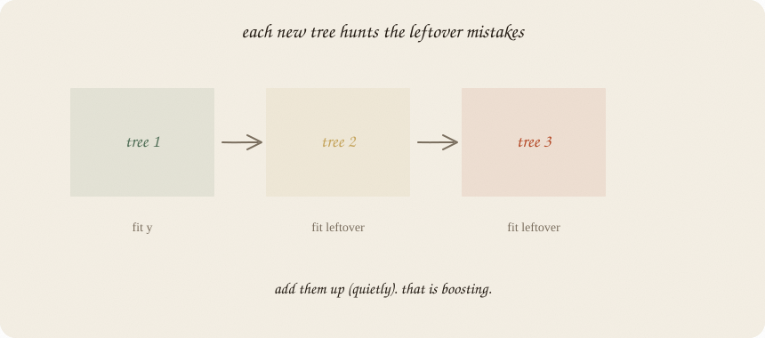
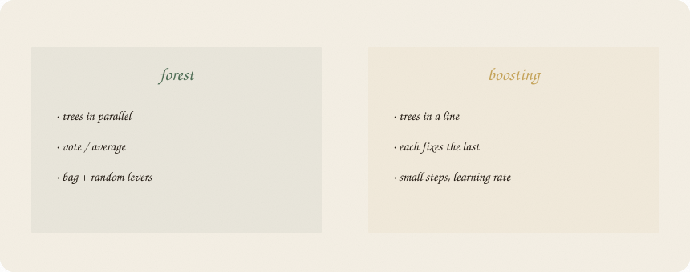
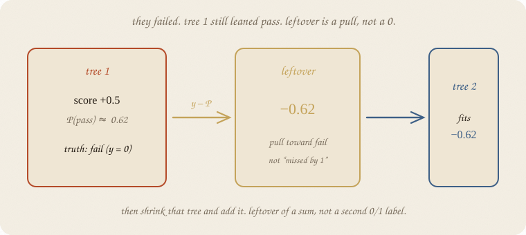
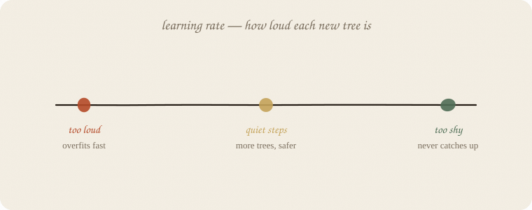

---
tags:
  - sketchbook
  - statistics
  - ml
aliases:
  - Gradient Boosting
  - Gradient Boosting Sketchbook
  - GBM
  - XGBoost
---

# Gradient boosting — a sketchbook

> [!abstract] In one sentence
> Trees in a **line**, not a choir: each new tree is trained on the **leftover mistakes**. Add them quietly (learning rate). That is boosting.



Read [[01 decision tree]] and [[02 random forest]] first. Same exam. Forest: many trees **in parallel**, then a vote. Boosting: many trees **in sequence**, each fixing what the last still got wrong.

XGBoost / LightGBM / CatBoost are fast, taxed versions of this idea. The religion is here. The brand names are engines. Dialects in one page: [[04 boosting flavors]].

Flip it like a notebook. One page = one idea. Done.

---

## Page 1 — Choir vs chain

Forest: disagreement by bagging and muted levers. Vote.

Boosting: **no vote at the start.** Tree 1 fits *y* (pass/fail, or a score). Look at who is still wrong — the leftover. Tree 2 fits **that leftover**. Tree 3 fits the leftover of 1+2. Add them up.



| | forest | boosting |
|---|---|---|
| trees | parallel | a chain |
| each tree sees | a bag of *y* | the current leftover |
| combine | vote / average | **sum** (small steps) |
| randomness | the point | optional extra |

Same bricks (shallow trees). Different glue.

---

## Page 2 — Leftover is not a 0/1 miss

You have met leftovers: *y − ŷ* on the grade line.

Pass/fail is the same verb, **not** “tree 2 refits 0 or 1.” Tree 1 puts out a **score**. Squash to P(pass). Leftover = **y − P**. People call that the **gradient** of the loss. Hence the name.

They failed (y = 0). Tree 1 still said score +0.5 → P ≈ 0.62. Leftover = 0 − 0.62 = **−0.62**. Tree 2 fits that pull toward fail — not a second binary label.



Then **shrink** that tree before adding it. If you add it at full volume, tree 2 memorizes the noise of tree 1’s leftover. That is overfit, only faster.

---

## Page 3 — Learning rate is the volume knob



**Learning rate** (*ν*, sklearn `learning_rate`): how much of each new tree you actually add.

| too loud (≈ 1) | quiet (0.05–0.1) | too shy |
|---|---|---|
| few trees, overfits fast | more trees, safer | never catches up |

Rule of thumb: **smaller rate, more trees.** You buy the same fit in smaller bites. Ridge energy: a tax on drama, paid in steps.

Depth of each tree is usually **small** (stumps or depth 2–3). The *chain* supplies the complexity, not one deep monster.

---

## Page 4 — Same pass/fail class, honestly

House seed 7. The forest lifted test from 0.71 → 0.79. Boosting on this **tiny** exam is easy to spoil:

| model | knobs | train | test |
|---|---|---:|---:|
| deep tree | depth 8 | 1.000 | 0.708 |
| forest | 100 trees | 1.000 | **0.792** |
| boosting | rate 0.1, 30 trees, depth 2 | 0.964 | 0.750 |
| boosting | rate 1.0, 30 trees | 1.000 | 0.750 |
| boosting | rate 0.1, 80 trees | 1.000 | 0.708 |
| boosting | rate 0.05, 40 trees, depth 3 | 1.000 | **0.667** |

Quiet + short chain: a bit better than the deep tree, **not** better than the forest, on 24 test people. Longer chain: train perfect, test back to 0.71 — memorized again. Deeper bricks + quieter rate is **not** a free swap: test **0.667**. Same class, worse.

That is the lesson, not a scandal. Boosting **shines on bigger tables**. On this toy exam the choir is enough. Importances still hours-first (~0.83), then sleep, tutor whisper.

If you later open XGBoost: same leftover-chain + extra taxes (shrinkage, column samples, regularizers). Different engine, same religion.

---

## Page 5 — Mini recipe

1. Know one tree (Gini, leftover as a *room*).
2. Fit a **small** tree to *y* (or to the score).
3. Compute leftover = *y − P* (not a 0/1 miss). Fit the **next** small tree to that.
4. Add it **quietly** (`learning_rate`).
5. Repeat. Stop when hidden people stop improving — more trees can hurt.
6. Do not start at XGBoost. Start here. Then change the engine if you need speed.

If you keep only one thing:

> forest votes. boosting **adds leftover-trees**, quietly.

---

## Page 6 — The chain, in sklearn

Same pass/fail class as the forest notebook — eighty students, house seed 7. `GradientBoostingClassifier` is the plain sklearn chain (not XGBoost). Depth 2 trees.

```python
import numpy as np
from sklearn.model_selection import train_test_split
from sklearn.ensemble import GradientBoostingClassifier, RandomForestClassifier
from sklearn.tree import DecisionTreeClassifier

rng = np.random.default_rng(7)
n = 80
hours = rng.uniform(1, 6, n)
sleep = rng.uniform(4, 9, n)
tutor = (rng.random(n) > 0.6).astype(float)
z = -3.2 + 1.05 * hours + 0.25 * (sleep - 6.5) + 0.7 * tutor
passed = (rng.random(n) < 1 / (1 + np.exp(-z))).astype(int)

X = np.column_stack([hours, sleep, tutor])
names = ["hours", "sleep", "tutor"]
Xtr, Xte, ytr, yte = train_test_split(X, passed, test_size=0.3, random_state=0)

deep = DecisionTreeClassifier(max_depth=8, random_state=7).fit(Xtr, ytr)
rf = RandomForestClassifier(n_estimators=100, random_state=7).fit(Xtr, ytr)
gb = GradientBoostingClassifier(
    n_estimators=30, learning_rate=0.1, max_depth=2, random_state=7
).fit(Xtr, ytr)

print("deep   ", round(deep.score(Xtr, ytr), 3), round(deep.score(Xte, yte), 3))
print("forest ", round(rf.score(Xtr, ytr), 3), round(rf.score(Xte, yte), 3))
print("boost  ", round(gb.score(Xtr, ytr), 3), round(gb.score(Xte, yte), 3))
print("importances", dict(zip(names, gb.feature_importances_.round(3))))
```

```
deep    1.0 0.708
forest  1.0 0.792
boost   0.964 0.75
importances {'hours': 0.831, 'sleep': 0.15, 'tutor': 0.019}
```

On this small test set the **forest wins**. That does **not** mean boosting is weaker. It means 56 trainers + a chain is easy to spoil. Boosting is the chain you will want when *n* grows and you are willing to tune rate × trees. The printout is the honesty, not a demo that boosting always beats the choir.

`n_estimators` = length of the chain. `learning_rate` = how loud each new tree is. `max_depth=2` keeps each brick small.

---

## Last page — cheat sheet

| word | meaning |
|---|---|
| leftover / gradient | y − P (pass/fail), not a second 0/1 label |
| chain | tree k fits the leftover of 1…k−1 |
| learning rate | shrink each tree before adding |
| n_estimators | how many leftover-trees |
| XGBoost etc. | engines for this religion |

### Use / skip

**Reach for it when** tables with mixes, leftover errors that a forest already almost got; you will **tune** rate and depth; you outgrew one default forest.

**Skip it when** you need an answer tonight with no knobs ([[02 random forest]]); tiny *n* and a loud rate (you will memorize); a line or logistic already fits.

**Pays you:** often the strongest tabular model once *n* is real. Fine leftover-hunting. Same bricks as the tree notebook.

**Costs you:** knobs. Easy to overfit. Harder to read than one tree. On 80 fake students the forest was enough — believe the test set, not the brand.

---

*The chain. Forest was the choir: [[02 random forest]]. AdaBoost vs XGBoost vs this, in one page: [[04 boosting flavors]].*
