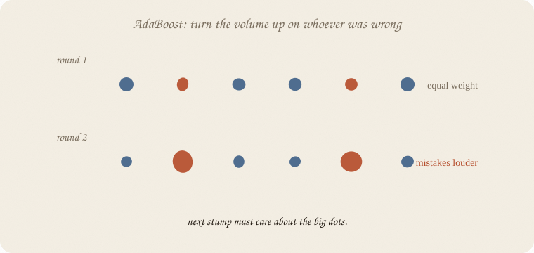
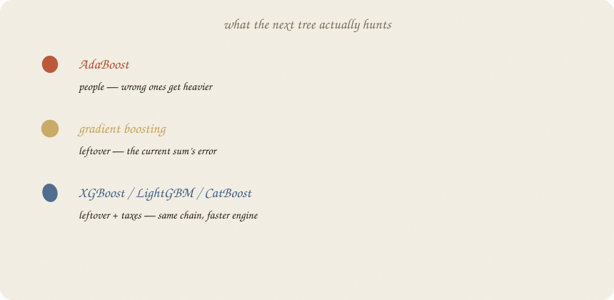

---
tags:
  - sketchbook
  - statistics
  - ml
aliases:
  - AdaBoost
  - XGBoost
  - LightGBM
  - boosting flavors
---

# Boosting flavors — a sketchbook

> [!abstract] In one sentence
> **One chain, three dialects.** AdaBoost reweights *people*. Gradient boosting fits *leftovers*. XGBoost & co. are that leftover-chain with a faster engine and extra taxes — not a new idea.


Read [[03 gradient boosting]] first. That notebook is the religion. This one is the **family portrait**: AdaBoost vs gradient boosting vs the brand names, short enough to remember, not a second encyclopedia.

No extra AdaBoost sheet. No extra XGBoost sheet. This is the “what’s the difference” note.

Flip it like a notebook. One page = one idea. Done.

---

## Page 1 — You do not need three religions

All of them: **small trees in a line.** Each new tree cares extra about what the last ones still get wrong. Then you **add**.

They disagree on *what* “wrong” looks like, and on how much extra machinery sits on the chain.

If you only keep one boosting notebook, keep [[03 gradient boosting]]. Open this when a blog says AdaBoost, XGBoost, LightGBM, CatBoost as if they were different species.

---

## Page 2 — AdaBoost: turn the volume up on the wrong people

Oldest dialect. Usually **stumps** (depth 1).

Round 1: every student weighs the same. Fit a stump.
Whoever was misclassified gets **heavier**. The next stump is scored as if those people were sitting in the room twice.



A stump that does well on the heavy dots gets a bigger say in the final **weighted vote**.

That is not “fit the residual number.” That is **reweight the people.** Same chain energy. Different leftover.

---

## Page 3 — Gradient boosting: hunt the leftover number

[[03 gradient boosting]] again, in one line:

Current sum → leftover (the **gradient** of the loss) → plant a small tree on that leftover → add it **quietly**.

People do not change weight. The *target* of the next tree changes.



| dialect | the next tree hunts | typical brick | combine |
|---|---|---|---|
| AdaBoost | **people** (wrong ones louder) | stumps | weighted vote |
| gradient boosting | **leftover** of the sum | depth 2–3 | sum, shrunk |
| XGBoost / LightGBM / CatBoost | leftover **+ taxes** | depth 2–8, fast | sum, shrunk, regularized |

XGBoost is gradient boosting with: second-order leftover (a bit more precise), penalties on tree size (ridge-ish), column samples (forest-ish), missing-value tricks, and a C++ engine. LightGBM: leaf-wise growth, histograms, speed on huge tables. CatBoost: categories without you inventing dummy columns.

**Same religion as 03.** Different garage.

---

## Page 4 — Same pass/fail class, no brand worship

Stumps in a chain (AdaBoost) vs leftover-trees (GB) vs sklearn’s histogram engine (`HistGradientBoosting` — the closest thing here without installing XGBoost):

| | train | test |
|---|---:|---:|
| AdaBoost, 30 stumps, rate 0.5 | 0.911 | **0.875** |
| gradient boosting, 30 × depth 2, rate 0.1 | 0.964 | 0.750 |
| hist boosting, 30 × depth 2, rate 0.1 | 0.857 | 0.792 |
| forest (from 02), 100 trees | 1.000 | 0.792 |

On **24 test people**, AdaBoost happened to win. That is a coin with 24 flips, not “AdaBoost is best.” The point of the table: **brand ≠ ranking.** Tiny *n*, any of them can look like a genius.

Install XGBoost later if you want the engine. Do not expect it to rewrite this table by magic.

---

## Page 5 — Pros / cons, one glance

**AdaBoost** 
Pays you: simple story (loud mistakes). Stumps you can still almost read. Few knobs. 
Costs you: noisy labels get *louder* (the opposite of what you want). Weaker on messy probabilities. Old, not the default anymore. 
Reach for it: teaching the chain; a tiny, clean yes/no. 
Skip it: labels are dirty; you already live in XGBoost-land.

**Gradient boosting (sklearn GBM)** 
Pays you: the leftover picture you already have. Fine on medium tables. One library. 
Costs you: slower than the C++ engines. Easy to overfit if the rate is loud. 
Reach for it: learning; datasets that fit in RAM; you don’t want another install. 
Skip it: millions of rows (use an engine).

**XGBoost / LightGBM / CatBoost** 
Pays you: speed, extra taxes, missing values, (CatBoost) categories. Often the production default for tables. 
Costs you: more knobs, more ways to fool yourself. Not a new idea — 03 in a faster coat. LightGBM can over-grow if you don’t cap depth/leaves. 
Reach for it: real tables, once you can explain leftover + learning rate. 
Skip it: you cannot yet draw the chain on paper.

---

## Page 6 — Mini recipe

1. Can you explain leftover-trees? If not, stay in [[03 gradient boosting]].
2. Need a **story about loud people**? AdaBoost, one paragraph, then move on.
3. Need a **model tonight on a medium CSV**? sklearn GBM or a forest.
4. Need **speed / missings / categories** on a real table? Pick **one** engine (XGBoost is the common default; CatBoost if the sheet is full of categories). Do not collect all three.
5. Believe hidden people, not the logo.

If you keep only one thing:

> AdaBoost reweights people. GB fits leftovers. XGBoost is GB with a gym membership.

---

## Page 7 — Three dialects, in sklearn

Same pass/fail class as the boosting notebook — eighty students. No XGBoost install required: `HistGradientBoostingClassifier` is sklearn’s histogram engine (LightGBM-adjacent). AdaBoost uses **stumps**.

```python
import numpy as np
from sklearn.model_selection import train_test_split
from sklearn.tree import DecisionTreeClassifier
from sklearn.ensemble import (
    AdaBoostClassifier,
    GradientBoostingClassifier,
    HistGradientBoostingClassifier,
)

rng = np.random.default_rng(7)
n = 80
hours = rng.uniform(1, 6, n)
sleep = rng.uniform(4, 9, n)
tutor = (rng.random(n) > 0.6).astype(float)
z = -3.2 + 1.05 * hours + 0.25 * (sleep - 6.5) + 0.7 * tutor
passed = (rng.random(n) < 1 / (1 + np.exp(-z))).astype(int)

X = np.column_stack([hours, sleep, tutor])
Xtr, Xte, ytr, yte = train_test_split(X, passed, test_size=0.3, random_state=0)

ada = AdaBoostClassifier(
    estimator=DecisionTreeClassifier(max_depth=1, random_state=7),
    n_estimators=30, learning_rate=0.5, random_state=7,
).fit(Xtr, ytr)
gb = GradientBoostingClassifier(
    n_estimators=30, learning_rate=0.1, max_depth=2, random_state=7,
).fit(Xtr, ytr)
hist = HistGradientBoostingClassifier(
    max_iter=30, learning_rate=0.1, max_depth=2, random_state=7,
).fit(Xtr, ytr)

print("ada   ", round(ada.score(Xtr, ytr), 3), round(ada.score(Xte, yte), 3))
print("gb    ", round(gb.score(Xtr, ytr), 3), round(gb.score(Xte, yte), 3))
print("hist  ", round(hist.score(Xtr, ytr), 3), round(hist.score(Xte, yte), 3))
```

```
ada    0.911 0.875
gb     0.964 0.75
hist   0.857 0.792
```

AdaBoost luckiest on this split. Hist ≈ forest territory. GB hungrier on train. **Do not pick a career from 24 test rows.** The snippet is so you have seen all three calls.

`HistGradientBoosting` uses `max_iter` for “how many trees,” same job as `n_estimators`.

---

## Last page — cheat sheet

| name | hunts | brick | vibe |
|---|---|---|---|
| AdaBoost | heavy people | stumps | old, readable, noisy-label-shy |
| gradient boosting | leftover | small trees | the idea in 03 |
| XGBoost | leftover + taxes | small/medium trees | default engine |
| LightGBM | leftover + taxes | leaf-wise, histograms | huge tables |
| CatBoost | leftover + taxes | ordered categories | messy categoricals |

### Use / skip

**Reach for it when**

- someone names a brand and you need the dialect in one page

**Skip it when**

- you wanted a 12-page AdaBoost and a 12-page XGBoost
- you are not tuning one of them for real yet

**Pays you:** a map. Ada vs leftover vs engine.

**Costs you:** none of these beats a forest by law on tiny *n*. Chain first, logo later.

---

*Family portrait, not a third religion. The chain: [[03 gradient boosting]]. The choir: [[02 random forest]].*
