---
tags:
  - sketchbook
  - statistics
  - ml
aliases:
  - Linear Regression
  - Linear Regression Sketchbook
  - linear regression
---

# Linear regression — a sketchbook

> [!abstract] In one sentence
> You have points. You draw **a straight line** through them. After that the line is a **prediction machine**: *x in, ŷ out.*


Flip it like a notebook. One page = one idea. Done.

---

## Page 1 — The problem

You want to know **how a grade depends on hours studied**.

You ask 8 people:

| hours studied | grade |
|--------------:|------:|
| 1 | 3 |
| 2 | 4 |
| 2 | 3 |
| 3 | 5 |
| 4 | 6 |
| 5 | 7 |
| 5 | 6 |
| 6 | 8 |

This is **not a law**. Person A studies 2 hours and gets a 3. Person B also studies 2 and gets a 4. Life is noisy.

Still, you can see a direction: **more hours → tend to mean a better grade.**

Question of the whole sketchbook:

> Can I turn *x* (hours) into a *decent guess* for *y* (grade)?

Not perfect. Good enough.

---

## Page 2 — Points are a cloud

Each person = **one dot**.

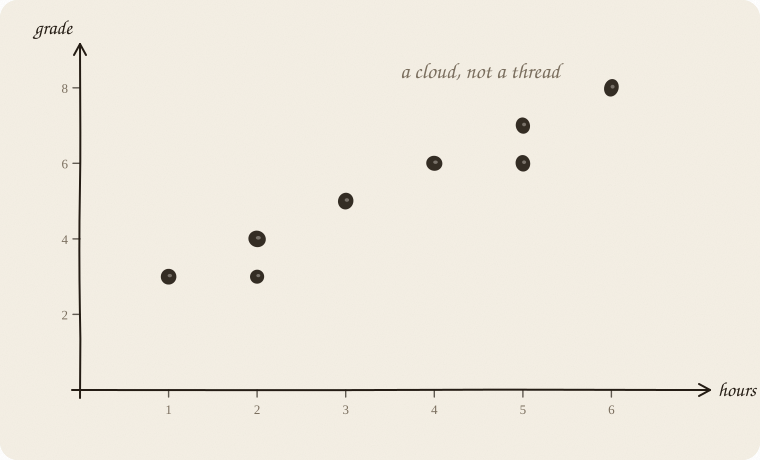

That is a **cloud of points**.

You can already see some things without math:

- The cloud rises to the right. Positive relationship.
- It is not thin like a thread. There is scatter.
- You do not need a **curve** here. A **straight line** is a decent model.

> [!tip] Margin note
> Cloud rises: positive trend.
> Cloud falls: negative trend.
> Looks like a round blob: no linear trend. A line would be nonsense.

---

## Page 3 — The line is the answer

You put **a straight line** through the cloud.

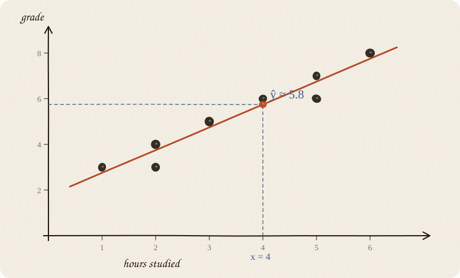

The line does not say: “This *is* the world.”
It says: “Roughly, **on average**.”

Someone with 4 hours:

> line at *x* = 4  →  ŷ ≈ 5.8

The hat on the y (**ŷ**, “y hat”) means: **prediction**, not the real grade.

Real grade next to it: 6.
Prediction: 5.8.
Off, but close. That is the deal.

---

## Page 4 — Two numbers run everything

Every straight line on paper has **exactly two knobs**:

**ŷ = a + b · x**

- **a** — intercept. Where the line hits the y-axis.
- **b** — slope. How steep.

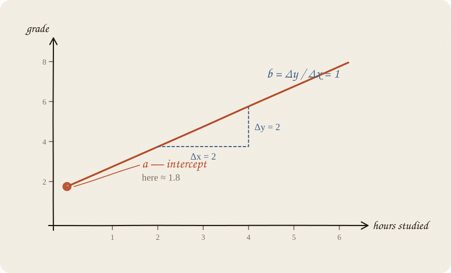

### a — the start

*What comes out when x = 0?*

Here: 0 hours studied. The line hits the grade axis at **a = 1.75**.

Sometimes a is meaningful (“base rent, before anything happens”).
Sometimes a is just math and **nonsense outside the data** — nobody sits an exam with −3 hours of studying.

### b — the slope

*What happens when x grows by 1?*

For our 8 people, **b = 1**. Each extra hour goes with **+1 grade point**, on average.

Other lines, other *b* — just to feel the knob:

| b | means |
|---|---|
| +1 | each extra hour: grade +1 on average *(this cloud)* |
| −0.4 | each extra hour: grade −0.4 on average |
| 0 | x does nothing. Flat line. |

The sentence to keep:

> **b is the average effect of +1 on x.**

Not for *one* person. For the pattern in the cloud.

---

## Page 5 — Mini picture: touching the slope

Two points on the line:

- A: 2 hours → grade 3.8
- B: 5 hours → grade 6.8

$$b = \frac{\Delta y}{\Delta x} = \frac{6.8 - 3.8}{5 - 2} = \frac{3}{3} = 1$$

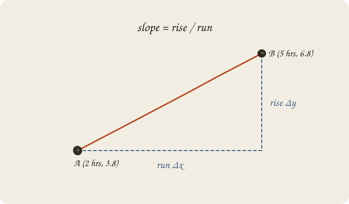

Slope = **rise over run**.
School math — except the line does not have to go through *two* points. It has to go through *a whole cloud*.

---

## Page 6 — The error is vertical

The line almost never hits the point exactly. The gap **up / down** is the error.

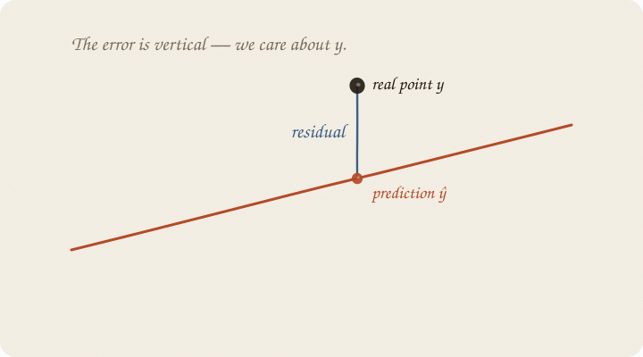

**residual = real − prediction = y − ŷ**

- residual **positive**: point sits above the line. Better than the model thought.
- residual **negative**: point sits below. Worse than expected.
- residual **0**: bullseye. Rare.

Why vertical, not diagonal onto the line?
Because we are **predicting y**. We care about: *how far off was the grade?* Not the slanted distance on the page.

Under **ordinary least squares** (the default line, next page), the mean of all residuals is **always exactly 0**. The overs and the unders cancel. That is why adding them raw is useless — and why we square. It is also why the line is forced through the **centroid** of the cloud (page 10): the average leftover is zero, so the average point sits on the line.

---

## Page 7 — Which line is “the best”?

You could draw a thousand lines through the cloud. Most of them are bad.

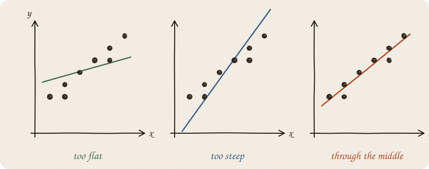

Idea: **make the residuals small.**

Naive thought: add all residuals.
Problem: +2 and −2 sum to 0. Looks perfect. Is not.

So the classic recipe:

1. Take each residual.
2. **Square** it. (Negatives become positive. Big misses get *extra* loud.)
3. Add them up.
4. Find a and b where that sum is **smallest**.

$$\text{sum of squared errors} = (y_1-\hat y_1)^2 + (y_2-\hat y_2)^2 + \cdots + (y_n-\hat y_n)^2$$

That is **least squares**. Sounds like a spell. It is only: *punish big misses hard.*

A point 4 grades off costs 16.
Two points 1 grade off cost 2.
So outliers **yank** the line toward themselves.

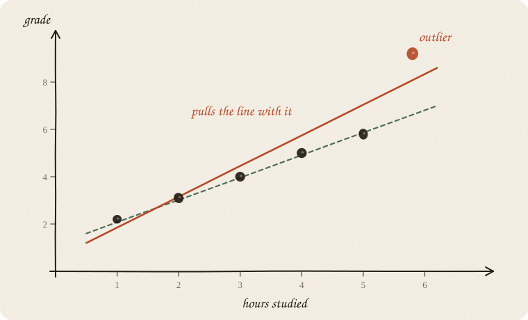

> [!note] Why square?
> You could use absolute values (|residual|) instead. That is a different method.
> Squares are the default recipe because they are smooth and they shout at large errors.

---

## Page 8 — Using the machine

The best line for the 8 people is (no rounding; the data are tidy):

$$\hat y = 1.75 + 1 \cdot \text{hours}$$

Then:

| hours | calculation | prediction ŷ |
|------:|-------------|-------------:|
| 0 | 1.75 + 1·0 | 1.75 |
| 2 | 1.75 + 1·2 | 3.75 |
| 4 | 1.75 + 1·4 | 5.75 |
| 6 | 1.75 + 1·6 | 7.75 |

Someone studies **3 hours**:

$$\hat y = 1.75 + 1 \cdot 3 = 4.75$$

You do not say: “You will get a 4.75.”
You say: “People like you landed **around** 4.8, on average. Scatter extra.”

The line is an **average-maker**, not an oracle.

---

## Page 9 — What “linear” actually means

Linear here does **not** mean “the world is simple.”
Linear means: **the effect of x is the same size everywhere.**

> +1 hour at 1 hour → +1 grade
> +1 hour at 5 hours → +1 grade *(same b)*

The line has **no bend**. No plateau. No “after 4 hours it stops helping.”

If the truth looks like this:

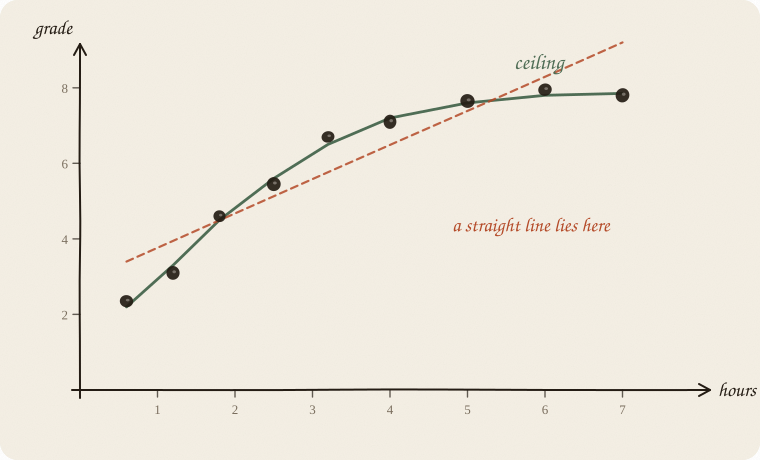

…then a straight line is **the wrong tool**. It cuts the curve and lies at both ends.

Later you might want other models (a curve, steps, trees). For now it is enough: **straight line = constant effect.**

---

## Page 10 — A tiny example you can feel

Four points, deliberately small. Just so the trick *lands*.

| x (hours) | y (grade) |
|----------:|----------:|
| 1 | 2 |
| 2 | 4 |
| 3 | 5 |
| 4 | 7 |

Means (the “centroid” of the cloud):

$$\bar x = 2.5 \qquad \bar y = 4.5$$

The best line **always goes through the centroid** *(x̄, ȳ)*. Keep that.

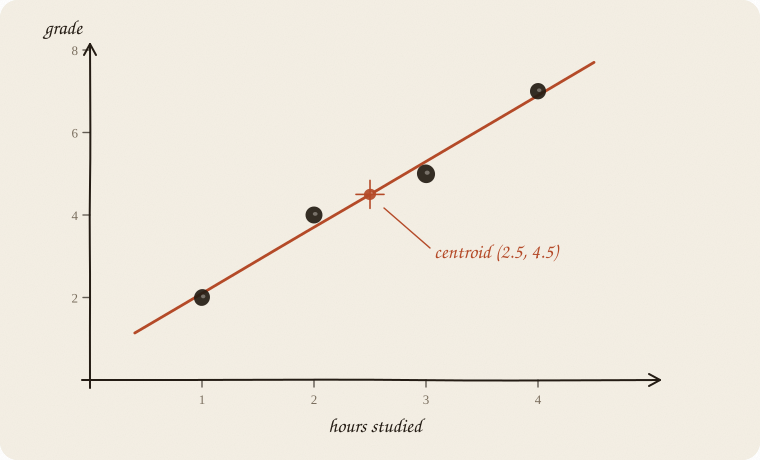

Slope from how x and y walk together:

$$b = 1.6 \qquad a = \bar y - b\cdot\bar x = 4.5 - 1.6\cdot 2.5 = 0.5$$

$$\hat y = 0.5 + 1.6 \cdot x$$

Check:

| x | ŷ | real y | residual | residual² |
|--:|--:|-------:|---------:|----------:|
| 1 | 2.1 | 2 | −0.1 | 0.01 |
| 2 | 3.7 | 4 | +0.3 | 0.09 |
| 3 | 5.3 | 5 | −0.3 | 0.09 |
| 4 | 6.9 | 7 | +0.1 | 0.01 |

Sum of squares = **0.20**. Tiny. The line sits tight.

You do not have to do this by hand every time. The computer does exactly that — just with more points. Your head only needs: **centroid + slope + small residual².**

---

## Page 11 — R² in one minute

How good is the line?

Without *x*, best guess is the average ȳ. A flat line. R² against that is **0**.

With *x*, a slanted line. R² is *how much of the scatter that line explained away.*

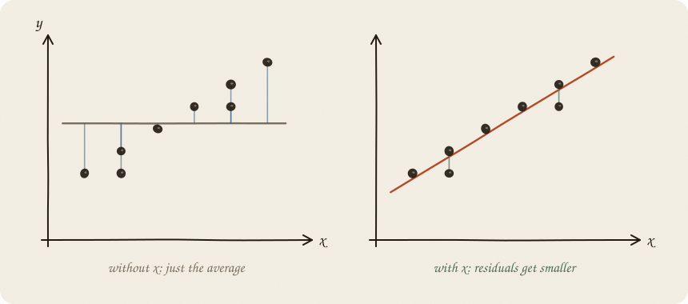

| R² | means |
|---:|---|
| 0 | Line is useless. As good as the plain average. |
| 0.5 | Half the scatter explained. Okay. |
| 1 | Every point sits *exactly* on the line. A fairy tale. |

R² = 0.8 sounds great. It does not mean x is the *cause*. It only means the points hug the line.

0.6 is not a medal and not a fail. It is **60% of the scatter explained — on these people.** New people: usually less. Compare to the flat average (R² = 0), not to a textbook “good.”

---

## Page 12 — Correlation is not cause

Classic trap, everyone falls in once:

> Ice cream sales and drownings rise together.
> So ice cream causes drowning?

No. Both rise because it is **summer**. A third variable.

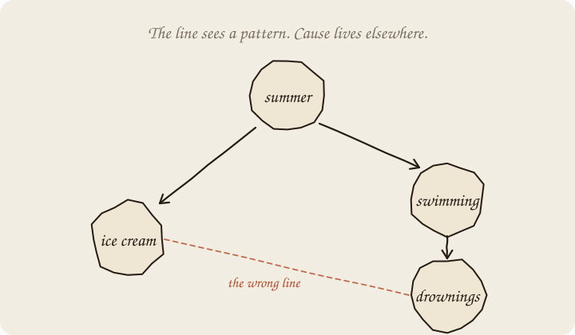

The line between ice cream and drownings would be steep and “significant” — and still **wrong as a story**.

Linear regression finds **patterns**.
Cause is on you: experiment, time, domain knowledge.

More traps:

| trap | picture |
|---|---|
| outlier | One far-away point **yanks** the whole line |
| measure only one range | Infer from 18-year-olds to toddlers |
| predict past the data | Line at x = 200 hours → grade 220. Nonsense |
| y drives x | Bad grade → then more studying. Arrow the wrong way |

---

## Page 13 — More than one x

So far: **one** x. Hours, a **line**.

Often you have two levers. Hours **and** sleep. Same machine. The picture changes:

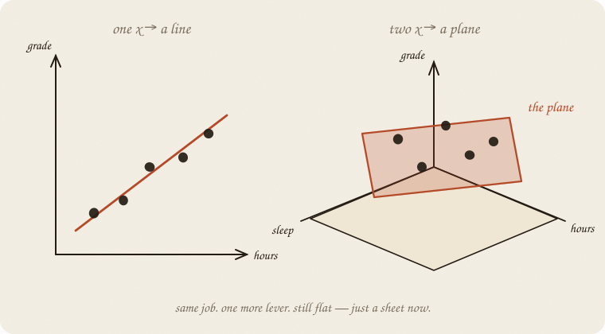

$$\text{grade} \approx a + b_1\cdot\text{hours} + b_2\cdot\text{sleep}$$

Still “linear”: each lever has **one fixed add-on**. No bend. Only now the fit is a **flat plane** through a 3-D cloud, not a line through a 2-D one.

Each *b* is still “+1 on that lever, on average.” The new phrase: **holding the other lever still.** Without it you misread *b*. (The eight people on page 1 have no sleep column. This page is the shape, not a fitted number.)

A third lever is the same trick in a space you cannot draw. If two levers say almost the same thing — hours studied and minutes studied — they **fight**. One *b* goes huge, the other huge the other way. Net effect maybe fine; the story is garbage. The textbook name is **multicollinearity**. Ridge is the seatbelt ([[02 ridge regression]]).

---

## Page 14 — What the computer does inside (no panic)

You do not need to derive the formula. Just see the landscape.

Think of a and b as coordinates on the floor. At every spot you measure the sum of squared errors. That makes a bowl.

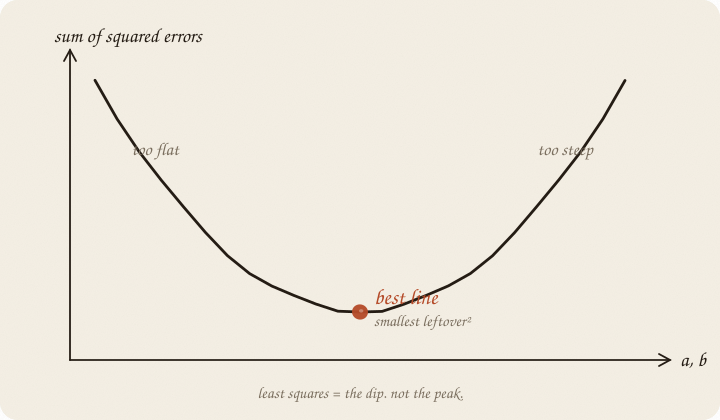

The computer rolls to the lowest point. Done.

For a straight line there is **one** clear dip. That is why simple linear regression is well-behaved: one answer, no magic. When there is no formula for the bottom, you **walk** the bowl: [[01 gradient descent]].

---

## Page 15 — Mini recipe

1. **Question.** What do I want to predict? That is y.
2. **Lever.** What do I have beforehand? That is x. (Or several x.)
3. **Draw the points.** Look at the cloud. Rising? Bent? Outliers?
4. **Draw the line.** Computer: least squares.
5. **Read b.** “+1 on x goes with +b on y.”
6. **Look at residuals.** Systematic misses? Then the line is too dumb.
7. **Treat R² as volume**, not as truth.
8. **Think about cause separately.** Pattern ≠ mechanism.

If you keep only one thing:

> cloud → line → ŷ = a + b x → prediction + humility

---

## Page 16 — Eight people, in sklearn

Same eight rows as page 1. No pipeline, no scaling. Just the line. One *x*, least squares: scale does not change the story. Ridge will tax **size**, so it will **demand** a scaler ([[02 ridge regression]], page 10). Not tonight.

```python
from sklearn.linear_model import LinearRegression
import numpy as np

hours = np.array([1, 2, 2, 3, 4, 5, 5, 6]).reshape(-1, 1)
grade = np.array([3, 4, 3, 5, 6, 7, 6, 8])

line = LinearRegression().fit(hours, grade)
print(f"ŷ = {line.intercept_:.2f} + {line.coef_[0]:.2f} · hours")
print("3 hours →", round(line.predict([[3]])[0], 2))
print("4 hours →", round(line.predict([[4]])[0], 2))
print("R² =", round(line.score(hours, grade), 3))
```

```
ŷ = 1.75 + 1.00 · hours
3 hours → 4.75
4 hours → 5.75
R² = 0.936
```

Same numbers as the sketchbook. `.score` is R² on *these* eight people — pride, not a test. Next person: different sketchbook, or at least a split. Do not copy this unscaled fit into lasso or elastic-net. Those taxes care how big the knobs are written.

---

## Last page — cheat sheet

| symbol | meaning |
|---|---|
| ŷ = a + b x | the line |
| a | intercept (x = 0) |
| b | slope, effect of +1 x |
| ŷ | prediction (“y hat”) |
| y | real value |
| y − ŷ | residual / error |
| R² | share of scatter explained on *these* people, 0 to 1 |

Best line = smallest sum of (residuals)².
It always goes through the centroid (x̄, ȳ).

**linear** — effect the same size everywhere (no bend).
**cause** — extra. Not inside the formula.

### Use / skip

**Reach for it when** *y* is a real number, the cloud looks like a straight smear, and you want a sentence: “+1 on *x* goes with +b on *y*.”

**Skip it when** *y* is yes/no ([[01 logistic regression]]); *y* is a count that cannot go negative ([[06 GLM]]); the cloud bends; one point yanks the line (try [[02 ridge regression]]); you have more levers than people.

**Pays you:** simple, fast, knobs you can read. The starting machine.

**Costs you:** no legal region for ŷ. Outliers scream. Twin *x* fight (multicollinearity). Cause is not in the formula. A later tax on size ([[02 ridge regression]], [[03 lasso]]) needs **scale** first — this notebook did not.

---

*Sketched as a notebook, not a lecture. If the line goes feral: [[02 ridge regression]]. If *y* is yes/no: [[01 logistic regression]].*
