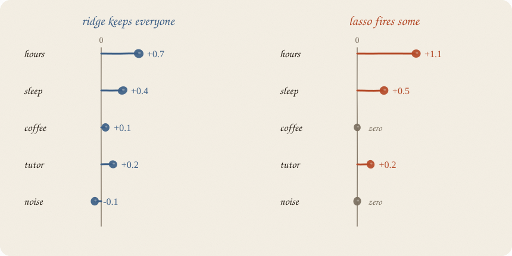
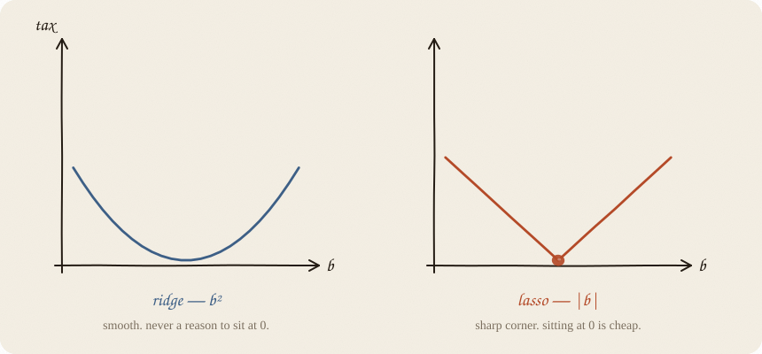
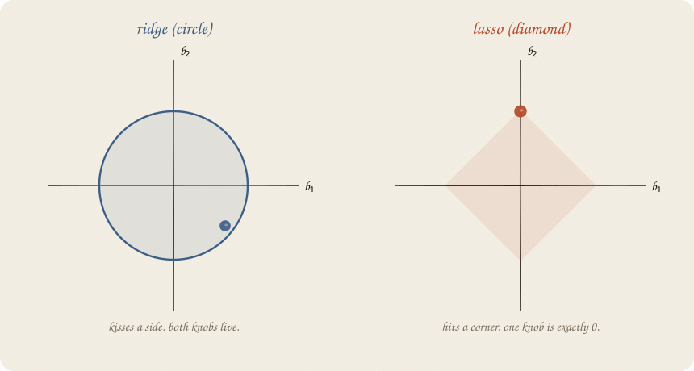
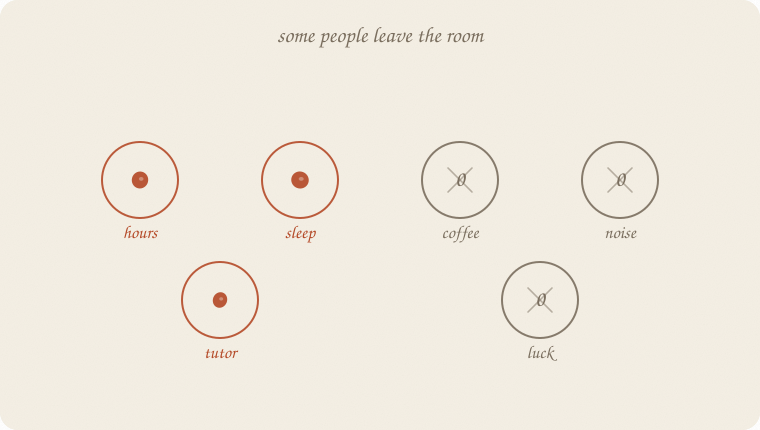
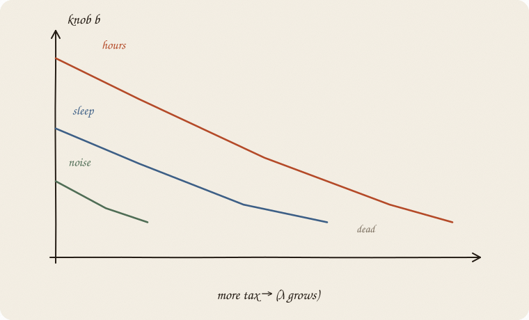
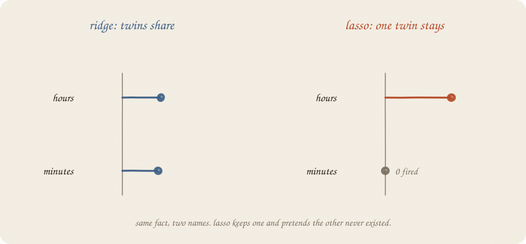
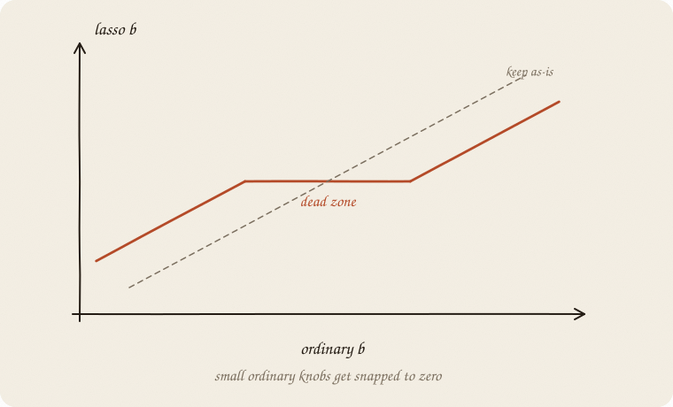
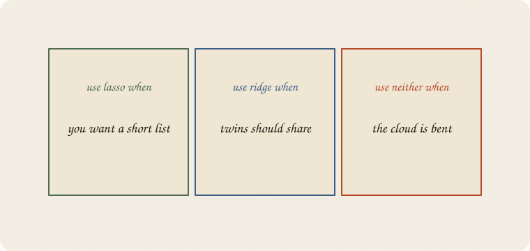

---
tags:
  - sketchbook
  - statistics
  - ml
aliases:
  - Lasso
  - Lasso Regression Sketchbook
  - lasso
---

# Lasso — a sketchbook

> [!abstract] In one sentence
> Same line, different tax: **pay for the size of each knob, not the square.** Small knobs get **snapped to zero**. Some *x* leave the room.



Read [[01 linear regression]] then [[02 ridge regression]]. This is the sibling ridge almost introduced: the one that **fires people**.

Flip it like a notebook. One page = one idea. Done.

---

## Page 1 — Ridge kept everyone

Ridge’s personality: *turn the volume down. Nobody leaves.*

Hours, sleep, coffee, tutor, noise — all still in the model, just quieter.

Sometimes you do not want quieter.
You want **shorter**.

A grade model with 40 levers is a pain to read. A grade model with 3 levers is a sentence:

> grade ≈ hours + sleep + tutor

That is lasso’s job. Not a new shape of line. A **haircut**.

---

## Page 2 — Change the tax, not the line

Still:

$$\hat y = a + b_1 x_1 + b_2 x_2 + \cdots$$

Still: make residuals small.

Ridge added:

> λ × (knobs)²

Lasso adds:

> λ × |knobs|

Absolute value. The *size*, not the square.



The ridge tax is a **smooth U**. Near zero it is almost flat. There is never a special reason to sit *exactly* at 0. So knobs shrink and linger.

The lasso tax is a **V**. A sharp corner at zero. Sitting at 0 is cheap, and leaving 0 has a real first step of cost. So some knobs **die**.

Same λ idea: louder tax → more death.

---

## Page 3 — Why a diamond kills

Two knobs on the page. Ridge’s fence was a **circle** around zero. Lasso’s fence is a **diamond**.



The ordinary “best” still lives somewhere out in the residual rings.

The allowed region is now a diamond. Best allowed point = where a ring **kisses** the diamond.

Circles get kissed on a **side**. Both knobs stay alive.
Diamonds often get kissed on a **corner**. A corner means one knob is exactly 0.

That is the whole trick, as a picture. Corners create zeros.

---

## Page 4 — Some people leave the room

After lasso, the roster looks different.



Hours: stays.
Sleep: stays.
Tutor: stays.
Coffee, luck, noise: **0**. Gone from the sentence.

Not “tiny.” **Zero.** You can drop the column.

Ridge never gives you that gift. Lasso’s whole personality is that gift.

> [!tip] Margin note
> Zero is a selection. The model is saying: *I can explain the cloud without you.* That can be right. It can also be rude to a useful-but-quiet *x*.

---

## Page 5 — The path: knobs die as the tax grows

Start with λ = 0. Ordinary line. Everyone in, drama allowed.

Turn λ up. Watch the knobs.



Noise dies first. Then maybe coffee. Hours hangs on the longest.

This drawing is a **lasso path**. One picture of “who matters,” in order.

You still pick λ the ridge way: hide people, score the hidden ones, find the sweet spot. The path is how you *see* what that λ is doing.

---

## Page 6 — Twins: lasso picks a favorite

Hours studied and minutes studied. Same fact, two names.

Ridge: they share the job. Two modest knobs.

Lasso: often **keeps one and fires the other.**



The leftover after “hours” is already explained. Minutes has nothing new to say. The diamond is happy to park minutes at a corner.

So: lasso is a great **shortlist** tool.
It is a shaky **fairness** tool when *x* are copies of each other. The one that survives is a bit of luck (who was scaled how, tiny noise). Do not write a story about why *hours* won and *minutes* lost.

---

## Page 7 — The dead zone

Another way to feel it. Compare ordinary *b* to lasso *b*.



Small ordinary knobs fall in a **dead zone** and get snapped to 0.
Big ones survive, a bit shrunken.

People call this **soft thresholding** when there is one *x* (or when the *x* are not tangled). Fancy name. Picture: a gap around zero that eats weak signals.

That is why lasso is both a shrinker *and* a selector.

---

## Page 8 — Scale, still. Always.

Same warning as ridge, louder.

Lasso’s tax cares about **how big the number looks**.
Hours in the 1–6 range vs minutes in the 60–360 range: the tax is unfair unless you scale first.

Recipe, unchanged:

1. Subtract each *x*’s average.
2. Divide by its spread.
3. *Then* run lasso.

Skip this and you are selecting on units, not on meaning.

---

## Page 9 — When to use it



**Lasso** — you want a short list. Many *x*, most probably junk. You would like a sentence, not a committee.

**Ridge** — the *x* are real and often twins. You want them to share, not to hold a talent show.

**Neither** — the cloud is bent. A straight line with a fancier tax is still a straight line.

Lasso does **not** invent cause. A zero means “not useful for this prediction, in this sample.” It does not mean “this thing does not matter in the world.”

---

## Page 10 — Mini recipe

1. **Same line as always.** ŷ = a + b’s.
2. **Tax |b| instead of b².** Sharp corner at zero.
3. **Scale the *x* first.** Always.
4. **Pick λ** by hiding people. Path picture optional, useful.
5. **Read the zeros as a shortlist**, not as a moral verdict.
6. **If twins fight,** do not trust which one survived. Try elastic net next.

If you keep only one thing:

> ridge shrinks. lasso shrinks *and* fires.

---

## Page 11 — Shortlist, in sklearn

Same eighty students as the ridge page. Lasso, scaled, `alpha=0.18`. Watch who leaves.

```python
import numpy as np
from sklearn.linear_model import Lasso
from sklearn.model_selection import train_test_split
from sklearn.pipeline import make_pipeline
from sklearn.preprocessing import StandardScaler

rng = np.random.default_rng(7)
n = 80
hours = rng.uniform(1, 6, n)
sleep = rng.uniform(4, 9, n)
tutor = (rng.random(n) > 0.6).astype(float)
coffee = rng.uniform(0, 4, n)
noise = rng.normal(0, 1, n)
minutes = hours * 60 + rng.normal(0, 3, n)
naps = sleep + rng.normal(0, 0.25, n)
grade = 1.8 + 0.9 * hours + 0.35 * sleep + 0.6 * tutor + rng.normal(0, 0.55, n)

X = np.column_stack([hours, minutes, sleep, naps, tutor, coffee, noise])
names = ["hours", "minutes", "sleep", "naps", "tutor", "coffee", "noise"]
Xtr, Xte, ytr, yte = train_test_split(X, grade, test_size=0.3, random_state=0)

lasso = make_pipeline(StandardScaler(), Lasso(alpha=0.18, max_iter=10_000)).fit(Xtr, ytr)
b = lasso.named_steps["lasso"].coef_

print(f"intercept  {lasso.named_steps['lasso'].intercept_:7.3f}")
for name, c in zip(names, b):
    mark = "  ← 0" if abs(c) < 1e-8 else ""
    print(f"{name:10s} {c:7.3f}{mark}")

kept = [name for name, c in zip(names, b) if abs(c) > 1e-8]
print("stayed:", ", ".join(kept))
print("grade ≈", " + ".join(kept))
print(f"R² train {lasso.score(Xtr, ytr):.3f}   R² test {lasso.score(Xte, yte):.3f}")
```

```
intercept    7.418
hours        0.000  ← 0
minutes      0.970
sleep        0.293
naps         0.000  ← 0
tutor        0.034
coffee       0.000  ← 0
noise       -0.000  ← 0
stayed: minutes, sleep, tutor
grade ≈ minutes + sleep + tutor
R² train 0.802   R² test 0.724
```

Coffee and noise: fired. Good. Those were junk.
Naps: fired. Sleep’s cousin lost the talent show.
Hours: **also fired.** Minutes kept the job. Same fact, two names — lasso picked a favorite. Do not write a story about why minutes “mattered more.”

`alpha` is λ again. Bigger α, shorter sentence.

---

## Last page — cheat sheet

| | ridge | lasso |
|---|---|---|
| tax | b² | \|b\| |
| fence | circle | diamond |
| zeros | almost never | often |
| twins | share | one stays |
| good at | stable prediction | a short list |

λ still = volume of the tax.
Path = what happens as you turn λ.
Dead zone = small knobs get eaten.

### Use / skip

**Reach for it when** you have many *x* and want a **sentence**, not a committee. Most levers are probably junk. A shortlist is the point.

**Skip it when** twins should share (ridge or [[04 elastic-net]] — lasso fires one at random); you need every real lever kept, just quieter ([[02 ridge regression]]); the cloud is bent.

**Pays you:** zeros. Columns you can drop. A readable model.

**Costs you:** the surviving twin is a bit of luck. Weak-but-real *x* can die. Scale, then pick λ. A zero is not “this does not matter in the world.”

---

*Sibling of ridge. Next, if twins should share **and** junk should die: [[04 elastic-net]].*
