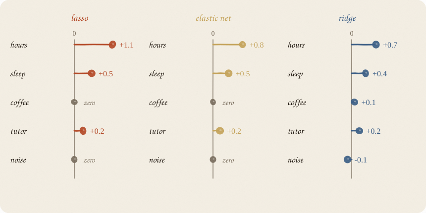
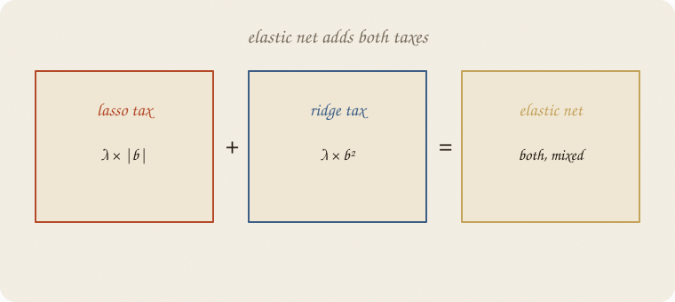
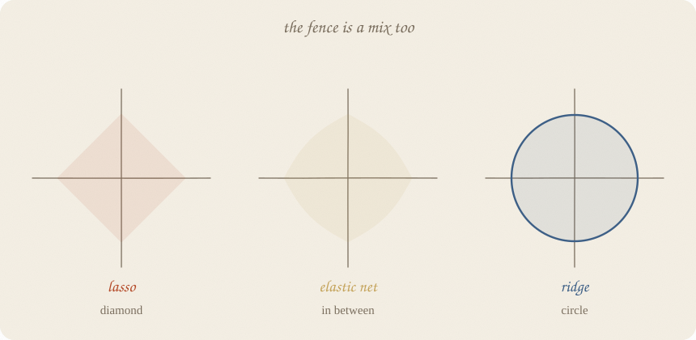
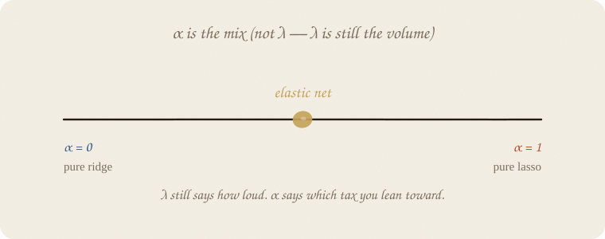
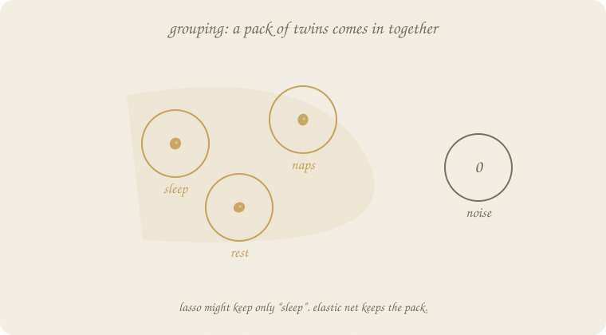
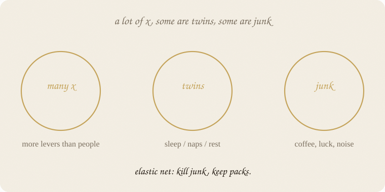

---
tags:
  - sketchbook
  - statistics
  - ml
aliases:
  - Elastic Net
  - Elastic-Net Sketchbook
  - elastic-net
---

# Elastic net — a sketchbook

> [!abstract] In one sentence
> **Lasso’s haircut + ridge’s sharing.** Junk can still die. Twins get to stay in the room together.



Read [[03 lasso]] and [[02 ridge regression]] first. Elastic net is the compromise kid.

Flip it like a notebook. One page = one idea. Done.

---

## Page 1 — Two good personalities, two bad habits

Ridge: everyone quieter. Twins share. Junk also stays, whispering.

Lasso: a short list. Junk dies. Twins hold a talent show and one gets fired — often by luck.

You often want **both** gifts:

- kill the noise
- keep a pack of related *x* together

That mix is **elastic net**.

Not a new shape of line. Both taxes, at once.

---

## Page 2 — Add both taxes

Still ŷ = a + b’s.
Still: small residuals, please.

Elastic net’s score:

> how wrong on the points
> **+** a lasso tax on |b|
> **+** a ridge tax on b²



The V *and* the U. Sharp corner (so zeros can happen) plus a smooth bowl (so twins are not forced into a knife-fight).

λ is still **how loud**.
A second knob, **α** (alpha), says **which tax you lean toward.**

---

## Page 3 — The fence in between

Ridge: circle.
Lasso: diamond.
Elastic net: a **rounded diamond**. Corners exist, but they are less stabby. Sides bulge toward a circle.



Corners still let a knob hit exactly 0. So selection lives.
The bulge means the kiss-point can sit on an edge with **two modest knobs**, not just one winner. So grouping lives.

If you only remember the picture: *diamond enough to fire, circle enough to share.*

---

## Page 4 — The twin test, three ways

Hours and minutes. Same fact.


| | hours | minutes | vibe |
|---|---:|---:|---|
| lasso | big | 0 | one favorite |
| elastic net | medium | medium | they share |
| ridge | medium | medium | they share — and so does junk |

Elastic net is lasso’s shortlist with ridge’s manners toward copies.

---

## Page 5 — α is the mix

Do not confuse the two knobs.

- **λ** — volume. How hard you squeeze.
- **α** — recipe. How much of the squeeze is lasso vs ridge.



| α | you are basically doing |
|---|---|
| 0 | pure ridge. no zeros. |
| 1 | pure lasso. talent show for twins. |
| in between | elastic net. the point. |

People argue about the spelling of α. Some code uses the opposite mix. Read the help text once. The idea does not change: **one slider from “share” to “fire.”**

Pick both knobs by hiding people. Two knobs is more fussy than one. That is the tax you pay for the extra personality.

---

## Page 6 — Grouping: a pack comes in together

Sleep, naps, rest. Three names for “are you tired.”

Lasso often keeps *sleep* and zeros the cousins, even if they all carry a bit of signal.

Elastic net likes to **bring the pack**.



The leftover after one cousin still looks a lot like the other cousins. Ridge-tax says: share. Lasso-tax says: you may still zero *luck* and *coffee*.

That is why people reach for elastic net in “wide” data: lots of *x*, clusters of twins, plus junk.

---

## Page 7 — When it shines



Picture:

- more levers than people
- some levers are copies / cousins
- some levers are junk

Then:

> **kill junk, keep packs.**

If you have one honest *x* and plenty of points: ordinary line. Do not get fancy.
If every *x* is a real, separate thing: ridge is enough.
If you want the shortest possible sentence and you do not mind a random twin dying: lasso.

Elastic net is the default once the spreadsheet gets wide.

Scale first. Same sermon. Elastic net’s taxes still care how big the numbers look.

---

## Page 8 — Mini recipe

1. **Same line.** ŷ = a + b’s.
2. **Pay |b| and b².** Corner plus bowl.
3. **Scale the *x*.** Always.
4. **α** = mix (0 ridge … 1 lasso). **λ** = volume.
5. **Tune on hidden people.** Both knobs.
6. **Read zeros as junk (maybe).** Read small packs as cousins, not as three independent miracles.

If you keep only one thing:

> lasso fires. ridge shares. elastic net does both.

---

## Page 9 — Packs, in sklearn

Same **thirty** students as ridge and lasso. Same grade recipe. Elastic net, scaled, `alpha=0.40`, `l1_ratio=0.5` (half V, half U). Mix still half and half; λ a bit louder so junk actually dies on this small class.

```python
import numpy as np
from sklearn.linear_model import ElasticNet
from sklearn.model_selection import train_test_split
from sklearn.pipeline import make_pipeline
from sklearn.preprocessing import StandardScaler

rng = np.random.default_rng(7)
n = 30
hours = rng.uniform(1, 6, n)
sleep = rng.uniform(4, 9, n)
tutor = (rng.random(n) > 0.6).astype(float)
coffee = rng.uniform(0, 4, n)
noise = rng.normal(0, 1, n)
minutes = hours * 60 + rng.normal(0, 3, n)
naps = sleep + rng.normal(0, 0.25, n)
grade = 1.8 + 0.9 * hours + 0.35 * sleep + 0.6 * tutor + rng.normal(0, 0.55, n)

X = np.column_stack([hours, minutes, sleep, naps, tutor, coffee, noise])
names = ["hours", "minutes", "sleep", "naps", "tutor", "coffee", "noise"]
Xtr, Xte, ytr, yte = train_test_split(X, grade, test_size=0.3, random_state=0)

en = make_pipeline(
    StandardScaler(),
    ElasticNet(alpha=0.40, l1_ratio=0.5, max_iter=10_000),
).fit(Xtr, ytr)
b = en.named_steps["elasticnet"].coef_

print(f"intercept  {en.named_steps['elasticnet'].intercept_:7.3f}")
for name, c in zip(names, b):
    mark = "  ← 0" if abs(c) < 1e-8 else ""
    print(f"{name:10s} {c:7.3f}{mark}")

kept = [name for name, c in zip(names, b) if abs(c) > 1e-8]
fired = [name for name, c in zip(names, b) if abs(c) <= 1e-8]
print("stayed:", ", ".join(kept))
print("fired: ", ", ".join(fired))
print(f"R² train {en.score(Xtr, ytr):.3f}   R² test {en.score(Xte, yte):.3f}")
```

```
intercept    7.241
hours        0.547
minutes      0.517
sleep        0.055
naps         0.074
tutor        0.296
coffee       0.000  ← 0
noise        0.000  ← 0
stayed: hours, minutes, sleep, naps, tutor
fired:  coffee, noise
R² train 0.858   R² test 0.776
```

Intercept **7.241** — same trainers as ridge and lasso.
Coffee and noise: gone. Junk died.
Hours and minutes: **0.55 and 0.52.** Twins share, no talent show. Lasso on this class fired minutes.
Sleep and naps: both still in the room — quieter, not fired. Lasso kept only naps.

`l1_ratio` is α in the sketchbook (1 = pure lasso, 0 = pure ridge). `alpha` is still λ, the volume.

---

## Last page — cheat sheet

| | tax | fence | zeros | twins |
|---|---|---|---|---|
| ridge | b² | circle | no | share |
| lasso | \|b\| | diamond | yes | one stays |
| elastic net | both | rounded diamond | yes | share, then maybe fire junk |

α = which tax you lean toward.
λ = how loud.

### Use / skip

**Reach for it when** the spreadsheet is wide: more levers than people, **packs of twins**, plus junk. You want junk to die and cousins to come in together.

**Skip it when** one honest *x* already does the job; every *x* is a real separate thing (ridge is enough); you want the shortest possible sentence and you do not mind a random twin dying (lasso).

**Pays you:** both gifts. Kill junk, keep packs. Default once the sheet gets wide.

**Costs you:** two knobs (λ and α) to tune. Still a straight score. Still not cause.

---

*Compromise kid. If you want to **watch** knobs walk in one by one, that walk has a name: [[05 LARS]].*
