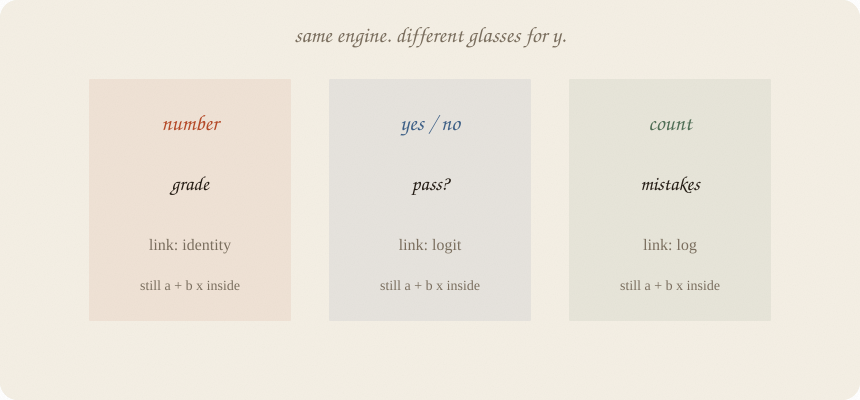
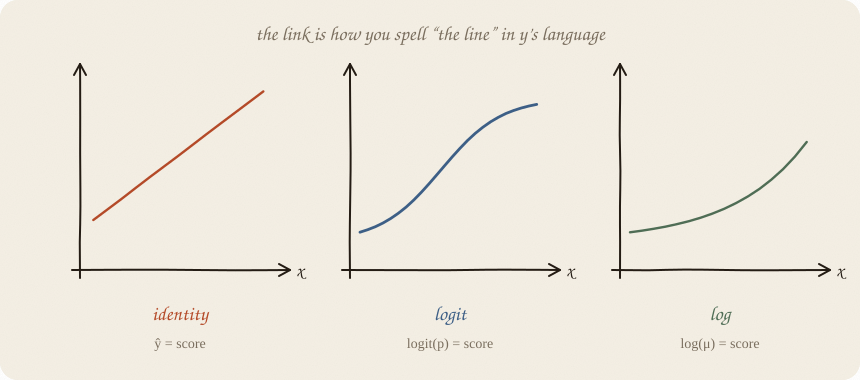
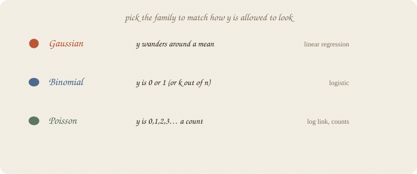
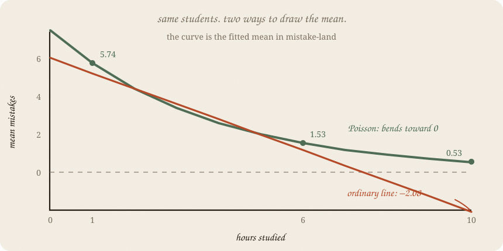

---
tags:
  - sketchbook
  - statistics
  - ml
aliases:
  - GLM
  - Generalized Linear Model
  - GLM Sketchbook
---

# GLM — a sketchbook

> [!abstract] In one sentence
> **One engine, different glasses for y.** Inside: still a + b x. Outside: a **link** that speaks grade, pass/fail, or a count of mistakes.



Read [[01 linear regression]] and [[01 logistic regression]]. Those two are not strangers. They are the same machine in two outfits. This note is the family portrait.

Flip it like a notebook. One page = one idea. Done.

---

## Page 1 — y is not always a grade

The regression shelf assumed *y* could sit anywhere on a number line. Grades. Heights. Minutes.

Sometimes *y* is **yes/no**.
Sometimes *y* is **0, 1, 2, 3…** — how many mistakes on the exam.
Sometimes *y* is a wait time that cannot go negative.

Ordinary least squares will still fit a line. It will also predict −4 mistakes at 10 hours. The math does not blush. You should.

**GLM** = generalized linear model. Ugly name. Friendly idea: *keep the linear score, change how it becomes ŷ, change what leftovers are allowed to look like.*

---

## Page 2 — Three pieces, not a new religion

Every GLM has three knobs of *kind*, not of number:

1. **The score.** a + b x. Same as always. This is the “linear.”
2. **The link.** How that score is spelled in *y*’s language.
3. **The family.** What shape of leftover *y* is allowed (Gaussian blob, coin flips, counts, …).

You do not pick a mysterious “GLM algorithm.” You pick **how y is allowed to look**, and the rest follows.

Logistic was already this: binomial family, logit link, linear score.

---

## Page 3 — The link is the translation



| link | says | you already know it as |
|---|---|---|
| identity | ŷ = score | linear regression |
| logit | logit(p) = score | logistic |
| log | log(μ) = score | counts, that stay positive |

Identity: score *is* the guess. Grades.
Logit: score is log-odds. Then the S. Pass/fail.
Log: score is log(mean). Exponentiate, never negative. Number of mistakes.

The link is not decoration. It is the promise that ŷ will not wander into a nonsense region.

---

## Page 4 — The family is how y is allowed to rattle



**Gaussian** — leftovers are a blob around the mean. Classic line. Grades.

**Binomial** — each person is a coin with probability *p*. Pass/fail. Logistic.

**Poisson** — *y* is a count. Mean = variance, roughly. Mistakes, emails, accidents.

Wrong family: you can still get a number out. It will lie about uncertainty, and sometimes about the mean too. Pick the family by looking at *y*, not by looking at a menu of functions.

---

## Page 5 — Counts: a line that cannot go negative

Same students. Now *y* = **how many mistakes** on the exam. More hours → fewer mistakes. Never below 0.



A Poisson GLM with a log link:

$$\log(\text{mean mistakes}) = a + b \cdot \text{hours}$$

The straight line lives on the hidden **log(mean)** scale. The curve is what we see back in mistake-land:

$$\text{mean mistakes} = e^{a + b \cdot \text{hours}}$$

Here, *b* = −0.264. One extra hour multiplies the mean by $e^{-0.264} \approx 0.77$ — about **23% fewer expected mistakes**, wherever you start.

On these data, the Poisson curve goes from 5.74 mistakes at 1 hour to 1.53 at 6 hours. The ordinary line looks similar nearby, but by 10 hours it predicts **−2.08 mistakes**. The Poisson curve stays above zero. That is the glasses working.

---

## Page 6 — What GLM is not

Not a tree. Not a neural net. The score is still a line. If hours help, then plateau, then hurt, a GLM will not discover that S-bend for you unless you feed it a bent *x*.

Not automatic. “Run GLM” without choosing family + link is just linear regression in a fancier coat.

Not a cause machine. Same sermon as the first sketchbook.

Ridge / lasso taxes still exist on top of a GLM (penalized GLMs). Different sequel. Same tax idea.

---

## Page 7 — Mini recipe

1. **Look at y.** Number? Yes/no? Count? Time?
2. **Pick a family** that is allowed to look like that.
3. **Pick a link** so ŷ stays in the legal region (identity / logit / log).
4. **Keep the score linear.** a + b x.
5. **Read b in the link’s language.** Add for identity. Multiply odds for logit. Multiply the mean for log.
6. **If the leftover is the wrong shape,** you guessed the family. Don’t blame the score.

If you keep only one thing:

> linear inside. glasses outside. glasses chosen to match y.

---

## Page 8 — Mistakes, in sklearn

Same **thirty** students as ridge. Same hours, sleep, tutor. *y* is not a grade — it is a Poisson count of mistakes. PoissonRegressor uses a **log link**. LinearRegression is the identity-link cousin — and it will go negative if you ask it far enough.

```python
import numpy as np
from sklearn.linear_model import LinearRegression, PoissonRegressor

rng = np.random.default_rng(7)
n = 30
hours = rng.uniform(1, 6, n)
sleep = rng.uniform(4, 9, n)
tutor = (rng.random(n) > 0.6).astype(float)
lam = np.exp(2.4 - 0.35 * hours - 0.08 * (sleep - 6.5) - 0.4 * tutor)
mistakes = rng.poisson(lam)

ph = PoissonRegressor(alpha=0).fit(hours.reshape(-1, 1), mistakes)
lh = LinearRegression().fit(hours.reshape(-1, 1), mistakes)

print("poisson  log(mean) = "
      f"{ph.intercept_:.3f} + {ph.coef_[0]:.3f} · hours")
print("mean mistakes | 1 hour →", round(ph.predict([[1]])[0], 2))
print("mean mistakes | 6 hours →", round(ph.predict([[6]])[0], 2))
print("linear | 1 hour →", round(lh.predict([[1]])[0], 2))
print("linear | 6 hours →", round(lh.predict([[6]])[0], 2))
print("linear | 10 hours →", round(lh.predict([[10]])[0], 2))
```

```
poisson  log(mean) = 2.011 + -0.264 · hours
mean mistakes | 1 hour → 5.74
mean mistakes | 6 hours → 1.53
linear | 1 hour → 5.21
linear | 6 hours → 1.16
linear | 10 hours → -2.08
```

Poisson: about 6 mistakes down to about 1.5. Always positive.
Ordinary line: still fine at 6 hours, then **−2** at 10. The glasses were the point.

`alpha=0` turns the penalty off so this is a plain GLM, not a ridge-GLM. sklearn’s `score` here is D² (like R² for this family), not R².

---

## Last page — cheat sheet

| piece | job |
|---|---|
| score | a + b x. always |
| link | translates score → ŷ |
| family | how y rattles |
| identity + Gaussian | linear regression |
| logit + binomial | logistic |
| log + Poisson | counts |

### Use / skip

**Reach for it when** *y* is a count, a yes/no, a fraction, or anything with a **legal region** (can’t be negative, can’t exceed 1), and you still want readable knobs.

**Skip it when** a plain number and a straight cloud already fit ([[01 linear regression]]); you guessed the family because it sounded grown-up; the score itself should bend (trees, later shelves).

**Pays you:** one story for line, logistic, and counts. ŷ stays legal. *b* still has a sentence.

**Costs you:** you must choose glasses. Wrong family → smug, wrong uncertainty. Still linear inside.

---

*Family portrait of the linear score. Costumes named: [[01 distributions]]. Classification 01 is the yes/no outfit. Regression 01 is the grade outfit.*
