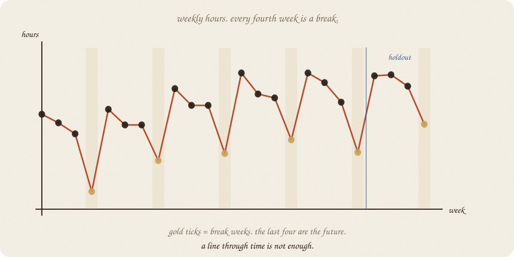
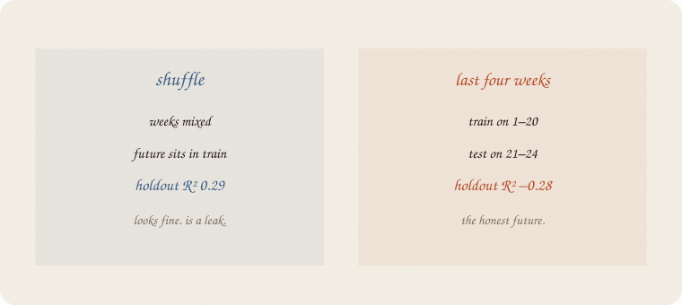
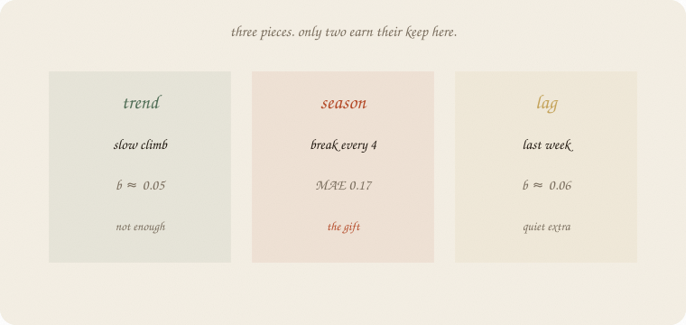
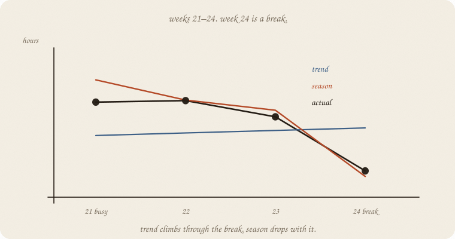
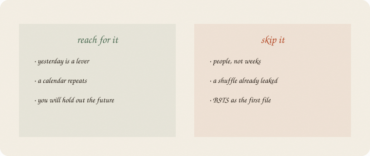

---
tags:
  - sketchbook
  - statistics
  - ml
aliases:
  - Time series
  - Lag trend season
  - Time Series Sketchbook
---

# Lag, trend, season — a sketchbook

> [!abstract] In one sentence
> The dots have an **order**. Last week can help guess this week (**lag**). A slow climb is **trend**. A repeating calendar dip is **season**. Train on the **past**; test on **later**.



One class, 24 weeks. Each week: **average hours studied**. Not eight people in a cloud. Extra office hours in week 17 is later ([[02 causal impact]]). This notebook is the furniture that campaign sits on; ordinary next-week forecasting starts at [[02 forecasting]].

---

## Page 1 — Hours, every week

One class. Each week: **average hours studied** — the whole room, not person 3.

The cloud is gone. Week 4 is after week 3. You cannot shuffle them.

The year we planted (tidy on purpose): a slow climb as the term gets harder (**trend**). Every **fourth** week a break — no classes, hours dip (**season**). Last week still smells a little like this week (**lag**).

A real calendar is messier. Name the beat you can name.

---

## Page 2 — Shuffle leaks the future

Fit a line on week-number only. Two tests.

**Shuffle** four weeks into a test set (sklearn’s habit). Holdout R² **0.29**. Looks like a line.

**Last four weeks** as the future. Train on 1–20. Holdout R² **−0.28**. MAE **0.60**. The line climbs through a break week it never learned.



The shuffle put a future break into train. That is cheating. Time’s rule:

> train on the past. test on **later**.

People call this a **holdout in time**. Same humility as R² on new people. The new people are next month.

---

## Page 3 — Three pieces



**Trend.** ŷ = a + b · week. Here b ≈ 0.05 hours per week. Real, small. Alone it cannot see the dip.

**Season.** A dummy for week-type (busy / mid / late / break). The break is about **−1.4** hours. That is the gift.

**Lag.** Last week’s hours as an extra *x*. After season is in, lag’s *b* is **0.06** — quiet. Yesterday was mostly the calendar repeating, not a leftover echo.

Name all three. Keep what earns the holdout.

---

## Page 4 — The future is a break week

Weeks 21–24. Week 24 is a break.



| | 21 | 22 | 23 | **24** | MAE |
|---|---:|---:|---:|---:|---:|
| actual | 5.08 | 5.11 | 4.79 | **3.72** | — |
| trend only | 4.42 | 4.47 | 4.52 | 4.57 | **0.60** |
| trend + season | 5.52 | 5.12 | 4.92 | **3.61** | **0.17** |
| copy last week | — | — | — | — | 0.89 |

Trend climbs through the break. Season drops with it. Copy-yesterday is worse than a line — week 23 is not a break, week 24 is.

Lag on top: MAE **0.16**. A hair. Season already did the work.

---

## Page 5 — Mini recipe

1. The dots have an **order**. If they are people with no week attached, that is a cloud ([[01 linear regression]]).
2. Hold out the **end**. Never shuffle.
3. Draw **trend**, then **season** (the calendar you can name), then **lag**.
4. Keep a piece only if the **future** got better.
5. Copy-yesterday is a baseline, not a model.
6. A campaign in week 20 is [[01 confounding]] *on a series*. Later. Need this 01 first.

If you keep only one thing:

> yesterday is a lever. the calendar repeats. test on later.

---

## Page 6 — 24 weeks, in sklearn

Last four weeks held out. Trend vs season vs a shuffled cheat.

```python
import numpy as np
from sklearn.linear_model import LinearRegression
from sklearn.model_selection import train_test_split

rng = np.random.default_rng(7)
n = 24
t = np.arange(n, dtype=float)
season = np.array([0.8, 0.4, 0.1, -1.4] * 6)
y = np.zeros(n)
noise = rng.normal(0, 0.25, n)
phi = 0.45
for i in range(n):
    base = 3.2 + 0.09 * t[i] + season[i]
    lag = 0.0 if i == 0 else (y[i - 1] - (3.2 + 0.09 * t[i - 1] + season[i - 1]))
    y[i] = base + phi * lag + noise[i]

print("hours", np.round(y, 2).tolist())
Xtr, ytr = t[:20].reshape(-1, 1), y[:20]
Xte, yte = t[20:].reshape(-1, 1), y[20:]
dummies = np.eye(4)[np.arange(n) % 4][:, :3]
ylag = np.r_[y[0], y[:-1]]

mt = LinearRegression().fit(Xtr, ytr)
print("trend-only     b", round(mt.coef_[0], 3),
      "  train R²", round(mt.score(Xtr, ytr), 2),
      "  holdout R²", round(mt.score(Xte, yte), 2),
      "  holdout MAE", round(np.abs(mt.predict(Xte) - yte).mean(), 2))

Xs_tr, Xs_te, ys_tr, ys_te = train_test_split(t.reshape(-1, 1), y, test_size=4, random_state=0)
ms = LinearRegression().fit(Xs_tr, ys_tr)
print("trend shuffled holdout R²", round(ms.score(Xs_te, ys_te), 2),
      "  MAE", round(np.abs(ms.predict(Xs_te) - ys_te).mean(), 2))

Xts = np.column_stack([t, dummies])
mts = LinearRegression().fit(Xts[:20], y[:20])
print("trend+season   holdout R²", round(mts.score(Xts[20:], y[20:]), 2),
      "  MAE", round(np.abs(mts.predict(Xts[20:]) - y[20:]).mean(), 2))

# lag on the holdout uses the *previous actual* week — one-step-ahead
# after each week arrives. Not a four-week forecast issued at week 20.
Xf = np.column_stack([t, dummies, ylag])
mf = LinearRegression().fit(Xf[:20], y[:20])
print(" + lag         holdout R²", round(mf.score(Xf[20:], y[20:]), 2),
      "  MAE", round(np.abs(mf.predict(Xf[20:]) - y[20:]).mean(), 2),
      "  lag b", round(mf.coef_[-1], 2))
print("holdout actual", np.round(y[20:], 2))
print("holdout trend ", np.round(mt.predict(Xte), 2))
print("holdout +seas ", np.round(mts.predict(Xts[20:]), 2))
print("naive last-week MAE", round(np.abs(y[19:23] - y[20:]).mean(), 2))
print("week type holdout", (np.arange(n) % 4)[20:].tolist(), "(0=busy … 3=break)")
```

```
hours [4.0, 3.76, 3.45, 1.83, 4.14, 3.7, 3.7, 2.7, 4.72, 4.25, 4.25, 2.9, 5.16, 4.57, 4.46, 3.28, 5.16, 4.89, 4.34, 2.93, 5.08, 5.11, 4.79, 3.72]
trend-only     b 0.049   train R² 0.11   holdout R² -0.28   holdout MAE 0.6
trend shuffled holdout R² 0.29   MAE 0.48
trend+season   holdout R² 0.82   MAE 0.17
 + lag         holdout R² 0.85   MAE 0.16   lag b 0.06
holdout actual [5.08 5.11 4.79 3.72]
holdout trend  [4.42 4.47 4.52 4.57]
holdout +seas  [5.52 5.12 4.92 3.61]
naive last-week MAE 0.89
week type holdout [0, 1, 2, 3] (0=busy … 3=break)
```

Shuffle looks kinder than the future (0.29 vs −0.28). Season turns the future honest (MAE 0.60 → 0.17) and catches week 24 (3.61 vs actual 3.72). Lag adds a hair — **one-step-ahead** (each holdout week may use the previous actual). Not a four-week forecast frozen at week 20. Copy-yesterday is the worst baseline on the page.

`t[:20]` is the past. `t[20:]` is later. `train_test_split` is the leak — printed so you can see it lie.

---

## Last page — cheat sheet

| word | meaning |
|---|---|
| series | dots with an order |
| trend | slow climb or fall |
| season | calendar beat (here: every 4th week) |
| lag | yesterday as *x* |
| holdout in time | train past, test later |
| leak | shuffle that puts the future in train |



### Use / skip

**Reach for it when**

- the dots have an **order** (weeks, days)
- a beat you can name (break week, Monday)
- you will test on **later**

**Skip it when**

- the dots are **people** ([[01 linear regression]])
- you already shuffled the weeks
- you wanted the campaign gap ([[02 causal impact]]) before trend and season

**Pays you:** season catches the break. The honest split for a forecast.

**Costs you:** lag after season can be a passenger. You named the calendar. A campaign still needs the fork ([[01 confounding]]).

---

*Yesterday is a lever. The gap after a start date: [[02 causal impact]]. Next: [[02 forecasting]].*
