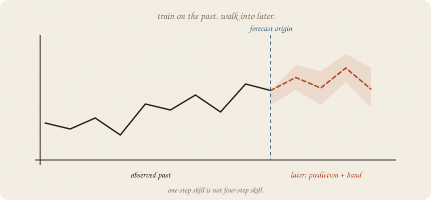

---
tags:
  - sketchbook
  - statistics
  - ml
aliases:
  - Forecasting
  - Forecasting Sketchbook
---

# Forecasting — a sketchbook

> [!abstract] In one sentence
> A forecast is a path into **later**: test it on the future you hid, and do not let a prediction secretly borrow the answer.



Read [[01 lag trend season]] first. That note named the furniture. This one asks how far ahead you are looking, how forecasts feed themselves, and how to score the future without shuffling it into the past. A regular forecast asks **what will probably happen next**; [[02 causal impact]] asks **what would have happened without the campaign**.

---

## Page 1 — One step or four?

At the end of week 20, you want weeks 21–24.

There are two jobs:

- **one-step ahead:** predict week 21, then wait for the real week 21 before predicting week 22
- **four-step ahead:** issue all four predictions at week 20, before any of the four answers arrives

The second job is harder. A one-step forecast can use yesterday’s actual value. A four-step forecast must use its own yesterday after the first step.

The **forecast horizon** is how far ahead you ask the machine to see.

---

## Page 2 — Your prediction becomes the next lever

Suppose the model says:

> tomorrow = trend + season + yesterday’s leftover

For one step, yesterday is real. For the next step in a four-week path, yesterday may be your prediction. The forecast begins to walk on its own footprints.

That is **recursive forecasting**. Small mistakes can echo. A model that wins at one step may wander at four.

Do not print a one-step score and call it a four-week forecast.

---

## Page 3 — The future gets its own pile

Training weeks 1–20 and testing weeks 21–24 is honest for this story. The test pile is later, not random.

For a longer series, use **rolling-origin evaluation**:

1. train up to week 20, forecast the next few weeks
2. move the origin to week 21, forecast again
3. repeat
4. average the errors by horizon

The score is not one trophy. Report horizon 1, horizon 2, and so on. A model can be calm tomorrow and lost next month.

---

## Page 4 — Baselines are small and serious

Always keep a dumb forecast nearby:

- **last value:** tomorrow equals today
- **seasonal last:** next break resembles the last break
- **drift:** the recent climb continues

If your clever model cannot beat the baseline on later weeks, it did not earn its adjectives.

Prediction intervals belong here too. A point forecast is the centre of a story. The interval shows how much the future can wander. That is different from a causal-impact counterfactual: there the path is not merely “next”; it is the missing no-campaign path ([[02 causal impact]]).

---

## Page 5 — Mini recipe

1. Name the horizon: one step, four steps, or longer.
2. Hold out the **end**. Never shuffle weeks.
3. Keep a naive baseline.
4. Fit trend, season, and lag only on the past.
5. For many steps, feed predictions back as lag values.
6. Score each horizon separately.
7. Draw a prediction band if the decision needs risk, not just a centre line.

If you keep only one thing:

> one-step skill is not four-step skill. Test the path you will actually use.

---

## Page 6 — Four weeks ahead, in numpy

Same planted series as [[01 lag trend season]]. The model learns trend + season on weeks 1–20, then recursively predicts the four later weeks. The naive forecast copies the last observed week.

```python
import numpy as np

rng = np.random.default_rng(7)
n = 24
t = np.arange(n, dtype=float)
season = np.array([0.8, 0.4, 0.1, -1.4] * 6)
y = np.zeros(n)
noise = rng.normal(0, 0.25, n)
phi = 0.45
for i in range(n):
    base = 3.2 + 0.09 * t[i] + season[i]
    lag = 0.0 if i == 0 else (y[i - 1] - (3.2 + 0.09 * t[i - 1] + season[i - 1]))
    y[i] = base + phi * lag + noise[i]

cut = 20
dummies = np.eye(4)[np.arange(n) % 4][:, :3]
X = np.column_stack([np.ones(n), t, dummies])
beta = np.linalg.lstsq(X[:cut], y[:cut], rcond=None)[0]

future = []
for i in range(cut, n):
    future.append(np.dot(X[i], beta))

actual = y[cut:]
naive = np.repeat(y[cut - 1], n - cut)
forecast = np.array(future)
print("actual", np.round(actual, 2))
print("forecast", np.round(forecast, 2))
print("naive", np.round(naive, 2))
print("MAE forecast", round(np.abs(forecast - actual).mean(), 2))
print("MAE naive", round(np.abs(naive - actual).mean(), 2))
print("horizon MAE", np.round(np.abs(forecast - actual), 2))
```

```
actual [5.08 5.11 4.79 3.72]
forecast [5.52 5.12 4.92 3.61]
naive [4.79 4.79 4.79 4.79]
MAE forecast 0.17
MAE naive 0.5
horizon MAE [0.44 0.01 0.13 0.11]
```

The seasonal forecast beats copying the last week. Week 24 is a break, so the model falls. This is a four-step path issued at week 20, not a one-step score wearing a longer coat.

---

## Last page — cheat sheet

| word | meaning |
|---|---|
| horizon | how far into later you forecast |
| one-step | wait for each actual before the next forecast |
| recursive | feed predictions back as future lag values |
| rolling origin | move the train/test boundary through time |
| baseline | small forecast that must be beaten |
| prediction interval | plausible range for a future observation |

### Use / skip

**Reach for it when**

- the next values matter
- the dots have an order
- you can keep the future hidden until scoring

**Skip it when**

- the rows are people with no time order ([[01 linear regression]])
- you shuffled the future into training
- you only wanted the campaign gap ([[02 causal impact]])

**Pays you:** a forecast tested at the horizon you actually need.

**Costs you:** long paths compound mistakes. A forecast is not a promise; report its horizon and baseline.

---

*Time 02. The future is a path, not a random test row. Next: memory in the leftover — [[03 ARIMA]].*
