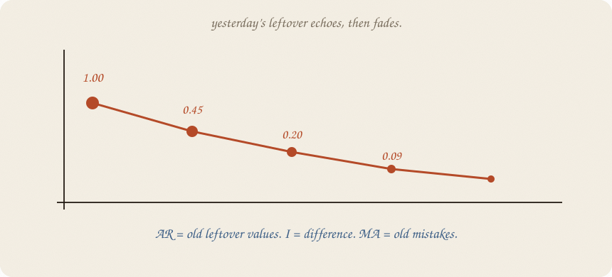

---
tags:
  - sketchbook
  - statistics
  - ml
aliases:
  - ARIMA
  - ARIMA Sketchbook
---

# ARIMA — a sketchbook

> [!abstract] In one sentence
> ARIMA gives the leftover a named memory: remove a trend when needed, let old leftover echo forward, and forecast the next echo.



Read [[01 lag trend season]] and [[02 forecasting]] first. They taught order, honest holdouts, and horizon. ARIMA is a compact name for what the leftover keeps remembering. If the question changes from “what comes next?” to “what would have happened without a campaign?”, open [[02 causal impact]].

---

## Page 1 — The leftover has a memory

Trend + season can explain the calendar and still leave a residue.

If a high week tends to be followed by another high week, the residue has memory. If a low miss tends to be followed by a low miss, the model is late to the room.

ARIMA gives that memory a job:

- **AR:** old values of the leftover help guess today’s leftover
- **I:** difference the series when a climb makes it non-stationary
- **MA:** old forecast mistakes help explain today’s value

The letters are a filing cabinet, not the lesson. The lesson is named memory in the leftover.

---

## Page 2 — The I is a difference

If a series climbs, its level is not stable. Difference it:

$$\Delta y_t = y_t - y_{t-1}$$

Now ask whether the changes have a stable pattern. Difference once, twice, or not at all — that is the **I** order.

Do not difference a clean seasonal pattern just because ARIMA has an I in its name. [[01 lag trend season]] may already have the right calendar furniture.

---

## Page 3 — AR is yesterday’s leftover

Let *e* be actual minus trend + season.

$$e_t = \phi e_{t-1} + \text{new shock}$$

If φ = 0.45, yesterday’s miss leaves 45% of itself in today’s miss. The echo fades:

**1.00 → 0.45 → 0.20 → 0.09**

That is why an AR forecast settles back toward the structural path instead of copying yesterday forever.


---

## Page 4 — MA remembers the mistake

An **MA** term is not a moving average of the raw series. It remembers old **forecast errors**.

If the model was surprised upward yesterday, today’s forecast can account for part of that surprise. AR remembers the old leftover. MA remembers the old miss made by the model.

Real ARIMA models can use both. This sketchbook keeps one AR echo visible so the idea does not disappear inside a parameter list.

---

## Page 5 — Mini recipe

1. Plot the series before naming a model.
2. Remove a trend only if the level keeps wandering.
3. Inspect leftover memory after trend / season.
4. Fit a small AR order before shopping for a large one.
5. Hold out later weeks and score the actual horizon ([[02 forecasting]]).
6. Compare with last-value and seasonal baselines.

If you keep only one thing:

> ARIMA is not a magic brand. It is memory, difference, and forecast errors arranged in a small machine.

---

## Page 6 — Echo after trend and season, in numpy

This tiny run fits trend + season on the past, estimates one AR coefficient in the leftover, and recursively carries that echo through the four-week holdout.

```python
import numpy as np

rng = np.random.default_rng(7)
n = 24
t = np.arange(n, dtype=float)
season = np.array([0.8, 0.4, 0.1, -1.4] * 6)
y = np.zeros(n)
noise = rng.normal(0, 0.25, n)
phi_true = 0.45
for i in range(n):
    base = 3.2 + 0.09 * t[i] + season[i]
    lag = 0.0 if i == 0 else (y[i - 1] - (3.2 + 0.09 * t[i - 1] + season[i - 1]))
    y[i] = base + phi_true * lag + noise[i]

cut = 20
dummies = np.eye(4)[np.arange(n) % 4][:, :3]
X = np.column_stack([np.ones(n), t, dummies])
beta = np.linalg.lstsq(X[:cut], y[:cut], rcond=None)[0]
fitted = X[:cut] @ beta
resid = y[:cut] - fitted
phi = np.dot(resid[1:], resid[:-1]) / np.dot(resid[:-1], resid[:-1])

base_future = X[cut:] @ beta
echo = resid[-1]
forecast = []
for base in base_future:
    echo = phi * echo
    forecast.append(base + echo)

actual = y[cut:]
print("estimated AR phi", round(phi, 2))
print("actual", np.round(actual, 2))
print("ARIMA-style forecast", np.round(forecast, 2))
print("MAE", round(np.abs(np.array(forecast) - actual).mean(), 2))
```

```
estimated AR phi 0.42
actual [5.08 5.11 4.79 3.72]
ARIMA-style forecast [5.37 5.06 4.9 3.61]
MAE 0.15
```

The old leftover echo helps a little here. It fades each step. This is an ARIMA-style teaching loop, not a claim that four points can identify the best order.

---

## Last page — cheat sheet

| word | meaning |
|---|---|
| AR | old leftover values echo forward |
| I | difference the series to remove wandering level |
| MA | old forecast errors echo into the fit |
| ARIMA | AR + I + MA family |
| stationary | pattern whose basic behaviour does not drift |
| order | how many lags / differences / errors you keep |

### Use / skip

**Reach for it when**

- leftover still has memory after trend and season
- you have enough ordered history to estimate that memory
- you test the chosen order on later weeks

**Skip it when**

- season alone already wins
- you have 24 points and want a catalogue of orders
- you need an outside predictor known in the future ([[04 ARIMAX]])

**Pays you:** a compact language for memory in the leftover.

**Costs you:** order selection is easy to overfit. Differencing can erase useful structure. Small histories do not deserve grand certainty.

---

*Time 03. Trend and season are furniture; ARIMA names the echo in the leftover. Next: [[04 ARIMAX]].*
