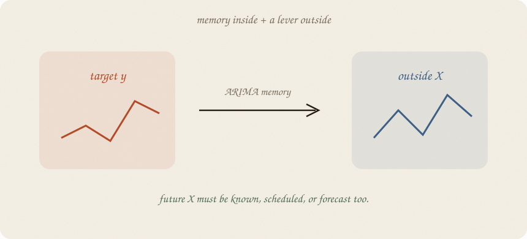

---
tags:
  - sketchbook
  - statistics
  - ml
aliases:
  - ARIMAX
  - ARIMAX Sketchbook
  - Dynamic regression
---

# ARIMAX — a sketchbook

> [!abstract] In one sentence
> ARIMAX is ARIMA with an outside lever: the series keeps its own memory, while a predictor explains movement — but you must know that predictor in the future.



Read [[01 lag trend season]], [[02 forecasting]], and [[03 ARIMA]] first. This is the short bridge from “the past echoes” to “the calendar or a known input also helps.”

---

## Page 1 — The X is outside

ARIMA listens to the series itself. ARIMAX adds an **X**:

- temperature helps predict energy use
- ad spend helps predict sales
- planned office hours help predict study hours

The X is not automatically a cause. It is a predictor. A predictor can be useful and still be a passenger of a third force ([[01 confounding]]).

---

## Page 2 — Known later or forecast later

To forecast next month with ARIMAX, you need next month’s X.

There are only three honest options:

1. the future X is fixed by a schedule
2. the future X is known from another system
3. you forecast X too, and carry that uncertainty into y

If you train with a future lever but do not have it when you deploy, the model has been shown a cheat sheet.

This is the same humility as [[02 forecasting]]: test the path you can actually produce.

---

## Page 3 — Memory plus lever

The small picture is:

$$y_t = \text{trend} + \text{season} + b x_t + \phi e_{t-1} + \text{new shock}$$

The **b x** part is the outside lever. The **φ e** part is the old miss echoing.

ARIMAX asks two questions at once:

- does X explain the series after time furniture is present?
- does leftover memory remain after X is included?

Do not read *b* as a causal effect without a causal design.

---

## Page 4 — Not the same as a control series

An ARIMAX predictor and the control in [[03 control series]] can look similar. Their jobs differ. ARIMAX is an ordinary forecasting tool; [[02 causal impact]] uses a control to build a special no-intervention forecast.

| thing | job |
|---|---|
| ARIMAX X | improve a forecast |
| causal control | help construct the would-have without the intervention |
| future X | must be known or forecastable |
| unaffected control | must not receive the intervention |

The same series can serve both roles only if it passes both sets of checks. “It predicts well” is not “it is a valid causal control.”

---

## Page 5 — Mini recipe

1. Name the target and the outside X.
2. Ask whether future X is available at forecast time.
3. Fit trend / season, X, and leftover memory on the past.
4. Hold out later weeks.
5. Compare ARIMAX with ARIMA and a naive baseline.
6. Report the horizon and the X scenario.
7. Do not call *b* causal without the fork from [[01 confounding]].

If you keep only one thing:

> ARIMAX needs tomorrow’s X to predict tomorrow’s y.

---

## Page 6 — Known office hours, in numpy

The outside X is a planned number of office-hours slots. It is known for the future. The target also keeps an AR echo. We compare an AR-style model without X to one with X.

```python
import numpy as np

rng = np.random.default_rng(7)
n = 24
t = np.arange(n, dtype=float)
season = np.array([0.8, 0.4, 0.1, -1.4] * 6)
x = np.array([0, 1, 1, 0, 0, 1, 0, 0] * 3, dtype=float)
y = np.zeros(n)
noise = rng.normal(0, 0.20, n)
phi_true = 0.45
for i in range(n):
    base = 3.0 + 0.08 * t[i] + season[i] + 0.80 * x[i]
    lag = 0.0 if i == 0 else (y[i - 1] - (3.0 + 0.08 * t[i - 1] + season[i - 1] + 0.80 * x[i - 1]))
    y[i] = base + phi_true * lag + noise[i]

cut = 20
dummies = np.eye(4)[np.arange(n) % 4][:, :3]
def design(include_x):
    pieces = [np.ones(n), t, dummies.T[0], dummies.T[1], dummies.T[2]]
    if include_x:
        pieces.append(x)
    return np.column_stack(pieces)

def forecast(include_x):
    X = design(include_x)
    beta = np.linalg.lstsq(X[:cut], y[:cut], rcond=None)[0]
    resid = y[:cut] - X[:cut] @ beta
    phi = np.dot(resid[1:], resid[:-1]) / np.dot(resid[:-1], resid[:-1])
    path = []
    echo = resid[-1]
    for i in range(cut, n):
        echo = phi * echo
        path.append(X[i] @ beta + echo)
    return np.array(path), beta[-1] if include_x else 0.0

actual = y[cut:]
arima, _ = forecast(False)
arimax, x_beta = forecast(True)
print("actual", np.round(actual, 2))
print("ARIMA-style", np.round(arima, 2), "MAE", round(np.abs(arima - actual).mean(), 2))
print("ARIMAX", np.round(arimax, 2), "MAE", round(np.abs(arimax - actual).mean(), 2))
print("estimated X coefficient", round(x_beta, 2), "  planned future X", x[cut:].astype(int).tolist())
```

```
actual [4.82 5.57 4.47 3.32]
ARIMA-style [5.17 5.58 5.05 3.23] MAE 0.26
ARIMAX [5.01 5.5 4.56 3.21] MAE 0.12
estimated X coefficient 0.74   planned future X [0, 1, 0, 0]
```

The known schedule helps ARIMAX beat the no-X version. Change the future X scenario and the forecast changes. That is useful, but it is also a responsibility: report which X you assumed.

---

## Last page — cheat sheet

| word | meaning |
|---|---|
| X | outside predictor |
| ARIMAX | ARIMA plus outside predictors |
| dynamic regression | another name for regression with time-memory leftovers |
| future X | known, scheduled, or forecast separately |
| coefficient | predictive lever, not automatically causal effect |
| scenario | the future X path you assumed |

### Use / skip

**Reach for it when**

- an outside input is genuinely available in the future
- it improves later holdout error beyond ARIMA / baseline
- you can state the future X scenario

**Skip it when**

- X is only known after y arrives
- you are calling prediction a causal effect
- X is contaminated by the intervention ([[03 control series]])

**Pays you:** forecasts that respond to a known plan or outside signal.

**Costs you:** future X is another forecast or assumption. A strong coefficient can still be confounding.

---

*Time 04. ARIMA remembers the series. ARIMAX also listens to a future-known lever. Forecast first; explain causally only with more design.*
