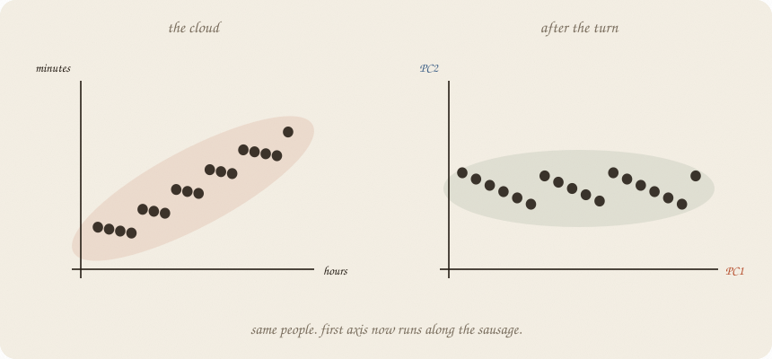
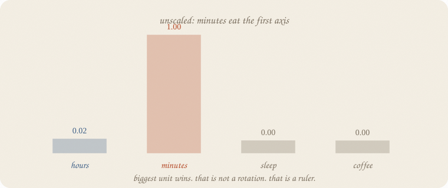
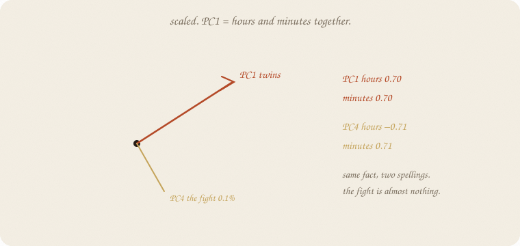
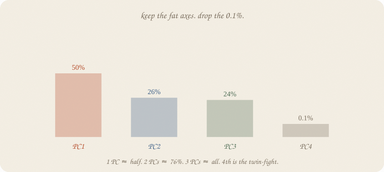
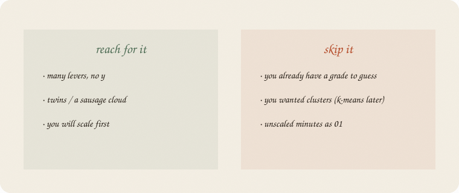

---
tags:
  - sketchbook
  - statistics
  - ml
aliases:
  - PCA
  - Principal component analysis
  - PCA Sketchbook
---

# PCA — a sketchbook

> [!abstract] In one sentence
> No *y*. **Turn the cloud** so the first axis runs along the sausage. Drop the thin directions. Scale first, or the fattest *unit* wins.



Read [[01 linear regression]] and [[02 ridge regression]] first — especially twins. Same exam world: hours, minutes (hours×60 plus leftover), sleep, coffee. **No grade.** LDA drew two blobs *because* of pass/fail. This notebook draws **one** cloud and asks which way it is long.

This is 01 of the unsupervised wing. Rooms are [[02 k-means]]. Embeddings already used PCA as a camera ([[02 embeddings]]); here PCA *is* the machine.

Flip it like a notebook. One page = one idea. Done.

---

## Page 1 — There is no grade

Eighty students, house seed 7. Unlabeled cloud: hours, minutes, sleep, coffee. **No grade.** Not the thirty graders on the ridge page, and not a pass/fail class.

Nobody asked who passed. Nobody asked ŷ.

The cloud still has a shape. Hours and minutes are almost the same fact (corr **0.997**). Sleep is its own direction (corr with hours **0.061**). Coffee rattles.

The job: **name the long ways** of that cloud, then maybe throw the short ones away.

People call this **principal component analysis**. Ugly name. Friendly job: *rotate so PC1 is the sausage.*

---

## Page 2 — Unscaled, minutes eat the axis

Do not scale. Fit two PCs anyway.



PC1 is **minutes 1.00**, hours 0.02. Explained: **1.00**. Of course. Minutes live around 60–360. Hours live around 1–6. The fattest ruler wins. That is not a rotation. That is a unit.

Ridge already taxed size. PCA **is** size unless you fix the spelling first.

---

## Page 3 — Scale, then turn

Subtract the mean. Divide by the spread. *Then* rotate.



| | hours | minutes | sleep | coffee | scatter kept |
|---|---:|---:|---:|---:|---:|
| **PC1** | 0.70 | 0.70 | 0.09 | −0.03 | **50%** |
| PC2 | −0.03 | −0.02 | 0.68 | 0.73 | 26% |
| PC3 | −0.06 | −0.06 | 0.73 | −0.68 | 24% |
| **PC4** | −0.71 | 0.71 | 0.00 | 0.00 | **0.1%** |

PC1 is the twins, sharing, like ridge asked them to. PC4 is the **fight** — hours minus minutes — almost nothing. Drop it and you dropped a spelling difference, not a fact.

PC2 and PC3 split sleep vs coffee. Honest leftover directions, not a second sausage.

---

## Page 4 — Keep the fat axes



1 PC keeps **half** the (scaled) scatter. Reconstructing the four columns from PC1 only: mean leftover² **0.499**.

2 PCs keep **76%**. Leftover² **0.239**.

3 PCs keep **99.9%**. The fourth is the twin-fight.

You do not need a medal cutoff. Look at the bars. Keep until the next bar is a whisper. New people: that whisper will not save you.

This is **not** a grade line. There is no ŷ. There is a thinner cloud that still looks like the old one.

---

## Page 5 — Mini recipe

1. **No y.** If you have a grade to guess, go back to [[01 linear regression]].
2. **Scale.** Always. Minutes will eat PC1 if you don’t.
3. **Rotate.** First axis = longest sausage.
4. **Read the loadings.** Twins should share PC1. Their fight should be a thin PC.
5. **Keep the fat bars.** Drop the 0.1%.
6. **Do not** call PC1 “the cause.” It is a direction in the cloud.

If you keep only one thing:

> no y. scale. turn the sausage. drop the thin axis.

---

## Page 6 — Hours and minutes, in sklearn

Same unlabeled cloud — eighty students, four levers, no grade. House seed 7.

```python
import numpy as np
from sklearn.decomposition import PCA
from sklearn.preprocessing import StandardScaler

rng = np.random.default_rng(7)
n = 80
hours = rng.uniform(1, 6, n)
minutes = hours * 60 + rng.normal(0, 8, n)
sleep = rng.uniform(4, 9, n)
coffee = rng.uniform(0, 4, n)
X = np.column_stack([hours, minutes, sleep, coffee])
names = ["hours", "minutes", "sleep", "coffee"]

print("corr hours·minutes", round(np.corrcoef(hours, minutes)[0, 1], 3))
print("corr hours·sleep  ", round(np.corrcoef(hours, sleep)[0, 1], 3))

raw = PCA(n_components=2, random_state=7).fit(X)
print("unscaled PC1", {n: round(float(v), 3) for n, v in zip(names, raw.components_[0])},
      "  explained", round(raw.explained_variance_ratio_[0], 3))

Xs = StandardScaler().fit_transform(X)
pca = PCA(random_state=7).fit(Xs)
print("scaled explained", np.round(pca.explained_variance_ratio_, 3).tolist())
print("scaled cumulative", np.round(np.cumsum(pca.explained_variance_ratio_), 3).tolist())
for i, row in enumerate(pca.components_, 1):
    print(f"PC{i}", {n: round(float(v), 3) for n, v in zip(names, row)})
p1 = PCA(n_components=1, random_state=7).fit(Xs)
p2 = PCA(n_components=2, random_state=7).fit(Xs)
print("recon mse 1 PC", round(((Xs - p1.inverse_transform(p1.transform(Xs))) ** 2).mean(), 3))
print("recon mse 2 PC", round(((Xs - p2.inverse_transform(p2.transform(Xs))) ** 2).mean(), 3))
```

```
corr hours·minutes 0.997
corr hours·sleep   0.061
unscaled PC1 {'hours': 0.017, 'minutes': 1.0, 'sleep': 0.001, 'coffee': -0.0}   explained 1.0
scaled explained [0.501, 0.26, 0.238, 0.001]
scaled cumulative [0.501, 0.761, 0.999, 1.0]
PC1 {'hours': 0.704, 'minutes': 0.704, 'sleep': 0.086, 'coffee': -0.034}
PC2 {'hours': -0.025, 'minutes': -0.022, 'sleep': 0.68, 'coffee': 0.733}
PC3 {'hours': -0.06, 'minutes': -0.061, 'sleep': 0.728, 'coffee': -0.68}
PC4 {'hours': -0.707, 'minutes': 0.707, 'sleep': -0.001, 'coffee': -0.002}
recon mse 1 PC 0.499
recon mse 2 PC 0.239
```

Unscaled: minutes **1.00**, story dead. Scaled: PC1 twins share 0.70 / 0.70, keep half the scatter. PC4 is hours minus minutes — **0.1%**. Reconstruct with 2 PCs: leftover² 0.239 on scaled columns. `StandardScaler` is not optional. `components_` are the directions; `explained_variance_ratio_` are the bars.

---

## Last page — cheat sheet

| word | meaning |
|---|---|
| no y | unsupervised — a cloud, not a grade |
| PC | a new axis, longest leftover first |
| loading | how much each old lever sits on that PC |
| scale | always, or the fat unit wins |
| explained | share of scatter that PC keeps |

**Also called:** sausage = first principal component · loading = how much a feature sits on that PC · lever = feature.



### Use / skip

**Reach for it when** you have **many levers and no y**, a sausage / twins, and you will **scale** first.

**Skip it when** you already have a grade to guess ([[01 linear regression]]); you wanted **rooms** ([[02 k-means]]); you were going to skip the scaler and let minutes be PC1.

**Pays you:** a thinner cloud that still looks like the people. Twins share one axis. The fight is a bar you can drop.

**Costs you:** no ŷ. PC1 is not a cause. Unscaled PCA is a ruler, not a rotation. [[02 k-means]] is a different question (blobs, not axes).

---

*Unsupervised 01. No grade. Next: [[02 k-means]] — rooms in the cloud, still no y.*
