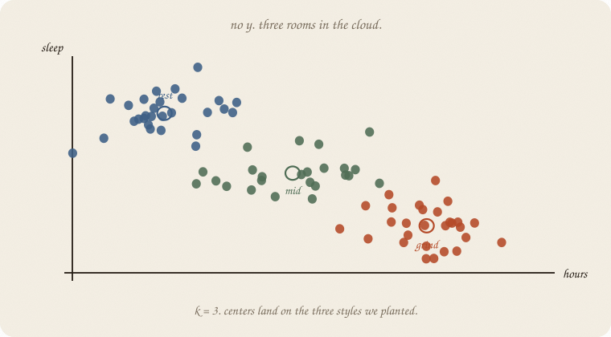
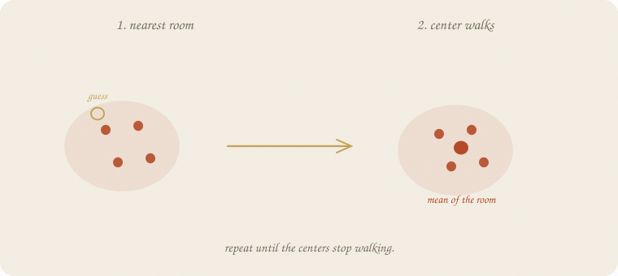
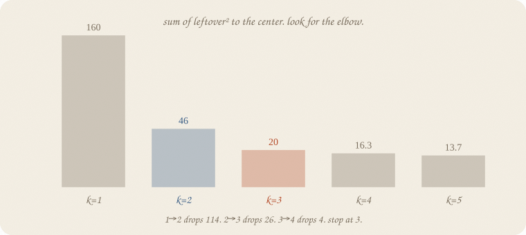
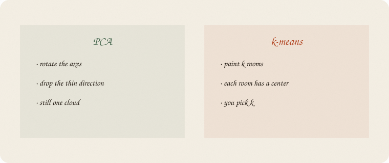
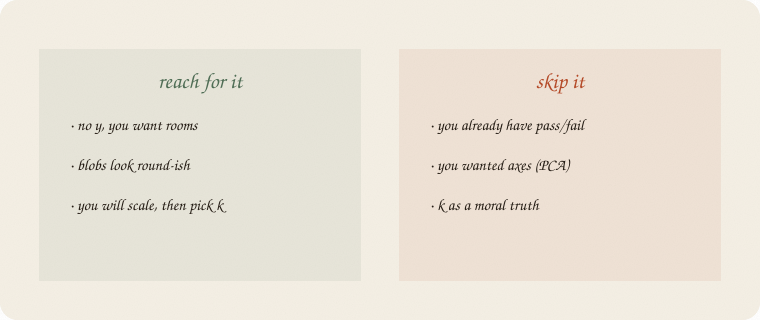

---
tags:
  - sketchbook
  - statistics
  - ml
aliases:
  - k-means
  - kmeans
  - K-means Sketchbook
---

# k-means — a sketchbook

> [!abstract] In one sentence
> No *y*. **Paint k rooms** in the cloud. Each room has a center. People go to the nearest one. You pick *k*.



Read [[01 PCA]] first. Same exam world: hours and sleep. **Still no grade.** PCA asked which way the cloud is long. This notebook asks whether the cloud has **rooms**.

This is 02 of the unsupervised wing. LDA already drew two blobs *because* of pass/fail. Here nobody told us who passed. We still want names for clumps.

Flip it like a notebook. One page = one idea. Done.

---

## Page 1 — There is still no grade

Eighty students, house seed 7. Hours and sleep. **No grade.** Three styles planted on purpose — not ridge’s thirty graders, and not the pass/fail class.

Three study styles, planted on purpose:

| room | hours | sleep | people |
|---|---:|---:|---:|
| grind | around 5 | around 5 | 28 |
| rest | around 2 | around 8 | 28 |
| mid | around 3.5 | around 6.6 | 24 |

Nobody asked who passed. Nobody asked ŷ.

The cloud still has **clumps**. The job: name the rooms, then maybe put a new student in one.

People call this **k-means**. Ugly name. Friendly job: *k rooms, each with a mean.*

---

## Page 2 — Assign, then walk the center

Guess *k* starting spots. Then loop:

1. **Assign.** Each person goes to the nearest center.
2. **Walk.** Each center becomes the mean of its people.



Repeat until the centers stop walking. That is the whole machine.

The leftover is not *y* − ŷ. There is no *y*. Leftover is **distance to your center**, squared, added up. People call that **inertia**. Smaller = tighter rooms.

sklearn starts the guesses with **k-means++** (spread the first centers out) and tries several starts (`n_init=10`). Same loop after that.

---

## Page 3 — *k* is a choice, not a truth

Ask for 2 rooms and you get 2. Ask for 5 and you get 5. The algorithm does not know we planted 3.

Look at the leftover pile as *k* grows:



| *k* | leftover² (inertia) | drop from previous | silhouette | sizes |
|--:|---:|---:|---:|---|
| 1 | **160.0** | — | — | 80 |
| 2 | **46.2** | 114 | 0.567 | 39 / 41 |
| 3 | **20.3** | **26** | **0.575** | **28 / 28 / 24** |
| 4 | 16.3 | 4 | 0.508 | 17 / 27 / 11 / 25 |
| 5 | 13.7 | 3 | 0.434 | split further |

1 → 2 drops a cliff. 2 → 3 still drops. 3 → 4 is a **whisper**. Stop at 3.

Silhouette (how in-the-room vs how near-the-next-room) also peaks at 3. Not a medal. A second glance.

*k* = 3 recovers the plant: sizes **28 / 28 / 24**. Centers land on grind **4.80 / 5.17**, rest **1.99 / 7.98**, mid **3.36 / 6.48**.

A new student: 3 hours, 7 of sleep. Nearest room is **mid**. That is a label we painted, not a pass/fail.

---

## Page 4 — PCA turns. k-means paints.



PCA: one cloud, new axes, drop the thin direction. Still one cloud.

k-means: the same people, **k** buckets. No new axis. You picked *k*.

Do not mix the jobs. Twins (hours and minutes) are a PCA fact. Three study styles are a k-means fact. If you have pass/fail already, go back to [[01 logistic regression]] or [[02 LDA]] — that is a *y*.

Scale first when the levers are in different units. Hours and sleep here are already similar, so unscaled also finds the three rooms. Add **minutes** without a scaler and minutes eat the distances, same sin as unscaled PCA.

---

## Page 5 — Mini recipe

1. **No y.** If you have a grade to guess, go back to [[01 linear regression]]. If you have pass/fail, go back to [[01 logistic regression]].
2. **Scale** when units differ. Always if minutes might join.
3. **Pick k.** Elbow on inertia. Silhouette as a second glance.
4. **Fit.** Assign, walk, repeat. Several starts.
5. **Read the centers** in the original units. Name the rooms in English.
6. **Do not** call a room “the cause,” or *k* “the truth.” k-means will always give you *k* rooms.

If you keep only one thing:

> no y. paint k rooms. each has a center. you pick k.

---

## Page 6 — Three study styles, in sklearn

Same unlabeled cloud as page 1 — eighty students, hours and sleep, no grade. Three styles planted. House seed 7.

```python
import numpy as np
from sklearn.cluster import KMeans
from sklearn.preprocessing import StandardScaler
from sklearn.metrics import silhouette_score

rng = np.random.default_rng(7)
n1, n2, n3 = 28, 28, 24
grind = np.column_stack([rng.normal(5.0, 0.45, n1), rng.normal(5.2, 0.55, n1)])
rest = np.column_stack([rng.normal(2.0, 0.50, n2), rng.normal(8.0, 0.50, n2)])
mid = np.column_stack([rng.normal(3.5, 0.55, n3), rng.normal(6.6, 0.55, n3)])
X = np.vstack([grind, rest, mid])
names = ["hours", "sleep"]

sc = StandardScaler()
Xs = sc.fit_transform(X)

print("n", len(X))
for k in range(1, 6):
    km = KMeans(n_clusters=k, n_init=10, random_state=7).fit(Xs)
    if k == 1:
        print(f"k={k}  inertia {km.inertia_:.1f}")
    else:
        sil = silhouette_score(Xs, km.labels_)
        print(f"k={k}  inertia {km.inertia_:.1f}  sil {sil:.3f}  "
              f"sizes {np.bincount(km.labels_).tolist()}")

km3 = KMeans(n_clusters=3, n_init=10, random_state=7).fit(Xs)
print("k=3 centers")
for i, row in enumerate(sc.inverse_transform(km3.cluster_centers_)):
    print(i, {n: round(float(v), 2) for n, v in zip(names, row)})
print("new 3h, 7s → room", int(km3.predict(sc.transform([[3.0, 7.0]]))[0]))
```

```
n 80
k=1  inertia 160.0
k=2  inertia 46.2  sil 0.567  sizes [39, 41]
k=3  inertia 20.3  sil 0.575  sizes [28, 28, 24]
k=4  inertia 16.3  sil 0.508  sizes [17, 27, 11, 25]
k=5  inertia 13.7  sil 0.434  sizes [10, 17, 25, 18, 10]
k=3 centers
0 {'hours': 4.8, 'sleep': 5.17}
1 {'hours': 1.99, 'sleep': 7.98}
2 {'hours': 3.36, 'sleep': 6.48}
new 3h, 7s → room 2
```

k=3 is the elbow and the silhouette peak. Sizes **28 / 28 / 24** — the plant, recovered. Center 0 is grind, 1 is rest, 2 is mid. The new student (3 h, 7 sleep) lands in **room 2**. `inertia_` is leftover². `n_clusters` is *k*. `random_state=7` plus `n_init=10` is the house start, not a moral.

---

## Last page — cheat sheet

| word | meaning |
|---|---|
| no y | unsupervised — rooms, not a grade |
| *k* | how many rooms you asked for |
| center | mean of the people in that room |
| inertia | leftover² to your center, added up |
| elbow | where the next *k* barely helps |
| silhouette | in-the-room vs near-the-next-room |

**Also called** (in a room):

| here | there |
|---|---|
| room | cluster |
| center | centroid |
| leftover² | inertia |



### Use / skip

**Reach for it when** you have **no y**, the cloud looks like **round-ish blobs**, and you will **scale**, then pick *k* with an elbow.

**Skip it when** you already have pass/fail ([[01 logistic regression]], [[02 LDA]]); you wanted **axes** ([[01 PCA]]); you were going to treat *k* as a discovered truth.

**Pays you:** names for clumps, a center you can read in English, a room for a new person.

**Costs you:** you pick *k*. It will always paint *k* rooms, even if the cloud is one sausage. A room is not a cause. Unscaled minutes still eat the ruler.

---

*Unsupervised 02. No grade. Rooms, not axes. Remaining rooms, short: SVM after the S; MCMC after the walk.*
